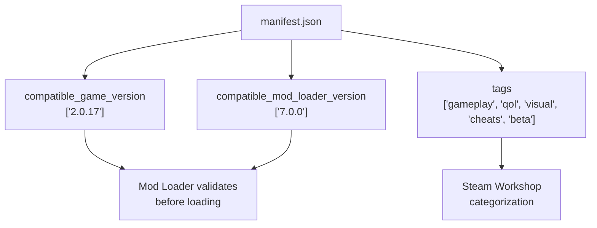
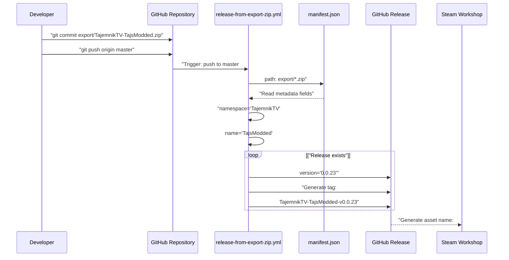
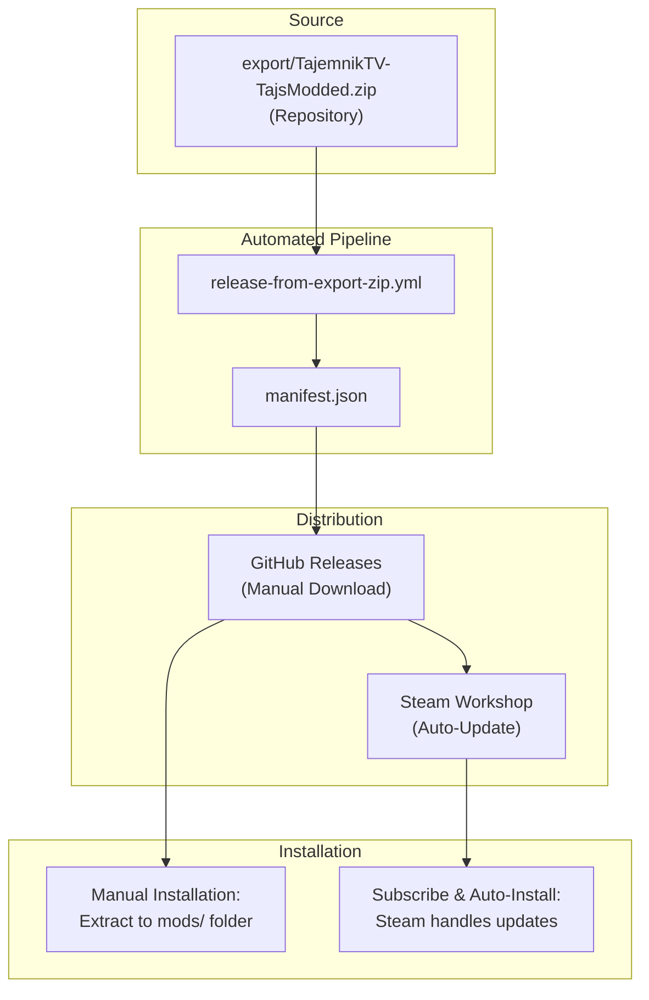
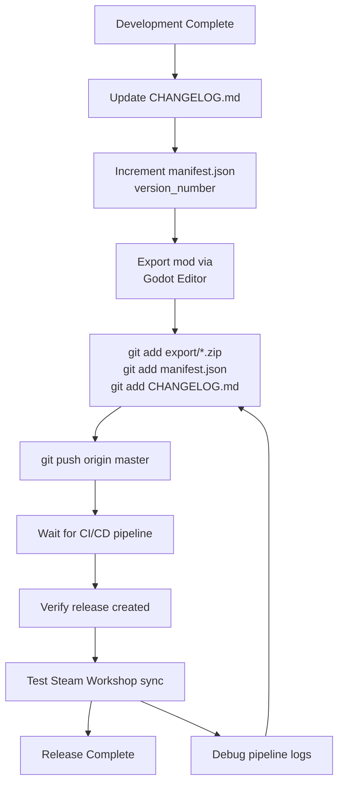
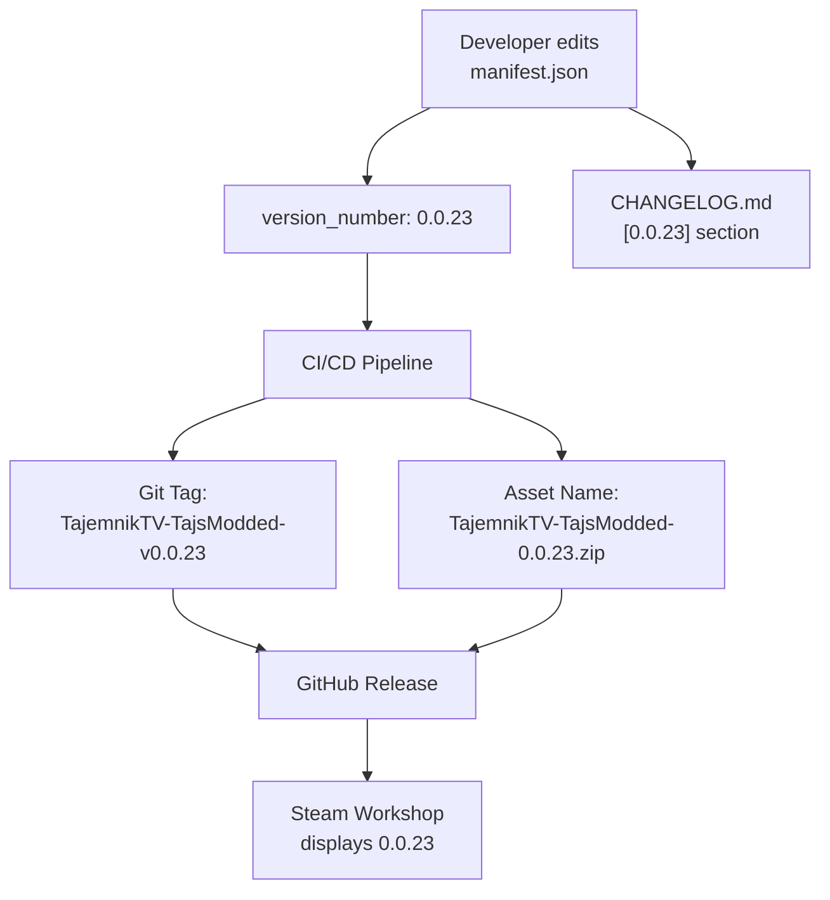

> **Relevant source files**
>
> - [.github/workflows/release-from-export-zip.yml](https://github.com/tajemniktv/TajsMod/blob/5f1e656a/.github/workflows/release-from-export-zip.yml)
> - [export/TajemnikTV-TajsModded.zip](https://github.com/tajemniktv/TajsMod/blob/5f1e656a/export/TajemnikTV-TajsModded.zip)
> - [manifest.json](https://github.com/tajemniktv/TajsMod/blob/5f1e656a/manifest.json)

## Purpose and Scope

This document explains how TajsMod is packaged, versioned, and distributed to end users. It covers the export package structure, versioning conventions defined in `manifest.json`, the automated CI/CD release pipeline, and the dual distribution model (Steam Workshop + GitHub Releases). For information about installing the mod as an end user, see [Installation and Configuration](/tajemniktv/TajsMod/2-installation-and-configuration). For contribution workflows, see [Contributing Guidelines](/tajemniktv/TajsMod/8.2-contributing-guidelines).

---

## Export Package Structure

The distributable mod is packaged as a single ZIP file containing all necessary scripts and metadata:

```markdown
TajemnikTV-TajsModded.zip
├── manifest.json # Mod metadata and version info
├── mod_main.gd # Main orchestrator script
├── default_commands.gd # Command definitions
├── config_manager.gd # Configuration persistence
├── palette_overlay.gd # Command palette UI
├── screenshot_manager.gd # Screenshot utility
├── buy_max_manager.gd # Buy Max automation
├── window_group.gd # Group customization
├── [other manager scripts]
└── [script extensions]
```

The package is located at [export/TajemnikTV-TajsModded.zip](https://github.com/tajemniktv/TajsMod/blob/5f1e656a/export/TajemnikTV-TajsModded.zip)

in the repository. This is the canonical distribution artifact that gets uploaded to both Steam Workshop and GitHub Releases.

**Key Characteristics:**

- **Self-contained**: All scripts and dependencies included
- **No binary assets**: Pure GDScript implementation
- **Direct installation**: Compatible with Mod Loader 7.0.0+ via simple extraction

**Sources:** [manifest.json L1-L36](https://github.com/tajemniktv/TajsMod/blob/5f1e656a/manifest.json#L1-L36)

---

## Manifest Metadata

The [manifest.json](https://github.com/tajemniktv/TajsMod/blob/5f1e656a/manifest.json)

file serves as the single source of truth for mod identity, versioning, and compatibility requirements. This file drives both the automated release pipeline and the in-game mod loader.

### Manifest Structure

```json
{
  "namespace": "TajemnikTV",
  "name": "TajsModded",
  "version_number": "0.0.23",
  "description": "...",
  "dependencies": [],
  "extra": {
    "godot": {
      "authors": ["TajemnikTV"],
      "compatible_game_version": ["2.0.17"],
      "compatible_mod_loader_version": ["7.0.0"],
      "tags": ["gameplay", "qol", "visual", "cheats", "beta"]
    }
  },
  "website_url": "https://github.com/tajemniktv/TajsView/"
}
```

### Version Numbering

The `version_number` field follows semantic versioning principles:

| Component | Current | Meaning                     |
| --------- | ------- | --------------------------- |
| Major     | `0`     | Pre-release (unstable API)  |
| Minor     | `0`     | Feature additions           |
| Patch     | `23`    | Bug fixes and minor changes |

**Version Increment Rules:**

- **Patch**: Bug fixes, minor tweaks, documentation
- **Minor**: New features, new commands, new managers
- **Major**: Breaking changes, API rewrites (reserved for 1.0.0+)

### Compatibility Constraints

The manifest enforces version constraints:



| Field                           | Current Value                                     | Purpose                      |
| ------------------------------- | ------------------------------------------------- | ---------------------------- |
| `compatible_game_version`       | `["2.0.17"]`                                      | Minimum Upload Labs version  |
| `compatible_mod_loader_version` | `["7.0.0"]`                                       | Minimum Mod Loader version   |
| `tags`                          | `["gameplay", "qol", "visual", "cheats", "beta"]` | Steam Workshop searchability |

**Sources:** [manifest.json L1-L36](https://github.com/tajemniktv/TajsMod/blob/5f1e656a/manifest.json#L1-L36)

---

## Automated Release Pipeline

The CI/CD pipeline automates the entire release workflow, eliminating manual steps and ensuring consistency. Releases are triggered automatically when the export ZIP is updated in the repository.

### Pipeline Diagram



### Trigger Conditions

The workflow activates when:

1. **Automatic**: Push to `master` branch that modifies `export/TajemnikTV-TajsModded.zip`
2. **Manual**: Workflow dispatch via GitHub Actions UI

**Implementation:**

[.github/workflows/release-from-export-zip.yml L3-L8](https://github.com/tajemniktv/TajsMod/blob/5f1e656a/.github/workflows/release-from-export-zip.yml#L3-L8)

### Tag Generation Logic

The pipeline constructs a unique release tag from manifest fields:

**Algorithm:**

[.github/workflows/release-from-export-zip.yml L33-L47](https://github.com/tajemniktv/TajsMod/blob/5f1e656a/.github/workflows/release-from-export-zip.yml#L33-L47)

**Tag Format:**

```
{namespace}-{name}-v{version_number}
```

**Example:**

```
TajemnikTV-TajsModded-v0.0.23
```

**Sanitization Rules:**

- Spaces converted to hyphens
- Only alphanumeric, dots, underscores, and hyphens preserved
- Ensures tag is Git-safe and URL-safe

### Asset Naming

The uploaded ZIP is renamed to include version metadata:

**Format:**

```
TajemnikTV-TajsModded-{version}.zip
```

**Implementation:**

[.github/workflows/release-from-export-zip.yml L49](https://github.com/tajemniktv/TajsMod/blob/5f1e656a/.github/workflows/release-from-export-zip.yml#L49-L49)

This allows users to identify versions by filename alone, without needing to inspect the manifest.

### Idempotent Release Creation

The pipeline supports both creating new releases and updating existing ones:

| Scenario               | Behavior                                    |
| ---------------------- | ------------------------------------------- |
| Tag does not exist     | Create new release with `gh release create` |
| Tag exists (draft)     | Upload asset, convert to published          |
| Tag exists (published) | Upload asset with `--clobber` flag          |

**Implementation:**

[.github/workflows/release-from-export-zip.yml L55-L72](https://github.com/tajemniktv/TajsMod/blob/5f1e656a/.github/workflows/release-from-export-zip.yml#L55-L72)

This allows developers to:

1. Pre-create draft releases for testing
2. Overwrite assets if the export was rebuilt without version bump
3. Publish drafts automatically when the final ZIP is committed

**Sources:** [.github/workflows/release-from-export-zip.yml L1-L73](https://github.com/tajemniktv/TajsMod/blob/5f1e656a/.github/workflows/release-from-export-zip.yml#L1-L73)

---

## Distribution Channels

TajsMod is distributed through two parallel channels, each serving different user preferences.

### Distribution Flow Diagram



### Steam Workshop (Primary Channel)

**Advantages:**

- Automatic updates for subscribed users
- Integrated discovery within Steam
- One-click installation
- Mod Loader compatibility guaranteed

**Update Process:**

1. Developer commits new `export/*.zip` to repository
2. GitHub workflow creates release
3. External process (not in repository) detects release
4. Steam Workshop entry automatically updated
5. Subscribed users receive update on next game launch

**Workshop Link:** Provided in mod loader UI after subscription

### GitHub Releases (Manual Channel)

**Advantages:**

- Direct download without Steam client
- Access to all historical versions
- Faster availability (no external sync delay)
- Useful for testing pre-release builds

**Access:**

```yaml
https://github.com/tajemniktv/TajsView/releases
```

**Installation Steps:**

1. Download `TajemnikTV-TajsModded-{version}.zip` from release page
2. Extract to `<game_directory>/mods/` folder
3. Restart game or reload mods via Mod Loader

**Version Selection:**
Users can download any tagged release, not just the latest. This is useful for:

- Rolling back to stable versions if latest has issues
- Testing specific versions for bug reproduction
- Comparing feature sets across versions

**Sources:** [.github/workflows/release-from-export-zip.yml L1-L73](https://github.com/tajemniktv/TajsMod/blob/5f1e656a/.github/workflows/release-from-export-zip.yml#L1-L73)

[manifest.json L35](https://github.com/tajemniktv/TajsMod/blob/5f1e656a/manifest.json#L35-L35)

---

## Manual Build Workflow

Developers updating the mod follow this workflow:

### Build Process Flowchart



### Step-by-Step Instructions

#### 1. Update Version Metadata

Edit [manifest.json L34](https://github.com/tajemniktv/TajsMod/blob/5f1e656a/manifest.json#L34-L34)

:

```
"version_number": "0.0.24"  // Increment appropriately
```

Ensure compatibility fields are current:

- `compatible_game_version`: Update if minimum game version changed
- `compatible_mod_loader_version`: Update if new Mod Loader features used

#### 2. Document Changes

Add entry to `CHANGELOG.md` following existing format:

```markdown
## [0.0.24] - YYYY-MM-DD

### Added

- New feature description

### Fixed

- Bug fix description
```

See [Version History and Roadmap](/tajemniktv/TajsMod/9-version-history-and-roadmap) for changelog structure.

#### 3. Export Package

**Using Godot Editor:**

1. Open TajsMod project in Godot
2. Navigate to Project → Export
3. Select "Upload Labs Mod" export preset
4. Export to `export/TajemnikTV-TajsModded.zip`
5. Verify ZIP contains all necessary `.gd` files and manifest

**Export Checklist:**

- All `.gd` scripts included
- `manifest.json` present at root
- No editor-only files (`.import`, `.godot/`)
- File size reasonable (< 1 MB for pure GDScript mod)

#### 4. Commit and Push

```
git add export/TajemnikTV-TajsModded.zip
git add manifest.json
git add CHANGELOG.md
git commit -m "Release v0.0.24: [brief description]"
git push origin master
```

**Important:** All three files must be committed together to maintain version consistency.

#### 5. Monitor Pipeline

Navigate to GitHub Actions tab:

```yaml
https://github.com/tajemniktv/TajsView/actions
```

Watch for workflow run triggered by the push. Pipeline typically completes in < 1 minute.

**Common Failure Scenarios:**

| Error                                      | Cause                     | Solution                           |
| ------------------------------------------ | ------------------------- | ---------------------------------- |
| "Missing export/TajemnikTV-TajsModded.zip" | ZIP not committed         | Verify ZIP is staged and committed |
| "manifest.json: missing .version_number"   | Invalid manifest syntax   | Validate JSON syntax               |
| "Release creation failed"                  | GitHub token insufficient | Check repository permissions       |

#### 6. Verify Release

Once pipeline succeeds:

1. Check Releases page for new tag (e.g., `TajemnikTV-TajsModded-v0.0.24`)
2. Download asset and verify it matches local ZIP
3. Check Steam Workshop for sync (may take 5-15 minutes)

**Sources:** [manifest.json L1-L36](https://github.com/tajemniktv/TajsMod/blob/5f1e656a/manifest.json#L1-L36)

[.github/workflows/release-from-export-zip.yml L1-L73](https://github.com/tajemniktv/TajsMod/blob/5f1e656a/.github/workflows/release-from-export-zip.yml#L1-L73)

---

## Version Synchronization

Multiple version indicators must remain synchronized:

### Version Source Table

| Location        | Field            | Format                             | Purpose                                |
| --------------- | ---------------- | ---------------------------------- | -------------------------------------- |
| `manifest.json` | `version_number` | `0.0.23`                           | Official version, parsed by Mod Loader |
| `CHANGELOG.md`  | Section header   | `## [0.0.23] - 2024-XX-XX`         | User-facing changelog                  |
| GitHub Release  | Tag              | `TajemnikTV-TajsModded-v0.0.23`    | Git reference, generated by CI         |
| GitHub Release  | Asset name       | `TajemnikTV-TajsModded-0.0.23.zip` | Download filename, generated by CI     |

### Synchronization Flow



**Critical Rule:** Only `manifest.json` is edited manually. All other version strings are derived automatically by the pipeline.

**Sources:** [manifest.json L34](https://github.com/tajemniktv/TajsMod/blob/5f1e656a/manifest.json#L34-L34)

[.github/workflows/release-from-export-zip.yml L35-L49](https://github.com/tajemniktv/TajsMod/blob/5f1e656a/.github/workflows/release-from-export-zip.yml#L35-L49)

---

## Troubleshooting

### Pipeline Does Not Trigger

**Symptoms:** Push to `master` does not start GitHub Action

**Possible Causes:**

1. File path does not match trigger pattern _ **Check:** File must be `export/TajemnikTV-TajsModded.zip` exactly _ **Solution:** Verify case-sensitive path matches [.github/workflows/release-from-export-zip.yml L7](https://github.com/tajemniktv/TajsMod/blob/5f1e656a/.github/workflows/release-from-export-zip.yml#L7-L7)
2. Push was to different branch _ **Check:** Workflow only triggers on `master` branch _ **Solution:** Merge changes to `master` or manually dispatch workflow
3. Workflow disabled _ **Check:** Navigate to Actions → select workflow → check if enabled _ **Solution:** Re-enable via GitHub UI

### Release Creation Fails

**Symptoms:** Pipeline runs but `gh release create` command fails

**Possible Causes:**

1. Insufficient GitHub token permissions _ **Check:** [.github/workflows/release-from-export-zip.yml L11](https://github.com/tajemniktv/TajsMod/blob/5f1e656a/.github/workflows/release-from-export-zip.yml#L11-L11) requires `contents: write` _ **Solution:** Verify repository settings → Actions → Workflow permissions
2. Invalid manifest JSON _ **Check:** Run `jq . manifest.json` locally _ **Solution:** Fix JSON syntax errors, ensure all required fields present
3. Tag already exists as immutable tag _ **Check:** GitHub Release already published for this version _ **Solution:** Increment `version_number` before rebuilding

### Steam Workshop Not Updating

**Symptoms:** GitHub Release created, but Workshop shows old version

**Possible Causes:**

1. External sync process has not run yet _ **Check:** Wait 15-30 minutes for propagation _ **Solution:** No action needed, Steam sync is asynchronous
2. Workshop page requires manual re-upload _ **Check:** Contact Steam Workshop admin or check external sync logs _ **Solution:** Manual upload may be required for first-time setup

**Sources:** [.github/workflows/release-from-export-zip.yml L1-L73](https://github.com/tajemniktv/TajsMod/blob/5f1e656a/.github/workflows/release-from-export-zip.yml#L1-L73)

[manifest.json L1-L36](https://github.com/tajemniktv/TajsMod/blob/5f1e656a/manifest.json#L1-L36)
