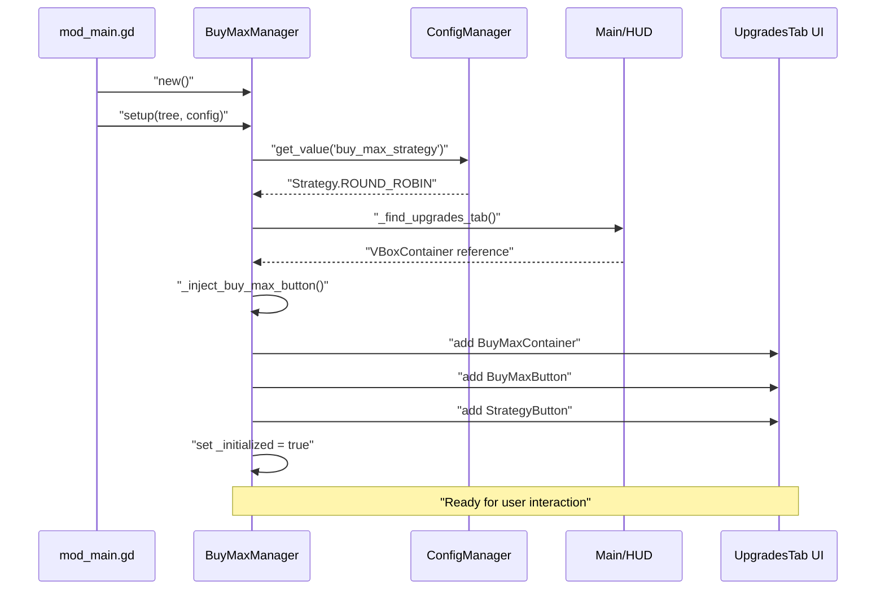
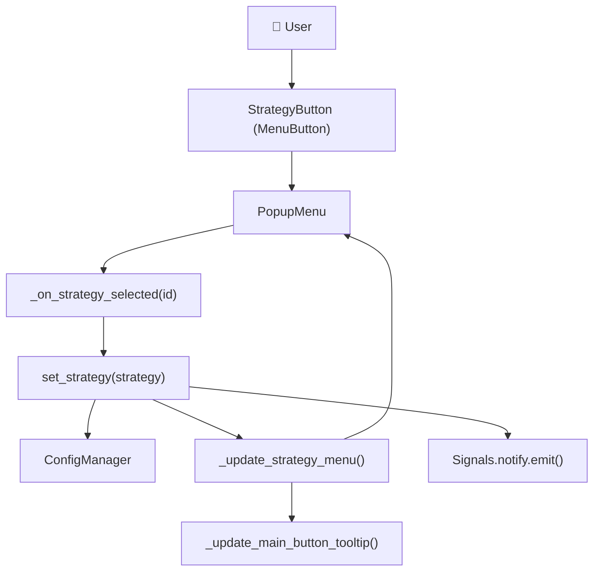
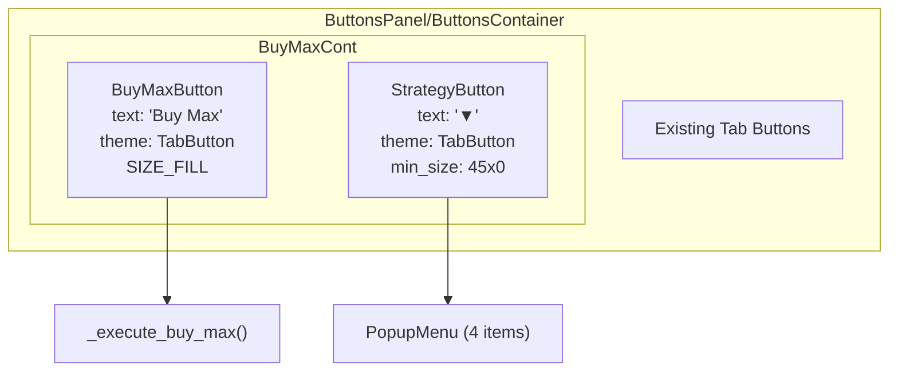
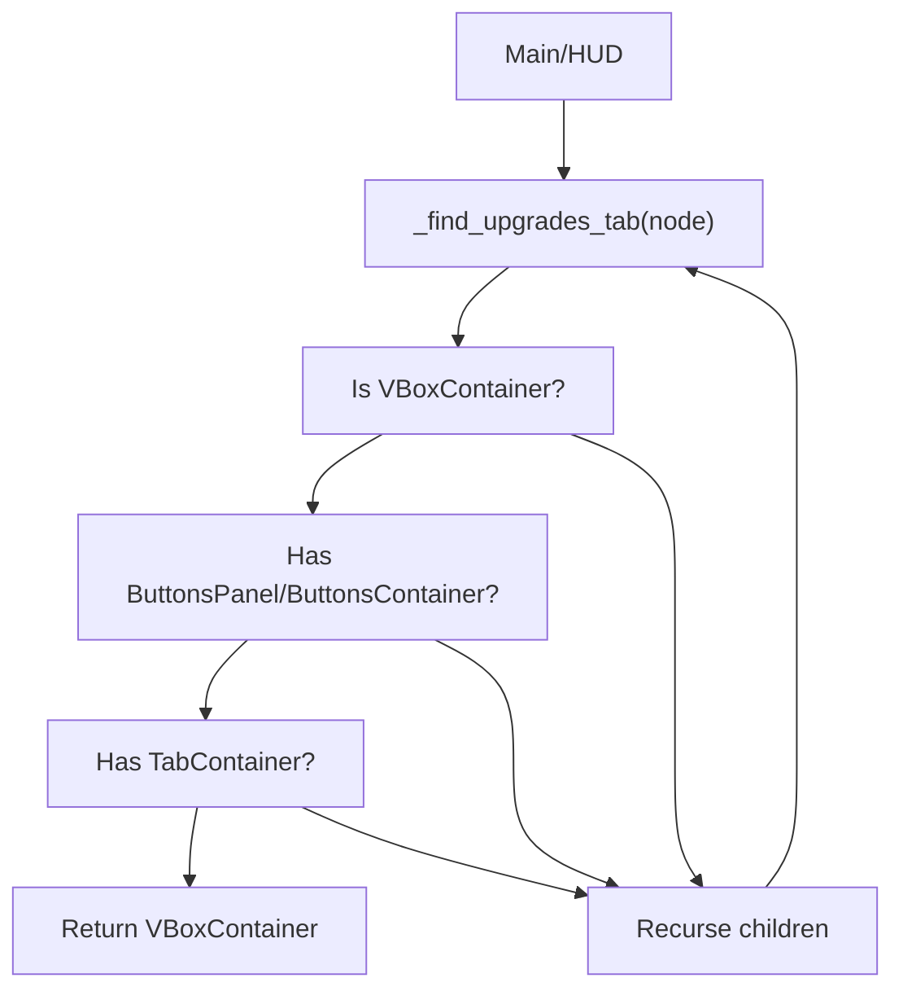
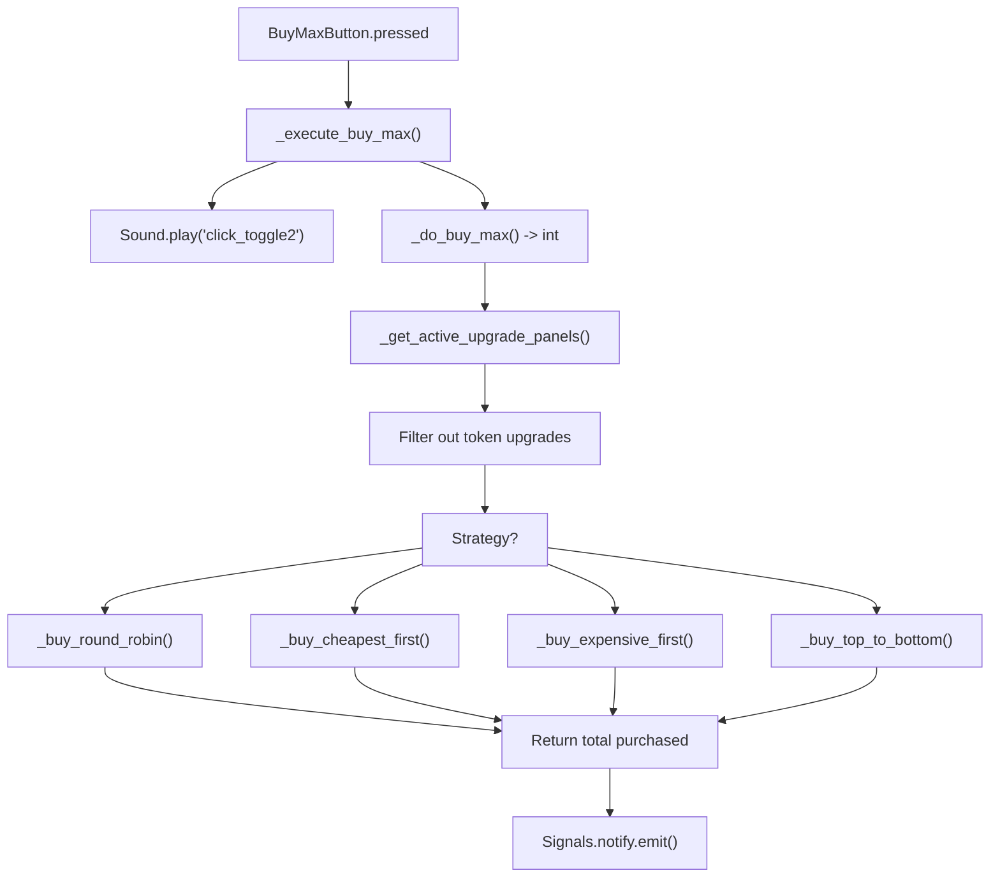
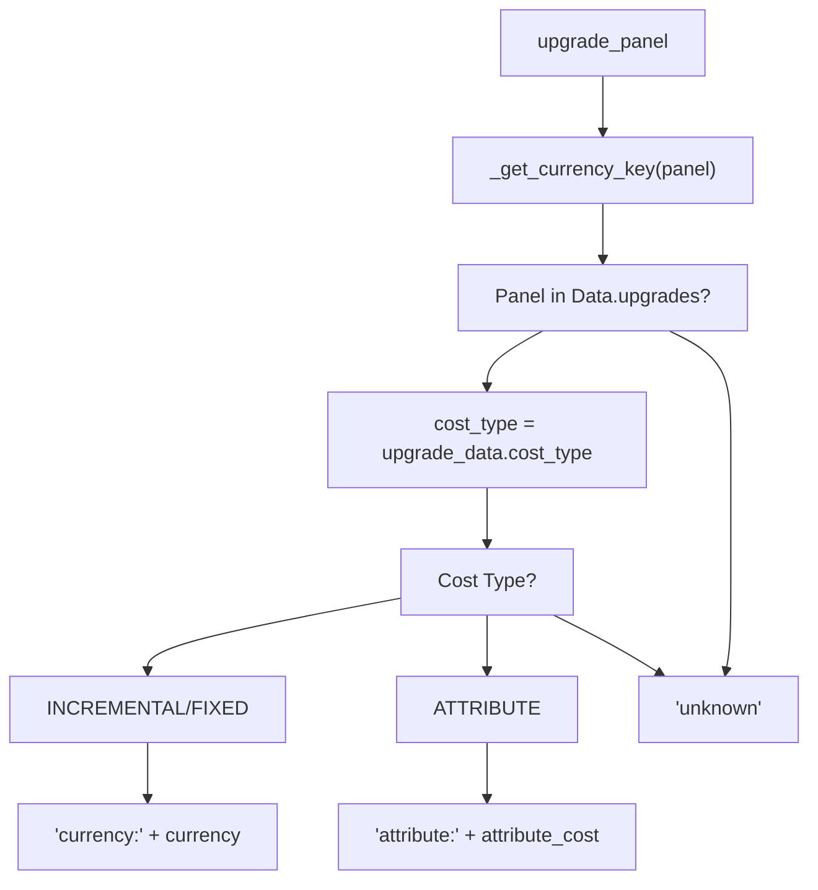
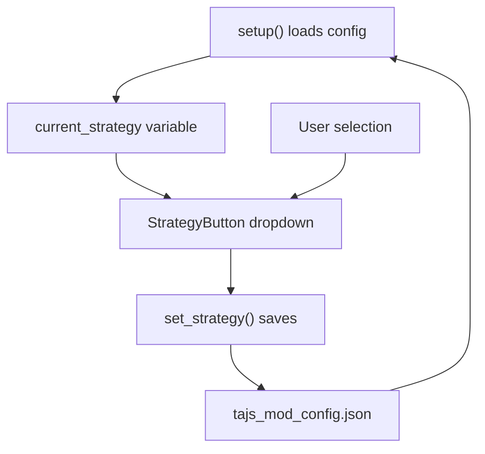
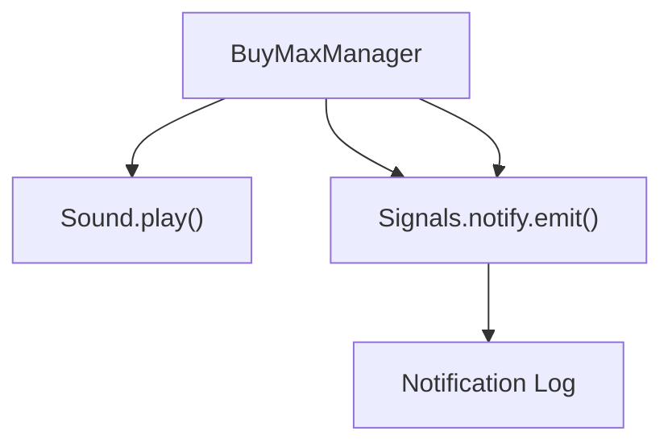
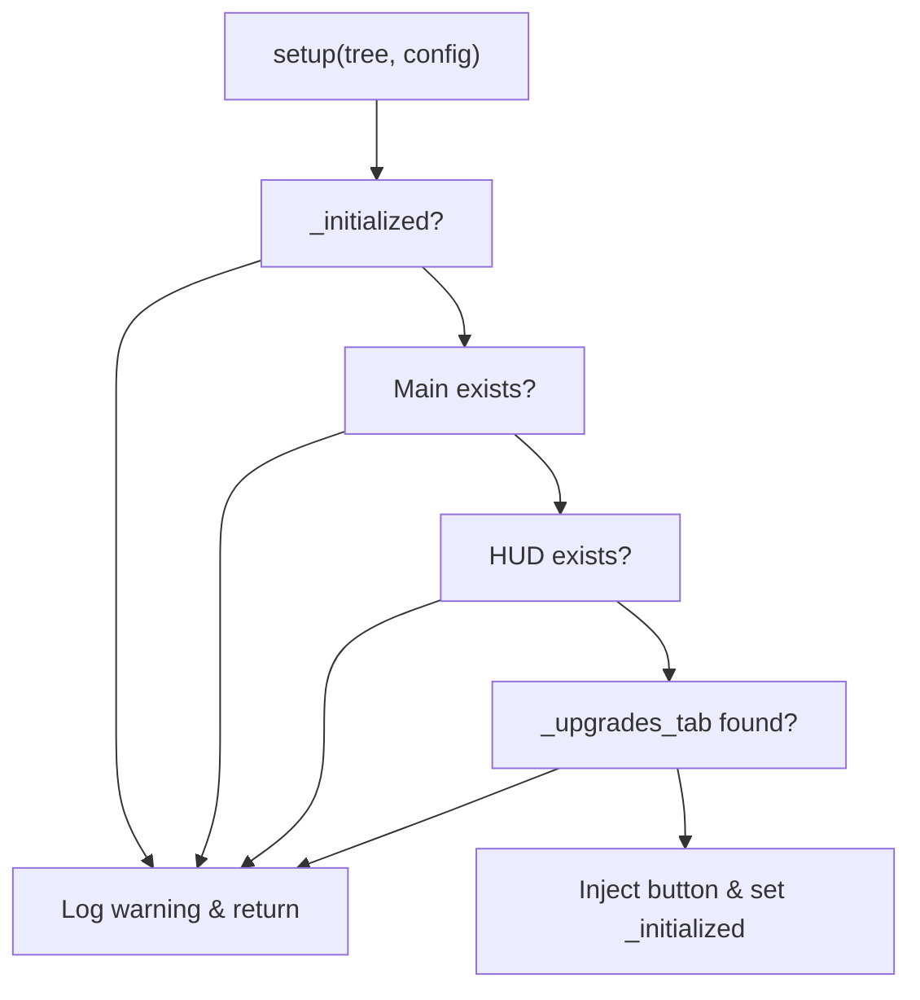
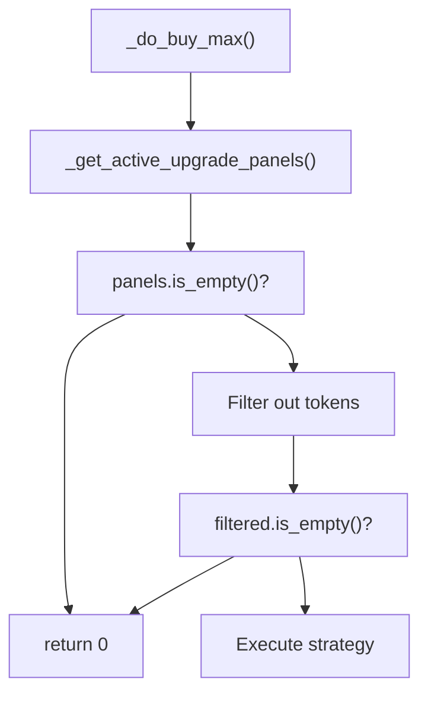

> **Relevant source files**
>
> - [extensions/scenes/windows/window_inventory.gd](https://github.com/tajemniktv/TajsMod/blob/5f1e656a/extensions/scenes/windows/window_inventory.gd)
> - [extensions/scripts/utilities/buy_max_manager.gd](https://github.com/tajemniktv/TajsMod/blob/5f1e656a/extensions/scripts/utilities/buy_max_manager.gd)
> - [extensions/scripts/utilities/focus_handler.gd](https://github.com/tajemniktv/TajsMod/blob/5f1e656a/extensions/scripts/utilities/focus_handler.gd)

## Purpose and Scope

The Buy Max Manager is a utility component that adds automated batch purchasing functionality to the game's upgrade system. It injects a split button into the upgrades tab UI, providing players with four different purchase strategies to efficiently spend accumulated currency on upgrades. This manager is part of the optional gameplay enhancements and is always enabled once the mod is loaded.

For information about other utility managers (FocusHandler, WireColorOverrides, etc.), see [Other Utility Managers](/tajemniktv/TajsMod/6.3-other-utility-managers). For the broader context of gameplay features including cheats and node limit controls, see [Gameplay Features](</tajemniktv/TajsMod/5.4-gameplay-features-(opt-in)>). For configuration management details, see [Configuration System](/tajemniktv/TajsMod/3.2-configuration-system).

**Sources**: [extensions/scripts/utilities/buy_max_manager.gd L1-L10](https://github.com/tajemniktv/TajsMod/blob/5f1e656a/extensions/scripts/utilities/buy_max_manager.gd#L1-L10)

---

## Architecture Overview

### Component Lifecycle

The `BuyMaxManager` extends `Node` and follows the standard mod manager initialization pattern. It is instantiated and configured by `mod_main.gd` during the deferred setup phase after the HUD is available.



**Key Initialization Steps**:

1. Load saved strategy from `ConfigManager`
2. Locate the upgrades tab in the HUD scene tree
3. Inject UI components into the buttons panel
4. Configure event handlers and styling

**Sources**: [extensions/scripts/utilities/buy_max_manager.gd L45-L76](https://github.com/tajemniktv/TajsMod/blob/5f1e656a/extensions/scripts/utilities/buy_max_manager.gd#L45-L76)

---

## Purchase Strategy System

### Strategy Enumeration

The manager implements four distinct purchase strategies defined in the `Strategy` enum:

| Strategy ID           | Name           | Behavior                                                       | Use Case                                           |
| --------------------- | -------------- | -------------------------------------------------------------- | -------------------------------------------------- |
| `ROUND_ROBIN` (0)     | Round Robin    | Buys 1 level of each upgrade in rotation until funds exhausted | Balanced progression across all upgrades           |
| `CHEAPEST_FIRST` (1)  | Cheapest First | Always purchases the cheapest available upgrade first          | Maximize number of purchases, incremental gains    |
| `EXPENSIVE_FIRST` (2) | Most Expensive | Buys the most expensive affordable upgrade                     | Maximize impact per purchase                       |
| `TOP_TO_BOTTOM` (3)   | Top to Bottom  | Maxes out upgrades sequentially from top to bottom of UI       | Complete individual upgrades before moving to next |

**Sources**: [extensions/scripts/utilities/buy_max_manager.gd L12-L31](https://github.com/tajemniktv/TajsMod/blob/5f1e656a/extensions/scripts/utilities/buy_max_manager.gd#L12-L31)

### Strategy Selection Flow



**Strategy Persistence**: The selected strategy is immediately persisted via `ConfigManager.set_value("buy_max_strategy", strategy)` and restored on next game session.

**Sources**: [extensions/scripts/utilities/buy_max_manager.gd L79-L87](https://github.com/tajemniktv/TajsMod/blob/5f1e656a/extensions/scripts/utilities/buy_max_manager.gd#L79-L87)

[extensions/scripts/utilities/buy_max_manager.gd L238-L242](https://github.com/tajemniktv/TajsMod/blob/5f1e656a/extensions/scripts/utilities/buy_max_manager.gd#L238-L242)

---

## UI Injection System

### Split Button Architecture

The Buy Max button uses a split-button pattern consisting of two components inside an `HBoxContainer`:



**UI Tree Location**: The manager searches for a `VBoxContainer` that contains both `ButtonsPanel/ButtonsContainer` and `TabContainer` children, which uniquely identifies the upgrades tab structure.

**Theme Matching**: Both buttons use `theme_type_variation = "TabButton"` to match the game's existing tab buttons. The popup menu is styled with `StyleBoxFlat` to match the dark theme defined in `main.tres`.

**Sources**: [extensions/scripts/utilities/buy_max_manager.gd L112-L169](https://github.com/tajemniktv/TajsMod/blob/5f1e656a/extensions/scripts/utilities/buy_max_manager.gd#L112-L169)

[extensions/scripts/utilities/buy_max_manager.gd L202-L235](https://github.com/tajemniktv/TajsMod/blob/5f1e656a/extensions/scripts/utilities/buy_max_manager.gd#L202-L235)

### Upgrades Tab Discovery



**Sources**: [extensions/scripts/utilities/buy_max_manager.gd L94-L108](https://github.com/tajemniktv/TajsMod/blob/5f1e656a/extensions/scripts/utilities/buy_max_manager.gd#L94-L108)

---

## Purchase Algorithm Details

### Main Execution Flow



**Panel Discovery**: The algorithm queries the currently active tab in the `TabContainer` and recursively searches for all visible `Panel` nodes that have both `can_purchase()` and `update_all()` methods.

**Token Exclusion**: Upgrades with `currency_key == "currency:token"` are filtered out before processing to prevent accidental token spending.

**Sources**: [extensions/scripts/utilities/buy_max_manager.gd L244-L283](https://github.com/tajemniktv/TajsMod/blob/5f1e656a/extensions/scripts/utilities/buy_max_manager.gd#L244-L283)

[extensions/scripts/utilities/buy_max_manager.gd L405-L432](https://github.com/tajemniktv/TajsMod/blob/5f1e656a/extensions/scripts/utilities/buy_max_manager.gd#L405-L432)

### Strategy Implementation Details

#### Round Robin Strategy

Groups upgrades by currency type and rotates through each group, buying one level at a time until no more purchases are possible in that currency.

**Algorithm**:

```
1. Group panels by _get_currency_key(panel)
2. For each currency group:
   a. While any purchase made this pass:
      - For each panel in group:
        * panel.update_all()
        * If can_purchase(): panel._on_purchase_pressed()
   b. Final pass: attempt one more purchase per panel
3. Return total purchased
```

**Sources**: [extensions/scripts/utilities/buy_max_manager.gd L290-L323](https://github.com/tajemniktv/TajsMod/blob/5f1e656a/extensions/scripts/utilities/buy_max_manager.gd#L290-L323)

#### Cheapest First Strategy

Finds and purchases the globally cheapest affordable upgrade, repeating until no more purchases are possible.

**Algorithm**:

```sql
1. While any purchase made:
   a. Set cheapest_cost = INF, cheapest_panel = null
   b. For each panel:
      - panel.update_all()
      - If can_purchase() and cost < cheapest_cost:
        * Update cheapest_cost and cheapest_panel
   c. If cheapest_panel found:
      - cheapest_panel._on_purchase_pressed()
      - Increment total
2. Return total purchased
```

**Sources**: [extensions/scripts/utilities/buy_max_manager.gd L326-L351](https://github.com/tajemniktv/TajsMod/blob/5f1e656a/extensions/scripts/utilities/buy_max_manager.gd#L326-L351)

#### Most Expensive First Strategy

Purchases the most expensive affordable upgrade repeatedly, maximizing impact per transaction.

**Algorithm**:

```sql
1. While any purchase made:
   a. Set highest_cost = -1, expensive_panel = null
   b. For each panel:
      - panel.update_all()
      - If can_purchase() and cost > highest_cost:
        * Update highest_cost and expensive_panel
   c. If expensive_panel found:
      - expensive_panel._on_purchase_pressed()
      - Increment total
2. Return total purchased
```

**Sources**: [extensions/scripts/utilities/buy_max_manager.gd L354-L379](https://github.com/tajemniktv/TajsMod/blob/5f1e656a/extensions/scripts/utilities/buy_max_manager.gd#L354-L379)

#### Top to Bottom Strategy

Processes panels in UI order (top to bottom), exhausting each upgrade before moving to the next.

**Algorithm**:

```
1. For each panel in order:
   a. While panel.can_purchase():
      - panel.update_all()
      - panel._on_purchase_pressed()
      - Increment total
2. Return total purchased
```

**Sources**: [extensions/scripts/utilities/buy_max_manager.gd L382-L398](https://github.com/tajemniktv/TajsMod/blob/5f1e656a/extensions/scripts/utilities/buy_max_manager.gd#L382-L398)

---

## Currency Grouping System

The `_get_currency_key()` helper function groups upgrades by their cost type for fair distribution in Round Robin strategy:



**Currency Key Examples**:

- `"currency:dollar"` - Standard dollar upgrades
- `"currency:research"` - Research point upgrades
- `"attribute:compute"` - Upgrades costing compute attribute
- `"currency:token"` - Token upgrades (filtered out)

**Sources**: [extensions/scripts/utilities/buy_max_manager.gd L435-L450](https://github.com/tajemniktv/TajsMod/blob/5f1e656a/extensions/scripts/utilities/buy_max_manager.gd#L435-L450)

---

## Configuration and Persistence

### Persisted State

| Configuration Key  | Type  | Default                    | Description                          |
| ------------------ | ----- | -------------------------- | ------------------------------------ |
| `buy_max_strategy` | `int` | `Strategy.ROUND_ROBIN` (0) | Currently selected purchase strategy |

The strategy preference is:

1. Loaded in `setup()` via `config.get_value("buy_max_strategy", Strategy.ROUND_ROBIN)`
2. Saved immediately on change via `config.set_value("buy_max_strategy", strategy)`
3. Persisted to `user://tajs_mod_config.json`

**Configuration Flow**:



**Sources**: [extensions/scripts/utilities/buy_max_manager.gd L52-L54](https://github.com/tajemniktv/TajsMod/blob/5f1e656a/extensions/scripts/utilities/buy_max_manager.gd#L52-L54)

[extensions/scripts/utilities/buy_max_manager.gd L80-L86](https://github.com/tajemniktv/TajsMod/blob/5f1e656a/extensions/scripts/utilities/buy_max_manager.gd#L80-L86)

---

## Integration with Game Systems

### Upgrade Panel Interface

The Buy Max Manager interacts with the game's upgrade panels through their public interface:

| Method                   | Purpose                                 | Called By                          |
| ------------------------ | --------------------------------------- | ---------------------------------- |
| `update_all()`           | Recalculates cost and affordability     | Before each `can_purchase()` check |
| `can_purchase()`         | Returns `bool` if upgrade is affordable | Decision logic in all strategies   |
| `_on_purchase_pressed()` | Executes the purchase transaction       | After affordability confirmed      |

**Panel Properties**:

- `panel.cost` - Current cost of next upgrade level
- `panel.visible` - Whether panel is shown (used for filtering)
- `panel.name` - Upgrade identifier, maps to `Data.upgrades[name]`

**Sources**: [extensions/scripts/utilities/buy_max_manager.gd L309-L321](https://github.com/tajemniktv/TajsMod/blob/5f1e656a/extensions/scripts/utilities/buy_max_manager.gd#L309-L321)

[extensions/scripts/utilities/buy_max_manager.gd L426-L432](https://github.com/tajemniktv/TajsMod/blob/5f1e656a/extensions/scripts/utilities/buy_max_manager.gd#L426-L432)

### Signal Integration



**Notification Messages**:

- Success: `"Bought %d upgrades (%s)"` with strategy name
- Failure: `"Nothing affordable on this page"`
- Strategy change: `"Strategy: %s"` with strategy name

**Sources**: [extensions/scripts/utilities/buy_max_manager.gd L246-L252](https://github.com/tajemniktv/TajsMod/blob/5f1e656a/extensions/scripts/utilities/buy_max_manager.gd#L246-L252)

[extensions/scripts/utilities/buy_max_manager.gd L85](https://github.com/tajemniktv/TajsMod/blob/5f1e656a/extensions/scripts/utilities/buy_max_manager.gd#L85-L85)

---

## Error Handling and Edge Cases

### Initialization Guards

The manager includes defensive checks to prevent initialization failures:



### Duplicate Injection Prevention

Before creating UI components, the manager checks if `BuyMaxContainer` already exists in the button panel using `buttons_container.has_node("BuyMaxContainer")`. If found, it reuses the existing reference rather than creating duplicates.

**Sources**: [extensions/scripts/utilities/buy_max_manager.gd L46-L76](https://github.com/tajemniktv/TajsMod/blob/5f1e656a/extensions/scripts/utilities/buy_max_manager.gd#L46-L76)

[extensions/scripts/utilities/buy_max_manager.gd L118-L121](https://github.com/tajemniktv/TajsMod/blob/5f1e656a/extensions/scripts/utilities/buy_max_manager.gd#L118-L121)

### Empty Panel Handling



**Sources**: [extensions/scripts/utilities/buy_max_manager.gd L257-L271](https://github.com/tajemniktv/TajsMod/blob/5f1e656a/extensions/scripts/utilities/buy_max_manager.gd#L257-L271)

---

## Cross-References

This manager is referenced by other mod components:

- **mod_main.gd**: Instantiates and calls `setup()` during `_setup_for_main()`
- **default_commands.gd**: Potentially includes commands to trigger buy max or change strategy
- **Settings Panel**: May include UI controls to disable or configure the feature

The manager operates independently once initialized and requires no ongoing coordination with `mod_main.gd` beyond the initial setup phase.

**Sources**: High-level architecture context from provided diagrams
