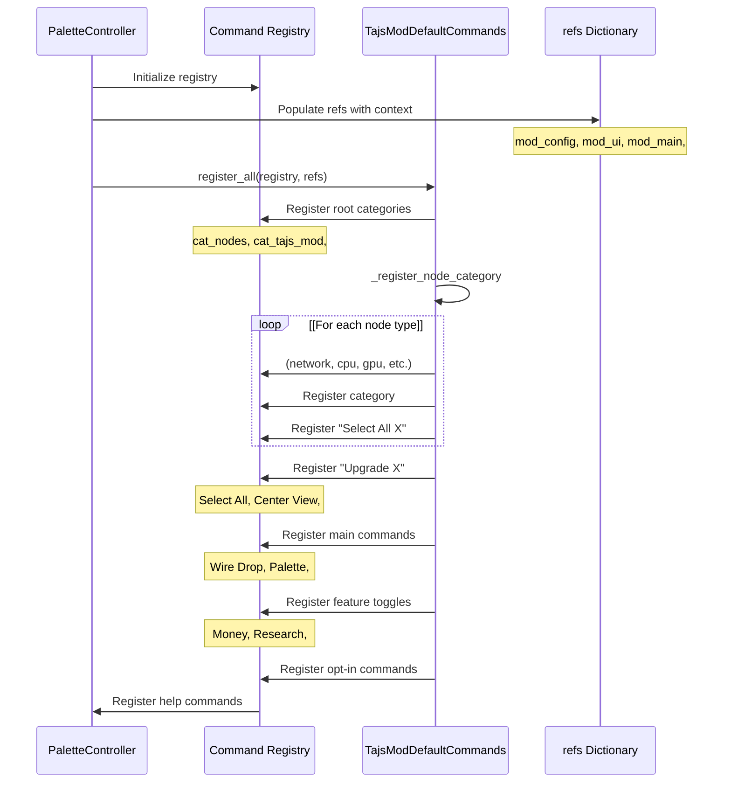
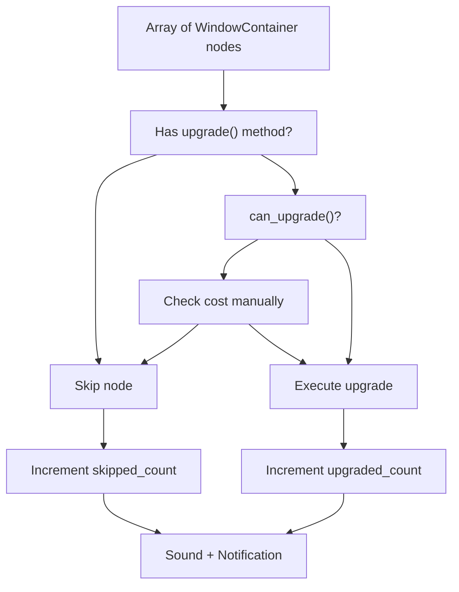

> **Relevant source files**
>
> - [extensions/scripts/palette/default_commands.gd](https://github.com/tajemniktv/TajsMod/blob/5f1e656a/extensions/scripts/palette/default_commands.gd)

## Purpose and Scope

This document explains the command definition system that powers the Command Palette. It covers the structure of individual commands, the category hierarchy that organizes them, the badge system for visual indicators, and the complete set of 60+ default commands registered by the mod. For information about the UI implementation and interaction model of the palette, see [Palette Overlay UI](/tajemniktv/TajsMod/4.2-palette-overlay-ui).

---

## Command Structure and Properties

Each command in the registry is represented as a Dictionary with standardized properties. The `TajsModDefaultCommands` class in [extensions/scripts/palette/default_commands.gd L1-L1102](https://github.com/tajemniktv/TajsMod/blob/5f1e656a/extensions/scripts/palette/default_commands.gd#L1-L1102)

defines and registers all default commands using this structure.

### Command Property Reference

| Property        | Type          | Required        | Description                                                        |
| --------------- | ------------- | --------------- | ------------------------------------------------------------------ |
| `id`            | String        | Yes             | Unique identifier for the command (e.g., `"cmd_select_all_nodes"`) |
| `title`         | String        | Yes\*           | Display name shown in the palette                                  |
| `get_title`     | Callable      | No              | Dynamic title function (overrides `title` if present)              |
| `category_path` | Array[String] | Yes             | Hierarchy path (e.g., `["Nodes", "Groups"]`)                       |
| `keywords`      | Array[String] | Yes             | Search terms for fuzzy matching                                    |
| `hint`          | String        | Yes             | Description/tooltip text                                           |
| `icon_path`     | String        | No              | Path to texture icon (e.g., `"res://textures/icons/..."`)          |
| `badge`         | String        | No              | Visual indicator: `"SAFE"`, `"OPT-IN"`, or `"NEW"`                 |
| `is_category`   | bool          | No              | `true` if this is a category, not an executable command            |
| `run`           | Callable      | Conditional\*\* | Function executed when command is selected                         |
| `can_run`       | Callable      | No              | Function returning `bool` to enable/disable command                |
| `keep_open`     | bool          | No              | If `true`, palette stays open after execution                      |

- Either `title` or `get_title` must be provided.

\*\* Required for non-category commands.

### Command Structure Diagram

```mermaid
flowchart TD

CommandDict["Command Dictionary"]
Id["id: String<br>Unique identifier"]
Title["title: String<br>Display name"]
GetTitle["get_title: Callable<br>(optional dynamic)"]
CategoryPath["category_path: Array[String]<br>Hierarchy location"]
Keywords["keywords: Array[String]<br>Search terms"]
Hint["hint: String<br>Description"]
IconPath["icon_path: String<br>Texture resource"]
Badge["badge: String<br>SAFE/OPT-IN/NEW"]
IsCategory["is_category: bool<br>Category flag"]
Run["run: Callable<br>Execution logic"]
CanRun["can_run: Callable<br>Availability check"]
KeepOpen["keep_open: bool<br>Palette persistence"]

CommandDict --> Id
CommandDict --> Title
CommandDict --> GetTitle
CommandDict --> CategoryPath
CommandDict --> Keywords
CommandDict --> Hint
CommandDict --> IconPath
CommandDict --> Badge
CommandDict --> IsCategory
CommandDict --> Run
CommandDict --> CanRun
CommandDict --> KeepOpen

subgraph Behavior ["Behavior"]
    IsCategory
    Run
    CanRun
    KeepOpen
end

subgraph Presentation ["Presentation"]
    Hint
    IconPath
    Badge
end

subgraph Organization ["Organization"]
    CategoryPath
    Keywords
end

subgraph Identification ["Identification"]
    Id
    Title
    GetTitle
end
```



**Sources:** [extensions/scripts/palette/default_commands.gd L26-L69](https://github.com/tajemniktv/TajsMod/blob/5f1e656a/extensions/scripts/palette/default_commands.gd#L26-L69)

[extensions/scripts/palette/default_commands.gd L76-L131](https://github.com/tajemniktv/TajsMod/blob/5f1e656a/extensions/scripts/palette/default_commands.gd#L76-L131)

---

## Category Hierarchy

Commands are organized into a four-tier hierarchy with root categories, subcategories, and leaf commands. Categories use `is_category: true` and do not have `run` functions.

### Root Category Structure

```mermaid
flowchart TD

Root["Command Registry Root"]
Nodes["cat_nodes<br>'Nodes'<br>Badge: SAFE"]
TajsMod["cat_tajs_mod<br>'Taj's Mod'<br>Badge: SAFE"]
Tools["cat_tools<br>'Tools (Opt-in)'<br>Badge: OPT-IN"]
Help["cat_help<br>'Help & Links'<br>Badge: SAFE"]
NodesNetwork["cat_nodes_network<br>'Network'"]
NodesCPU["cat_nodes_cpu<br>'CPU'"]
NodesGPU["cat_nodes_gpu<br>'GPU'"]
NodesResearch["cat_nodes_research<br>'Research'"]
NodesFactory["cat_nodes_factory<br>'Factory'"]
NodesHacking["cat_nodes_hacking<br>'Hacking'"]
NodesCoding["cat_nodes_coding<br>'Coding'"]
NodesUtility["cat_nodes_utility<br>'Utility'"]
NodesGroups["cat_nodes_groups<br>'Groups'"]
TajsToggles["cat_tajs_toggles<br>'Feature Toggles'"]
TajsVisuals["cat_tajs_visuals<br>'Visuals'"]
TajsScreenshots["cat_tajs_screenshots<br>'Screenshots'"]

Root --> Nodes
Root --> TajsMod
Root --> Tools
Root --> Help
Nodes --> NodesNetwork
Nodes --> NodesCPU
Nodes --> NodesGPU
Nodes --> NodesResearch
Nodes --> NodesFactory
Nodes --> NodesHacking
Nodes --> NodesCoding
Nodes --> NodesUtility
Nodes --> NodesGroups
TajsMod --> TajsToggles
TajsMod --> TajsVisuals
TajsMod --> TajsScreenshots

subgraph subGraph1 ["Taj's Mod Subcategories"]
    TajsToggles
    TajsVisuals
    TajsScreenshots
end

subgraph subGraph0 ["Nodes Subcategories"]
    NodesNetwork
    NodesCPU
    NodesGPU
    NodesResearch
    NodesFactory
    NodesHacking
    NodesCoding
    NodesUtility
    NodesGroups
end
```



**Sources:** [extensions/scripts/palette/default_commands.gd L22-L69](https://github.com/tajemniktv/TajsMod/blob/5f1e656a/extensions/scripts/palette/default_commands.gd#L22-L69)

[extensions/scripts/palette/default_commands.gd L136-L160](https://github.com/tajemniktv/TajsMod/blob/5f1e656a/extensions/scripts/palette/default_commands.gd#L136-L160)

[extensions/scripts/palette/default_commands.gd L281-L556](https://github.com/tajemniktv/TajsMod/blob/5f1e656a/extensions/scripts/palette/default_commands.gd#L281-L556)

### Category Path Examples

The `category_path` property defines a command's location in the hierarchy:

| Command            | `category_path`                    | Result in Palette                            |
| ------------------ | ---------------------------------- | -------------------------------------------- |
| Select All Nodes   | `["Nodes"]`                        | Nodes > Select All Nodes                     |
| Select All Network | `["Nodes", "Network"]`             | Nodes > Network > Select All Network         |
| Wire Drop Menu     | `["Taj's Mod", "Feature Toggles"]` | Taj's Mod > Feature Toggles > Wire Drop Menu |
| Toggle Extra Glow  | `["Taj's Mod", "Visuals"]`         | Taj's Mod > Visuals > Toggle Extra Glow      |
| Money +10%         | `["Tools (Opt-in)"]`               | Tools (Opt-in) > Money +10%                  |

**Sources:** [extensions/scripts/palette/default_commands.gd L76-L95](https://github.com/tajemniktv/TajsMod/blob/5f1e656a/extensions/scripts/palette/default_commands.gd#L76-L95)

[extensions/scripts/palette/default_commands.gd L293-L308](https://github.com/tajemniktv/TajsMod/blob/5f1e656a/extensions/scripts/palette/default_commands.gd#L293-L308)

[extensions/scripts/palette/default_commands.gd L506-L519](https://github.com/tajemniktv/TajsMod/blob/5f1e656a/extensions/scripts/palette/default_commands.gd#L506-L519)

---

## Badge System

Badges provide visual indicators about command safety and availability. They appear as colored labels next to command titles in the palette.

### Badge Types

| Badge    | Meaning                                          | Usage                              | Example Commands                       |
| -------- | ------------------------------------------------ | ---------------------------------- | -------------------------------------- |
| `SAFE`   | Default QoL feature, no gameplay impact          | Most commands                      | Select All, Center View, Open Settings |
| `OPT-IN` | Gameplay-affecting, requires explicit enablement | Cheat commands, gameplay modifiers | Money +10%, Set Unlimited Nodes        |
| `NEW`    | Recently added feature                           | New commands in recent versions    | Add Sticky Note                        |

### Badge Enforcement

Commands with `badge: "OPT-IN"` typically include a `can_run` check that verifies tools are enabled:

```
"can_run": func(ctx): return ctx.are_tools_enabled()
```

This prevents execution unless the user has explicitly enabled tools via the "Enable Tools in Palette" command.

**Sources:** [extensions/scripts/palette/default_commands.gd L34-L57](https://github.com/tajemniktv/TajsMod/blob/5f1e656a/extensions/scripts/palette/default_commands.gd#L34-L57)

[extensions/scripts/palette/default_commands.gd L606-L617](https://github.com/tajemniktv/TajsMod/blob/5f1e656a/extensions/scripts/palette/default_commands.gd#L606-L617)

[extensions/scripts/palette/default_commands.gd L768-L781](https://github.com/tajemniktv/TajsMod/blob/5f1e656a/extensions/scripts/palette/default_commands.gd#L768-L781)

---

## Default Command Set

### Command Count by Category

| Category       | Subcategories                     | Commands | Badge  |
| -------------- | --------------------------------- | -------- | ------ |
| Nodes          | 9 (Network, CPU, GPU, etc.)       | ~30      | SAFE   |
| Taj's Mod      | 3 (Toggles, Visuals, Screenshots) | ~20      | SAFE   |
| Tools (Opt-in) | 0                                 | ~15      | OPT-IN |
| Help & Links   | 0                                 | 8        | SAFE   |
| **Total**      | **12**                            | **~65**  | -      |

**Note:** Dynamic node category commands (Select All X, Upgrade X) are generated programmatically for each node type.

### Key Command Examples

#### Nodes Category Commands

| Command ID                  | Title                        | Description                                |
| --------------------------- | ---------------------------- | ------------------------------------------ |
| `cmd_select_all_nodes`      | Select All Nodes             | Select all nodes on desktop                |
| `cmd_deselect_all`          | Deselect All                 | Clear current selection                    |
| `cmd_center_view`           | Center View on Selection     | Move camera to selected nodes              |
| `cmd_jump_to_group`         | Jump to Group                | Open group picker for navigation           |
| `cmd_upgrade_selected`      | Upgrade Selected             | Upgrade all selected nodes (if affordable) |
| `cmd_upgrade_all`           | Upgrade All                  | Upgrade all nodes on desktop               |
| `cmd_clear_wires_selection` | Clear All Wires in Selection | Disconnect all wires from selected nodes   |

**Sources:** [extensions/scripts/palette/default_commands.gd L76-L225](https://github.com/tajemniktv/TajsMod/blob/5f1e656a/extensions/scripts/palette/default_commands.gd#L76-L225)

#### Taj's Mod Category Commands

| Command ID              | Title                        | Description                         |
| ----------------------- | ---------------------------- | ----------------------------------- |
| `cmd_open_settings`     | Open Settings                | Open mod settings panel             |
| `cmd_toggle_wire_drop`  | Wire Drop Menu [ON]/[OFF]    | Toggle wire drop node spawning menu |
| `cmd_toggle_palette`    | Command Palette [ON]/[OFF]   | Toggle command palette (MMB)        |
| `cmd_toggle_select_all` | Ctrl+A Select All [ON]/[OFF] | Toggle Ctrl+A select all nodes      |
| `cmd_toggle_glow`       | Toggle Extra Glow            | Toggle extra glow effect            |
| `cmd_cycle_opacity`     | Cycle UI Opacity             | Cycle through 100% → 75% → 50%      |
| `cmd_take_screenshot`   | Take Screenshot              | Capture full desktop screenshot     |

**Sources:** [extensions/scripts/palette/default_commands.gd L251-L582](https://github.com/tajemniktv/TajsMod/blob/5f1e656a/extensions/scripts/palette/default_commands.gd#L251-L582)

#### Tools (Opt-in) Category Commands

| Command ID                 | Title                  | Description                      |
| -------------------------- | ---------------------- | -------------------------------- |
| `cmd_money_add`            | Money +10%             | Increase money by 10%            |
| `cmd_money_add_50`         | Money +50%             | Increase money by 50%            |
| `cmd_research_add`         | Research +10%          | Increase research by 10%         |
| `cmd_node_limit_unlimited` | Set Unlimited Nodes    | Remove node limit (set to ∞)     |
| `cmd_node_limit_default`   | Reset Node Limit       | Reset node limit to 400          |
| `cmd_add_sticky_note`      | Add Sticky Note        | Place text note at camera center |
| `cmd_clear_all_notes`      | Clear All Sticky Notes | Delete all sticky notes          |

**Sources:** [extensions/scripts/palette/default_commands.gd L606-L795](https://github.com/tajemniktv/TajsMod/blob/5f1e656a/extensions/scripts/palette/default_commands.gd#L606-L795)

#### Help & Links Category Commands

| Command ID          | Title                   | Description                               |
| ------------------- | ----------------------- | ----------------------------------------- |
| `cmd_show_about`    | About Taj's Mod         | Show mod version and info                 |
| `cmd_copy_workshop` | Copy Workshop Link      | Copy Steam Workshop link to clipboard     |
| `cmd_enable_tools`  | Enable Tools in Palette | Enable opt-in tools and gameplay commands |
| `cmd_palette_help`  | Palette Help            | Show command palette help and hotkeys     |

**Sources:** [extensions/scripts/palette/default_commands.gd L801-L890](https://github.com/tajemniktv/TajsMod/blob/5f1e656a/extensions/scripts/palette/default_commands.gd#L801-L890)

---

## Command Registration Process

### Registration Flow



**Sources:** [extensions/scripts/palette/default_commands.gd L13-L892](https://github.com/tajemniktv/TajsMod/blob/5f1e656a/extensions/scripts/palette/default_commands.gd#L13-L892)

### Reference Dictionary Structure

The `refs` Dictionary passed to `register_all()` contains references to key system components:

| Key              | Type              | Usage                                        |
| ---------------- | ----------------- | -------------------------------------------- |
| `mod_config`     | ConfigManager     | Read/write settings values                   |
| `mod_ui`         | SettingsUI        | Show/hide settings panel                     |
| `mod_main`       | ModMain           | Access managers and core functionality       |
| `context`        | CommandContext    | Check if tools enabled, provide runtime info |
| `palette_config` | PaletteConfig     | Manage palette-specific settings             |
| `controller`     | PaletteController | Access overlay, control palette state        |
| `registry`       | CommandRegistry   | Register additional commands                 |

These references enable command `run` functions to interact with the mod's systems.

**Sources:** [extensions/scripts/palette/default_commands.gd L14-L20](https://github.com/tajemniktv/TajsMod/blob/5f1e656a/extensions/scripts/palette/default_commands.gd#L14-L20)

---

## Helper Utilities

The `TajsModDefaultCommands` class provides several static helper functions used by multiple commands.

### \_upgrade_nodes



**Purpose:** Safely upgrade a list of nodes, checking affordability and handling different upgrade method signatures.

**Logic:**

1. Iterate through all windows in the provided array
2. Verify window has `upgrade()` method
3. If window has `can_upgrade()`, use it for validation and call `_on_upgrade_button_pressed()`
4. Otherwise, manually check `cost` property against `Globals.currencies["money"]`
5. Deduct cost and call `upgrade()` with 0 or 1 argument based on method signature
6. Play sound and show notification with count

**Sources:** [extensions/scripts/palette/default_commands.gd L993-L1046](https://github.com/tajemniktv/TajsMod/blob/5f1e656a/extensions/scripts/palette/default_commands.gd#L993-L1046)

### \_clear_wires_for_windows

**Purpose:** Disconnect all wire connections from a list of windows.

**Logic:**

1. Find all `ResourceContainer` nodes within each window
2. For each container: _ Emit `Signals.delete_connection` for all output connections _ Emit `Signals.delete_connection` for input connection if present
3. Return Dictionary with `{"cleared": int, "nodes": int}` for feedback

**Used by:** `cmd_clear_wires_selection` command

**Sources:** [extensions/scripts/palette/default_commands.gd L1058-L1102](https://github.com/tajemniktv/TajsMod/blob/5f1e656a/extensions/scripts/palette/default_commands.gd#L1058-L1102)

### \_modify_currency

**Purpose:** Add or subtract a percentage of a currency (money, research, token).

**Logic:**

1. Calculate `amount = current * percent`
2. Apply minimum amount for small percentages (e.g., 1000 for money)
3. Update `Globals.currencies[type]`
4. Update `Globals.max_money` or `Globals.max_research` if increased
5. Call `Globals.process(0)` to trigger UI updates
6. Play sound and show notification

**Used by:** Money/Research cheat commands in Tools category

**Sources:** [extensions/scripts/palette/default_commands.gd L895-L924](https://github.com/tajemniktv/TajsMod/blob/5f1e656a/extensions/scripts/palette/default_commands.gd#L895-L924)

### \_register_node_category

**Purpose:** Programmatically register a node category with "Select All" and "Upgrade" commands.

**Parameters:**

- `cat_id`: String identifier (e.g., `"network"`, `"cpu"`)
- `cat_title`: Display name (e.g., `"Network"`, `"CPU"`)
- `icon`: Icon filename (e.g., `"connections"`, `"bits"`)

**Generated Commands:**

1. Category: `cat_nodes_{cat_id}` with title and icon
2. Select command: `cmd_select_{cat_id}` - filters by `Data.windows[key].category`
3. Upgrade command: `cmd_upgrade_{cat_id}` - upgrades filtered nodes

**Sources:** [extensions/scripts/palette/default_commands.gd L927-L991](https://github.com/tajemniktv/TajsMod/blob/5f1e656a/extensions/scripts/palette/default_commands.gd#L927-L991)

---

## Extending with Custom Commands

### Adding Commands via mod_main.gd

To add custom commands, modify the `_setup_command_palette()` method in `mod_main.gd`:

```python
# After TajsModDefaultCommands.register_all()
palette_controller.registry.register({
    "id": "cmd_my_custom_command",
    "title": "My Custom Feature",
    "category_path": ["Taj's Mod"],
    "keywords": ["custom", "feature", "special"],
    "hint": "Execute my custom functionality",
    "badge": "SAFE",
    "run": func(ctx):
        # Your custom logic here
        print("Custom command executed!")
        Signals.notify.emit("check", "Custom command ran!")
})
```

### Dynamic Command Titles

Use `get_title` to create commands with state-dependent titles (e.g., ON/OFF toggles):

```javascript
registry.register({
    "id": "cmd_my_toggle",
    "title": "My Feature",
    "get_title": func():
        var enabled = mod_config.get_value("my_feature_enabled", false)
        return "My Feature " + ("[ON]" if enabled else "[OFF]"),
    "run": func(ctx):
        var current = mod_config.get_value("my_feature_enabled", false)
        mod_config.set_value("my_feature_enabled", !current)
        # Apply the toggle...
})
```

### Conditional Availability

Use `can_run` to disable commands based on runtime conditions:

```css
registry.register({
    "id": "cmd_require_selection",
    "title": "Process Selection",
    "can_run": func(ctx):
        return Globals and Globals.selections.size() > 0,
    "run": func(ctx):
        # Process selected nodes...
})
```

### Keep Palette Open

Set `keep_open: true` for commands that transition to other modes (e.g., opening pickers):

```css
registry.register({
    "id": "cmd_open_picker",
    "title": "Open Picker",
    "keep_open": true,  # Don't close palette
    "run": func(ctx):
        controller.overlay.show_group_picker(groups, manager)
})
```

**Sources:** [extensions/scripts/palette/default_commands.gd L163-L193](https://github.com/tajemniktv/TajsMod/blob/5f1e656a/extensions/scripts/palette/default_commands.gd#L163-L193)

[extensions/scripts/palette/default_commands.gd L293-L308](https://github.com/tajemniktv/TajsMod/blob/5f1e656a/extensions/scripts/palette/default_commands.gd#L293-L308)

---

## Command Execution Context

Commands receive a `CommandContext` object (`ctx` parameter) that provides:

| Method                        | Returns | Description                         |
| ----------------------------- | ------- | ----------------------------------- |
| `ctx.are_tools_enabled()`     | bool    | Check if opt-in tools are available |
| `ctx.set_tools_enabled(bool)` | void    | Enable/disable tools in palette     |

This context is used primarily for conditional availability of opt-in commands.

**Sources:** [extensions/scripts/palette/default_commands.gd L57-L58](https://github.com/tajemniktv/TajsMod/blob/5f1e656a/extensions/scripts/palette/default_commands.gd#L57-L58)

[extensions/scripts/palette/default_commands.gd L614-L617](https://github.com/tajemniktv/TajsMod/blob/5f1e656a/extensions/scripts/palette/default_commands.gd#L614-L617)

---

## Summary

The command definition system provides a flexible, declarative approach to registering palette commands:

- **Structured Properties**: Commands use a standardized Dictionary format with 12 possible properties
- **Hierarchical Organization**: Four root categories with subcategories enable intuitive navigation
- **Badge System**: Visual indicators distinguish safe QoL features from gameplay-affecting tools
- **60+ Default Commands**: Comprehensive set covering node management, mod settings, cheats, and help
- **Helper Utilities**: Shared logic for upgrades, wire clearing, and currency modification
- **Extensibility**: Simple registration API for adding custom commands with dynamic titles and conditional availability

The registry acts as the single source of truth for all palette functionality, consumed by the `PaletteOverlay` UI layer (see [Palette Overlay UI](/tajemniktv/TajsMod/4.2-palette-overlay-ui)).

**Sources:** [extensions/scripts/palette/default_commands.gd L1-L1102](https://github.com/tajemniktv/TajsMod/blob/5f1e656a/extensions/scripts/palette/default_commands.gd#L1-L1102)
