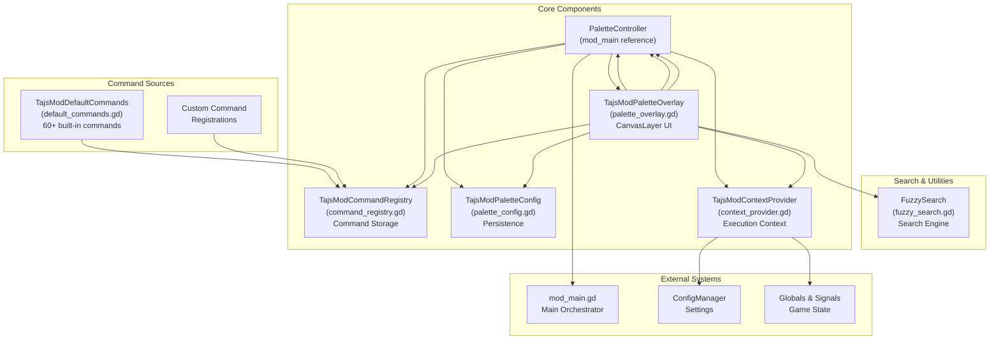
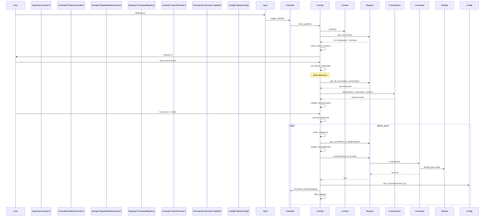
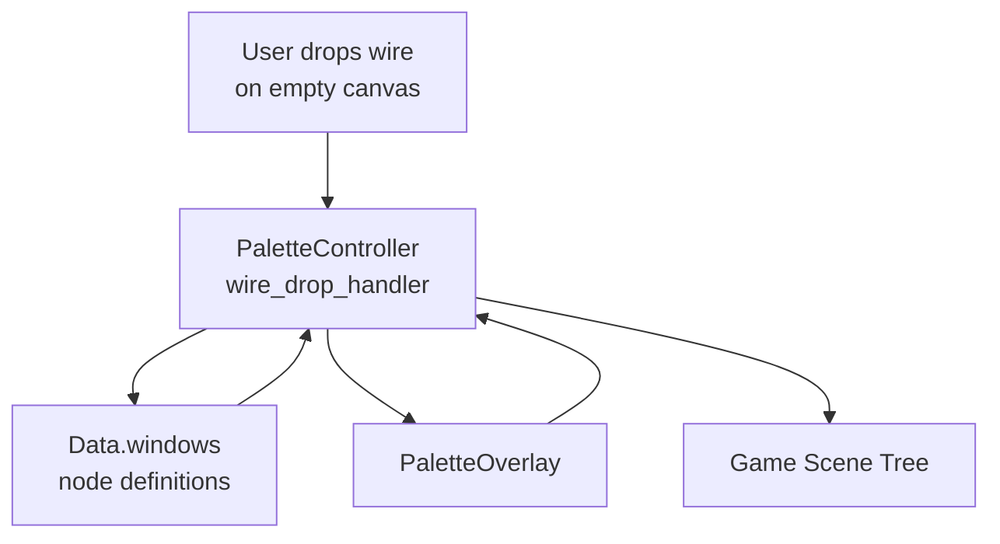
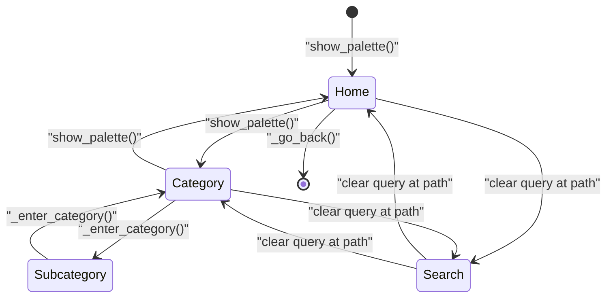
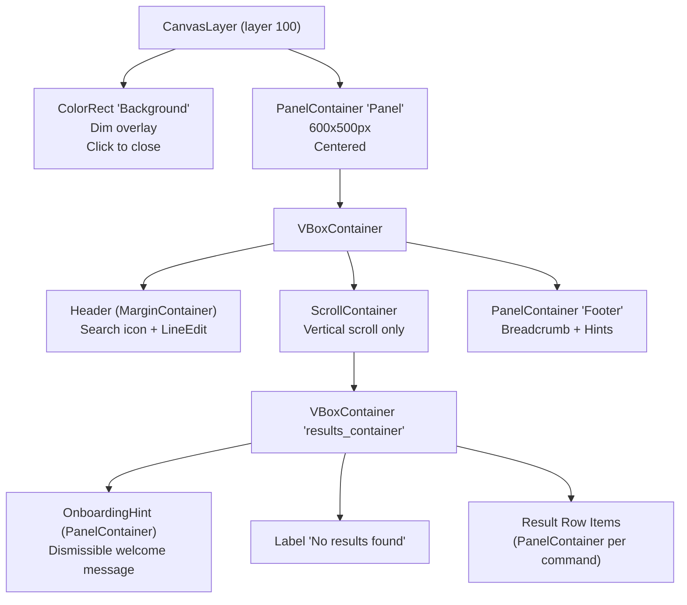
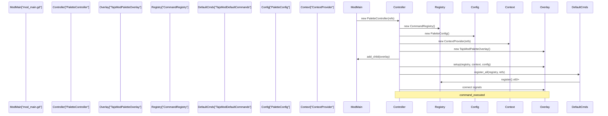

> **Relevant source files**
>
> - [extensions/scripts/palette/default_commands.gd](https://github.com/tajemniktv/TajsMod/blob/5f1e656a/extensions/scripts/palette/default_commands.gd)
> - [extensions/scripts/palette/palette_overlay.gd](https://github.com/tajemniktv/TajsMod/blob/5f1e656a/extensions/scripts/palette/palette_overlay.gd)

## Purpose and Scope

The Command Palette System provides a keyboard-driven, fuzzy-searchable interface for executing mod commands and actions. It serves as the primary power-user interface for accessing the 60+ commands available in the mod, offering fast navigation through hierarchical categories and specialized modes for node spawning and group navigation.

This document covers the architecture, component interactions, and operational modes of the palette system. For details on individual command definitions and the command registry, see [Command Definitions and Registry](/tajemniktv/TajsMod/4.1-command-definitions-and-registry). For UI implementation specifics, see [Palette Overlay UI](/tajemniktv/TajsMod/4.2-palette-overlay-ui).

---

## Architecture Overview

The command palette system is built from five cooperating components that handle registration, display, search, configuration, and execution orchestration.

### Component Architecture



**Sources:** [extensions/scripts/palette/palette_overlay.gd L1-L73](https://github.com/tajemniktv/TajsMod/blob/5f1e656a/extensions/scripts/palette/palette_overlay.gd#L1-L73)

[extensions/scripts/palette/default_commands.gd L1-L13](https://github.com/tajemniktv/TajsMod/blob/5f1e656a/extensions/scripts/palette/default_commands.gd#L1-L13)

### Core Components

| Component      | Class                    | Responsibility                                                                              |
| -------------- | ------------------------ | ------------------------------------------------------------------------------------------- |
| **Controller** | `PaletteController`      | Orchestrates palette lifecycle, handles input (MMB), routes signals to appropriate handlers |
| **Overlay**    | `TajsModPaletteOverlay`  | Manages UI rendering, user input, search results display, and specialized modes             |
| **Registry**   | `TajsModCommandRegistry` | Stores registered commands, provides query APIs for categories and executable commands      |
| **Context**    | `TajsModContextProvider` | Provides runtime context to commands (are_tools_enabled, current selections, etc.)          |
| **Config**     | `TajsModPaletteConfig`   | Persists favorites, recents, and onboarding state to disk                                   |
| **Search**     | `FuzzySearch`            | Performs fuzzy matching on command titles, keywords, and hints                              |

**Sources:** [extensions/scripts/palette/palette_overlay.gd L13-L17](https://github.com/tajemniktv/TajsMod/blob/5f1e656a/extensions/scripts/palette/palette_overlay.gd#L13-L17)

[extensions/scripts/palette/palette_overlay.gd L70-L72](https://github.com/tajemniktv/TajsMod/blob/5f1e656a/extensions/scripts/palette/palette_overlay.gd#L70-L72)

---

## Command Execution Flow



**Sources:** [extensions/scripts/palette/palette_overlay.gd L335-L369](https://github.com/tajemniktv/TajsMod/blob/5f1e656a/extensions/scripts/palette/palette_overlay.gd#L335-L369)

[extensions/scripts/palette/palette_overlay.gd L981-L1016](https://github.com/tajemniktv/TajsMod/blob/5f1e656a/extensions/scripts/palette/palette_overlay.gd#L981-L1016)

[extensions/scripts/palette/default_commands.gd L13-L21](https://github.com/tajemniktv/TajsMod/blob/5f1e656a/extensions/scripts/palette/default_commands.gd#L13-L21)

---

## Specialized Operating Modes

The palette overlay operates in three distinct modes, each with specialized UI and behavior.

### Mode State Table

| Mode             | State Variable                                       | Purpose                    | Trigger               |
| ---------------- | ---------------------------------------------------- | -------------------------- | --------------------- |
| **Normal**       | ` _picker_mode = false``_group_picker_mode = false ` | Standard command execution | `show_palette()`      |
| **Node Picker**  | `_picker_mode = true`                                | Spawn node on wire drop    | `show_node_picker()`  |
| **Group Picker** | `_group_picker_mode = true`                          | Navigate to group          | `show_group_picker()` |

**Sources:** [extensions/scripts/palette/palette_overlay.gd L38-L46](https://github.com/tajemniktv/TajsMod/blob/5f1e656a/extensions/scripts/palette/palette_overlay.gd#L38-L46)

### Normal Command Mode

In normal mode, the palette displays hierarchical command categories and executable commands. Users can navigate categories with arrow keys, search with fuzzy matching, and execute commands with Enter.

**Key Behaviors:**

- Home screen shows favorites → recents → root categories (lines 627-674)
- Search performs fuzzy matching across all executable commands (lines 861-889)
- Category navigation maintains history for back/forward (lines 1068-1108)
- Favorites toggled with `Ctrl+F` (lines 1110-1126)

**Sources:** [extensions/scripts/palette/palette_overlay.gd L627-L689](https://github.com/tajemniktv/TajsMod/blob/5f1e656a/extensions/scripts/palette/palette_overlay.gd#L627-L689)

[extensions/scripts/palette/palette_overlay.gd L856-L890](https://github.com/tajemniktv/TajsMod/blob/5f1e656a/extensions/scripts/palette/palette_overlay.gd#L856-L890)

### Node Picker Mode

Node picker mode is activated when a wire is dropped onto empty canvas space. It displays only nodes compatible with the origin pin's resource type.



**State:**

- `_picker_mode = true`
- `_picker_origin_info` contains pin resource type and direction
- `_picker_spawn_position` stores canvas coordinates for spawning
- `_picker_nodes` holds filtered compatible node definitions

**Display:**

- Search placeholder: "Search nodes to add..." (line 415)
- Breadcrumb: "🔌 Add Node (connecting output → input)" (line 473)
- Only compatible nodes shown, filtered by resource type matching

**Execution:**

- Selecting a node emits `node_selected` signal with `(window_id, spawn_pos, origin_info)` (line 1028)
- Controller handles actual node spawning and wire connection

**Sources:** [extensions/scripts/palette/palette_overlay.gd L401-L494](https://github.com/tajemniktv/TajsMod/blob/5f1e656a/extensions/scripts/palette/palette_overlay.gd#L401-L494)

[extensions/scripts/palette/palette_overlay.gd L1018-L1032](https://github.com/tajemniktv/TajsMod/blob/5f1e656a/extensions/scripts/palette/palette_overlay.gd#L1018-L1032)

### Group Picker Mode

Group picker mode displays all groups on the desktop for quick camera navigation via the "Jump to Group" command.

**State:**

- `_group_picker_mode = true`
- `_group_picker_groups` contains array of group node references
- Stores `goto_group_manager` reference in metadata (line 524)

**Display:**

- Search placeholder: "Search groups to jump to..." (line 517)
- Breadcrumb: "📍 Jump to Group (N groups)" (line 592)
- Groups sorted and displayed with names and icons

**Execution:**

- Selecting a group emits `group_selected` signal (line 1044)
- `GotoGroupManager` receives signal and navigates camera

**Sources:** [extensions/scripts/palette/palette_overlay.gd L500-L621](https://github.com/tajemniktv/TajsMod/blob/5f1e656a/extensions/scripts/palette/palette_overlay.gd#L500-L621)

[extensions/scripts/palette/palette_overlay.gd L1034-L1048](https://github.com/tajemniktv/TajsMod/blob/5f1e656a/extensions/scripts/palette/palette_overlay.gd#L1034-L1048)

---

## Command Structure

Commands registered with the palette follow a standardized dictionary structure.

### Command Dictionary Schema

| Field           | Type            | Required | Purpose                                           |
| --------------- | --------------- | -------- | ------------------------------------------------- |
| `id`            | `String`        | ✓        | Unique identifier for the command                 |
| `title`         | `String`        | ✓        | Display name                                      |
| `get_title`     | `Callable`      | ✗        | Dynamic title generator (overrides `title`)       |
| `category_path` | `Array[String]` | ✓        | Hierarchical path (e.g., `["Nodes", "CPU"]`)      |
| `keywords`      | `Array[String]` | ✓        | Search keywords                                   |
| `hint`          | `String`        | ✓        | Description text                                  |
| `icon_path`     | `String`        | ✗        | Resource path to icon texture                     |
| `is_category`   | `bool`          | ✗        | If `true`, navigates to subcategory               |
| `badge`         | `String`        | ✗        | Visual badge: `SAFE`, `OPT-IN`, `GAMEPLAY`, `NEW` |
| `can_run`       | `Callable`      | ✗        | Conditional visibility: `func(ctx) -> bool`       |
| `run`           | `Callable`      | ✗        | Execution handler: `func(ctx) -> void`            |
| `keep_open`     | `bool`          | ✗        | If `true`, palette stays open after execution     |

**Sources:** [extensions/scripts/palette/default_commands.gd L26-L46](https://github.com/tajemniktv/TajsMod/blob/5f1e656a/extensions/scripts/palette/default_commands.gd#L26-L46)

[extensions/scripts/palette/default_commands.gd L76-L95](https://github.com/tajemniktv/TajsMod/blob/5f1e656a/extensions/scripts/palette/default_commands.gd#L76-L95)

### Example Command Registration

```

```

**Sources:** [extensions/scripts/palette/default_commands.gd L26-L35](https://github.com/tajemniktv/TajsMod/blob/5f1e656a/extensions/scripts/palette/default_commands.gd#L26-L35)

[extensions/scripts/palette/default_commands.gd L311-L326](https://github.com/tajemniktv/TajsMod/blob/5f1e656a/extensions/scripts/palette/default_commands.gd#L311-L326)

---

## Search and Navigation

### Fuzzy Search Engine

The `FuzzySearch` utility performs ranking-based fuzzy matching on commands.

**Search Targets:**

- Command title (highest weight)
- Keywords array
- Hint text (description)
- Category path

**Match Scoring:**

- Substring match: higher score
- Word boundary match: bonus points
- Case-insensitive matching
- Multiple keyword matches accumulate score

**Sources:** [extensions/scripts/palette/palette_overlay.gd L11](https://github.com/tajemniktv/TajsMod/blob/5f1e656a/extensions/scripts/palette/palette_overlay.gd#L11-L11)

[extensions/scripts/palette/palette_overlay.gd L882-L889](https://github.com/tajemniktv/TajsMod/blob/5f1e656a/extensions/scripts/palette/palette_overlay.gd#L882-L889)

### Category Navigation



**Navigation State:**

- `_current_path`: Current category hierarchy (e.g., `["Nodes", "CPU"]`)
- `_history_back`: Stack of previous paths for back navigation
- `_history_forward`: Stack of forward paths (cleared on new navigation)
- `_selected_index`: Currently highlighted result row

**Breadcrumb Display:**

- Home: "🏠 Home"
- Category: "🏠 Home > Nodes > CPU"
- Node Picker: "🔌 Add Node (connecting output → input)"
- Group Picker: "📍 Jump to Group (N groups)"

**Sources:** [extensions/scripts/palette/palette_overlay.gd L28-L36](https://github.com/tajemniktv/TajsMod/blob/5f1e656a/extensions/scripts/palette/palette_overlay.gd#L28-L36)

[extensions/scripts/palette/palette_overlay.gd L845-L850](https://github.com/tajemniktv/TajsMod/blob/5f1e656a/extensions/scripts/palette/palette_overlay.gd#L845-L850)

[extensions/scripts/palette/palette_overlay.gd L1068-L1108](https://github.com/tajemniktv/TajsMod/blob/5f1e656a/extensions/scripts/palette/palette_overlay.gd#L1068-L1108)

### Keyboard Shortcuts

| Key               | Context           | Action                            |
| ----------------- | ----------------- | --------------------------------- |
| `MMB`             | Global            | Toggle palette open/closed        |
| `Spacebar`        | Alternative       | Toggle palette (if configured)    |
| `Esc`             | Palette open      | Close palette                     |
| `↑` / `↓`         | Result list       | Navigate selection                |
| `Enter`           | Result selected   | Execute command or enter category |
| `→` / `Tab`       | Category selected | Enter category                    |
| `←` / `Backspace` | Empty search      | Go back one level                 |
| `Ctrl+F`          | Command selected  | Toggle favorite                   |
| `Ctrl+A`          | Search focused    | Select all search text            |

**Sources:** [extensions/scripts/palette/palette_overlay.gd L896-L941](https://github.com/tajemniktv/TajsMod/blob/5f1e656a/extensions/scripts/palette/palette_overlay.gd#L896-L941)

---

## State Management

### Display State

The overlay maintains several state variables for rendering and interaction:

```

```

**Update Flow:**

1. User action triggers navigation/search
2. `_display_items()` clears old `_result_items` and populates new ones (lines 705-723)
3. `_update_selection()` applies highlight styling to `_selected_index` (lines 822-843)
4. `_update_breadcrumbs()` refreshes footer text (lines 845-850)

**Sources:** [extensions/scripts/palette/palette_overlay.gd L28-L36](https://github.com/tajemniktv/TajsMod/blob/5f1e656a/extensions/scripts/palette/palette_overlay.gd#L28-L36)

[extensions/scripts/palette/palette_overlay.gd L705-L723](https://github.com/tajemniktv/TajsMod/blob/5f1e656a/extensions/scripts/palette/palette_overlay.gd#L705-L723)

[extensions/scripts/palette/palette_overlay.gd L822-L843](https://github.com/tajemniktv/TajsMod/blob/5f1e656a/extensions/scripts/palette/palette_overlay.gd#L822-L843)

### Navigation History

Back/forward navigation is implemented with two stacks:

```

```

**History Management:**

- Entering a category pushes current path to `_history_back` and clears `_history_forward` (lines 1056-1065)
- Going back pops from `_history_back`, pushes to `_history_forward` (lines 1068-1088)
- Going forward pops from `_history_forward`, pushes to `_history_back` (lines 1091-1107)

**Sources:** [extensions/scripts/palette/palette_overlay.gd L34-L35](https://github.com/tajemniktv/TajsMod/blob/5f1e656a/extensions/scripts/palette/palette_overlay.gd#L34-L35)

[extensions/scripts/palette/palette_overlay.gd L1050-L1108](https://github.com/tajemniktv/TajsMod/blob/5f1e656a/extensions/scripts/palette/palette_overlay.gd#L1050-L1108)

### Persistence

The `PaletteConfig` component persists user preferences across sessions:

**Persisted Data:**

- **Favorites**: Command IDs marked with `Ctrl+F`
- **Recents**: Last N executed commands (FIFO queue)
- **Onboarding**: Whether user has dismissed the welcome hint

**Storage:**

- Saved to `user://` directory as JSON
- Write-through: updated immediately on change
- Read on palette initialization

**Display Priority:**
On home screen with empty search:

1. Favorites (with ★ indicator)
2. Recents (with ⏱ indicator, max 5)
3. Root categories

**Sources:** [extensions/scripts/palette/palette_overlay.gd L16](https://github.com/tajemniktv/TajsMod/blob/5f1e656a/extensions/scripts/palette/palette_overlay.gd#L16-L16)

[extensions/scripts/palette/palette_overlay.gd L631-L674](https://github.com/tajemniktv/TajsMod/blob/5f1e656a/extensions/scripts/palette/palette_overlay.gd#L631-L674)

[extensions/scripts/palette/palette_overlay.gd L1110-L1126](https://github.com/tajemniktv/TajsMod/blob/5f1e656a/extensions/scripts/palette/palette_overlay.gd#L1110-L1126)

---

## UI Components

### Panel Structure



**Styling Constants:**

- `PANEL_WIDTH = 600`
- `PANEL_HEIGHT = 500`
- `ITEM_HEIGHT = 50`
- `MAX_VISIBLE_ITEMS = 10`
- Background dim: `Color(0, 0, 0, 0.6)`
- Panel background: `Color(0.08, 0.1, 0.14, 0.95)` with 12px rounded corners

**Sources:** [extensions/scripts/palette/palette_overlay.gd L49-L62](https://github.com/tajemniktv/TajsMod/blob/5f1e656a/extensions/scripts/palette/palette_overlay.gd#L49-L62)

[extensions/scripts/palette/palette_overlay.gd L96-L172](https://github.com/tajemniktv/TajsMod/blob/5f1e656a/extensions/scripts/palette/palette_overlay.gd#L96-L172)

### Result Row Rendering

Each command in the results list is rendered as a `PanelContainer` with structured content:

```
┌─────────────────────────────────────────────────────────────┐
│ [★/⏱] [Icon] Title                  [Category] [→/Badge]   │
└─────────────────────────────────────────────────────────────┘
```

**Row Components (left to right):**

1. **Favorite/Recent Indicator** (optional): ★ for favorites, ⏱ for recents
2. **Icon** (optional): 24x24 texture from `icon_path`
3. **Title**: 18pt font with glow effect
4. **Category Path** (if at root): " > " joined path in 12pt gray text
5. **Arrow/Badge**: _ Categories: → arrow indicator _ Commands: `[SAFE]`, `[OPT-IN]`, `[GAMEPLAY]`, `[NEW]` badge

**Interaction:**

- Hover: Changes background to `COLOR_HOVER`
- Selected: Changes background to `COLOR_SELECTED` with border
- Click: Executes command or navigates to category

**Sources:** [extensions/scripts/palette/palette_overlay.gd L725-L819](https://github.com/tajemniktv/TajsMod/blob/5f1e656a/extensions/scripts/palette/palette_overlay.gd#L725-L819)

[extensions/scripts/palette/palette_overlay.gd L822-L843](https://github.com/tajemniktv/TajsMod/blob/5f1e656a/extensions/scripts/palette/palette_overlay.gd#L822-L843)

### Visual Feedback

**Selection Highlighting:**

- Selected item: `Color(0.2, 0.4, 0.6, 0.8)` background with 1px border
- Hover item: `Color(0.15, 0.25, 0.35, 0.5)` background
- Auto-scrolls to keep selected item visible (line 842)

**Badge Colors:**

| Badge      | Color                    | Purpose                      |
| ---------- | ------------------------ | ---------------------------- |
| `SAFE`     | `Color(0.3, 0.7, 0.4)`   | No gameplay impact           |
| `OPT-IN`   | `Color(0.85, 0.65, 0.2)` | Requires explicit enablement |
| `GAMEPLAY` | `Color(0.8, 0.3, 0.3)`   | Affects gameplay mechanics   |
| `NEW`      | Context-dependent        | Recently added feature       |

**Text Effects:**

- Glow: 5px outline with `Color(0.4, 0.65, 1.0, 0.5)` on titles
- Shadow: Applied to all text for readability

**Sources:** [extensions/scripts/palette/palette_overlay.gd L54-L62](https://github.com/tajemniktv/TajsMod/blob/5f1e656a/extensions/scripts/palette/palette_overlay.gd#L54-L62)

[extensions/scripts/palette/palette_overlay.gd L89-L94](https://github.com/tajemniktv/TajsMod/blob/5f1e656a/extensions/scripts/palette/palette_overlay.gd#L89-L94)

[extensions/scripts/palette/palette_overlay.gd L803-L817](https://github.com/tajemniktv/TajsMod/blob/5f1e656a/extensions/scripts/palette/palette_overlay.gd#L803-L817)

---

## Integration with Mod

### Initialization Sequence



**Initialization in mod_main:**
The palette controller is initialized during `_setup_for_main()` after the HUD is available. References passed include:

- `mod_config`: ConfigManager instance
- `mod_ui`: Settings panel
- `mod_main`: Self reference
- `context`: Global context object

**Sources:** [extensions/scripts/palette/default_commands.gd L13-L21](https://github.com/tajemniktv/TajsMod/blob/5f1e656a/extensions/scripts/palette/default_commands.gd#L13-L21)

Reference to mod_main initialization (not in provided files)

### Context Provider

The `ContextProvider` exposes runtime state to commands via callable methods:

**Available Context Methods:**

- `are_tools_enabled() -> bool`: Check if opt-in gameplay commands are visible
- `set_tools_enabled(enabled: bool)`: Toggle tools visibility
- `get_selected_nodes() -> Array`: Current desktop selection
- `get_desktop() -> Node`: Desktop scene node
- `refresh()`: Update cached context state

**Usage in Commands:**

```

```

**Sources:** [extensions/scripts/palette/default_commands.gd L17](https://github.com/tajemniktv/TajsMod/blob/5f1e656a/extensions/scripts/palette/default_commands.gd#L17-L17)

[extensions/scripts/palette/palette_overlay.gd L83-L87](https://github.com/tajemniktv/TajsMod/blob/5f1e656a/extensions/scripts/palette/palette_overlay.gd#L83-L87)

[extensions/scripts/palette/default_commands.gd L614-L616](https://github.com/tajemniktv/TajsMod/blob/5f1e656a/extensions/scripts/palette/default_commands.gd#L614-L616)

### Signal Communication

The palette system uses signals for loose coupling with the rest of the mod:

| Signal             | Emitter                 | Parameters                                                         | Purpose                            |
| ------------------ | ----------------------- | ------------------------------------------------------------------ | ---------------------------------- |
| `command_executed` | `TajsModPaletteOverlay` | `command_id: String`                                               | Notify that a command ran          |
| `node_selected`    | `TajsModPaletteOverlay` | ` window_id: String``spawn_pos: Vector2``origin_info: Dictionary ` | Request node spawn from wire drop  |
| `group_selected`   | `TajsModPaletteOverlay` | `group: Node`                                                      | Request camera navigation to group |
| `closed`           | `TajsModPaletteOverlay` | None                                                               | Palette was hidden                 |

**Signal Handlers:**

- `command_executed`: Controller logs execution, updates analytics
- `node_selected`: Controller spawns node and creates connection
- `group_selected`: `GotoGroupManager.navigate_to_group()` called directly (one-shot connection)

**Sources:** [extensions/scripts/palette/palette_overlay.gd L64-L67](https://github.com/tajemniktv/TajsMod/blob/5f1e656a/extensions/scripts/palette/palette_overlay.gd#L64-L67)

[extensions/scripts/palette/palette_overlay.gd L1028-L1029](https://github.com/tajemniktv/TajsMod/blob/5f1e656a/extensions/scripts/palette/palette_overlay.gd#L1028-L1029)

[extensions/scripts/palette/default_commands.gd L189-L193](https://github.com/tajemniktv/TajsMod/blob/5f1e656a/extensions/scripts/palette/default_commands.gd#L189-L193)

---

## Performance Considerations

### Debounced Search

Search input is debounced with a 30ms timer to prevent excessive re-renders during typing:

```

```

**Sources:** [extensions/scripts/palette/palette_overlay.gd L323-L328](https://github.com/tajemniktv/TajsMod/blob/5f1e656a/extensions/scripts/palette/palette_overlay.gd#L323-L328)

[extensions/scripts/palette/palette_overlay.gd L856-L890](https://github.com/tajemniktv/TajsMod/blob/5f1e656a/extensions/scripts/palette/palette_overlay.gd#L856-L890)

### Result Limit

Fuzzy search limits results to `MAX_VISIBLE_ITEMS = 10` to keep the UI performant and focused:

```

```

**Sources:** [extensions/scripts/palette/palette_overlay.gd L52](https://github.com/tajemniktv/TajsMod/blob/5f1e656a/extensions/scripts/palette/palette_overlay.gd#L52-L52)

[extensions/scripts/palette/palette_overlay.gd L883](https://github.com/tajemniktv/TajsMod/blob/5f1e656a/extensions/scripts/palette/palette_overlay.gd#L883-L883)

### Node Reference Management

Special care is taken with node references in picker modes to prevent use-after-free:

- `_picker_origin_info.duplicate()` before passing to async spawner (line 1028)
- `is_instance_valid(group)` checks before accessing groups (line 550, 606, 1038)
- Result rows use `queue_free()` for cleanup (line 708)

**Sources:** [extensions/scripts/palette/palette_overlay.gd L1028](https://github.com/tajemniktv/TajsMod/blob/5f1e656a/extensions/scripts/palette/palette_overlay.gd#L1028-L1028)

[extensions/scripts/palette/palette_overlay.gd L550](https://github.com/tajemniktv/TajsMod/blob/5f1e656a/extensions/scripts/palette/palette_overlay.gd#L550-L550)

[extensions/scripts/palette/palette_overlay.gd L708](https://github.com/tajemniktv/TajsMod/blob/5f1e656a/extensions/scripts/palette/palette_overlay.gd#L708-L708)
