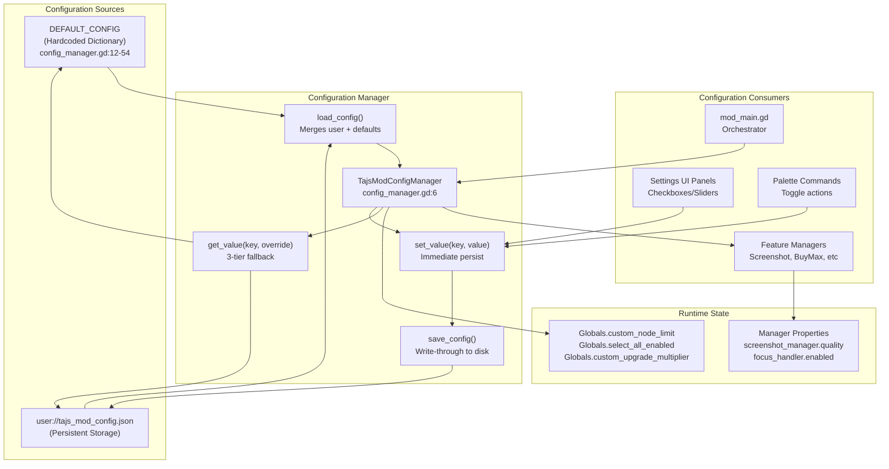
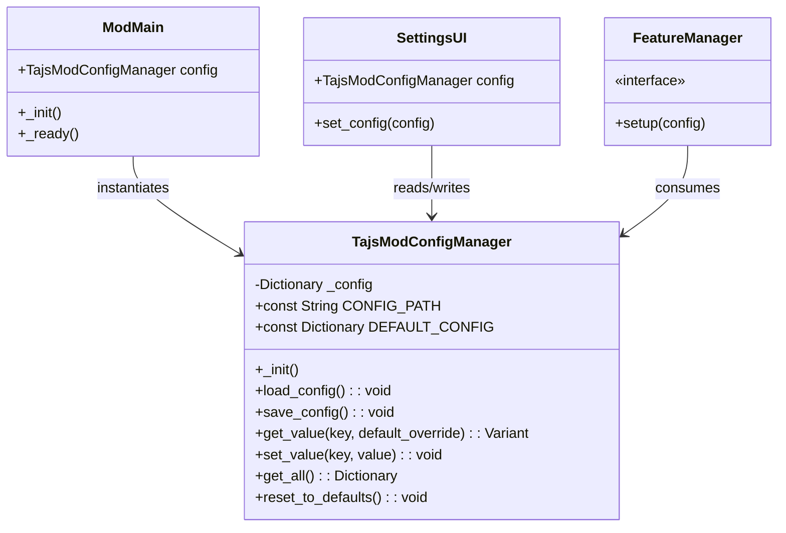
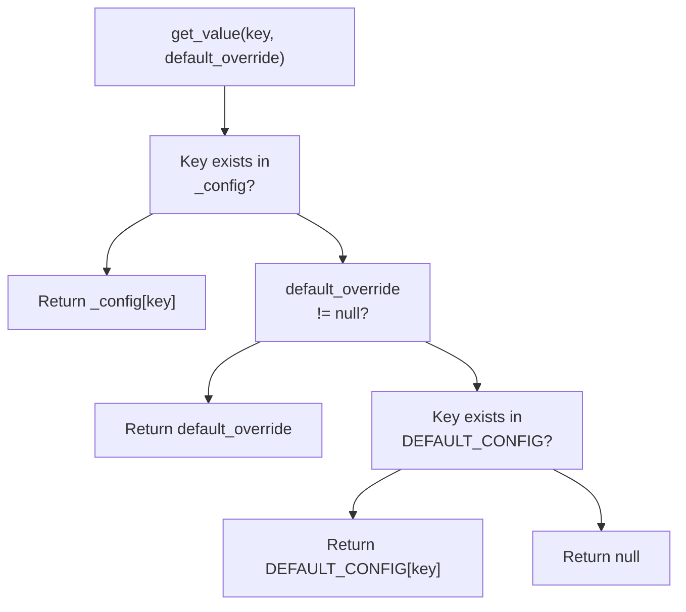
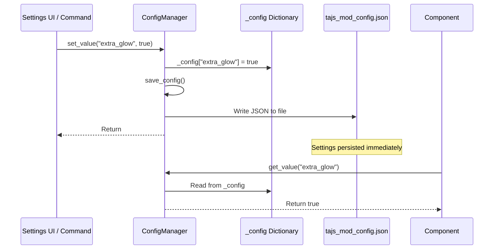
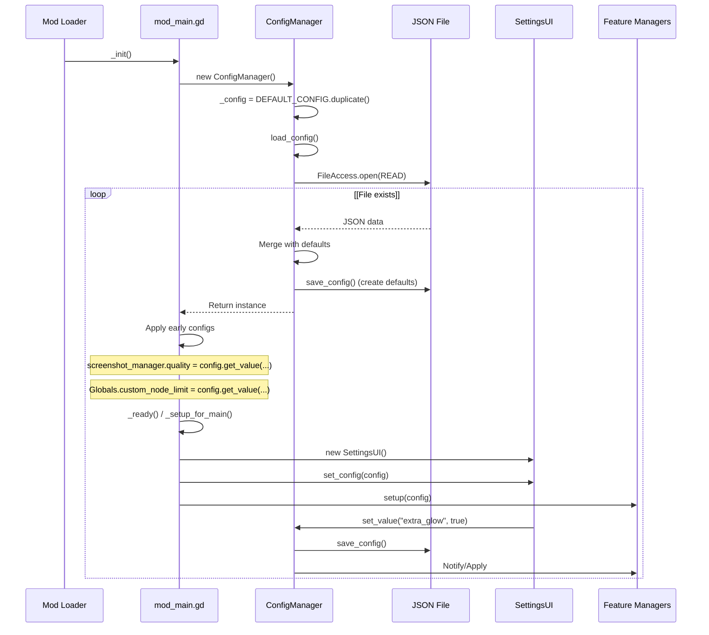
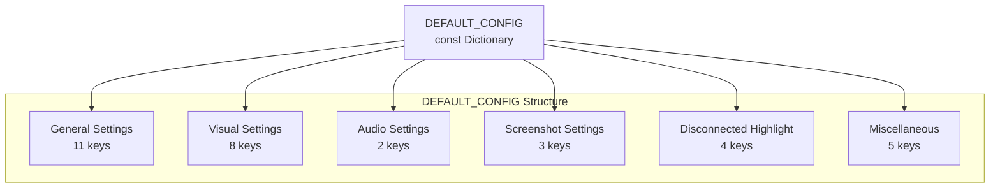

> **Relevant source files**
>
> - [extensions/scripts/utilities/config_manager.gd](https://github.com/tajemniktv/TajsMod/blob/5f1e656a/extensions/scripts/utilities/config_manager.gd)
> - [manifest.json](https://github.com/tajemniktv/TajsMod/blob/5f1e656a/manifest.json)
> - [mod_main.gd](https://github.com/tajemniktv/TajsMod/blob/5f1e656a/mod_main.gd)

## Purpose and Scope

The Configuration System manages persistent storage and retrieval of all user settings in Taj's Mod. It provides a centralized `ConfigManager` class that handles JSON-based persistence, default value fallbacks, and write-through caching to ensure settings survive game restarts.

This page covers the configuration architecture, persistence strategy, and integration patterns. For information about the Settings UI that allows users to modify these values, see [Settings Panel UI](/tajemniktv/TajsMod/5-feature-reference). For the command palette's settings toggle commands, see [Command Definitions and Registry](/tajemniktv/TajsMod/4.1-command-definitions-and-registry).

---

## Architecture Overview

The configuration system follows a write-through caching pattern with a three-tier fallback hierarchy. All settings are stored in a single JSON file and accessed through a centralized manager instance.



**Sources:** [extensions/scripts/utilities/config_manager.gd L1-L134](https://github.com/tajemniktv/TajsMod/blob/5f1e656a/extensions/scripts/utilities/config_manager.gd#L1-L134)

[mod_main.gd L33-L96](https://github.com/tajemniktv/TajsMod/blob/5f1e656a/mod_main.gd#L33-L96)

---

## The ConfigManager Class

The `TajsModConfigManager` class is a `RefCounted` singleton that manages all configuration operations. It is instantiated early in the mod lifecycle and passed to components that need configuration access.

### Class Definition



**Sources:** [extensions/scripts/utilities/config_manager.gd L6-L134](https://github.com/tajemniktv/TajsMod/blob/5f1e656a/extensions/scripts/utilities/config_manager.gd#L6-L134)

[mod_main.gd L12-L89](https://github.com/tajemniktv/TajsMod/blob/5f1e656a/mod_main.gd#L12-L89)

### Key Methods

| Method                | Signature                                              | Description                                                     |
| --------------------- | ------------------------------------------------------ | --------------------------------------------------------------- |
| `_init()`             | `func _init() -> void`                                 | Initializes `_config` with defaults, then calls `load_config()` |
| `load_config()`       | `func load_config() -> void`                           | Reads JSON file, merges with defaults, preserves extra keys     |
| `save_config()`       | `func save_config() -> void`                           | Writes `_config` to JSON file with tab indentation              |
| `get_value()`         | `func get_value(key: String, default_override = null)` | Returns value with 3-tier fallback                              |
| `set_value()`         | `func set_value(key: String, value) -> void`           | Updates `_config[key]` and immediately calls `save_config()`    |
| `get_all()`           | `func get_all() -> Dictionary`                         | Returns a duplicate of the entire config dictionary             |
| `reset_to_defaults()` | `func reset_to_defaults() -> void`                     | Deletes user file, resets `_config` to `DEFAULT_CONFIG`         |

**Sources:** [extensions/scripts/utilities/config_manager.gd L58-L133](https://github.com/tajemniktv/TajsMod/blob/5f1e656a/extensions/scripts/utilities/config_manager.gd#L58-L133)

---

## Configuration Hierarchy

The configuration system uses a three-tier fallback mechanism when retrieving values. This allows new settings to be added in updates without breaking existing user configurations.



**Sources:** [extensions/scripts/utilities/config_manager.gd L110-L117](https://github.com/tajemniktv/TajsMod/blob/5f1e656a/extensions/scripts/utilities/config_manager.gd#L110-L117)

### Fallback Behavior

1. **Tier 1 - User Configuration**: If the key exists in the in-memory `_config` dictionary (loaded from `user://tajs_mod_config.json`), return that value
2. **Tier 2 - Method Override**: If a `default_override` parameter was provided to `get_value()`, return that
3. **Tier 3 - Default Configuration**: If the key exists in `DEFAULT_CONFIG`, return the hardcoded default
4. **Tier 4 - Null**: If none of the above, return `null`

This hierarchy ensures backward compatibility when new settings are added. The `load_config()` method explicitly preserves extra keys from the user file that aren't in `DEFAULT_CONFIG`:

**Sources:** [extensions/scripts/utilities/config_manager.gd L62-L117](https://github.com/tajemniktv/TajsMod/blob/5f1e656a/extensions/scripts/utilities/config_manager.gd#L62-L117)

---

## Persistence Strategy

The configuration system uses a **write-through caching** strategy where every modification immediately persists to disk. This ensures no settings are lost even if the game crashes.

### Write-Through Workflow



**Sources:** [extensions/scripts/utilities/config_manager.gd L100-L121](https://github.com/tajemniktv/TajsMod/blob/5f1e656a/extensions/scripts/utilities/config_manager.gd#L100-L121)

### File Format

The configuration file is stored as formatted JSON with tab indentation at `user://tajs_mod_config.json`. Example content:

```css
 {
  "node_limit": 400,
	"extra_glow": false,
	"glow_intensity": 2,
	"screenshot_quality": 2,
	"command_palette_enabled": true,
	"wire_colors_hex": {
    "money":"#FFD700","research": "#00BFFF";
  }
}
```

**Sources:** [extensions/scripts/utilities/config_manager.gd L10-L108](https://github.com/tajemniktv/TajsMod/blob/5f1e656a/extensions/scripts/utilities/config_manager.gd#L10-L108)

### Smart Merging on Load

When `load_config()` runs, it performs smart merging to handle version updates:

1. Iterate through all keys in `DEFAULT_CONFIG` and add them to `_config` if missing from the user file
2. Preserve any extra keys from the user file that aren't in defaults (e.g., `wire_colors_hex` custom data)
3. Log success or errors

This allows new default settings to be added in updates without requiring users to reset their configuration.

**Sources:** [extensions/scripts/utilities/config_manager.gd L79-L98](https://github.com/tajemniktv/TajsMod/blob/5f1e656a/extensions/scripts/utilities/config_manager.gd#L79-L98)

---

## Configuration Lifecycle

The configuration system is initialized early in the mod lifecycle and remains active throughout the game session.



**Sources:** [mod_main.gd L72-L339](https://github.com/tajemniktv/TajsMod/blob/5f1e656a/mod_main.gd#L72-L339)

[extensions/scripts/utilities/config_manager.gd L58-L108](https://github.com/tajemniktv/TajsMod/blob/5f1e656a/extensions/scripts/utilities/config_manager.gd#L58-L108)

---

## Configuration Categories

The `DEFAULT_CONFIG` dictionary defines 40+ configuration keys organized into logical categories. Each category corresponds to a tab in the Settings UI.

### General Tab

| Key                         | Type   | Default | Description                                 |
| --------------------------- | ------ | ------- | ------------------------------------------- |
| `node_limit`                | `int`  | `400`   | Maximum nodes allowed (-1 for unlimited)    |
| `select_all_enabled`        | `bool` | `true`  | Enable Ctrl+A to select all nodes           |
| `command_palette_enabled`   | `bool` | `true`  | Enable MMB command palette                  |
| `wire_drop_menu_enabled`    | `bool` | `true`  | Show quick-add menu on wire drop            |
| `right_click_clear_enabled` | `bool` | `true`  | Right-click output slots to disconnect      |
| `goto_group_enabled`        | `bool` | `true`  | Show "Go To Group" button                   |
| `buy_max_enabled`           | `bool` | `true`  | Show "Buy Max" button in upgrades           |
| `z_order_fix_enabled`       | `bool` | `true`  | Fix z-order of nested groups                |
| `disable_slider_scroll`     | `bool` | `false` | Block scroll wheel on sliders               |
| `six_input_containers`      | `bool` | `true`  | Allow 6-input containers (requires restart) |
| `upgrade_multiplier`        | `int`  | `10`    | Ctrl+click upgrade multiplier               |

**Sources:** [extensions/scripts/utilities/config_manager.gd L12-L36](https://github.com/tajemniktv/TajsMod/blob/5f1e656a/extensions/scripts/utilities/config_manager.gd#L12-L36)

### Visuals Tab

| Key                  | Type         | Default | Description                       |
| -------------------- | ------------ | ------- | --------------------------------- |
| `extra_glow`         | `bool`       | `false` | Enable enhanced glow effects      |
| `glow_intensity`     | `float`      | `2.0`   | Glow brightness multiplier        |
| `glow_strength`      | `float`      | `1.3`   | Glow spread strength              |
| `glow_bloom`         | `float`      | `0.2`   | Bloom effect amount               |
| `glow_sensitivity`   | `float`      | `0.8`   | HDR threshold sensitivity         |
| `ui_opacity`         | `float`      | `100.0` | UI transparency (50-100%)         |
| `custom_wire_colors` | `bool`       | `true`  | Enable custom wire colors         |
| `wire_colors_hex`    | `Dictionary` | `{}`    | Custom wire colors by resource ID |

**Sources:** [extensions/scripts/utilities/config_manager.gd L36-L42](https://github.com/tajemniktv/TajsMod/blob/5f1e656a/extensions/scripts/utilities/config_manager.gd#L36-L42)

### Screenshot Settings

| Key                    | Type     | Default                | Description                         |
| ---------------------- | -------- | ---------------------- | ----------------------------------- |
| `screenshot_quality`   | `int`    | `2`                    | JPEG quality (0=Low, 1=Med, 2=High) |
| `screenshot_watermark` | `bool`   | `true`                 | Add "Taj's Mod" watermark           |
| `screenshot_folder`    | `String` | `"user://screenshots"` | Output directory path               |

**Sources:** [extensions/scripts/utilities/config_manager.gd L14-L16](https://github.com/tajemniktv/TajsMod/blob/5f1e656a/extensions/scripts/utilities/config_manager.gd#L14-L16)

### Audio Settings

| Key                  | Type    | Default | Description                              |
| -------------------- | ------- | ------- | ---------------------------------------- |
| `mute_on_focus_loss` | `bool`  | `true`  | Reduce volume when window loses focus    |
| `background_volume`  | `float` | `0.0`   | Volume percentage when unfocused (0-100) |

**Sources:** [extensions/scripts/utilities/config_manager.gd L29-L31](https://github.com/tajemniktv/TajsMod/blob/5f1e656a/extensions/scripts/utilities/config_manager.gd#L29-L31)

### Highlight Disconnected Nodes

| Key                                | Type     | Default   | Description                 |
| ---------------------------------- | -------- | --------- | --------------------------- |
| `highlight_disconnected_enabled`   | `bool`   | `true`    | Highlight unconnected nodes |
| `highlight_disconnected_style`     | `String` | `"pulse"` | Style: "pulse" or "outline" |
| `highlight_disconnected_intensity` | `float`  | `0.5`     | Effect intensity (0.0-1.0)  |
| `highlight_disconnected_debug`     | `bool`   | `false`   | Enable debug logging        |

**Sources:** [extensions/scripts/utilities/config_manager.gd L45-L49](https://github.com/tajemniktv/TajsMod/blob/5f1e656a/extensions/scripts/utilities/config_manager.gd#L45-L49)

### Debug Settings

| Key                        | Type   | Default | Description                                |
| -------------------------- | ------ | ------- | ------------------------------------------ |
| `custom_boot_screen`       | `bool` | `true`  | Show custom boot screen (requires restart) |
| `debug_mode`               | `bool` | `false` | Enable verbose debug logging               |
| `disable_controller_input` | `bool` | `false` | Block all controller inputs                |

**Sources:** [extensions/scripts/utilities/config_manager.gd L52-L53](https://github.com/tajemniktv/TajsMod/blob/5f1e656a/extensions/scripts/utilities/config_manager.gd#L52-L53)

---

## Integration Points

Components integrate with the configuration system through several patterns:

### Pattern 1: Direct Read in \_init()

Early initialization components read configuration directly during `mod_main._init()`:

**Sources:** [mod_main.gd L88-L96](https://github.com/tajemniktv/TajsMod/blob/5f1e656a/mod_main.gd#L88-L96)

### Pattern 2: Manager Setup Method

Feature managers receive the config instance via a `setup()` method:

**Sources:** [mod_main.gd L104-L418](https://github.com/tajemniktv/TajsMod/blob/5f1e656a/mod_main.gd#L104-L418)

### Pattern 3: SettingsUI Callbacks

The Settings UI registers callbacks that call `config.set_value()` and apply changes immediately:

**Sources:** [mod_main.gd L467-L497](https://github.com/tajemniktv/TajsMod/blob/5f1e656a/mod_main.gd#L467-L497)

### Pattern 4: Palette Commands

Command palette toggles modify config and sync UI state:

**Sources:** [mod_main.gd L1150-L1154](https://github.com/tajemniktv/TajsMod/blob/5f1e656a/mod_main.gd#L1150-L1154)

### Pattern 5: Restart-Required Settings

Some settings require a game restart to take effect. These track their original values and show a banner if changed:

**Sources:** [mod_main.gd L473-L1174](https://github.com/tajemniktv/TajsMod/blob/5f1e656a/mod_main.gd#L473-L1174)

---

## Default Configuration Reference

The complete `DEFAULT_CONFIG` dictionary serves as the schema for all available settings. It is defined as a constant at the top of the ConfigManager class:



**Sources:** [extensions/scripts/utilities/config_manager.gd L12-L54](https://github.com/tajemniktv/TajsMod/blob/5f1e656a/extensions/scripts/utilities/config_manager.gd#L12-L54)

### Adding New Settings

To add a new configuration option:

1. Add the key and default value to `DEFAULT_CONFIG` in `config_manager.gd`
2. Create UI controls in the appropriate settings tab in `mod_main._build_settings_menu()`
3. Connect the UI control's signal to a callback that calls `config.set_value()`
4. Consume the setting in the relevant manager or component via `config.get_value()`
5. If the setting requires a restart, add it to `_restart_original_values` and call `_check_restart_required()`

**Sources:** [extensions/scripts/utilities/config_manager.gd L12-L54](https://github.com/tajemniktv/TajsMod/blob/5f1e656a/extensions/scripts/utilities/config_manager.gd#L12-L54)

[mod_main.gd L462-L688](https://github.com/tajemniktv/TajsMod/blob/5f1e656a/mod_main.gd#L462-L688)
