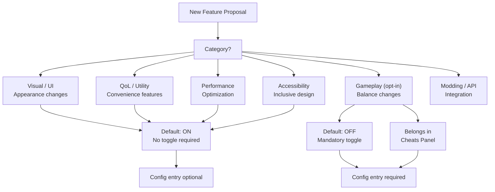
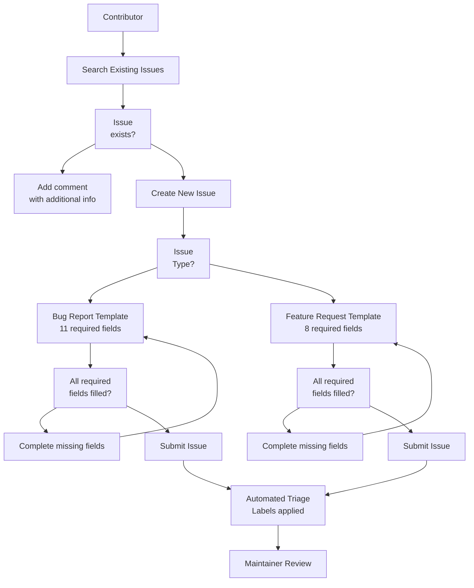
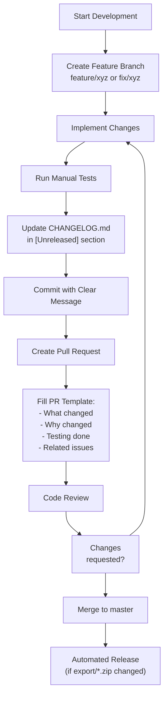
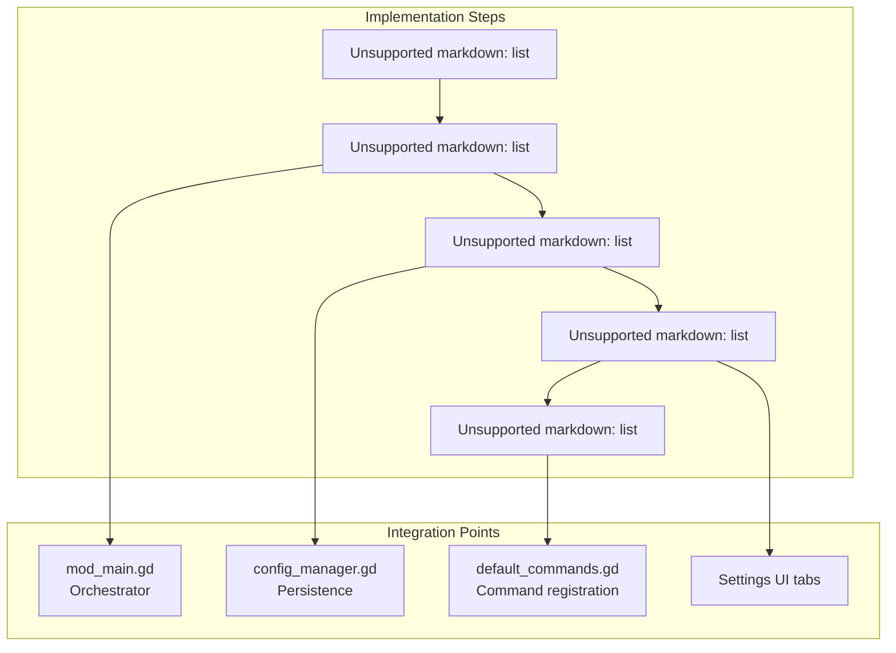
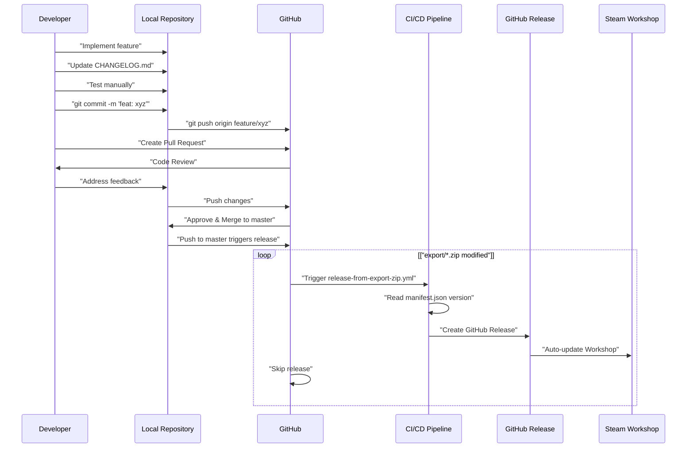
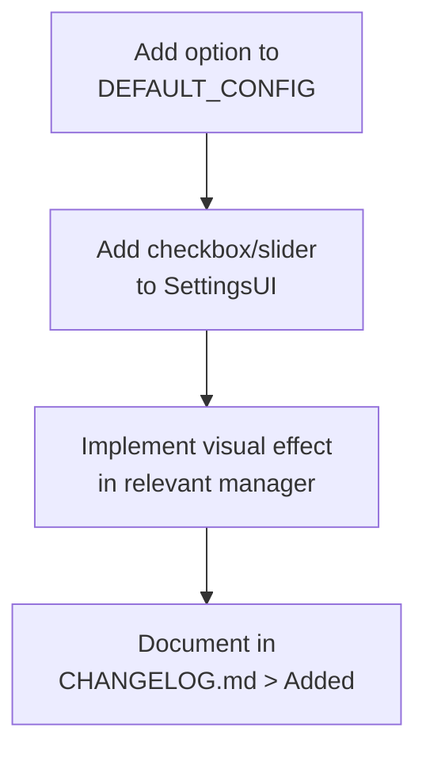
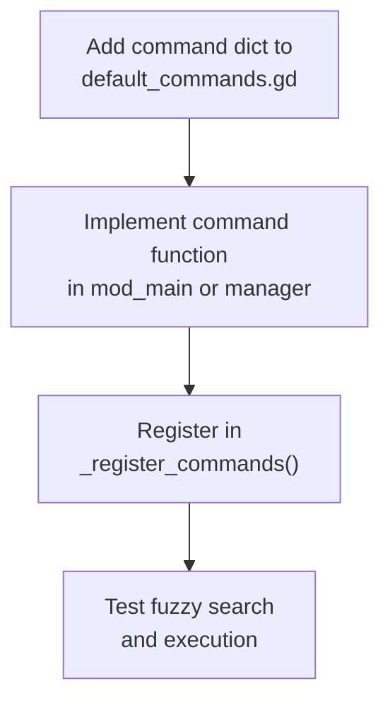
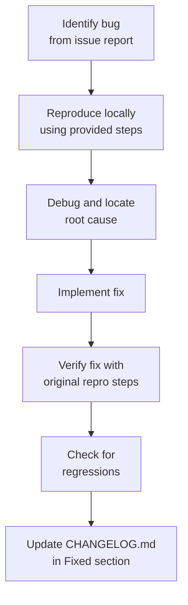

> **Relevant source files**
>
> - [.github/ISSUE_TEMPLATE/bug_report.yml](https://github.com/tajemniktv/TajsMod/blob/5f1e656a/.github/ISSUE_TEMPLATE/bug_report.yml)
> - [.github/ISSUE_TEMPLATE/config.yml](https://github.com/tajemniktv/TajsMod/blob/5f1e656a/.github/ISSUE_TEMPLATE/config.yml)
> - [.github/ISSUE_TEMPLATE/feature_request.yml](https://github.com/tajemniktv/TajsMod/blob/5f1e656a/.github/ISSUE_TEMPLATE/feature_request.yml)
> - [CHANGELOG.md](https://github.com/tajemniktv/TajsMod/blob/5f1e656a/CHANGELOG.md)
> - [README.md](https://github.com/tajemniktv/TajsMod/blob/5f1e656a/README.md)
> - [preview/Containers6Input.png](https://github.com/tajemniktv/TajsMod/blob/5f1e656a/preview/Containers6Input.png)

This page provides best practices and conventions for contributing code, documentation, or issue reports to Taj's Mod. It covers code style standards, feature categorization principles, testing expectations, and changelog maintenance procedures.

For information about the build pipeline and release process, see [Building and Distribution](/tajemniktv/TajsMod/8.1-building-and-distribution). For details on the issue triage system and automated labeling, see [Issue Management](/tajemniktv/TajsMod/8.3-issue-management).

---

## Philosophy and Contribution Principles

Taj's Mod follows a **"make the game better" toolbox** philosophy without overhauling core gameplay. All contributions should align with these core principles:

| Principle                   | Description                                         | Enforcement               |
| --------------------------- | --------------------------------------------------- | ------------------------- |
| **Non-invasive**            | Use script extensions rather than binary patches    | Review required           |
| **Opt-in Gameplay Changes** | Features affecting game balance default to disabled | Mandatory toggle          |
| **Modularity**              | Features can be toggled independently               | Config entry required     |
| **User Experience First**   | Dual interfaces for casual and power users          | Settings UI + Command     |
| **Persistent State**        | All settings survive restarts                       | ConfigManager integration |

**Sources:** [README.md L3-L18](https://github.com/tajemniktv/TajsMod/blob/5f1e656a/README.md#L3-L18)

---

## Code Style and Conventions

### GDScript Standards

The codebase uses Godot's GDScript with these conventions:

| Convention          | Standard             | Example                              |
| ------------------- | -------------------- | ------------------------------------ |
| **Class Names**     | PascalCase           | `ConfigManager`, `BuyMaxManager`     |
| **Function Names**  | snake_case           | `_setup_for_main()`, `load_config()` |
| **Private Methods** | Prefix with `_`      | `_init()`, `_ready()`, `_process()`  |
| **Constants**       | SCREAMING_SNAKE_CASE | `DEFAULT_CONFIG`, `MOD_VERSION`      |
| **Variables**       | snake_case           | `wire_colors`, `screenshot_quality`  |
| **Signals**         | snake_case           | `config_changed`, `palette_opened`   |

### File Organization

```markdown
mods/TajemnikTV-TajsModded/
├── mod_main.gd # Main orchestrator (hub)
├── managers/ # Feature-specific managers
│ ├── config_manager.gd
│ ├── screenshot_manager.gd
│ └── buy_max_manager.gd
├── commands/ # Command system
│ ├── default_commands.gd
│ └── palette_overlay.gd
├── ui/ # UI components
│ └── window_group.gd
└── extensions/ # Script extensions (installed via mod_main)
```

### Documentation Standards

Every significant class should include a header comment:

```markdown
# ========================================

# ClassName - Brief Purpose

# ========================================

# Detailed description of what this component does,

# its lifecycle, and how it integrates with the system.

#

# Dependencies:

# - ConfigManager (for settings persistence)

# - Globals (for game state access)
```

**Sources:** File structure observed across all provided files

---

## Feature Categorization

All features must be categorized to guide implementation decisions and user expectations. This categorization appears in issue templates, settings UI, and the command palette.

### Feature Categories



### Category Decision Table

| If Feature...                               | Then Category     | Default State | Toggle Required |
| ------------------------------------------- | ----------------- | ------------- | --------------- |
| Changes appearance only                     | Visual / UI       | ON            | No              |
| Adds convenience without affecting balance  | QoL / Utility     | ON            | Optional        |
| Improves performance                        | Performance       | ON            | No              |
| Helps players with disabilities             | Accessibility     | ON            | Optional        |
| Modifies node limits, currency, or research | Gameplay (opt-in) | **OFF**       | **Yes**         |
| Provides API for other mods                 | Modding / API     | ON            | No              |

**Sources:** [.github/ISSUE_TEMPLATE/bug_report.yml L44-L57](https://github.com/tajemniktv/TajsMod/blob/5f1e656a/.github/ISSUE_TEMPLATE/bug_report.yml#L44-L57)

[.github/ISSUE_TEMPLATE/feature_request.yml L72-L86](https://github.com/tajemniktv/TajsMod/blob/5f1e656a/.github/ISSUE_TEMPLATE/feature_request.yml#L72-L86)

---

## Testing Guidelines

### Manual Testing Checklist

Before submitting a pull request, verify:

| Test Area                       | Verification Steps                                         |
| ------------------------------- | ---------------------------------------------------------- |
| **Configuration Persistence**   | Change setting → Restart game → Verify persistence         |
| **Command Palette Integration** | Feature accessible via command palette (if applicable)     |
| **Settings UI**                 | Setting visible in correct tab with proper label           |
| **Hotkey Conflicts**            | No conflicts with base game or other mod features          |
| **Performance**                 | No noticeable lag on 1080p/1440p displays                  |
| **Save Compatibility**          | Existing saves load without errors                         |
| **Multi-instance**              | Feature works correctly when toggled on/off multiple times |

### Regression Testing

For bug fixes, include in your PR description:

1. **Last Known Working Version** - Which version worked correctly
2. **Regression Point** - When the bug was introduced
3. **Reproduction Steps** - Exact steps to trigger the bug
4. **Fix Verification** - Steps to verify the fix

**Sources:** [.github/ISSUE_TEMPLATE/bug_report.yml L137-L162](https://github.com/tajemniktv/TajsMod/blob/5f1e656a/.github/ISSUE_TEMPLATE/bug_report.yml#L137-L162)

---

## Issue Submission Workflow



### Bug Report Requirements

The bug report template requires 11 fields:

| Field                | Purpose                    | Example                     |
| -------------------- | -------------------------- | --------------------------- |
| `mod_version`        | Identify exact build       | `v0.0.23`                   |
| `game_version`       | Game compatibility         | `2.0.17`                    |
| `category`           | Route to correct subsystem | `QoL / Utility`             |
| `description`        | What went wrong            | Clear error description     |
| `reproduction_steps` | How to trigger             | Numbered step list          |
| `expected`           | Intended behavior          | What should happen          |
| `actual`             | Current behavior           | What happens instead        |
| `frequency`          | Reliability                | Every time / Often / Rarely |
| `regression`         | Previously worked?         | Yes / No / Not sure         |
| `other_mods`         | Conflict check             | List of installed mods      |
| `environment`        | System info                | OS, CPU, GPU, RAM           |

**Sources:** [.github/ISSUE_TEMPLATE/bug_report.yml L25-L222](https://github.com/tajemniktv/TajsMod/blob/5f1e656a/.github/ISSUE_TEMPLATE/bug_report.yml#L25-L222)

### Feature Request Requirements

The feature request template requires 8 core fields plus acceptance criteria:

| Field                 | Purpose                  | Example                     |
| --------------------- | ------------------------ | --------------------------- |
| `summary`             | One-line description     | "Add wire drop menu"        |
| `motivation`          | Problem being solved     | "Slow node spawning"        |
| `proposed_solution`   | Implementation details   | UI mockup + behavior        |
| `category`            | Feature classification   | `QoL / Utility`             |
| `scope`               | Size estimate            | Small / Medium / Large      |
| `constraints`         | Technical considerations | Performance impact? Opt-in? |
| `alternatives`        | Other approaches         | Why this solution is best   |
| `acceptance_criteria` | Definition of done       | Checklist format            |

**Sources:** [.github/ISSUE_TEMPLATE/feature_request.yml L23-L210](https://github.com/tajemniktv/TajsMod/blob/5f1e656a/.github/ISSUE_TEMPLATE/feature_request.yml#L23-L210)

---

## Pull Request Process

### PR Submission Checklist



### Commit Message Format

Use clear, descriptive commit messages:

```python
# Good examples:
feat: Add watermark option to screenshot system
fix: Prevent Ctrl+A from selecting nodes in palette search
chore: Update manifest version to 0.0.23
docs: Add contribution guidelines to README

# Bad examples:
Update file
Fix bug
Changes
WIP
```

**Sources:** [CHANGELOG.md L1-L154](https://github.com/tajemniktv/TajsMod/blob/5f1e656a/CHANGELOG.md#L1-L154)

---

## Changelog Maintenance

All changes must be documented in `CHANGELOG.md` following the [Keep a Changelog](https://keepachangelog.com/) format.

### Changelog Structure

```markdown
## [Unreleased]

### Added

- New features

### Changed

- Modifications to existing features

### Removed

- Removed features

### Fixed

- Bug fixes

## [0.23.0] - 2025-12-TBD

(Previous version entries...)
```

### Change Type Guidelines

| Change Type | Description                        | Example                             |
| ----------- | ---------------------------------- | ----------------------------------- |
| **Added**   | New features or capabilities       | "Screenshot Watermark option"       |
| **Changed** | Modifications to existing features | "Improved pattern button layout"    |
| **Removed** | Features that were deleted         | "Removed legacy compatibility code" |
| **Fixed**   | Bug fixes and corrections          | "Fixed Ctrl+A in command palette"   |

### Version Numbering

Taj's Mod uses semantic versioning (MAJOR.MINOR.PATCH):

- **MAJOR**: Breaking changes or major feature overhauls
- **MINOR**: New features, backward compatible
- **PATCH**: Bug fixes, small improvements

Current versioning strategy:

- `0.x.y` - Pre-1.0 development (breaking changes allowed in MINOR)
- After `1.0.0` - Strict semantic versioning

**Sources:** [CHANGELOG.md L1-L154](https://github.com/tajemniktv/TajsMod/blob/5f1e656a/CHANGELOG.md#L1-L154)

[README.md L3-L18](https://github.com/tajemniktv/TajsMod/blob/5f1e656a/README.md#L3-L18)

---

## Code Integration Points

### Adding a New Feature Manager



### Manager Implementation Template

```javascript
# ========================================
# MyManager - Brief Description
# ========================================
# Detailed description of functionality
#
# Dependencies:
# - ConfigManager (settings)
# - Globals (game state)

extends Node

# Configuration
var enabled := false
var my_setting := 100

# References
var config_manager: Node = null

func _init(config_mgr: Node) -> void:
    config_manager = config_mgr
    _load_settings()

func _load_settings() -> void:
    enabled = config_manager.get_value("my_manager_enabled", false)
    my_setting = config_manager.get_value("my_manager_setting", 100)

func apply_settings() -> void:
    # Apply configuration changes
    pass

func _process(delta: float) -> void:
    if not enabled:
        return
    # Per-frame logic
```

**Sources:** Architecture patterns observed in manager files

---

## Development Workflow Integration



### Local Development Setup

1. **Clone Repository** `git clone https://github.com/tajemniktv/TajsMod.git cd TajsMod`
2. **Symlink to Game Directory** (for testing) `markdown # Link mod folder to Upload Labs mods directory ln -s $(pwd) "~/.local/share/Upload Labs/mods/TajemnikTV-TajsModded" `
3. **Edit and Test** _ Modify source files _ Launch game to test changes \* Check `godot.log` for errors
4. **Create Export Package** (when ready) _ Update `manifest.json` version _ Export as `.zip` to `export/` directory \* Commit changes to trigger release

**Sources:** [README.md L60-L69](https://github.com/tajemniktv/TajsMod/blob/5f1e656a/README.md#L60-L69)

Development pipeline section

---

## Common Contribution Scenarios

### Scenario 1: Adding a Visual Customization Option



**Config Location:** [mod_main.gd](https://github.com/tajemniktv/TajsMod/blob/5f1e656a/mod_main.gd#LNaN-LNaN)

**Settings UI:** Settings panel visual tab
**Persistence:** Automatic via `ConfigManager.set_value()`

---

### Scenario 2: Adding a Command Palette Command



**Command File:** [commands/default_commands.gd](https://github.com/tajemniktv/TajsMod/blob/5f1e656a/commands/default_commands.gd)

**Registration:** `PaletteController.register_command()`
**Categories:** `"nodes"`, `"view"`, `"toggles"`, `"cheats"`, `"debug"`

**Sources:** [commands/default_commands.gd](https://github.com/tajemniktv/TajsMod/blob/5f1e656a/commands/default_commands.gd)

Command system architecture

---

### Scenario 3: Fixing a Bug



**Required Information:**

- Last known working version (if regression)
- Exact reproduction steps
- Expected vs actual behavior
- Fix verification steps

**Sources:** [.github/ISSUE_TEMPLATE/bug_report.yml](https://github.com/tajemniktv/TajsMod/blob/5f1e656a/.github/ISSUE_TEMPLATE/bug_report.yml)

---

## Best Practices Summary

| Practice                         | Rationale                   | Example                           |
| -------------------------------- | --------------------------- | --------------------------------- |
| **Small, focused commits**       | Easier to review and revert | One feature per commit            |
| **Test with minimal mods**       | Isolate conflicts           | Disable other mods during testing |
| **Update changelog immediately** | Don't forget later          | Add entry when implementing       |
| **Follow naming conventions**    | Code consistency            | snake_case for functions          |
| **Opt-in for gameplay changes**  | Preserve vanilla experience | Default `enabled: false`          |
| **Document edge cases**          | Prevent regressions         | Comment unusual logic             |
| **Check existing issues**        | Avoid duplicates            | Search before creating            |
| **Provide repro steps**          | Faster resolution           | Numbered list format              |

**Sources:** All contributing workflow files
