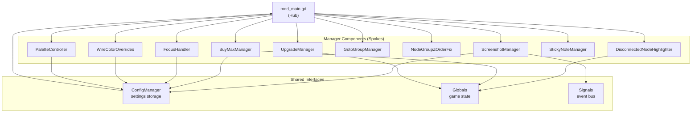
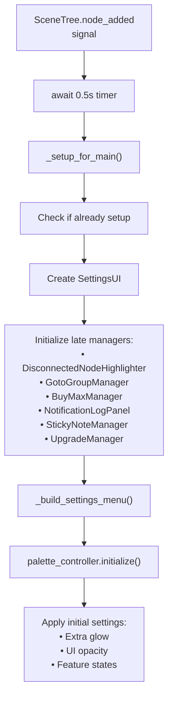
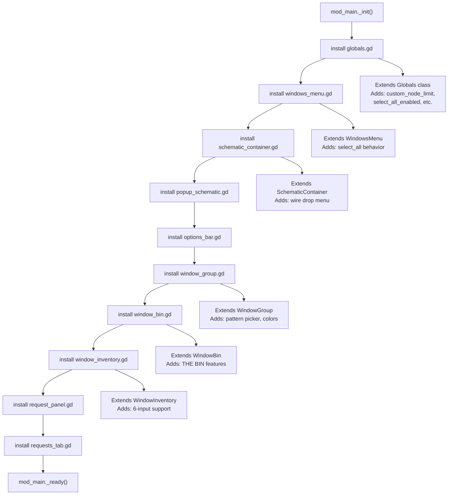
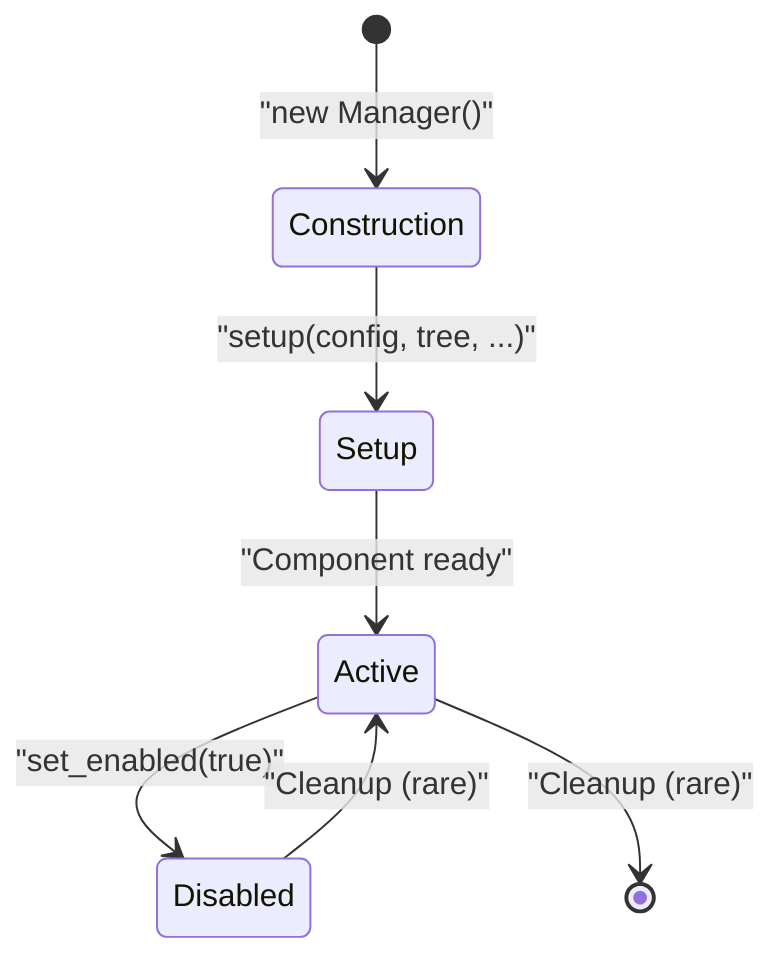
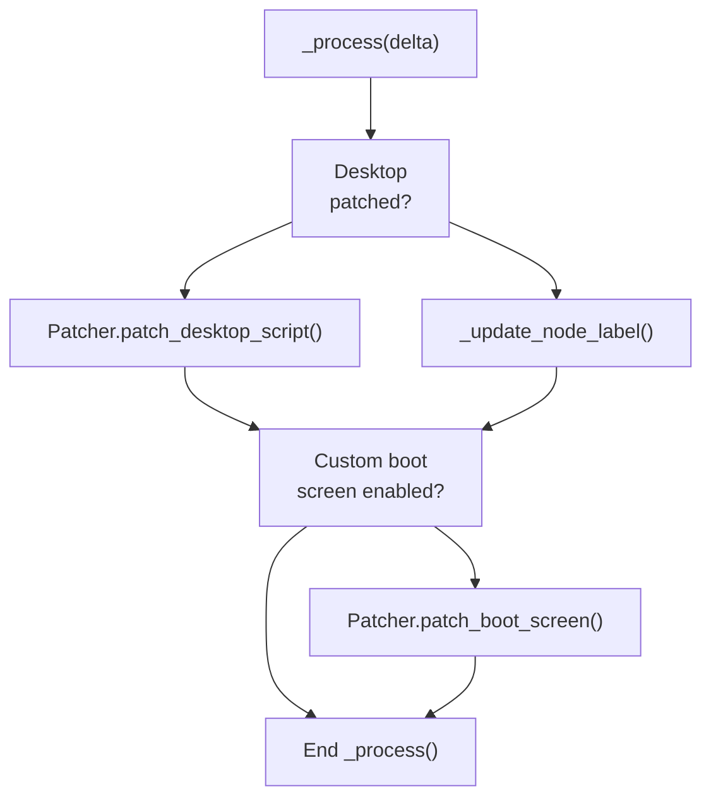
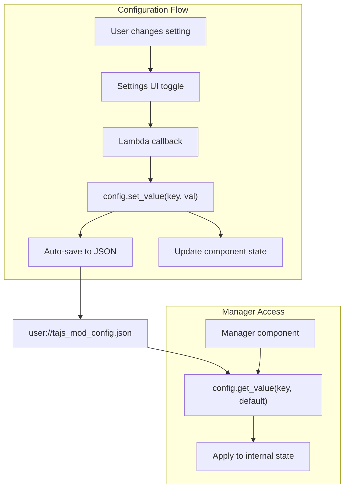

> **Relevant source files**
>
> - [extensions/scripts/utilities/config_manager.gd](https://github.com/tajemniktv/TajsMod/blob/5f1e656a/extensions/scripts/utilities/config_manager.gd)
> - [mod_main.gd](https://github.com/tajemniktv/TajsMod/blob/5f1e656a/mod_main.gd)

This document explains the fundamental architectural patterns that underpin TajsMod's implementation. It covers the **hub-and-spoke orchestration model**, **two-phase initialization sequence**, **script extension mechanism**, and **component lifecycle management**.

For details about individual manager components, see [Utility Manager Components](/tajemniktv/TajsMod/6-utility-manager-components). For configuration system internals, see [Configuration System](/tajemniktv/TajsMod/3.2-configuration-system). For script extension implementations, see [Script Extensions](/tajemniktv/TajsMod/3.3-script-extensions). For the main orchestrator's implementation details, see [The Main Orchestrator (mod_main.gd)](</tajemniktv/TajsMod/3.1-the-main-orchestrator-(mod_main.gd)>).

---

## Architectural Pattern: Hub-and-Spoke Orchestration

TajsMod uses a centralized orchestration pattern where `mod_main.gd` acts as the **hub** that initializes and coordinates 10+ independent **spoke** components. Each manager component is responsible for a specific feature domain and communicates through shared interfaces (`Globals`, `Signals`, `ConfigManager`).

### The Hub: mod_main.gd

The main orchestrator (`mod_main.gd`) serves as the entry point and lifecycle coordinator for all mod functionality. It:

- Installs script extensions during `_init()`
- Creates and initializes manager components
- Manages shared resources (color picker, configuration)
- Provides coordination methods for inter-component communication
- Handles persistent runtime tasks in `_process()`

**Sources:** [mod_main.gd L1-L68](https://github.com/tajemniktv/TajsMod/blob/5f1e656a/mod_main.gd#L1-L68)

### Manager Components (Spokes)

The orchestrator manages these specialized components:

| Manager                       | Purpose                            | Initialized In                      |
| ----------------------------- | ---------------------------------- | ----------------------------------- |
| `ConfigManager`               | Settings persistence and retrieval | `_init()`                           |
| `ScreenshotManager`           | Image capture and tiling           | `_init()`                           |
| `PaletteController`           | Command palette system             | `_init()`                           |
| `WireClearHandler`            | Right-click wire clearing          | `_init()`                           |
| `FocusHandler`                | Audio muting on focus loss         | `_init()`                           |
| `WireColorOverrides`          | Custom wire color system           | `_init()`                           |
| `GotoGroupManager`            | Node group navigation              | `_setup_for_main()`                 |
| `GotoGroupPanel`              | UI for group navigation            | `_setup_for_main()`                 |
| `NodeGroupZOrderFix`          | Z-order rendering fix              | `_setup_for_main()`                 |
| `BuyMaxManager`               | Upgrade automation                 | `_setup_for_main()`                 |
| `CheatManager`                | Cheat panel features               | `_build_settings_menu()`            |
| `NotificationLogPanel`        | Toast history UI                   | `_setup_notification_log()`         |
| `DisconnectedNodeHighlighter` | Visual node highlighting           | `_setup_disconnected_highlighter()` |
| `StickyNoteManager`           | Sticky notes feature               | `_setup_sticky_notes()`             |
| `UpgradeManager`              | Modifier key upgrades              | `_setup_upgrade_manager()`          |

**Sources:** [mod_main.gd L32-L48](https://github.com/tajemniktv/TajsMod/blob/5f1e656a/mod_main.gd#L32-L48)

[mod_main.gd L462-L689](https://github.com/tajemniktv/TajsMod/blob/5f1e656a/mod_main.gd#L462-L689)

### Component Communication



**Sources:** [mod_main.gd L32-L48](https://github.com/tajemniktv/TajsMod/blob/5f1e656a/mod_main.gd#L32-L48)

[mod_main.gd L278-L340](https://github.com/tajemniktv/TajsMod/blob/5f1e656a/mod_main.gd#L278-L340)

---

## Two-Phase Initialization

TajsMod uses a **two-phase initialization sequence** to ensure proper dependency ordering. This pattern separates construction-time tasks from scene-tree-dependent setup.

### Phase 1: \_init() - Early Initialization

The `_init()` method runs **before the node tree is available**. It handles:

1. **Script extension installation** - Must happen first, before any extended classes are instantiated
2. **Configuration loading** - Settings must be available for component initialization
3. **Early manager creation** - Components that don't need the scene tree

```mermaid
sequenceDiagram
  participant ModLoader
  participant mod_main._init()
  participant Script Extensions
  participant ConfigManager
  participant Early Managers

  ModLoader->>mod_main._init(): "Load mod"
  mod_main._init()->>Script Extensions: "install_script_extension() x10"
  note over Script Extensions: "Extensions modify base classes
  mod_main._init()->>ConfigManager: "new ConfigManager()"
  ConfigManager->>ConfigManager: "load_config()"
  note over ConfigManager: "Loads user://tajs_mod_config.json"
  mod_main._init()->>Early Managers: "new ScreenshotManager()"
  mod_main._init()->>Early Managers: "new PaletteController()"
  mod_main._init()->>Early Managers: "new WireClearHandler()"
  mod_main._init()->>Early Managers: "new FocusHandler()"
  mod_main._init()->>Early Managers: "new WireColorOverrides()"
  note over mod_main._init(): "Scene tree not yet available"
```

**Code execution order:**

1. Install 10 script extensions [mod_main.gd L73-L82](https://github.com/tajemniktv/TajsMod/blob/5f1e656a/mod_main.gd#L73-L82)
2. Create `ConfigManager` instance [mod_main.gd L89](https://github.com/tajemniktv/TajsMod/blob/5f1e656a/mod_main.gd#L89-L89)
3. Create early managers that don't require scene tree [mod_main.gd L92-L113](https://github.com/tajemniktv/TajsMod/blob/5f1e656a/mod_main.gd#L92-L113)

**Sources:** [mod_main.gd L72-L113](https://github.com/tajemniktv/TajsMod/blob/5f1e656a/mod_main.gd#L72-L113)

### Phase 2: \_ready() - Scene Tree Setup

The `_ready()` method runs **after the scene tree is available**. It handles:

1. **Shared resource initialization** - UI components like color picker
2. **Wire color application** - Requires `Data` to be loaded
3. **Node listener setup** - Waits for `Main` node to appear
4. **Patching operations** - Injects modifications into game systems

```mermaid
sequenceDiagram
  participant Godot Engine
  participant mod_main._ready()
  participant Shared UI (ColorPicker)
  participant WireColorOverrides
  participant SceneTree

  Godot Engine->>mod_main._ready(): "_ready() called"
  mod_main._ready()->>Shared UI (ColorPicker): "Create CanvasLayer + ColorPickerPanel"
  note over Shared UI (ColorPicker): "picker_canvas.layer = 100
  mod_main._ready()->>WireColorOverrides: "wire_colors.setup(config)"
  mod_main._ready()->>WireColorOverrides: "wire_colors.apply_overrides()"
  note over WireColorOverrides: "Data.connectors now available"
  mod_main._ready()->>mod_main._ready(): "screenshot_manager.set_tree()"
  mod_main._ready()->>mod_main._ready(): "Globals.custom_node_limit = saved_limit"
  mod_main._ready()->>SceneTree: "get_tree().node_added.connect()"
  note over SceneTree: "Listen for 'Main' node appearance"
  mod_main._ready()->>mod_main._ready(): "call_deferred('_check_existing_main')"
```

**Code execution order:**

1. Create shared color picker UI [mod_main.gd L119-L143](https://github.com/tajemniktv/TajsMod/blob/5f1e656a/mod_main.gd#L119-L143)
2. Apply wire color overrides [mod_main.gd L145-L147](https://github.com/tajemniktv/TajsMod/blob/5f1e656a/mod_main.gd#L145-L147)
3. Set scene tree references [mod_main.gd L150](https://github.com/tajemniktv/TajsMod/blob/5f1e656a/mod_main.gd#L150-L150)
4. Apply saved settings to `Globals` [mod_main.gd L153-L155](https://github.com/tajemniktv/TajsMod/blob/5f1e656a/mod_main.gd#L153-L155)
5. Inject bin window patch [mod_main.gd L158](https://github.com/tajemniktv/TajsMod/blob/5f1e656a/mod_main.gd#L158-L158)
6. Listen for `Main` node [mod_main.gd L162-L163](https://github.com/tajemniktv/TajsMod/blob/5f1e656a/mod_main.gd#L162-L163)

**Sources:** [mod_main.gd L115-L163](https://github.com/tajemniktv/TajsMod/blob/5f1e656a/mod_main.gd#L115-L163)

### Phase 3: \_setup_for_main() - Deferred Setup

When the `Main` node is detected, `_setup_for_main()` performs **UI-dependent initialization**:

1. **Settings UI creation** - Requires HUD to be available
2. **Late manager initialization** - Components that need UI references
3. **Command palette setup** - Needs tree and config
4. **Feature panel integration** - Injects UI into game's HUD



**Sources:** [mod_main.gd L268-L340](https://github.com/tajemniktv/TajsMod/blob/5f1e656a/mod_main.gd#L268-L340)

---

## Script Extension System

Script extensions allow the mod to **modify base game classes** without replacing binary files. They are installed during `_init()` before any game classes are instantiated.

### Extension Installation

Extensions are installed using `ModLoaderMod.install_script_extension()`:



**Installed Extensions:**

| Extension File           | Base Class           | Purpose                                                     |
| ------------------------ | -------------------- | ----------------------------------------------------------- |
| `globals.gd`             | `Globals`            | Adds custom node limit, select all flag, upgrade multiplier |
| `windows_menu.gd`        | `WindowsMenu`        | Implements Ctrl+A select all functionality                  |
| `schematic_container.gd` | `SchematicContainer` | Wire drop menu integration                                  |
| `popup_schematic.gd`     | `PopupSchematic`     | Popup-related enhancements                                  |
| `options_bar.gd`         | `OptionsBar`         | Options bar modifications                                   |
| `window_group.gd`        | `WindowGroup`        | Custom colors and patterns                                  |
| `window_bin.gd`          | `WindowBin`          | THE BIN enhancements                                        |
| `window_inventory.gd`    | `WindowInventory`    | 6-input container support                                   |
| `request_panel.gd`       | `RequestPanel`       | Request panel modifications                                 |
| `requests_tab.gd`        | `RequestsTab`        | Requests tab enhancements                                   |

**Sources:** [mod_main.gd L73-L82](https://github.com/tajemniktv/TajsMod/blob/5f1e656a/mod_main.gd#L73-L82)

### Extension Timing

Extensions must be installed in `_init()` because:

1. **Class inheritance** - Extensions modify class definitions
2. **Instantiation order** - Base game instantiates windows/nodes during startup
3. **No retroactive patching** - Cannot modify already-instantiated objects' class definitions

**Sources:** [mod_main.gd L72-L86](https://github.com/tajemniktv/TajsMod/blob/5f1e656a/mod_main.gd#L72-L86)

---

## Component Lifecycle

Each manager component follows a standard lifecycle pattern orchestrated by `mod_main.gd`.

### Lifecycle Stages



### Construction Phase

Managers are created during initialization:

**Early managers** (created in `_init()`):

- `ConfigManager` - No dependencies
- `ScreenshotManager` - Needs config
- `PaletteController` - Added as child immediately
- `WireClearHandler` - Needs config
- `FocusHandler` - Needs config
- `WireColorOverrides` - Standalone initially

**Late managers** (created in `_setup_for_main()`):

- `DisconnectedNodeHighlighter` - Needs tree + config
- `GotoGroupManager` - Needs tree
- `NodeGroupZOrderFix` - Needs tree
- `BuyMaxManager` - Needs tree + config
- `NotificationLogPanel` - Needs HUD reference
- `StickyNoteManager` - Needs tree + config
- `UpgradeManager` - Needs tree + config

**Sources:** [mod_main.gd L88-L113](https://github.com/tajemniktv/TajsMod/blob/5f1e656a/mod_main.gd#L88-L113)

[mod_main.gd L278-L340](https://github.com/tajemniktv/TajsMod/blob/5f1e656a/mod_main.gd#L278-L340)

### Setup Phase

Managers receive their dependencies through `setup()` methods:

```markdown
# Example: FocusHandler setup pattern

focus_handler.setup(config)

# Example: DisconnectedNodeHighlighter setup pattern

disconnected_highlighter.setup(config, get_tree(), self)

# Example: BuyMaxManager setup pattern (async)

await get_tree().create_timer(0.1).timeout
buy_max_manager.setup(get_tree(), config)
```

**Common setup parameters:**

- `config: ConfigManager` - For reading/writing settings
- `tree: SceneTree` - For node access and signals
- `mod_main: Node` - For accessing debug mode or shared resources

**Sources:** [mod_main.gd L104](https://github.com/tajemniktv/TajsMod/blob/5f1e656a/mod_main.gd#L104-L104)

[mod_main.gd L418](https://github.com/tajemniktv/TajsMod/blob/5f1e656a/mod_main.gd#L418-L418)

[mod_main.gd L436](https://github.com/tajemniktv/TajsMod/blob/5f1e656a/mod_main.gd#L436-L436)

### Active Phase

During runtime, managers:

1. **Respond to configuration changes** via config callbacks
2. **Listen to game signals** (e.g., `Signals.notify`)
3. **Handle user input** through input events
4. **Update UI** as game state changes
5. **Enable/disable** based on toggle settings

**Example: Toggle visibility pattern:**

```javascript
func _set_goto_group_visible(visible: bool) -> void:
    if goto_group_panel:
        var container = goto_group_panel.get_parent()
        if container:
            container.visible = visible
```

**Sources:** [mod_main.gd L1082-L1086](https://github.com/tajemniktv/TajsMod/blob/5f1e656a/mod_main.gd#L1082-L1086)

### Runtime Coordination

The `_process()` method handles persistent runtime tasks:



**Persistent patches:**

- Desktop script patching [mod_main.gd L180-L181](https://github.com/tajemniktv/TajsMod/blob/5f1e656a/mod_main.gd#L180-L181)
- Node counter label updates [mod_main.gd L184](https://github.com/tajemniktv/TajsMod/blob/5f1e656a/mod_main.gd#L184-L184)
- Boot screen customization [mod_main.gd L187-L190](https://github.com/tajemniktv/TajsMod/blob/5f1e656a/mod_main.gd#L187-L190)

**Sources:** [mod_main.gd L178-L190](https://github.com/tajemniktv/TajsMod/blob/5f1e656a/mod_main.gd#L178-L190)

---

## Configuration Integration

Components access configuration through the shared `ConfigManager` instance:



**Configuration access pattern:**

1. **Read on initialization:** `var value = config.get_value("setting_key", default_value)`
2. **Write on change:** `config.set_value("setting_key", new_value)` (auto-saves)
3. **Apply immediately:** Component updates its behavior in response

**Sources:** [mod_main.gd L467-L469](https://github.com/tajemniktv/TajsMod/blob/5f1e656a/mod_main.gd#L467-L469)

[extensions/scripts/utilities/config_manager.gd L110-L121](https://github.com/tajemniktv/TajsMod/blob/5f1e656a/extensions/scripts/utilities/config_manager.gd#L110-L121)

---

## Summary: Architectural Benefits

| Pattern                    | Benefit                                                   |
| -------------------------- | --------------------------------------------------------- |
| **Hub-and-Spoke**          | Clean separation of concerns; easy to add/remove features |
| **Two-Phase Init**         | Proper dependency ordering; avoids null reference errors  |
| **Script Extensions**      | Non-invasive integration; survives game updates           |
| **Standardized Lifecycle** | Predictable component behavior; consistent patterns       |
| **Centralized Config**     | Single source of truth; automatic persistence             |

**Sources:** [mod_main.gd L1-L1248](https://github.com/tajemniktv/TajsMod/blob/5f1e656a/mod_main.gd#L1-L1248)

[extensions/scripts/utilities/config_manager.gd L1-L134](https://github.com/tajemniktv/TajsMod/blob/5f1e656a/extensions/scripts/utilities/config_manager.gd#L1-L134)
