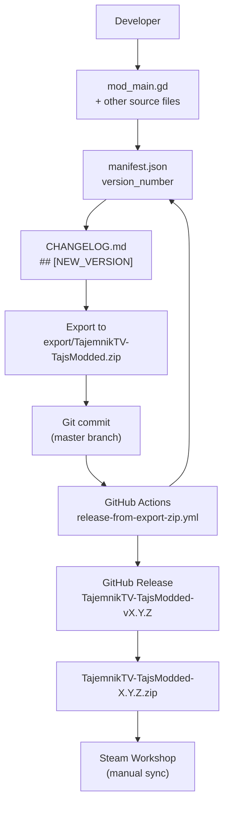
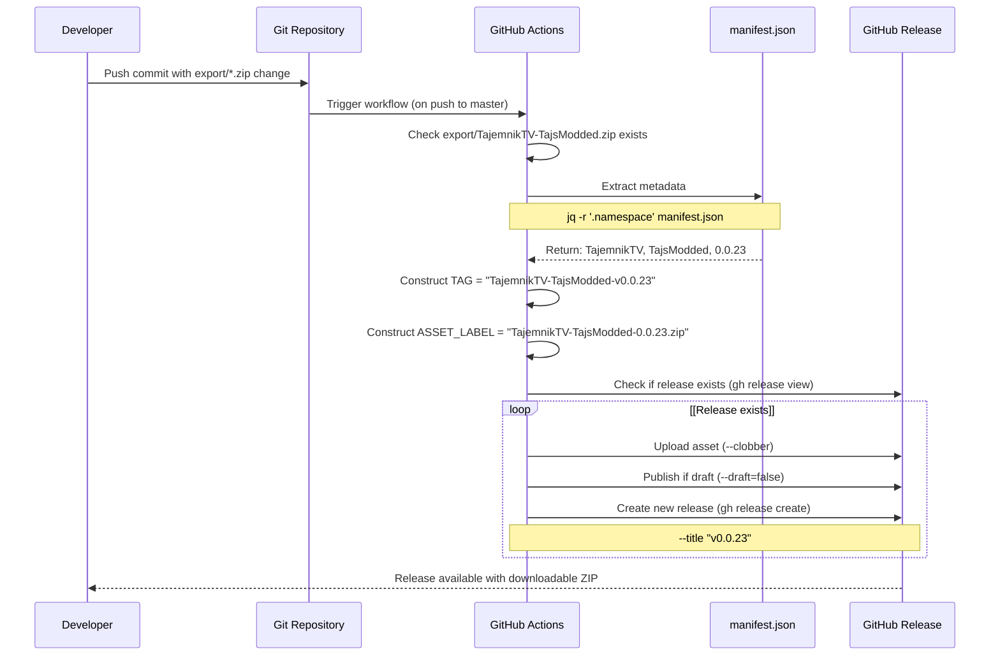
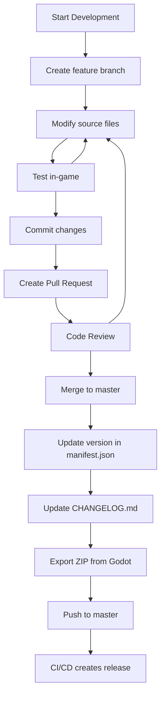
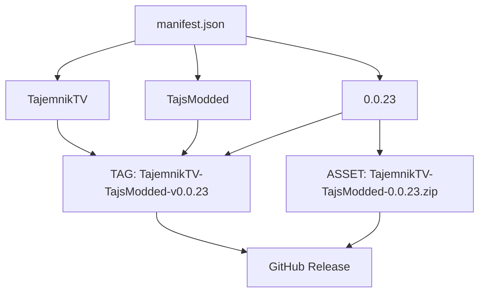

> **Relevant source files**
> * [.github/workflows/release-from-export-zip.yml](https://github.com/tajemniktv/TajsMod/blob/5f1e656a/.github/workflows/release-from-export-zip.yml)
> * [CHANGELOG.md](https://github.com/tajemniktv/TajsMod/blob/5f1e656a/CHANGELOG.md)
> * [export/TajemnikTV-TajsModded.zip](https://github.com/tajemniktv/TajsMod/blob/5f1e656a/export/TajemnikTV-TajsModded.zip)
> * [manifest.json](https://github.com/tajemniktv/TajsMod/blob/5f1e656a/manifest.json)

This guide is for contributors and maintainers working on Taj's Mod. It covers repository structure, development workflow, version management, and the automated release pipeline. For information about building distribution packages, see [Building and Distribution](/tajemniktv/TajsMod/8.1-building-and-distribution). For contribution guidelines and code standards, see [Contributing Guidelines](/tajemniktv/TajsMod/8.2-contributing-guidelines). For issue reporting and triage automation, see [Issue Management](/tajemniktv/TajsMod/8.3-issue-management).

---

## Repository Structure

The repository follows a mod distribution structure compatible with Upload Labs' Mod Loader 7.0.0+. The key distinction is between **source files** (tracked in git) and **distribution artifacts** (generated exports).

### Directory Layout

```go
TajsMod/
├── mods-unpacked/
│   └── TajemnikTV-TajsModded/
│       ├── mod_main.gd              # Main orchestrator (entry point)
│       ├── default_commands.gd      # Command registry
│       ├── extensions/              # Script extensions for base game
│       ├── managers/                # Feature managers
│       ├── ui/                      # UI components
│       └── manifest.json            # Mod metadata (copied here)
├── export/
│   └── TajemnikTV-TajsModded.zip   # Distribution package (triggers CI/CD)
├── .github/
│   ├── workflows/
│   │   └── release-from-export-zip.yml  # Automated release
│   └── ISSUE_TEMPLATE/
│       ├── bug_report.yml
│       └── feature_request.yml
├── manifest.json                    # Source of truth for version
├── CHANGELOG.md                     # Human-readable version history
└── README.md
```

**Sources:** [manifest.json L1-L37](https://github.com/tajemniktv/TajsMod/blob/5f1e656a/manifest.json#L1-L37)

 [CHANGELOG.md L1-L154](https://github.com/tajemniktv/TajsMod/blob/5f1e656a/CHANGELOG.md#L1-L154)

### Key Files and Their Roles

| File Path | Purpose | Update Frequency |
| --- | --- | --- |
| `manifest.json` | Mod metadata, version number, dependencies | Every release |
| `CHANGELOG.md` | Human-readable change log | Every release |
| `mods-unpacked/TajemnikTV-TajsModded/mod_main.gd` | Mod entry point, orchestrator | Feature development |
| `export/TajemnikTV-TajsModded.zip` | Distribution artifact | Manual export from Godot |
| `.github/workflows/release-from-export-zip.yml` | CI/CD pipeline | Rarely |

**Sources:** [manifest.json L1-L37](https://github.com/tajemniktv/TajsMod/blob/5f1e656a/manifest.json#L1-L37)

 [CHANGELOG.md L1-L154](https://github.com/tajemniktv/TajsMod/blob/5f1e656a/CHANGELOG.md#L1-L154)

 [.github/workflows/release-from-export-zip.yml L1-L73](https://github.com/tajemniktv/TajsMod/blob/5f1e656a/.github/workflows/release-from-export-zip.yml#L1-L73)

---

## Version Management Workflow

Taj's Mod uses a **manifest-driven versioning** approach where `manifest.json` is the single source of truth for the current version. The CI/CD pipeline reads this file to create releases automatically.

### Version Number Format

```
"version_number": "MAJOR.MINOR.PATCH"
```

* **MAJOR**: Breaking changes or major feature overhauls (e.g., 1.0.0)
* **MINOR**: New features, non-breaking (e.g., 0.22.0)
* **PATCH**: Bug fixes only (e.g., 0.22.1)

**Sources:** [manifest.json L34](https://github.com/tajemniktv/TajsMod/blob/5f1e656a/manifest.json#L34-L34)

### Versioning Workflow Diagram



**Diagram: Version Management and Release Flow**

**Sources:** [manifest.json L34](https://github.com/tajemniktv/TajsMod/blob/5f1e656a/manifest.json#L34-L34)

 [CHANGELOG.md L1-L154](https://github.com/tajemniktv/TajsMod/blob/5f1e656a/CHANGELOG.md#L1-L154)

 [.github/workflows/release-from-export-zip.yml L19-L72](https://github.com/tajemniktv/TajsMod/blob/5f1e656a/.github/workflows/release-from-export-zip.yml#L19-L72)

---

## CI/CD Pipeline Architecture

The automated release pipeline is triggered when `export/TajemnikTV-TajsModded.zip` is modified in the `master` branch. It reads `manifest.json` to determine release metadata.

### Pipeline Execution Flow



**Diagram: CI/CD Pipeline Execution Sequence**

**Sources:** [.github/workflows/release-from-export-zip.yml L1-L73](https://github.com/tajemniktv/TajsMod/blob/5f1e656a/.github/workflows/release-from-export-zip.yml#L1-L73)

### Pipeline Configuration Details

| Step | Script Command | Purpose |
| --- | --- | --- |
| **Validate ZIP** | `test -f "$ZIP"` | Ensure export file exists |
| **Parse Manifest** | `jq -r '.namespace // empty' "$MANIFEST"` | Extract namespace |
| **Parse Manifest** | `jq -r '.name // empty' "$MANIFEST"` | Extract mod name |
| **Parse Manifest** | `jq -r '.version_number // empty' "$MANIFEST"` | Extract version |
| **Construct Tag** | `TAG="${SAFE_ID}-v${VER}"` | Create release tag (e.g., `TajemnikTV-TajsModded-v0.0.23`) |
| **Check Existing** | `gh release view "$TAG"` | Determine if release already exists |
| **Upload/Create** | `gh release upload "$TAG"` or `gh release create "$TAG"` | Upload asset or create new release |
| **Publish Draft** | `gh release edit "$TAG" --draft=false` | Publish if was draft |

**Sources:** [.github/workflows/release-from-export-zip.yml L22-L72](https://github.com/tajemniktv/TajsMod/blob/5f1e656a/.github/workflows/release-from-export-zip.yml#L22-L72)

---

## Development Environment Setup

### Prerequisites

1. **Godot Engine 4.x** (compatible with Upload Labs v2.0.17+)
2. **Git** for version control
3. **Upload Labs** game installation with Mod Loader 7.0.0+
4. **Text editor/IDE** (VS Code with GDScript extension recommended)

### Initial Setup Steps

1. Clone the repository: ``` git clone https://github.com/tajemniktv/TajsMod.git cd TajsMod ```
2. Open the project in Godot or edit source files directly in `mods-unpacked/TajemnikTV-TajsModded/`
3. The mod can be tested by: * Copying `mods-unpacked/TajemnikTV-TajsModded/` to Upload Labs' mod directory, OR * Exporting via Godot and placing the ZIP in the mod directory

**Sources:** [manifest.json L9-L14](https://github.com/tajemniktv/TajsMod/blob/5f1e656a/manifest.json#L9-L14)

---

## Making Changes

### Development Workflow



**Diagram: Feature Development Lifecycle**

**Sources:** [.github/workflows/release-from-export-zip.yml L3-L8](https://github.com/tajemniktv/TajsMod/blob/5f1e656a/.github/workflows/release-from-export-zip.yml#L3-L8)

### File Modification Guidelines

| Component | Primary Files | When to Modify |
| --- | --- | --- |
| **Core Logic** | `mod_main.gd` | Adding new managers, initialization logic |
| **Commands** | `default_commands.gd` | Adding command palette commands |
| **Settings** | `config_manager.gd` | Adding configuration keys |
| **UI** | Files in `ui/` directory | Creating new panels, overlays |
| **Game Integration** | Files in `extensions/` directory | Extending base game classes |
| **Managers** | Files in `managers/` directory | Adding new feature managers |

**Sources:** Based on architectural patterns from provided diagrams

---

## Version Update Procedure

Before creating a release, ensure all version-related files are synchronized:

### Step-by-Step Version Update

1. **Update `manifest.json`:** ```json {   "version_number": "0.23.0" } ``` [manifest.json L34](https://github.com/tajemniktv/TajsMod/blob/5f1e656a/manifest.json#L34-L34)
2. **Update `CHANGELOG.md`:** ```markdown ## [0.23.0] - 2025-12-XX ### Added - New feature description ### Changed - Modified behavior description ### Fixed - Bug fix description ``` [CHANGELOG.md L7-L24](https://github.com/tajemniktv/TajsMod/blob/5f1e656a/CHANGELOG.md#L7-L24)
3. **Export in Godot** to `export/TajemnikTV-TajsModded.zip`
4. **Commit all changes** together: ``` git add manifest.json CHANGELOG.md export/TajemnikTV-TajsModded.zip git commit -m "Release v0.23.0: Feature description" git push origin master ```
5. **Monitor GitHub Actions** to ensure release is created successfully

**Sources:** [manifest.json L34](https://github.com/tajemniktv/TajsMod/blob/5f1e656a/manifest.json#L34-L34)

 [CHANGELOG.md L7-L24](https://github.com/tajemniktv/TajsMod/blob/5f1e656a/CHANGELOG.md#L7-L24)

 [.github/workflows/release-from-export-zip.yml L4-L7](https://github.com/tajemniktv/TajsMod/blob/5f1e656a/.github/workflows/release-from-export-zip.yml#L4-L7)

---

## Release Artifact Structure

The `export/TajemnikTV-TajsModded.zip` contains the complete mod structure expected by the Mod Loader:

```
TajemnikTV-TajsModded.zip
└── mods-unpacked/
    └── TajemnikTV-TajsModded/
        ├── mod_main.gd
        ├── default_commands.gd
        ├── extensions/
        ├── managers/
        ├── ui/
        ├── manifest.json
        ├── CHANGELOG.md
        ├── LICENSE
        ├── README.md
        └── [other assets]
```

### Manifest Metadata Extracted by CI/CD



**Diagram: Manifest Metadata to Release Mapping**

**Sources:** [manifest.json L32-L34](https://github.com/tajemniktv/TajsMod/blob/5f1e656a/manifest.json#L32-L34)

 [.github/workflows/release-from-export-zip.yml L33-L49](https://github.com/tajemniktv/TajsMod/blob/5f1e656a/.github/workflows/release-from-export-zip.yml#L33-L49)

---

## Testing Changes

### Local Testing Procedure

1. **Install the modified mod** to Upload Labs: * Windows: `%APPDATA%\Godot\app_userdata\Upload Labs 2\mods/` * Linux: `~/.local/share/godot/app_userdata/Upload Labs 2/mods/`
2. **Launch Upload Labs** and verify: * Mod loads without errors (check Mod Loader console) * New features work as expected * Settings persist across restarts * No conflicts with other mods
3. **Check logs** for errors: * Look for `[TajsMod]` prefixed messages * Verify no null reference exceptions

**Sources:** [manifest.json L9-L14](https://github.com/tajemniktv/TajsMod/blob/5f1e656a/manifest.json#L9-L14)

 (compatible versions)

---

## Common Development Tasks

### Adding a New Command

1. Edit `default_commands.gd`
2. Add command definition to `DEFAULT_COMMANDS` array
3. Implement command logic (callable or inline)
4. Test via command palette (MMB or Spacebar)

**Sources:** Architecture pattern from provided diagrams

### Adding a New Setting

1. Edit `config_manager.gd` to add key to `DEFAULT_CONFIG`
2. Create UI control in appropriate settings tab
3. Connect signal to `config_manager.set_value()`
4. Test persistence across game restarts

**Sources:** Architecture pattern from provided diagrams

### Creating a New Feature Manager

1. Create new file in `managers/` directory
2. Initialize in `mod_main.gd` during `_ready()`
3. Register with configuration system if needed
4. Update manifest version and changelog

**Sources:** Architecture pattern from provided diagrams

---

## Troubleshooting Build Issues

### CI/CD Pipeline Failures

| Error | Cause | Solution |
| --- | --- | --- |
| `Missing export/*.zip` | ZIP not committed | Ensure `git add export/TajemnikTV-TajsModded.zip` |
| `No manifest.json found` | Manifest not in repo root | Verify `manifest.json` exists at root |
| `missing .name` | Invalid manifest format | Check JSON syntax with `jq . manifest.json` |
| `Release already exists` | Tag collision | Delete old release or increment version |

**Sources:** [.github/workflows/release-from-export-zip.yml L26-L38](https://github.com/tajemniktv/TajsMod/blob/5f1e656a/.github/workflows/release-from-export-zip.yml#L26-L38)

### Local Testing Issues

| Issue | Likely Cause | Check |
| --- | --- | --- |
| Mod doesn't load | Incompatible game/loader version | Verify `compatible_game_version` and `compatible_mod_loader_version` in manifest |
| Settings don't persist | Config file permissions | Check write access to `user://tajs_mod_config.json` |
| Script errors on load | Syntax error in GDScript | Review Godot editor error console |

**Sources:** [manifest.json L9-L14](https://github.com/tajemniktv/TajsMod/blob/5f1e656a/manifest.json#L9-L14)

---

## Release Checklist

Before pushing a release, verify:

* `manifest.json` version incremented
* `CHANGELOG.md` updated with changes
* All new features tested in-game
* No script errors in Godot console
* Export ZIP generated and committed
* Commit message follows format: `Release vX.Y.Z: Description`
* GitHub Actions pipeline completes successfully
* Release appears on GitHub with correct version tag
* ZIP asset downloadable and contains expected files

**Sources:** [.github/workflows/release-from-export-zip.yml L1-L73](https://github.com/tajemniktv/TajsMod/blob/5f1e656a/.github/workflows/release-from-export-zip.yml#L1-L73)

 [CHANGELOG.md L1-L154](https://github.com/tajemniktv/TajsMod/blob/5f1e656a/CHANGELOG.md#L1-L154)

 [manifest.json L34](https://github.com/tajemniktv/TajsMod/blob/5f1e656a/manifest.json#L34-L34)