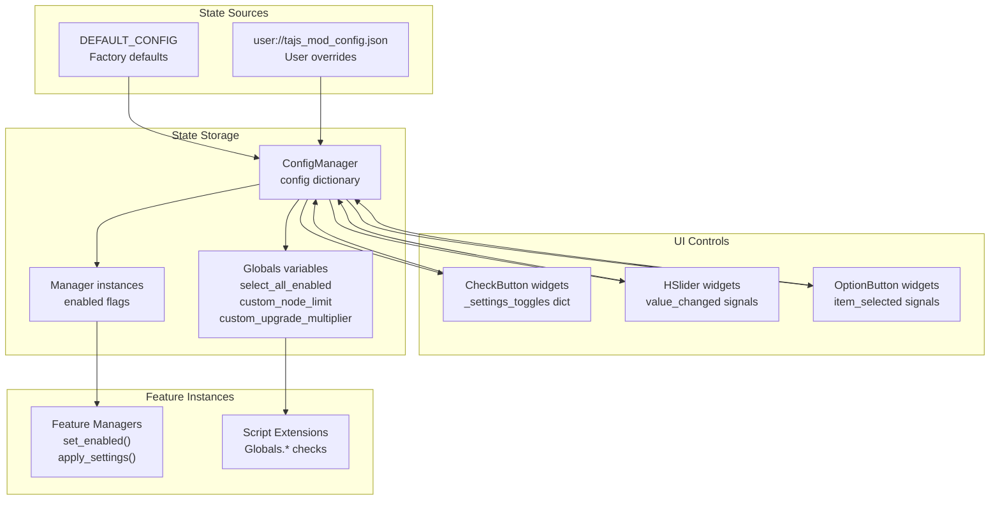
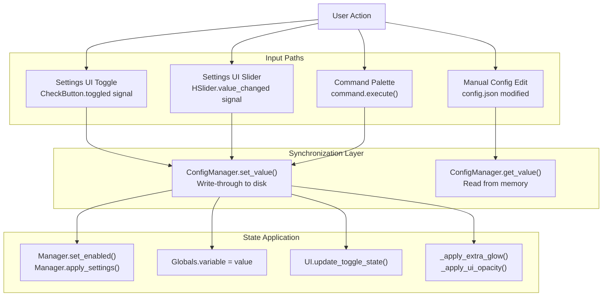

> **Relevant source files**
> * [CHANGELOG.md](https://github.com/tajemniktv/TajsMod/blob/5f1e656a/CHANGELOG.md)
> * [README.md](https://github.com/tajemniktv/TajsMod/blob/5f1e656a/README.md)
> * [mod_main.gd](https://github.com/tajemniktv/TajsMod/blob/5f1e656a/mod_main.gd)
> * [preview/Containers6Input.png](https://github.com/tajemniktv/TajsMod/blob/5f1e656a/preview/Containers6Input.png)

This page catalogs all user-facing features in Taj's Mod, organized by functional category. Each feature entry includes its configuration key(s), implementation location, and user-accessible settings.

For detailed implementation of individual feature managers, see [Utility Manager Components](/tajemniktv/TajsMod/6-utility-manager-components). For command palette-specific features, see [Command Palette System](/tajemniktv/TajsMod/4-command-palette-system). For visual customization technical details, see [Visual Enhancements](/tajemniktv/TajsMod/5.1-visual-enhancements).

---

## Feature Organization

Taj's Mod features are organized into four main categories, each accessible through dedicated tabs in the Settings UI:

```mermaid
flowchart TD

General["General Tab<br>Core QoL Features"]
Visuals["Visuals Tab<br>Appearance Customization"]
Cheats["Cheats Tab<br>Gameplay Modifiers"]
Debug["Debug Tab<br>Developer Tools"]
WireDrop["Wire Drop Menu"]
SixInput["6-Input Containers"]
CommandPalette["Command Palette"]
WireClear["Right-click Wire Clear"]
SelectAll["Ctrl+A Select All"]
GotoGroup["Go To Group Button"]
BuyMax["Buy Max Button"]
ZOrder["Group Z-Order Fix"]
SliderScroll["Disable Slider Scroll"]
NotifLog["Toast History Panel"]
DisconnectedHL["Highlight Disconnected Nodes"]
Screenshot["Screenshot System"]
FocusMute["Mute on Focus Loss"]
Controller["Disable Controller Input"]
WireColors["Custom Wire Colors"]
ExtraGlow["Extra Glow"]
UIOpacity["UI Opacity"]
GroupColors["17 Group Colors"]
GroupPatterns["11 Pattern Types"]
NodeLimit["Node Limit Control"]
UpgradeMultiplier["Upgrade Multiplier"]
CheatPanel["Cheat Panel"]
ResetSettings["Reset All Settings"]
BootScreen["Custom Boot Screen"]
DebugMode["Debug Logging"]
DebugInfo["Log Debug Info"]

General --> WireDrop
General --> SixInput
General --> CommandPalette
General --> WireClear
General --> SelectAll
General --> GotoGroup
General --> BuyMax
General --> ZOrder
General --> SliderScroll
General --> NotifLog
General --> DisconnectedHL
General --> Screenshot
General --> FocusMute
General --> Controller
Visuals --> WireColors
Visuals --> ExtraGlow
Visuals --> UIOpacity
Visuals --> GroupColors
Visuals --> GroupPatterns
Cheats --> NodeLimit
Cheats --> UpgradeMultiplier
Cheats --> CheatPanel
Debug --> ResetSettings
Debug --> BootScreen
Debug --> DebugMode
Debug --> DebugInfo

subgraph subGraph4 ["Debug Features"]
    ResetSettings
    BootScreen
    DebugMode
    DebugInfo
end

subgraph subGraph3 ["Gameplay Features"]
    NodeLimit
    UpgradeMultiplier
    CheatPanel
end

subgraph subGraph2 ["Visual Features"]
    WireColors
    ExtraGlow
    UIOpacity
    GroupColors
    GroupPatterns
end

subgraph subGraph1 ["General Features"]
    WireDrop
    SixInput
    CommandPalette
    WireClear
    SelectAll
    GotoGroup
    BuyMax
    ZOrder
    SliderScroll
    NotifLog
    DisconnectedHL
    Screenshot
    FocusMute
    Controller
end

subgraph subGraph0 ["Feature Categories"]
    General
    Visuals
    Cheats
    Debug
end
```



**Sources:** [mod_main.gd L462-L688](https://github.com/tajemniktv/TajsMod/blob/5f1e656a/mod_main.gd#L462-L688)

---

## Feature Configuration Matrix

The following table maps all features to their configuration keys, implementation classes, and default states:

| Feature Name | Config Key(s) | Default | Manager/Implementation | Restart Required |
| --- | --- | --- | --- | --- |
| **Wire Drop Node Menu** | `wire_drop_menu_enabled` | `true` | `PaletteController` | No |
| **6-Input Containers** | `six_input_containers` | `false` | Script extension: `window_inventory.gd` | **Yes** |
| **Command Palette** | `command_palette_enabled` | `true` | `PaletteController` | No |
| **Right-click Wire Clear** | `right_click_clear_enabled` | `true` | `WireClearHandler` | No |
| **Ctrl+A Select All** | `select_all_enabled` | `true` | `Globals.select_all_enabled` | No |
| **Go To Group Button** | `goto_group_enabled` | `true` | `GotoGroupManager` + `GotoGroupPanel` | No |
| **Buy Max Button** | `buy_max_enabled` | `true` | `BuyMaxManager` | No |
| **Upgrade Multiplier** | `upgrade_multiplier` | `10` | `Globals.custom_upgrade_multiplier` | No |
| **Group Z-Order Fix** | `z_order_fix_enabled` | `true` | `NodeGroupZOrderFix` | No |
| **Disable Slider Scroll** | `disable_slider_scroll` | `false` | Input blocking in `mod_main._input()` | No |
| **Toast History Panel** | `notification_log_enabled` | `true` | `NotificationLogPanel` | No |
| **Highlight Disconnected** | `highlight_disconnected_enabled` | `true` | `DisconnectedNodeHighlighter` | No |
| **Disconnected Style** | `highlight_disconnected_style` | `"pulse"` | `DisconnectedNodeHighlighter` | No |
| **Disconnected Intensity** | `highlight_disconnected_intensity` | `0.5` | `DisconnectedNodeHighlighter` | No |
| **Screenshot Quality** | `screenshot_quality` | `2` (High) | `ScreenshotManager` | No |
| **Screenshot Folder** | `screenshot_folder` | `"user://screenshots"` | `ScreenshotManager` | No |
| **Screenshot Watermark** | `screenshot_watermark` | `true` | `ScreenshotManager` | No |
| **Screenshot Delay** | `screenshot_capture_delay` | `0.1` | `ScreenshotManager` | No |
| **Mute on Focus Loss** | `mute_on_focus_loss` | `false` | `FocusHandler` | No |
| **Background Volume** | `background_volume` | `20` (%) | `FocusHandler` | No |
| **Disable Controller Input** | `disable_controller_input` | `false` | Input blocking in `mod_main._input()` | No |
| **Custom Wire Colors** | `custom_wire_colors` | `true` | `WireColorOverrides` | No |
| **Wire Color: [type]** | `wire_color_[type]` | varies | `WireColorOverrides` | No |
| **Extra Glow** | `extra_glow` | `false` | `Environment` modification | No |
| **Glow Intensity** | `glow_intensity` | `0.8` | `Environment.glow_intensity` | No |
| **Glow Strength** | `glow_strength` | `1.0` | `Environment.glow_strength` | No |
| **Glow Bloom** | `glow_bloom` | `0.0` | `Environment.glow_bloom` | No |
| **Glow Sensitivity** | `glow_sensitivity` | `0.5` | `Environment.glow_hdr_threshold` | No |
| **UI Opacity** | `ui_opacity` | `100` (%) | HUD modulation | No |
| **Node Limit** | `node_limit` | `400` | `Globals.custom_node_limit` | No |
| **Custom Boot Screen** | `custom_boot_screen` | `true` | `Patcher.patch_boot_screen()` | **Yes** |
| **Debug Mode** | `debug_mode` | `false` | Logging verbosity | No |

**Sources:** [mod_main.gd L88-L95](https://github.com/tajemniktv/TajsMod/blob/5f1e656a/mod_main.gd#L88-L95)

 [mod_main.gd L462-L688](https://github.com/tajemniktv/TajsMod/blob/5f1e656a/mod_main.gd#L462-L688)

---

## Feature Lifecycle and Initialization

The following diagram shows how features are initialized and when they become available:

```mermaid
sequenceDiagram
  participant _init()
  participant _ready()
  participant _setup_for_main()
  participant ConfigManager
  participant Utility Managers
  participant SettingsUI

  _init()->>ConfigManager: "Create ConfigManager"
  _init()->>Utility Managers: "Create early managers
  _ready()->>ConfigManager: (Screenshot, Palette, WireClear, Focus)"
  _ready()->>_ready(): "Load user config from disk"
  _ready()->>_ready(): "Apply node_limit to Globals"
  _ready()->>_ready(): "Apply wire color overrides"
  _setup_for_main()->>Utility Managers: "Inject THE BIN patch"
  _setup_for_main()->>SettingsUI: "Create DisconnectedNodeHighlighter"
  _setup_for_main()->>SettingsUI: "Create SettingsUI"
  _setup_for_main()->>Utility Managers: "_build_settings_menu()"
  _setup_for_main()->>ConfigManager: "Initialize remaining managers
  note over _setup_for_main(),ConfigManager: "Features now available to user"
```

**Sources:** [mod_main.gd L72-L114](https://github.com/tajemniktv/TajsMod/blob/5f1e656a/mod_main.gd#L72-L114)

 [mod_main.gd L115-L163](https://github.com/tajemniktv/TajsMod/blob/5f1e656a/mod_main.gd#L115-L163)

 [mod_main.gd L278-L340](https://github.com/tajemniktv/TajsMod/blob/5f1e656a/mod_main.gd#L278-L340)

---

## Feature Dependencies and Relationships

```mermaid
flowchart TD

ConfigMgr["ConfigManager<br>get_value() / set_value()"]
ConfigFile["user://tajs_mod_config.json"]
SettingsUI["SettingsUI<br>4 tabs with toggles/sliders"]
CommandPalette["PaletteController<br>60+ commands"]
WireColors["WireColorOverrides<br>50+ wire types"]
ExtraGlow["Environment.glow_*<br>4 parameters"]
UIOpacity["HUD.modulate"]
GroupVisuals["17 colors + 11 patterns<br>window_group.gd extension"]
WireDrop["Wire Drop Menu<br>palette_controller"]
WireClear["WireClearHandler<br>right-click detection"]
SelectAll["Globals.select_all_enabled<br>schematic_container.gd"]
Screenshot["ScreenshotManager<br>tiled capture"]
FocusMute["FocusHandler<br>AudioServer.set_bus_volume_db()"]
GotoGroup["GotoGroupManager + Panel<br>navigation popup"]
BuyMax["BuyMaxManager<br>4 purchase strategies"]
NotifLog["NotificationLogPanel<br>toast history"]
DisconnectedHL["DisconnectedNodeHighlighter<br>2 visual styles"]
StickyNotes["StickyNoteManager<br>editable text nodes"]
ZOrder["NodeGroupZOrderFix<br>z_index management"]
NodeLimit["Globals.custom_node_limit<br>-1 = unlimited"]
UpgradeMult["Globals.custom_upgrade_multiplier<br>Ctrl modifier"]
Cheats["CheatManager<br>currency manipulation"]

ConfigMgr --> SettingsUI
ConfigMgr --> CommandPalette
ConfigMgr --> WireColors
ConfigMgr --> ExtraGlow
ConfigMgr --> UIOpacity
ConfigMgr --> GroupVisuals
ConfigMgr --> WireDrop
ConfigMgr --> WireClear
ConfigMgr --> SelectAll
ConfigMgr --> Screenshot
ConfigMgr --> FocusMute
ConfigMgr --> GotoGroup
ConfigMgr --> BuyMax
ConfigMgr --> NotifLog
ConfigMgr --> DisconnectedHL
ConfigMgr --> StickyNotes
ConfigMgr --> ZOrder
ConfigMgr --> NodeLimit
ConfigMgr --> UpgradeMult
SettingsUI --> WireColors
SettingsUI --> ExtraGlow
SettingsUI --> Screenshot
SettingsUI --> FocusMute
CommandPalette --> WireDrop
CommandPalette --> Screenshot
CommandPalette --> NodeLimit
CommandPalette --> ExtraGlow

subgraph subGraph5 ["Gameplay Features"]
    NodeLimit
    UpgradeMult
    Cheats
end

subgraph subGraph4 ["UI Enhancements"]
    GotoGroup
    BuyMax
    NotifLog
    DisconnectedHL
    StickyNotes
    ZOrder
end

subgraph subGraph3 ["QoL Features"]
    WireDrop
    WireClear
    SelectAll
    Screenshot
    FocusMute
end

subgraph subGraph2 ["Visual Features"]
    WireColors
    ExtraGlow
    UIOpacity
    GroupVisuals
end

subgraph subGraph1 ["UI Layer"]
    SettingsUI
    CommandPalette
end

subgraph subGraph0 ["Configuration Layer"]
    ConfigMgr
    ConfigFile
    ConfigFile --> ConfigMgr
end
```



**Sources:** [mod_main.gd L33-L48](https://github.com/tajemniktv/TajsMod/blob/5f1e656a/mod_main.gd#L33-L48)

 [mod_main.gd L278-L340](https://github.com/tajemniktv/TajsMod/blob/5f1e656a/mod_main.gd#L278-L340)

---

## General Tab Features

### Wire Drop Node Menu

**Purpose:** Opens a searchable menu when dropping a wire onto empty canvas, showing only nodes compatible with the wire's resource type.

**Configuration:**

* Key: `wire_drop_menu_enabled`
* Default: `true`
* UI Toggle: "Wire Drop Node Menu"

**Implementation:**

* Managed by: `PaletteController`
* Mode trigger: Detecting wire drop events in `palette_overlay.gd`
* Filtering: Uses `palette_controller.get_compatible_schematic_ids(resource_type)`

**Sources:** [mod_main.gd L467-L470](https://github.com/tajemniktv/TajsMod/blob/5f1e656a/mod_main.gd#L467-L470)

 [extensions/scripts/palette/palette_controller.gd](https://github.com/tajemniktv/TajsMod/blob/5f1e656a/extensions/scripts/palette/palette_controller.gd)

---

### 6-Input Containers

**Purpose:** Increases input slot count on Container windows from 5 to 6.

**Configuration:**

* Key: `six_input_containers`
* Default: `false`
* UI Toggle: "6-Input Containers ⟳"
* **Restart Required:** Yes

**Implementation:**

* Script extension: `extensions/scenes/windows/window_inventory.gd`
* Modifies: `_ready()` to check `Globals.six_input_containers_enabled`
* Changes container initialization to allow 6 inputs

**Sources:** [mod_main.gd L473-L477](https://github.com/tajemniktv/TajsMod/blob/5f1e656a/mod_main.gd#L473-L477)

 [extensions/scenes/windows/window_inventory.gd](https://github.com/tajemniktv/TajsMod/blob/5f1e656a/extensions/scenes/windows/window_inventory.gd)

---

### Command Palette

**Purpose:** Provides keyboard-driven access to 60+ commands via Middle Mouse Button or Spacebar.

**Configuration:**

* Key: `command_palette_enabled`
* Default: `true`
* UI Toggle: "Command Palette (MMB)"

**Implementation:**

* Controller: `PaletteController`
* Overlay UI: `palette_overlay.gd` (fuzzy search, mode handling)
* Command registry: `default_commands.gd`
* See [Command Palette System](/tajemniktv/TajsMod/4-command-palette-system) for complete documentation

**Sources:** [mod_main.gd L480-L484](https://github.com/tajemniktv/TajsMod/blob/5f1e656a/mod_main.gd#L480-L484)

---

### Right-click Wire Clear

**Purpose:** Right-clicking an output connector disconnects all wires from that connector.

**Configuration:**

* Key: `right_click_clear_enabled`
* Default: `true`
* UI Toggle: "Right-click Wire Clear"

**Implementation:**

* Manager: `WireClearHandler`
* Monitors: `_input()` events for `MOUSE_BUTTON_RIGHT` on nodes in `connector_button` group
* Action: Removes all connectors attached to the clicked output

**Sources:** [mod_main.gd L487-L491](https://github.com/tajemniktv/TajsMod/blob/5f1e656a/mod_main.gd#L487-L491)

 [extensions/scripts/wire_drop/wire_clear_handler.gd](https://github.com/tajemniktv/TajsMod/blob/5f1e656a/extensions/scripts/wire_drop/wire_clear_handler.gd)

---

### Ctrl+A Select All

**Purpose:** Enables `Ctrl+A` keyboard shortcut to select all nodes on the schematic board.

**Configuration:**

* Key: `select_all_enabled`
* Default: `true`
* UI Toggle: "Ctrl+A Select All"

**Implementation:**

* Global flag: `Globals.select_all_enabled`
* Extension point: `schematic_container.gd._unhandled_key_input()`
* Action: Calls `select_all_windows()` when `KEY_A` pressed with `KEY_MASK_CTRL`

**Sources:** [mod_main.gd L494-L497](https://github.com/tajemniktv/TajsMod/blob/5f1e656a/mod_main.gd#L494-L497)

 [extensions/scripts/schematic_container.gd](https://github.com/tajemniktv/TajsMod/blob/5f1e656a/extensions/scripts/schematic_container.gd)

---

### Go To Group Button

**Purpose:** Bottom-left button that opens a popup to quickly navigate the camera to any Node Group on the board.

**Configuration:**

* Key: `goto_group_enabled`
* Default: `true`
* UI Toggle: "Go To Group Button"

**Implementation:**

* Manager: `GotoGroupManager` (retrieves list of groups)
* Panel: `GotoGroupPanel` (displays searchable list, handles clicks)
* Location: HUD Overlay at bottom-left, positioned above the bottom toolbar

**Sources:** [mod_main.gd L499-L503](https://github.com/tajemniktv/TajsMod/blob/5f1e656a/mod_main.gd#L499-L503)

 [mod_main.gd L342-L386](https://github.com/tajemniktv/TajsMod/blob/5f1e656a/mod_main.gd#L342-L386)

 [extensions/scripts/utilities/goto_group_manager.gd](https://github.com/tajemniktv/TajsMod/blob/5f1e656a/extensions/scripts/utilities/goto_group_manager.gd)

 [extensions/scripts/utilities/goto_group_panel.gd](https://github.com/tajemniktv/TajsMod/blob/5f1e656a/extensions/scripts/utilities/goto_group_panel.gd)

---

### Buy Max Button

**Purpose:** Adds a button to upgrade tabs that purchases the maximum affordable upgrade levels using one of four strategies.

**Configuration:**

* Key: `buy_max_enabled`
* Default: `true`
* UI Toggle: "Buy Max Button"

**Implementation:**

* Manager: `BuyMaxManager`
* Injection: Finds upgrade tabs and adds button dynamically
* Strategies: Round Robin, Cheapest First, Expensive First, Top to Bottom
* See [Buy Max Manager](/tajemniktv/TajsMod/6.2-buy-max-manager) for detailed strategy documentation

**Sources:** [mod_main.gd L505-L509](https://github.com/tajemniktv/TajsMod/blob/5f1e656a/mod_main.gd#L505-L509)

 [mod_main.gd L404-L420](https://github.com/tajemniktv/TajsMod/blob/5f1e656a/mod_main.gd#L404-L420)

 [extensions/scripts/utilities/buy_max_manager.gd](https://github.com/tajemniktv/TajsMod/blob/5f1e656a/extensions/scripts/utilities/buy_max_manager.gd)

---

### Upgrade Multiplier

**Purpose:** Holding `Ctrl` while clicking upgrade buttons purchases multiple levels at once.

**Configuration:**

* Key: `upgrade_multiplier`
* Default: `10`
* UI Control: Slider (2-100)
* Range: 2 to 100 levels

**Implementation:**

* Global variable: `Globals.custom_upgrade_multiplier`
* Manager: `UpgradeManager` (detects `Ctrl` key state, modifies buy amount)
* Extension point: Hooks into upgrade button click handlers

**Sources:** [mod_main.gd L512-L517](https://github.com/tajemniktv/TajsMod/blob/5f1e656a/mod_main.gd#L512-L517)

---

### Group Z-Order Fix

**Purpose:** Ensures that Node Groups fully contained within other Node Groups always render on top.

**Configuration:**

* Key: `z_order_fix_enabled`
* Default: `true`
* UI Toggle: "Group Z-Order Fix"

**Implementation:**

* Manager: `NodeGroupZOrderFix`
* Detection: Monitors `node_added` signal to detect group containment
* Action: Adjusts `z_index` property to maintain proper layering

**Sources:** [mod_main.gd L520-L524](https://github.com/tajemniktv/TajsMod/blob/5f1e656a/mod_main.gd#L520-L524)

 [mod_main.gd L389-L401](https://github.com/tajemniktv/TajsMod/blob/5f1e656a/mod_main.gd#L389-L401)

 [extensions/scripts/utilities/node_group_z_order_fix.gd](https://github.com/tajemniktv/TajsMod/blob/5f1e656a/extensions/scripts/utilities/node_group_z_order_fix.gd)

---

### Disable Slider Scroll

**Purpose:** Prevents mouse wheel from accidentally changing slider values when scrolling.

**Configuration:**

* Key: `disable_slider_scroll`
* Default: `false`
* UI Toggle: "Disable Slider Scroll"

**Implementation:**

* Input handler: `mod_main._input()`
* Detection: Checks if mouse is over any `HSlider` or `VSlider` using `_get_hovered_slider()`
* Action: Calls `get_viewport().set_input_as_handled()` to consume scroll events

**Sources:** [mod_main.gd L527-L529](https://github.com/tajemniktv/TajsMod/blob/5f1e656a/mod_main.gd#L527-L529)

 [mod_main.gd L199-L207](https://github.com/tajemniktv/TajsMod/blob/5f1e656a/mod_main.gd#L199-L207)

 [mod_main.gd L229-L258](https://github.com/tajemniktv/TajsMod/blob/5f1e656a/mod_main.gd#L229-L258)

---

### Toast History Panel

**Purpose:** Bell icon button in HUD that displays a scrollable log of all notification toasts.

**Configuration:**

* Key: `notification_log_enabled`
* Default: `true`
* UI Toggle: "Toast History Panel"

**Implementation:**

* Panel: `NotificationLogPanel`
* Hook: Connects to `Signals.notify` to capture all toast messages
* Display: Shows timestamp, icon, and message text for each notification

**Sources:** [mod_main.gd L532-L535](https://github.com/tajemniktv/TajsMod/blob/5f1e656a/mod_main.gd#L532-L535)

 [extensions/scripts/ui/notification_log_panel.gd](https://github.com/tajemniktv/TajsMod/blob/5f1e656a/extensions/scripts/ui/notification_log_panel.gd)

---

### Highlight Disconnected Nodes

**Purpose:** Visually highlights nodes that are not connected to the main graph for their connection type (power, data, etc.).

**Configuration:**

* Keys: * `highlight_disconnected_enabled` (default: `true`) * `highlight_disconnected_style` (default: `"pulse"`, options: `"pulse"` or `"outline"`) * `highlight_disconnected_intensity` (default: `0.5`, range: 0.0-1.0)
* UI Toggle: "Highlight Disconnected Nodes" with sub-settings

**Implementation:**

* Manager: `DisconnectedNodeHighlighter`
* Detection: Performs graph traversal from source nodes to identify disconnected components
* Styles: * **Pulse Tint:** Animates `self_modulate` with a pulsing color overlay * **Outline Tint:** Adds a colored outline shader effect
* Performance: Recomputes on node add/remove or connection change

**Sources:** [mod_main.gd L691-L753](https://github.com/tajemniktv/TajsMod/blob/5f1e656a/mod_main.gd#L691-L753)

 [mod_main.gd L425-L438](https://github.com/tajemniktv/TajsMod/blob/5f1e656a/mod_main.gd#L425-L438)

 [extensions/scripts/utilities/disconnected_node_highlighter.gd](https://github.com/tajemniktv/TajsMod/blob/5f1e656a/extensions/scripts/utilities/disconnected_node_highlighter.gd)

---

### Screenshot System

**Purpose:** Captures high-quality screenshots with configurable resolution, watermark, and tiled rendering for large images.

**Configuration:**

* Keys: * `screenshot_quality` (default: `2`, options: 0=Low, 1=Medium, 2=High, 3=Original) * `screenshot_folder` (default: `"user://screenshots"`) * `screenshot_watermark` (default: `true`) * `screenshot_capture_delay` (default: `0.1` seconds)
* UI Section: Multiple buttons and sliders in General tab

**Implementation:**

* Manager: `ScreenshotManager`
* Method: `capture_screenshot_with_tiles(quality_preset)` for large boards
* Tiling: Divides visible area into tiles, captures each, stitches together
* Watermark: Adds mod version text to bottom-right corner
* See [Screenshot Manager](/tajemniktv/TajsMod/6.1-screenshot-manager) for complete technical details

**Sources:** [mod_main.gd L92-L96](https://github.com/tajemniktv/TajsMod/blob/5f1e656a/mod_main.gd#L92-L96)

 [mod_main.gd L554](https://github.com/tajemniktv/TajsMod/blob/5f1e656a/mod_main.gd#L554-L554)

 [extensions/scripts/utilities/screenshot_manager.gd](https://github.com/tajemniktv/TajsMod/blob/5f1e656a/extensions/scripts/utilities/screenshot_manager.gd)

---

### Mute on Focus Loss

**Purpose:** Automatically reduces audio volume when the game window loses focus.

**Configuration:**

* Keys: * `mute_on_focus_loss` (default: `false`) * `background_volume` (default: `20` percent)
* UI Controls: Toggle + slider in General tab

**Implementation:**

* Manager: `FocusHandler`
* Detection: Listens to `get_viewport().focus_exited` and `focus_entered` signals
* Action: Calls `AudioServer.set_bus_volume_db("Master", db_value)` to adjust volume
* Restoration: Returns to 0 dB when focus regained

**Sources:** [mod_main.gd L557-L563](https://github.com/tajemniktv/TajsMod/blob/5f1e656a/mod_main.gd#L557-L563)

 [extensions/scripts/utilities/focus_handler.gd](https://github.com/tajemniktv/TajsMod/blob/5f1e656a/extensions/scripts/utilities/focus_handler.gd)

---

### Disable Controller Input

**Purpose:** Completely blocks all controller/joypad input events, useful when a controller is connected but intended for another application.

**Configuration:**

* Key: `disable_controller_input`
* Default: `false`
* UI Toggle: "Disable Controller Input"

**Implementation:**

* Input handler: `mod_main._input()`
* Detection: Checks if event is `InputEventJoypadMotion` or `InputEventJoypadButton`
* Action: Calls `get_viewport().set_input_as_handled()` to consume events before game processes them

**Sources:** [mod_main.gd L566-L568](https://github.com/tajemniktv/TajsMod/blob/5f1e656a/mod_main.gd#L566-L568)

 [mod_main.gd L193-L197](https://github.com/tajemniktv/TajsMod/blob/5f1e656a/mod_main.gd#L193-L197)

---

### Node Counter Display

**Purpose:** Real-time label in General tab showing current node count vs. node limit with visual warning.

**Configuration:**

* Not toggleable (always visible when settings panel open)
* Display format: `"Nodes: X / Y"` or `"Nodes: X / ∞"`

**Implementation:**

* Label: `_node_info_label` in General tab
* Update method: `_update_node_label()` called in `_process()`
* Source: Reads `Globals.node_groups.size()` and `Globals.custom_node_limit`
* Warning: Changes color when near limit

**Sources:** [mod_main.gd L541-L548](https://github.com/tajemniktv/TajsMod/blob/5f1e656a/mod_main.gd#L541-L548)

 [mod_main.gd L1076-L1083](https://github.com/tajemniktv/TajsMod/blob/5f1e656a/mod_main.gd#L1076-L1083)

---

### Node Limit Slider

**Purpose:** Adjustable limit for maximum nodes on the board, from 50 to 2000+, or unlimited (∞).

**Configuration:**

* Key: `node_limit`
* Default: `400`
* Range: 50 to 2050 (2050 represents ∞, stored as `-1`)
* UI Control: Slider with label showing current value

**Implementation:**

* Global variable: `Globals.custom_node_limit`
* Slider: `_node_limit_slider` with value mapping (2050 → -1)
* Enforcement: Game code checks `Globals.custom_node_limit` before spawning nodes
* Public method: `set_node_limit(value)` for command palette access

**Sources:** [mod_main.gd L985-L1030](https://github.com/tajemniktv/TajsMod/blob/5f1e656a/mod_main.gd#L985-L1030)

 [mod_main.gd L1033-L1039](https://github.com/tajemniktv/TajsMod/blob/5f1e656a/mod_main.gd#L1033-L1039)

 [mod_main.gd L153-L155](https://github.com/tajemniktv/TajsMod/blob/5f1e656a/mod_main.gd#L153-L155)

---

## Visuals Tab Features

### Custom Wire Colors

**Purpose:** Override default wire colors for all 50+ resource types with custom RGB values.

**Configuration:**

* Master key: `custom_wire_colors` (default: `true`)
* Individual keys: `wire_color_[resource_id]` (hex color strings)
* UI: Collapsible category sections with color pickers and reset buttons

**Implementation:**

* Manager: `WireColorOverrides`
* Method: `apply_overrides()` modifies `Data.connectors[resource_id].color`
* Refresh: `_refresh_all_connectors()` updates all visible wires and connector buttons
* Categories: 8 groups (Speeds, Resources, Hacking, Data Types, AI/Neural, Boosts, Other)
* See [Visual Enhancements](/tajemniktv/TajsMod/5.1-visual-enhancements) for complete color list

**Sources:** [mod_main.gd L756-L810](https://github.com/tajemniktv/TajsMod/blob/5f1e656a/mod_main.gd#L756-L810)

 [mod_main.gd L813-L846](https://github.com/tajemniktv/TajsMod/blob/5f1e656a/mod_main.gd#L813-L846)

 [mod_main.gd L849-L910](https://github.com/tajemniktv/TajsMod/blob/5f1e656a/mod_main.gd#L849-L910)

 [mod_main.gd L913-L950](https://github.com/tajemniktv/TajsMod/blob/5f1e656a/mod_main.gd#L913-L950)

 [extensions/scripts/utilities/wire_color_overrides.gd](https://github.com/tajemniktv/TajsMod/blob/5f1e656a/extensions/scripts/utilities/wire_color_overrides.gd)

---

### Extra Glow

**Purpose:** Enhanced bloom/glow effects on the game board with four adjustable parameters.

**Configuration:**

* Keys: * `extra_glow` (default: `false`, master toggle) * `glow_intensity` (default: `0.8`, range: 0.0-5.0) * `glow_strength` (default: `1.0`, range: 0.5-2.0) * `glow_bloom` (default: `0.0`, range: 0.0-0.5) * `glow_sensitivity` (default: `0.5`, range: 0.0-1.0)
* UI: Toggle with collapsible sub-settings (4 sliders)

**Implementation:**

* Target: `Main/WorldEnvironment` node's `Environment` resource
* Properties modified: * `environment.glow_enabled` * `environment.glow_intensity` * `environment.glow_strength` * `environment.glow_bloom` * `environment.glow_hdr_threshold` (sensitivity)
* Method: `_apply_extra_glow(enabled)` finds WorldEnvironment and modifies properties

**Sources:** [mod_main.gd L594-L618](https://github.com/tajemniktv/TajsMod/blob/5f1e656a/mod_main.gd#L594-L618)

 [mod_main.gd L1050-L1067](https://github.com/tajemniktv/TajsMod/blob/5f1e656a/mod_main.gd#L1050-L1067)

---

### UI Opacity

**Purpose:** Adjusts transparency of HUD elements for reduced visual clutter.

**Configuration:**

* Key: `ui_opacity`
* Default: `100` (percent)
* Range: 50% to 100%
* UI Control: Slider

**Implementation:**

* Target: `Main/HUD` node's `modulate` property
* Method: `_apply_ui_opacity(value)` sets `hud.modulate.a = value / 100.0`
* Scope: Affects all HUD elements including menus, panels, and overlays

**Sources:** [mod_main.gd L620-L623](https://github.com/tajemniktv/TajsMod/blob/5f1e656a/mod_main.gd#L620-L623)

 [mod_main.gd L1069-L1074](https://github.com/tajemniktv/TajsMod/blob/5f1e656a/mod_main.gd#L1069-L1074)

---

### Group Colors and Patterns

**Purpose:** Extensive visual customization for Node Group windows.

**Configuration:**

* **Colors:** 17 options including dark tones and vibrant highlights
* **Patterns:** 11 types (solid, stripes, grid, diagonal, crosshatch, dots, waves, etc.)
* Persistence: Saved per-group in game's save data

**Implementation:**

* Extension: `extensions/scenes/windows/window_group.gd`
* UI: Pattern picker panel and color picker panel
* Storage: Utilizes `window_data.pattern_id` and `window_data.color_index`
* Rendering: Pattern shaders applied to group background

**Available Colors:**

```yaml
0: Gray, 1: Red, 2: Orange, 3: Yellow, 4: Green, 5: Cyan,
6: Blue, 7: Purple, 8: Pink, 9: Dark Red, 10: Dark Green,
11: Dark Blue, 12: Dark Purple, 13: Bright Red, 14: Bright Green,
15: Bright Blue, 16: Bright Purple
```

**Available Patterns:**

```yaml
0: Solid, 1: Stripes, 2: Grid, 3: Diagonal, 4: Crosshatch,
5: Dots, 6: Waves, 7: Checkerboard, 8: Hexagons, 9: Triangles,
10: Circles
```

**Sources:** [extensions/scenes/windows/window_group.gd](https://github.com/tajemniktv/TajsMod/blob/5f1e656a/extensions/scenes/windows/window_group.gd)

---

## Cheats Tab Features

### Cheat Panel

**Purpose:** Buttons to directly modify currency values (Money, Research, Tokens).

**Configuration:**

* No config keys (cheats are not persistent)
* UI: Dedicated "Cheats" tab with multiple buttons

**Implementation:**

* Manager: `CheatManager`
* Method: `build_cheats_tab(parent_container)` adds buttons
* Actions: Modifies `Globals.currencies` dictionary directly
* Increments/decrements: ±10% of current value, or ±1000/±100 for small values

**Available Cheats:**

* Add/Remove Money
* Add/Remove Research
* Add/Remove Tokens
* Additional cheats added in v0.0.19 (see CHANGELOG)

**Sources:** [mod_main.gd L626-L628](https://github.com/tajemniktv/TajsMod/blob/5f1e656a/mod_main.gd#L626-L628)

 [extensions/scripts/utilities/cheat_manager.gd](https://github.com/tajemniktv/TajsMod/blob/5f1e656a/extensions/scripts/utilities/cheat_manager.gd)

---

## Debug Tab Features

### Reset All Settings

**Purpose:** Button that deletes user config and reloads all defaults.

**Configuration:**

* Not a persistent setting (one-time action)
* UI: Button in Debug tab

**Implementation:**

* Method: `config.reset_to_defaults()`
* Action: Deletes `user://tajs_mod_config.json` and recreates with `DEFAULT_CONFIG`
* Side effects: Immediately applies default values to all systems
* Notification: Shows toast "Settings reset!"

**Sources:** [mod_main.gd L633-L645](https://github.com/tajemniktv/TajsMod/blob/5f1e656a/mod_main.gd#L633-L645)

---

### Custom Boot Screen

**Purpose:** Replaces default boot screen with custom version showing mod information.

**Configuration:**

* Key: `custom_boot_screen`
* Default: `true`
* UI Toggle: "Custom Boot Screen ⟳"
* **Restart Required:** Yes

**Implementation:**

* Patcher: `Patcher.patch_boot_screen(boot_node, version, icon_path)`
* Called in: `mod_main._process()` when Boot node exists
* Modification: Changes boot screen logo and version text

**Sources:** [mod_main.gd L648-L652](https://github.com/tajemniktv/TajsMod/blob/5f1e656a/mod_main.gd#L648-L652)

 [mod_main.gd L187-L190](https://github.com/tajemniktv/TajsMod/blob/5f1e656a/mod_main.gd#L187-L190)

 [extensions/scripts/utilities/patcher.gd](https://github.com/tajemniktv/TajsMod/blob/5f1e656a/extensions/scripts/utilities/patcher.gd)

---

### Debug Logging

**Purpose:** Enables verbose logging to console and in-UI debug log panel.

**Configuration:**

* Key: `debug_mode`
* Default: `false`
* UI Toggle: "Enable Debug Logging"

**Implementation:**

* Flag: `_debug_mode` in `mod_main`
* Propagation: Passed to managers that support debug output (e.g., `StickyNoteManager`)
* Log panel: `_debug_log_label` shows last 20 log entries with timestamps
* Method: `_add_debug_log(message, force)` handles log routing

**Sources:** [mod_main.gd L655-L667](https://github.com/tajemniktv/TajsMod/blob/5f1e656a/mod_main.gd#L655-L667)

 [mod_main.gd L968-L982](https://github.com/tajemniktv/TajsMod/blob/5f1e656a/mod_main.gd#L968-L982)

---

### Log Debug Info

**Purpose:** Button that logs current game state values to debug panel.

**Configuration:**

* Not a persistent setting (one-time action)
* UI: Button in Debug tab

**Implementation:**

* Method: Calls `_add_debug_log()` multiple times
* Logged values: * `Globals.currencies.money` * `Globals.currencies.research` * `Globals.currencies.token` * `Globals.custom_node_limit` * `Globals.max_money` * `Globals.max_research`

**Sources:** [mod_main.gd L670-L678](https://github.com/tajemniktv/TajsMod/blob/5f1e656a/mod_main.gd#L670-L678)

---

## Feature Toggle State Management



**Sources:** [mod_main.gd L61-L62](https://github.com/tajemniktv/TajsMod/blob/5f1e656a/mod_main.gd#L61-L62)

 [mod_main.gd L462-L688](https://github.com/tajemniktv/TajsMod/blob/5f1e656a/mod_main.gd#L462-L688)

 [extensions/scripts/utilities/config_manager.gd](https://github.com/tajemniktv/TajsMod/blob/5f1e656a/extensions/scripts/utilities/config_manager.gd)

---

## Restart-Required Settings

Two settings require a game restart to take effect due to their initialization timing:

| Setting | Config Key | Reason |
| --- | --- | --- |
| **6-Input Containers** | `six_input_containers` | Container input count is set during `WindowInventory._ready()`, which only runs once per window instance. Existing windows cannot be modified after creation. |
| **Custom Boot Screen** | `custom_boot_screen` | Boot screen is shown during game startup before mod's `_ready()`. The setting controls whether `Patcher.patch_boot_screen()` is called, which must happen during the Boot node's lifecycle. |

**Detection:**

* Tracked in: `_restart_original_values` dictionary
* Check method: `_check_restart_required()` compares current vs. original values
* Banner: `ui.show_restart_banner()` displays notification when mismatch detected

**Sources:** [mod_main.gd L62](https://github.com/tajemniktv/TajsMod/blob/5f1e656a/mod_main.gd#L62-L62)

 [mod_main.gd L473-L477](https://github.com/tajemniktv/TajsMod/blob/5f1e656a/mod_main.gd#L473-L477)

 [mod_main.gd L648-L652](https://github.com/tajemniktv/TajsMod/blob/5f1e656a/mod_main.gd#L648-L652)

 [mod_main.gd L1111-L1121](https://github.com/tajemniktv/TajsMod/blob/5f1e656a/mod_main.gd#L1111-L1121)

---

## Configuration Synchronization

Features can be toggled from three sources:

1. **Settings UI:** Direct toggle/slider interaction
2. **Command Palette:** Commands like `"Toggle Extra Glow"`, `"Set Node Limit: 500"`
3. **Config File Edit:** Manual JSON modification (advanced)

All three paths converge through `ConfigManager.set_value()`, ensuring consistency:



**Sources:** [mod_main.gd L462-L688](https://github.com/tajemniktv/TajsMod/blob/5f1e656a/mod_main.gd#L462-L688)

 [extensions/scripts/utilities/config_manager.gd](https://github.com/tajemniktv/TajsMod/blob/5f1e656a/extensions/scripts/utilities/config_manager.gd)

 [extensions/scripts/palette/default_commands.gd](https://github.com/tajemniktv/TajsMod/blob/5f1e656a/extensions/scripts/palette/default_commands.gd)