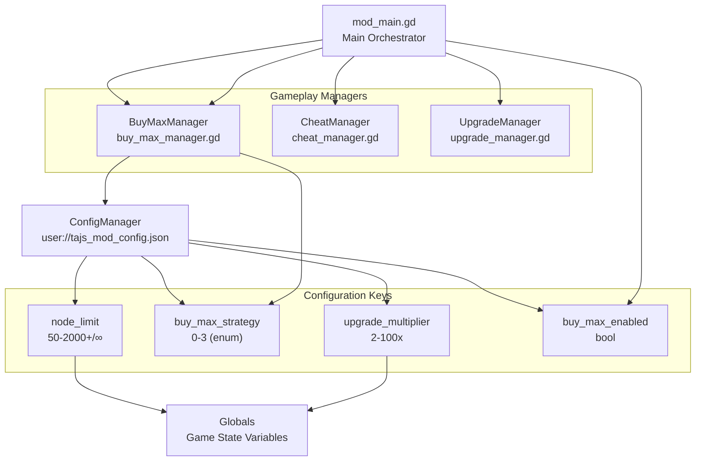
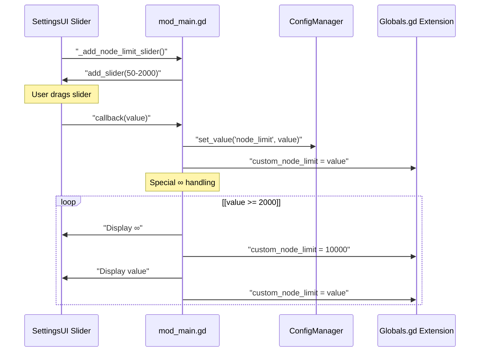
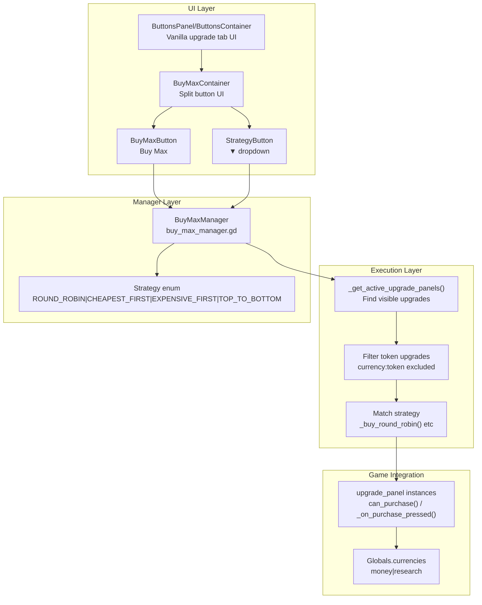
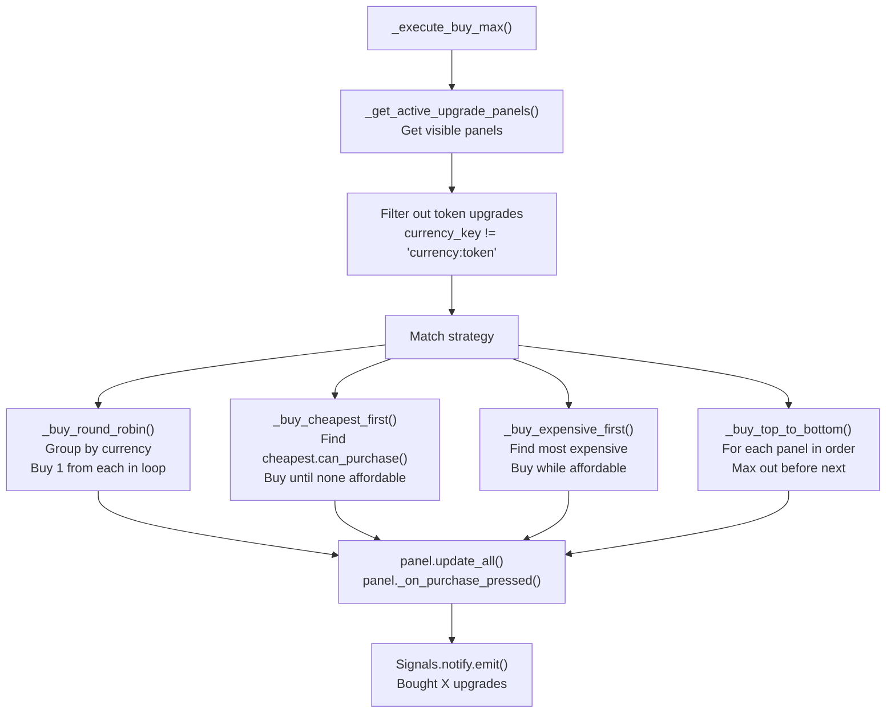
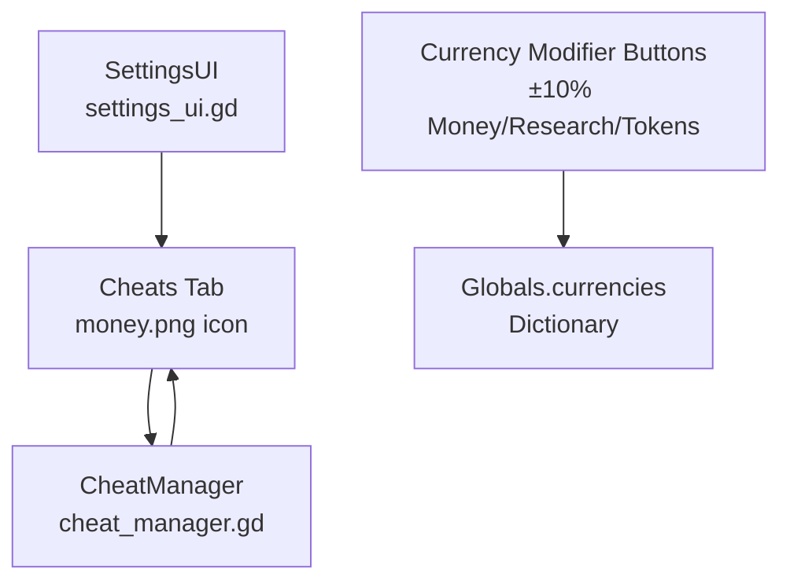
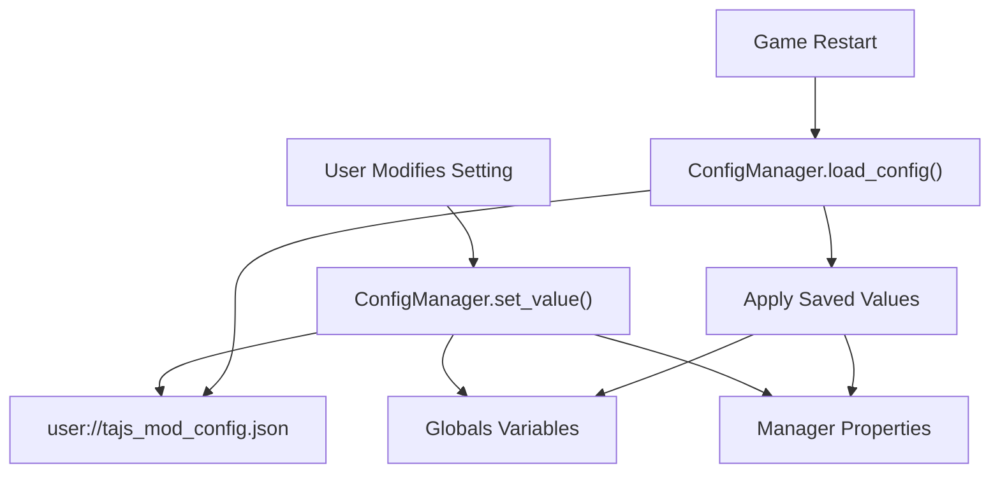

> **Relevant source files**
> * [README.md](https://github.com/tajemniktv/TajsMod/blob/5f1e656a/README.md)
> * [extensions/scenes/windows/window_inventory.gd](https://github.com/tajemniktv/TajsMod/blob/5f1e656a/extensions/scenes/windows/window_inventory.gd)
> * [extensions/scripts/utilities/buy_max_manager.gd](https://github.com/tajemniktv/TajsMod/blob/5f1e656a/extensions/scripts/utilities/buy_max_manager.gd)
> * [extensions/scripts/utilities/focus_handler.gd](https://github.com/tajemniktv/TajsMod/blob/5f1e656a/extensions/scripts/utilities/focus_handler.gd)
> * [mod_main.gd](https://github.com/tajemniktv/TajsMod/blob/5f1e656a/mod_main.gd)
> * [preview/Containers6Input.png](https://github.com/tajemniktv/TajsMod/blob/5f1e656a/preview/Containers6Input.png)

This page documents gameplay-modifying features that require explicit user enablement. These features alter core game mechanics such as node limits, upgrade purchasing, and currency values. All features covered here are clearly separated from Quality of Life and Visual enhancements to ensure players make informed decisions about their gameplay experience.

For Quality of Life features that don't affect game balance, see [Quality of Life Features](/tajemniktv/TajsMod/5.2-quality-of-life-features). For visual customization options, see [Visual Enhancements](/tajemniktv/TajsMod/5.1-visual-enhancements).

---

## Overview

Gameplay features in Taj's Mod are designed with the following principles:

| Principle | Implementation |
| --- | --- |
| **Opt-in by Default** | Most gameplay modifiers require user action to enable |
| **Clear Separation** | Located in dedicated "Cheats" tab or clearly marked |
| **Persistent Configuration** | All settings saved to `user://tajs_mod_config.json` |
| **Non-destructive** | Can be disabled at any time to return to vanilla behavior |

**Sources:** [README.md L47-L51](https://github.com/tajemniktv/TajsMod/blob/5f1e656a/README.md#L47-L51)

 [mod_main.gd L626-L628](https://github.com/tajemniktv/TajsMod/blob/5f1e656a/mod_main.gd#L626-L628)

---

## System Architecture

The following diagram shows how gameplay feature managers integrate with the main orchestrator:



**Sources:** [mod_main.gd L406-L420](https://github.com/tajemniktv/TajsMod/blob/5f1e656a/mod_main.gd#L406-L420)

 [mod_main.gd L320-L321](https://github.com/tajemniktv/TajsMod/blob/5f1e656a/mod_main.gd#L320-L321)

 [mod_main.gd L512-L517](https://github.com/tajemniktv/TajsMod/blob/5f1e656a/mod_main.gd#L512-L517)

---

## Node Limit Control

The node limit control allows players to adjust or remove the maximum number of nodes allowed on the board. This directly modifies the `Globals.custom_node_limit` value that the base game uses for validation.

### Configuration

| Setting | Range | Default | Config Key |
| --- | --- | --- | --- |
| Node Limit | 50-2000 | 400 | `node_limit` |
| Unlimited Mode | ∞ | Disabled | Special value (10000) |

### Implementation Details

The node limit slider is implemented with custom ∞ support:



The slider implementation includes:

* Custom label updates showing current/max nodes
* ∞ symbol display when slider reaches 2000
* Immediate application to `Globals.custom_node_limit`
* Persistence through config save

**Sources:** [mod_main.gd L551-L557](https://github.com/tajemniktv/TajsMod/blob/5f1e656a/mod_main.gd#L551-L557)

 [mod_main.gd L153-L155](https://github.com/tajemniktv/TajsMod/blob/5f1e656a/mod_main.gd#L153-L155)

### Usage Example

The node counter label displays real-time information:

```yaml
Nodes: 247 / 400
```

When at or near limit, the label color changes to warn the player.

**Sources:** [mod_main.gd L541-L548](https://github.com/tajemniktv/TajsMod/blob/5f1e656a/mod_main.gd#L541-L548)

 [mod_main.gd L183-L184](https://github.com/tajemniktv/TajsMod/blob/5f1e656a/mod_main.gd#L183-L184)

---

## Buy Max System

The Buy Max system adds a split-button UI to upgrade tabs that allows bulk purchasing of upgrades using one of four configurable strategies. The system is implemented as a standalone manager that injects itself into the game's upgrade UI.

### Architecture



**Sources:** [extensions/scripts/utilities/buy_max_manager.gd L1-L451](https://github.com/tajemniktv/TajsMod/blob/5f1e656a/extensions/scripts/utilities/buy_max_manager.gd#L1-L451)

### Purchase Strategies

The system provides four distinct strategies for bulk purchasing:

| Strategy | Behavior | Use Case |
| --- | --- | --- |
| **Round Robin** | Buys 1 level of each upgrade in rotation | Even distribution across all upgrades |
| **Cheapest First** | Always purchases the cheapest available upgrade | Maximize number of purchases |
| **Most Expensive** | Buys the most expensive affordable upgrade | Prioritize high-impact upgrades |
| **Top to Bottom** | Maxes out upgrades in UI order | Sequential completion |

**Sources:** [extensions/scripts/utilities/buy_max_manager.gd L12-L31](https://github.com/tajemniktv/TajsMod/blob/5f1e656a/extensions/scripts/utilities/buy_max_manager.gd#L12-L31)

### Strategy Implementation

Each strategy is implemented as a separate method that operates on filtered upgrade panels:



**Sources:** [extensions/scripts/utilities/buy_max_manager.gd L255-L399](https://github.com/tajemniktv/TajsMod/blob/5f1e656a/extensions/scripts/utilities/buy_max_manager.gd#L255-L399)

#### Round Robin Algorithm

```
for each currency_type:
    while any_purchase_in_group:
        for each panel in group:
            if panel.can_purchase():
                panel._on_purchase_pressed()
```

This ensures even distribution within each currency group (money, research).

**Sources:** [extensions/scripts/utilities/buy_max_manager.gd L291-L323](https://github.com/tajemniktv/TajsMod/blob/5f1e656a/extensions/scripts/utilities/buy_max_manager.gd#L291-L323)

#### Cheapest First Algorithm

```yaml
while true:
    cheapest_panel = null
    cheapest_cost = INF
    
    for each panel:
        panel.update_all()
        if panel.can_purchase() and panel.cost < cheapest_cost:
            cheapest_panel = panel
            cheapest_cost = panel.cost
    
    if cheapest_panel:
        cheapest_panel._on_purchase_pressed()
    else:
        break
```

**Sources:** [extensions/scripts/utilities/buy_max_manager.gd L326-L351](https://github.com/tajemniktv/TajsMod/blob/5f1e656a/extensions/scripts/utilities/buy_max_manager.gd#L326-L351)

### UI Integration

The Buy Max button is injected into the existing upgrade tab UI:

**Injection Point:** `HUD/Main/MainContainer/Overlay/.../upgrades_tab/ButtonsPanel/ButtonsContainer`

The split button consists of:

* **Main Button:** Executes buy max with current strategy
* **Dropdown Button:** Opens strategy selection menu

Both buttons use the `TabButton` theme type variation to match the vanilla UI styling.

**Sources:** [extensions/scripts/utilities/buy_max_manager.gd L112-L169](https://github.com/tajemniktv/TajsMod/blob/5f1e656a/extensions/scripts/utilities/buy_max_manager.gd#L112-L169)

### Configuration

| Config Key | Type | Default | Description |
| --- | --- | --- | --- |
| `buy_max_enabled` | bool | true | Show/hide Buy Max button |
| `buy_max_strategy` | int | 0 (Round Robin) | Selected strategy enum value |

**Sources:** [mod_main.gd L505-L509](https://github.com/tajemniktv/TajsMod/blob/5f1e656a/mod_main.gd#L505-L509)

 [extensions/scripts/utilities/buy_max_manager.gd L52-L54](https://github.com/tajemniktv/TajsMod/blob/5f1e656a/extensions/scripts/utilities/buy_max_manager.gd#L52-L54)

---

## Upgrade Manager (Modifier Keys)

The Upgrade Manager extends the base game's upgrade system to support bulk purchasing with modifier keys. This allows players to buy multiple levels of an upgrade in a single action.

### Multiplier System

The upgrade multiplier is controlled by a slider in the General settings tab:

| Parameter | Value |
| --- | --- |
| Range | 2-100x |
| Default | 10x |
| Increment | 1 |
| Modifier Key | Ctrl |

When Ctrl is held while clicking an upgrade button, the game attempts to purchase multiple levels equal to the configured multiplier.

**Sources:** [mod_main.gd L512-L517](https://github.com/tajemniktv/TajsMod/blob/5f1e656a/mod_main.gd#L512-L517)

### Global State

The multiplier value is stored in the extended Globals:

```
Globals.custom_upgrade_multiplier = int (2-100)
```

This value is read by the base game's upgrade purchase logic when the Ctrl modifier is detected.

**Sources:** [mod_main.gd L513-L516](https://github.com/tajemniktv/TajsMod/blob/5f1e656a/mod_main.gd#L513-L516)

### Configuration

| Config Key | Type | Default | Purpose |
| --- | --- | --- | --- |
| `upgrade_multiplier` | int | 10 | Number of levels to buy with Ctrl |

Changes to the slider immediately update both the config and the Globals state.

**Sources:** [mod_main.gd L512-L517](https://github.com/tajemniktv/TajsMod/blob/5f1e656a/mod_main.gd#L512-L517)

---

## Cheats Panel

The Cheats Panel provides direct manipulation of game currencies and resources. It is located in a dedicated "Cheats" tab to clearly separate it from legitimate gameplay features.

### Architecture



**Sources:** [mod_main.gd L626-L628](https://github.com/tajemniktv/TajsMod/blob/5f1e656a/mod_main.gd#L626-L628)

### Features

The Cheats Panel is implemented by `CheatManagerScript` and provides:

* **Currency Modification:** Direct addition/subtraction of currencies
* **Percentage-based Adjustments:** ±10% buttons for money, research, and tokens
* **Debug Integration:** Values logged to debug tab when debug mode is enabled

The exact implementation is contained in the `cheat_manager.gd` script's `build_cheats_tab()` method, which constructs the UI dynamically.

**Sources:** [mod_main.gd L26](https://github.com/tajemniktv/TajsMod/blob/5f1e656a/mod_main.gd#L26-L26)

 [mod_main.gd L627](https://github.com/tajemniktv/TajsMod/blob/5f1e656a/mod_main.gd#L627-L627)

### Safety Considerations

The Cheats tab is:

* Clearly labeled with a money icon
* Separated from other settings tabs
* Documented as opt-in gameplay modification
* Reversible (values can be reduced back to legitimate amounts)

---

## Configuration and Persistence

All gameplay features persist their state through the ConfigManager system:



### Persistence Table

| Feature | Config Key | Applied To | Load Phase |
| --- | --- | --- | --- |
| Node Limit | `node_limit` | `Globals.custom_node_limit` | `_ready()` |
| Buy Max Enabled | `buy_max_enabled` | `BuyMaxManager` visibility | `_setup_for_main()` |
| Buy Max Strategy | `buy_max_strategy` | `BuyMaxManager.current_strategy` | `setup()` |
| Upgrade Multiplier | `upgrade_multiplier` | `Globals.custom_upgrade_multiplier` | `_build_settings_menu()` |

**Sources:** [mod_main.gd L153-L155](https://github.com/tajemniktv/TajsMod/blob/5f1e656a/mod_main.gd#L153-L155)

 [mod_main.gd L332-L333](https://github.com/tajemniktv/TajsMod/blob/5f1e656a/mod_main.gd#L332-L333)

 [extensions/scripts/utilities/buy_max_manager.gd L52-L54](https://github.com/tajemniktv/TajsMod/blob/5f1e656a/extensions/scripts/utilities/buy_max_manager.gd#L52-L54)

 [mod_main.gd L512-L517](https://github.com/tajemniktv/TajsMod/blob/5f1e656a/mod_main.gd#L512-L517)

### Initialization Flow

```mermaid
sequenceDiagram
  participant ModLoader
  participant mod_main._ready()
  participant ConfigManager
  participant BuyMaxManager.setup()
  participant Globals Extension

  ModLoader->>mod_main._ready(): "_ready()"
  mod_main._ready()->>ConfigManager: "get_value('node_limit')"
  ConfigManager-->>mod_main._ready(): "400"
  mod_main._ready()->>Globals Extension: "custom_node_limit = 400"
  note over mod_main._ready(): Wait for Main node
  mod_main._ready()->>mod_main._ready(): "_setup_for_main()"
  mod_main._ready()->>BuyMaxManager.setup(): "setup(tree, config)"
  BuyMaxManager.setup()->>ConfigManager: "get_value('buy_max_strategy')"
  ConfigManager-->>BuyMaxManager.setup(): "Strategy.ROUND_ROBIN"
  BuyMaxManager.setup()->>BuyMaxManager.setup(): "current_strategy = 0"
  BuyMaxManager.setup()->>BuyMaxManager.setup(): "_inject_buy_max_button()"
  mod_main._ready()->>mod_main._ready(): "_build_settings_menu()"
  mod_main._ready()->>ConfigManager: "get_value('upgrade_multiplier')"
  ConfigManager-->>mod_main._ready(): "10"
  mod_main._ready()->>Globals Extension: "custom_upgrade_multiplier = 10"
```

**Sources:** [mod_main.gd L115-L163](https://github.com/tajemniktv/TajsMod/blob/5f1e656a/mod_main.gd#L115-L163)

 [mod_main.gd L278-L340](https://github.com/tajemniktv/TajsMod/blob/5f1e656a/mod_main.gd#L278-L340)

 [extensions/scripts/utilities/buy_max_manager.gd L46-L76](https://github.com/tajemniktv/TajsMod/blob/5f1e656a/extensions/scripts/utilities/buy_max_manager.gd#L46-L76)

---

## Summary

Gameplay features in Taj's Mod follow a consistent pattern:

1. **Manager-based Architecture:** Each feature implemented as a standalone manager
2. **Config-driven:** All settings persisted through ConfigManager
3. **Global State Integration:** Critical values stored in extended Globals
4. **UI Injection:** Features integrate into existing game UI non-destructively
5. **Clear Separation:** Cheats and gameplay modifiers isolated in dedicated tabs

This architecture ensures gameplay modifications are:

* Toggleable without restart (where possible)
* Persistent across sessions
* Clearly communicated to users
* Reversible to vanilla behavior

**Sources:** [mod_main.gd L1-L1844](https://github.com/tajemniktv/TajsMod/blob/5f1e656a/mod_main.gd#L1-L1844)

 [extensions/scripts/utilities/buy_max_manager.gd L1-L451](https://github.com/tajemniktv/TajsMod/blob/5f1e656a/extensions/scripts/utilities/buy_max_manager.gd#L1-L451)

 [extensions/scripts/utilities/config_manager.gd](https://github.com/tajemniktv/TajsMod/blob/5f1e656a/extensions/scripts/utilities/config_manager.gd)