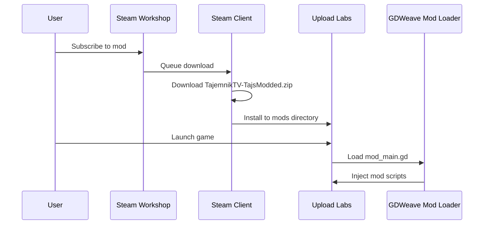
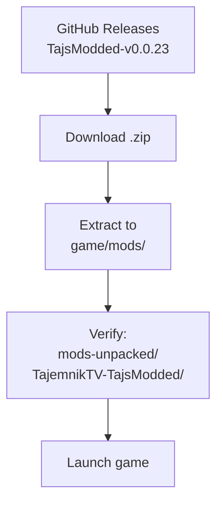
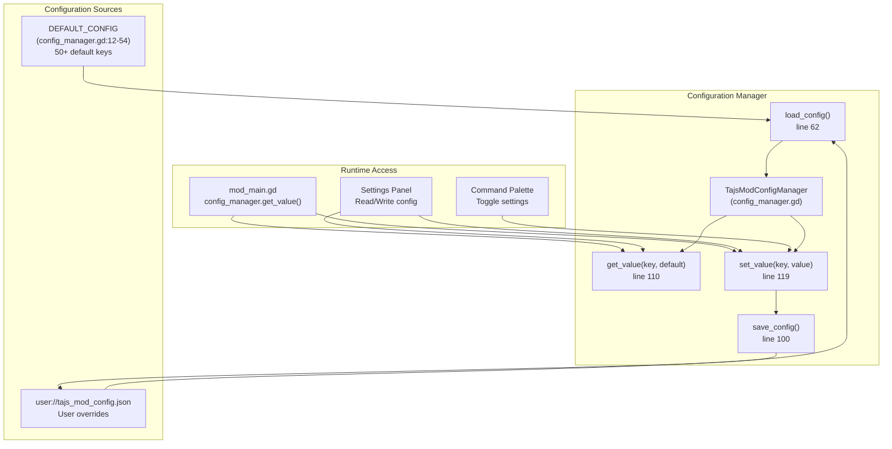
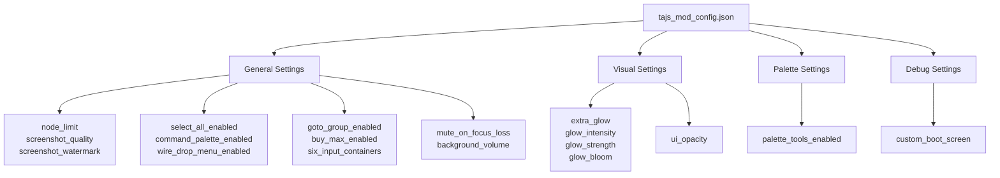
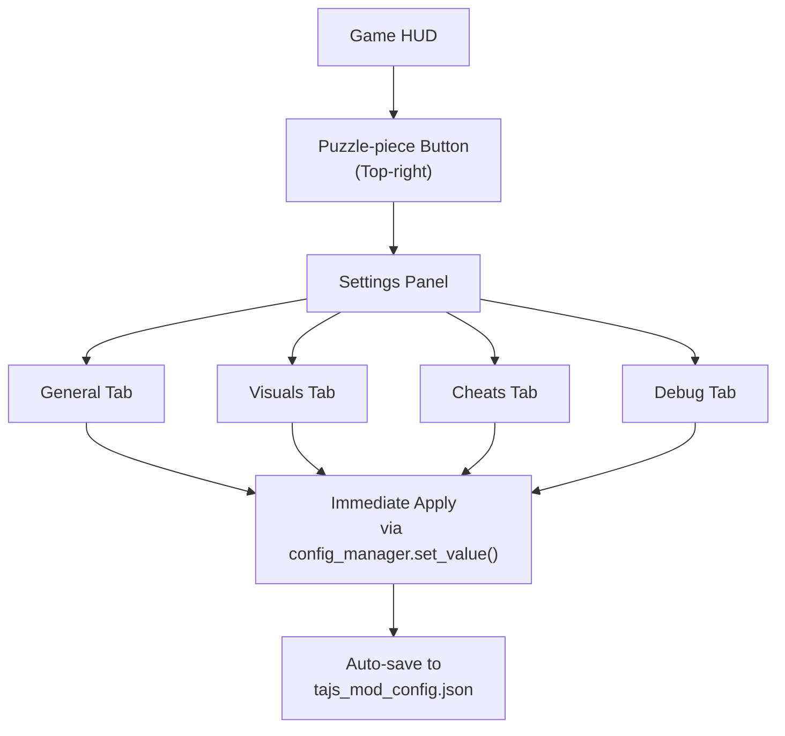
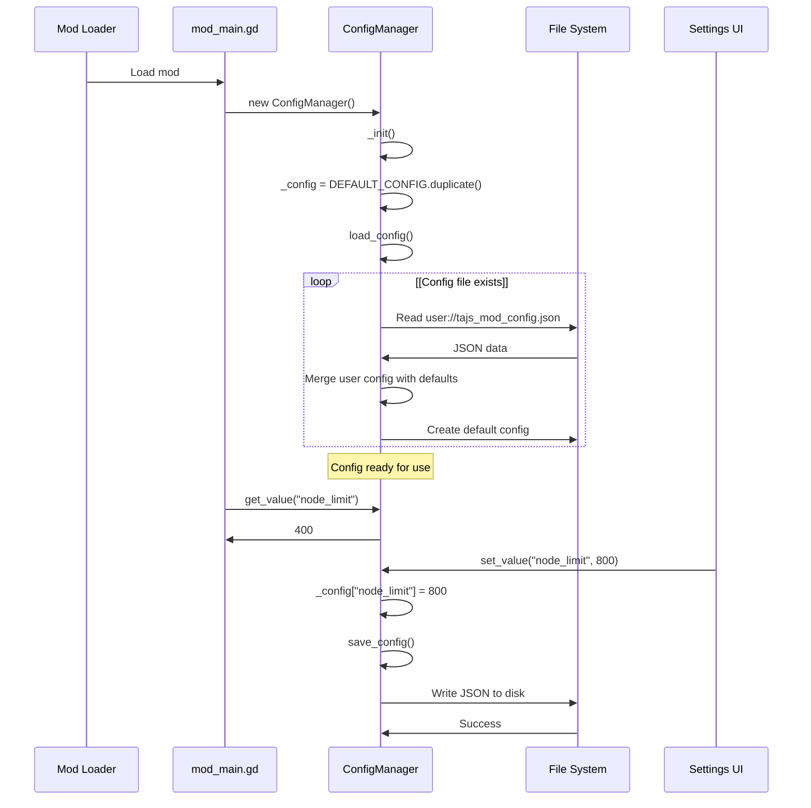

> **Relevant source files**
> * [README.md](https://github.com/tajemniktv/TajsMod/blob/5f1e656a/README.md)
> * [export/TajemnikTV-TajsModded.zip](https://github.com/tajemniktv/TajsMod/blob/5f1e656a/export/TajemnikTV-TajsModded.zip)
> * [extensions/scripts/utilities/config_manager.gd](https://github.com/tajemniktv/TajsMod/blob/5f1e656a/extensions/scripts/utilities/config_manager.gd)
> * [manifest.json](https://github.com/tajemniktv/TajsMod/blob/5f1e656a/manifest.json)
> * [preview/Containers6Input.png](https://github.com/tajemniktv/TajsMod/blob/5f1e656a/preview/Containers6Input.png)

This page covers the installation procedures for Taj's Mod and explains the configuration system that manages all mod settings. For detailed feature documentation and how to use specific features, see [Feature Reference](/tajemniktv/TajsMod/5-feature-reference). For information about building the mod or contributing, see [Development Guide](/tajemniktv/TajsMod/8-development-guide).

---

## System Requirements

Taj's Mod requires the following base system components:

| Component | Minimum Version | Notes |
| --- | --- | --- |
| Upload Labs | 2.0.17 | Base game version |
| Mod Loader | 7.0.0 | GDWeave mod loader |
| Operating System | Windows/Linux | Same as base game |

The mod has no known conflicts with other mods as of version 0.0.23.

**Sources:** [manifest.json L9-L13](https://github.com/tajemniktv/TajsMod/blob/5f1e656a/manifest.json#L9-L13)

 [README.md L75-L80](https://github.com/tajemniktv/TajsMod/blob/5f1e656a/README.md#L75-L80)

---

## Installation Methods

### Steam Workshop Installation (Recommended)

The Steam Workshop provides automatic installation, updates, and conflict resolution.



**Installation Steps:**

1. Navigate to the [Steam Workshop page](https://steamcommunity.com/sharedfiles/filedetails/?id=3628222709)
2. Click **Subscribe**
3. Steam will automatically download and install the mod
4. Launch Upload Labs
5. Verify installation by looking for the puzzle-piece settings button in the HUD

The mod is packaged as `TajemnikTV-TajsModded.zip` in the Workshop and extracted to the game's mods directory by Steam.

**Sources:** [README.md L62-L65](https://github.com/tajemniktv/TajsMod/blob/5f1e656a/README.md#L62-L65)

 [manifest.json L32-L34](https://github.com/tajemniktv/TajsMod/blob/5f1e656a/manifest.json#L32-L34)

 [export/TajemnikTV-TajsModded.zip L1](https://github.com/tajemniktv/TajsMod/blob/5f1e656a/export/TajemnikTV-TajsModded.zip#L1-L1)

### Manual Installation

Manual installation is not officially supported but possible for advanced users:



**Manual Steps:**

1. Download the latest release from GitHub Releases
2. Extract the zip file to `<game_directory>/mods/`
3. Ensure the structure is: `mods-unpacked/TajemnikTV-TajsModded/mod_main.gd`
4. Launch the game

**Warning:** Remove any previous manual installations before installing via Steam Workshop to avoid duplicates.

**Sources:** [README.md L66-L69](https://github.com/tajemniktv/TajsMod/blob/5f1e656a/README.md#L66-L69)

 [manifest.json L32](https://github.com/tajemniktv/TajsMod/blob/5f1e656a/manifest.json#L32-L32)

---

## Configuration System Architecture

Taj's Mod uses a persistent JSON-based configuration system managed by `TajsModConfigManager`.



**Key Characteristics:**

* **Write-through persistence**: Every `set_value()` call immediately writes to disk
* **Three-tier fallback**: User config → Default config → Method override parameter
* **Automatic migration**: New default keys are automatically added to existing user configs
* **Type preservation**: JSON maintains data types (bool, int, float, string)

**Sources:** [extensions/scripts/utilities/config_manager.gd L1-L134](https://github.com/tajemniktv/TajsMod/blob/5f1e656a/extensions/scripts/utilities/config_manager.gd#L1-L134)

---

## Configuration File Structure

### File Location

The configuration file is stored at:

```yaml
user://tajs_mod_config.json
```

On Windows, this typically resolves to:

```
%APPDATA%/Godot/app_userdata/Upload Labs/tajs_mod_config.json
```

**Sources:** [extensions/scripts/utilities/config_manager.gd L10](https://github.com/tajemniktv/TajsMod/blob/5f1e656a/extensions/scripts/utilities/config_manager.gd#L10-L10)

### Configuration Schema

The configuration is organized into logical categories matching the Settings UI tabs:



**Sources:** [extensions/scripts/utilities/config_manager.gd L12-L54](https://github.com/tajemniktv/TajsMod/blob/5f1e656a/extensions/scripts/utilities/config_manager.gd#L12-L54)

### Example Configuration File

```json
{
    "node_limit": 400,
    "screenshot_quality": 2,
    "screenshot_watermark": true,
    "select_all_enabled": true,
    "command_palette_enabled": true,
    "wire_drop_menu_enabled": true,
    "right_click_clear_enabled": true,
    "goto_group_enabled": true,
    "buy_max_enabled": true,
    "z_order_fix_enabled": true,
    "disable_slider_scroll": false,
    "mute_on_focus_loss": true,
    "background_volume": 0.0,
    "drag_dead_zone": 5,
    "six_input_containers": true,
    "extra_glow": false,
    "glow_intensity": 2.0,
    "glow_strength": 1.3,
    "glow_bloom": 0.2,
    "glow_sensitivity": 0.8,
    "ui_opacity": 100.0,
    "palette_tools_enabled": false,
    "highlight_disconnected_enabled": true,
    "highlight_disconnected_style": "pulse",
    "highlight_disconnected_intensity": 0.5,
    "highlight_disconnected_debug": false,
    "notification_log_enabled": true,
    "custom_boot_screen": true
}
```

**Sources:** [extensions/scripts/utilities/config_manager.gd L12-L54](https://github.com/tajemniktv/TajsMod/blob/5f1e656a/extensions/scripts/utilities/config_manager.gd#L12-L54)

---

## Configuration Categories

### General Settings

| Key | Type | Default | Description |
| --- | --- | --- | --- |
| `node_limit` | int | 400 | Maximum nodes allowed in workspace |
| `screenshot_quality` | int | 2 | Screenshot resolution (0=Low, 1=Med, 2=High, 3=Original) |
| `screenshot_watermark` | bool | true | Add Taj's Mod watermark to screenshots |
| `select_all_enabled` | bool | true | Enable Ctrl+A to select all nodes |
| `command_palette_enabled` | bool | true | Enable middle-click command palette |
| `wire_drop_menu_enabled` | bool | true | Enable wire drop node menu |
| `right_click_clear_enabled` | bool | true | Enable right-click to clear wires |
| `goto_group_enabled` | bool | true | Enable "Go To Group" panel button |
| `buy_max_enabled` | bool | true | Enable Buy Max button in upgrades |
| `z_order_fix_enabled` | bool | true | Fix node group z-order rendering |
| `disable_slider_scroll` | bool | false | Disable scroll wheel on sliders |
| `six_input_containers` | bool | true | Increase container inputs from 4 to 6 |

**Sources:** [extensions/scripts/utilities/config_manager.gd L13-L35](https://github.com/tajemniktv/TajsMod/blob/5f1e656a/extensions/scripts/utilities/config_manager.gd#L13-L35)

### Audio Settings

| Key | Type | Default | Description |
| --- | --- | --- | --- |
| `mute_on_focus_loss` | bool | true | Mute audio when window loses focus |
| `background_volume` | float | 0.0 | Volume when unfocused (0-100%, 0=mute) |

**Sources:** [extensions/scripts/utilities/config_manager.gd L30-L31](https://github.com/tajemniktv/TajsMod/blob/5f1e656a/extensions/scripts/utilities/config_manager.gd#L30-L31)

### Input Settings

| Key | Type | Default | Description |
| --- | --- | --- | --- |
| `drag_dead_zone` | int | 5 | Pixels before drag operation starts |

**Sources:** [extensions/scripts/utilities/config_manager.gd L33](https://github.com/tajemniktv/TajsMod/blob/5f1e656a/extensions/scripts/utilities/config_manager.gd#L33-L33)

### Visual Settings

| Key | Type | Default | Description |
| --- | --- | --- | --- |
| `extra_glow` | bool | false | Enable enhanced glow effects |
| `glow_intensity` | float | 2.0 | Glow brightness multiplier |
| `glow_strength` | float | 1.3 | Glow effect strength |
| `glow_bloom` | float | 0.2 | Bloom amount for glow |
| `glow_sensitivity` | float | 0.8 | Glow threshold sensitivity |
| `ui_opacity` | float | 100.0 | HUD transparency (0-100%) |

**Sources:** [extensions/scripts/utilities/config_manager.gd L37-L42](https://github.com/tajemniktv/TajsMod/blob/5f1e656a/extensions/scripts/utilities/config_manager.gd#L37-L42)

### Palette Settings

| Key | Type | Default | Description |
| --- | --- | --- | --- |
| `palette_tools_enabled` | bool | false | Enable palette tool features |

**Sources:** [extensions/scripts/utilities/config_manager.gd L44](https://github.com/tajemniktv/TajsMod/blob/5f1e656a/extensions/scripts/utilities/config_manager.gd#L44-L44)

### Disconnected Node Highlighting

| Key | Type | Default | Description |
| --- | --- | --- | --- |
| `highlight_disconnected_enabled` | bool | true | Enable disconnected node highlighting |
| `highlight_disconnected_style` | string | "pulse" | Highlight style ("pulse" or "outline") |
| `highlight_disconnected_intensity` | float | 0.5 | Highlight effect intensity |
| `highlight_disconnected_debug` | bool | false | Enable debug logging for highlighting |

**Sources:** [extensions/scripts/utilities/config_manager.gd L46-L49](https://github.com/tajemniktv/TajsMod/blob/5f1e656a/extensions/scripts/utilities/config_manager.gd#L46-L49)

### Notification Settings

| Key | Type | Default | Description |
| --- | --- | --- | --- |
| `notification_log_enabled` | bool | true | Enable notification history log |

**Sources:** [extensions/scripts/utilities/config_manager.gd L51](https://github.com/tajemniktv/TajsMod/blob/5f1e656a/extensions/scripts/utilities/config_manager.gd#L51-L51)

### Debug Settings

| Key | Type | Default | Description |
| --- | --- | --- | --- |
| `custom_boot_screen` | bool | true | Show custom Taj's Mod boot screen |

**Sources:** [extensions/scripts/utilities/config_manager.gd L53](https://github.com/tajemniktv/TajsMod/blob/5f1e656a/extensions/scripts/utilities/config_manager.gd#L53-L53)

---

## Accessing Settings In-Game

### Settings Panel Access

The primary interface for modifying configuration is the Settings Panel:



1. Look for the **puzzle-piece icon** in the top-right of the HUD
2. Click to open the Settings Panel
3. Navigate between tabs using the tab buttons
4. Modify settings using checkboxes, sliders, and input fields
5. Changes are **immediately applied and saved**

**Sources:** [README.md L24](https://github.com/tajemniktv/TajsMod/blob/5f1e656a/README.md#L24-L24)

### Command Palette Access

Some settings can be toggled via the Command Palette:

1. Press **Middle Mouse Button** or **Spacebar** to open the palette
2. Type a setting name (e.g., "glow", "node limit")
3. Execute the command to toggle or modify the setting
4. Changes are immediately saved to configuration

**Sources:** [README.md L36-L39](https://github.com/tajemniktv/TajsMod/blob/5f1e656a/README.md#L36-L39)

---

## Configuration Manager API

### Initialization

The `TajsModConfigManager` is instantiated early in the mod lifecycle:

```javascript
# In mod_main.gd _init()
var config_manager := TajsModConfigManager.new()
```

**Sources:** [extensions/scripts/utilities/config_manager.gd L58-L60](https://github.com/tajemniktv/TajsMod/blob/5f1e656a/extensions/scripts/utilities/config_manager.gd#L58-L60)

### Reading Configuration Values

```javascript
# Basic read with fallback to default
var node_limit = config_manager.get_value("node_limit")

# Read with custom override
var quality = config_manager.get_value("screenshot_quality", 1)

# Returns null if key doesn't exist and no override provided
var unknown = config_manager.get_value("nonexistent_key")
```

The `get_value()` method follows this resolution order:

1. User configuration file value (if exists)
2. `default_override` parameter (if provided)
3. `DEFAULT_CONFIG` dictionary value (if exists)
4. `null` (if not found anywhere)

**Sources:** [extensions/scripts/utilities/config_manager.gd L110-L117](https://github.com/tajemniktv/TajsMod/blob/5f1e656a/extensions/scripts/utilities/config_manager.gd#L110-L117)

### Writing Configuration Values

```markdown
# Set a value (automatically saves to disk)
config_manager.set_value("node_limit", 800)

# Enable a feature
config_manager.set_value("extra_glow", true)

# Adjust intensity
config_manager.set_value("glow_intensity", 2.5)
```

Every call to `set_value()` triggers an immediate `save_config()` operation, ensuring persistence.

**Sources:** [extensions/scripts/utilities/config_manager.gd L119-L121](https://github.com/tajemniktv/TajsMod/blob/5f1e656a/extensions/scripts/utilities/config_manager.gd#L119-L121)

### Resetting Configuration

```markdown
# Reset all settings to defaults
config_manager.reset_to_defaults()
```

This operation:

1. Deletes the user configuration file
2. Resets the in-memory `_config` dictionary to `DEFAULT_CONFIG`
3. Saves the default configuration to disk

**Sources:** [extensions/scripts/utilities/config_manager.gd L126-L133](https://github.com/tajemniktv/TajsMod/blob/5f1e656a/extensions/scripts/utilities/config_manager.gd#L126-L133)

### Retrieving All Configuration

```javascript
# Get a copy of the entire configuration
var all_config = config_manager.get_all()

# Returns a duplicate dictionary to prevent external mutation
```

**Sources:** [extensions/scripts/utilities/config_manager.gd L123-L124](https://github.com/tajemniktv/TajsMod/blob/5f1e656a/extensions/scripts/utilities/config_manager.gd#L123-L124)

---

## Configuration Lifecycle



**Key Lifecycle Events:**

1. **Mod Load**: `ConfigManager` instantiated during `mod_main.gd` `_init()`
2. **Initial Load**: `load_config()` reads from disk or creates defaults
3. **Runtime Access**: `get_value()` called by features throughout execution
4. **Setting Changes**: `set_value()` immediately persists to disk
5. **Reset**: Optional `reset_to_defaults()` wipes user config

**Sources:** [extensions/scripts/utilities/config_manager.gd L58-L133](https://github.com/tajemniktv/TajsMod/blob/5f1e656a/extensions/scripts/utilities/config_manager.gd#L58-L133)

---

## Configuration Persistence Strategy

### Write-Through Caching

Taj's Mod uses a **write-through cache** strategy:

* All reads come from the in-memory `_config` dictionary (fast)
* All writes go to both memory and disk immediately (durable)
* No deferred write or batching (simple, reliable)

### File Format

Configuration is stored as **pretty-printed JSON** with tab indentation:

```javascript
var json_string := JSON.stringify(_config, "\t")
```

This makes the file human-readable and easy to edit manually if needed.

**Sources:** [extensions/scripts/utilities/config_manager.gd L103](https://github.com/tajemniktv/TajsMod/blob/5f1e656a/extensions/scripts/utilities/config_manager.gd#L103-L103)

### Error Handling

The configuration system includes basic error handling:

```
if !FileAccess.file_exists(CONFIG_PATH):
    ModLoaderLog.info("No config file found, using defaults.", LOG_NAME)
    save_config()
    return
```

* Missing files trigger default creation
* Parse errors log to console and continue with defaults
* Write failures log errors but don't crash the mod

**Sources:** [extensions/scripts/utilities/config_manager.gd L63-L71](https://github.com/tajemniktv/TajsMod/blob/5f1e656a/extensions/scripts/utilities/config_manager.gd#L63-L71)

 [extensions/scripts/utilities/config_manager.gd L96-L98](https://github.com/tajemniktv/TajsMod/blob/5f1e656a/extensions/scripts/utilities/config_manager.gd#L96-L98)

---

## Advanced: Custom Configuration Keys

The configuration system supports arbitrary keys beyond `DEFAULT_CONFIG`:

```markdown
# In config loading (line 90-92)
for key in loaded_data:
    if !DEFAULT_CONFIG.has(key):
        _config[key] = loaded_data[key]
```

This allows features to store custom data (e.g., `wire_colors_hex` for wire color customization) without modifying `DEFAULT_CONFIG`.

**Example:**

```javascript
# Store custom wire colors
config_manager.set_value("wire_colors_hex", {
    "Input": "#FF6B6B",
    "Output": "#4ECDC4",
    "Logic": "#FFE66D"
})

# Retrieve later
var wire_colors = config_manager.get_value("wire_colors_hex", {})
```

**Sources:** [extensions/scripts/utilities/config_manager.gd L89-L92](https://github.com/tajemniktv/TajsMod/blob/5f1e656a/extensions/scripts/utilities/config_manager.gd#L89-L92)

---

## Troubleshooting

### Configuration Not Persisting

**Symptoms:** Settings reset after game restart

**Solutions:**

1. Check file permissions on `%APPDATA%/Godot/app_userdata/Upload Labs/`
2. Verify the config file exists at `user://tajs_mod_config.json`
3. Check mod logs for file write errors
4. Try resetting to defaults via Settings UI

### Invalid Configuration Values

**Symptoms:** Settings show unexpected values or don't apply

**Solutions:**

1. Open Settings Panel and use "Reset All Settings"
2. Manually delete `tajs_mod_config.json` and restart
3. Verify the file contains valid JSON (use a JSON validator)

### Mod Settings Not Appearing

**Symptoms:** No puzzle-piece button in HUD

**Solutions:**

1. Verify mod is installed correctly via Steam Workshop or manual installation
2. Check that Mod Loader version is 7.0.0 or higher
3. Check for mod load errors in the game console
4. Ensure game version is 2.0.17 or higher

**Sources:** [README.md L75-L80](https://github.com/tajemniktv/TajsMod/blob/5f1e656a/README.md#L75-L80)

 [manifest.json L9-L13](https://github.com/tajemniktv/TajsMod/blob/5f1e656a/manifest.json#L9-L13)