> **Relevant source files**
> * [.github/ISSUE_TEMPLATE/bug_report.yml](https://github.com/tajemniktv/TajsMod/blob/5f1e656a/.github/ISSUE_TEMPLATE/bug_report.yml)
> * [.github/ISSUE_TEMPLATE/config.yml](https://github.com/tajemniktv/TajsMod/blob/5f1e656a/.github/ISSUE_TEMPLATE/config.yml)
> * [.github/ISSUE_TEMPLATE/feature_request.yml](https://github.com/tajemniktv/TajsMod/blob/5f1e656a/.github/ISSUE_TEMPLATE/feature_request.yml)
> * [.github/workflows/issue-triage.yml](https://github.com/tajemniktv/TajsMod/blob/5f1e656a/.github/workflows/issue-triage.yml)

## Purpose and Scope

This document explains the issue tracking workflow for TajsMod, including the structured issue templates and automated triage system. It covers how bug reports and feature requests are standardized through GitHub Issue Forms, and how the automated labeling workflow processes them.

For general contribution guidelines and code style, see [Contributing Guidelines](/tajemniktv/TajsMod/8.2-contributing-guidelines). For information about the release process, see [Building and Distribution](/tajemniktv/TajsMod/8.1-building-and-distribution).

---

## Overview

TajsMod uses GitHub Issue Forms to enforce structured issue reporting. All issues are automatically triaged and labeled by a GitHub Actions workflow that parses form fields and applies appropriate labels.

**Key Components:**

* **Bug Report Form**: 11 required fields capturing version info, reproduction steps, frequency, and environment
* **Feature Request Form**: 8 required fields capturing problem statement, solution, scope, and constraints
* **Automated Triage**: `issue-triage.yml` workflow that labels issues on creation/edit/reopen


**Sources:** [.github/ISSUE_TEMPLATE/config.yml L1-L10](https://github.com/tajemniktv/TajsMod/blob/5f1e656a/.github/ISSUE_TEMPLATE/config.yml#L1-L10)

 [.github/workflows/issue-triage.yml L1-L144](https://github.com/tajemniktv/TajsMod/blob/5f1e656a/.github/workflows/issue-triage.yml#L1-L144)

---

## Bug Report Template Structure

The bug report form is defined in [.github/ISSUE_TEMPLATE/bug_report.yml L1-L273](https://github.com/tajemniktv/TajsMod/blob/5f1e656a/.github/ISSUE_TEMPLATE/bug_report.yml#L1-L273)

 and enforces comprehensive bug documentation.

### Required Fields

| Field | ID | Type | Purpose | Validation |
| --- | --- | --- | --- | --- |
| Taj's Mod version | `mod_version` | `input` | Tracks which release has the bug | Required |
| Game version | `game_version` | `input` | Identifies base game compatibility | Required |
| Category | `category` | `dropdown` | Categorizes bug type | Required (7 options) |
| Describe the bug | `description` | `textarea` | Primary bug description | Required |
| Steps to reproduce | `reproduction_steps` | `textarea` | Reproduction procedure | Required |
| Actual behavior | `actual` | `textarea` | What actually happened | Required |
| How often does it occur? | `frequency` | `dropdown` | Reproduction frequency | Required (5 options) |
| Did this work in an older version? | `regression` | `dropdown` | Regression detection | Required (3 options) |
| Other installed mods | `other_mods` | `textarea` | Conflict identification | Required |
| Environment | `environment` | `textarea` | System specifications | Required |
| Confirmations | `confirmations` | `checkboxes` | Quality checklist | 3 required checkboxes |

### Field Categories


**Sources:** [.github/ISSUE_TEMPLATE/bug_report.yml L25-L273](https://github.com/tajemniktv/TajsMod/blob/5f1e656a/.github/ISSUE_TEMPLATE/bug_report.yml#L25-L273)

### Category Options

The `category` field maps to automated labels (see Automated Triage section):

* **Visual / UI**: UI rendering, layout, styling issues
* **QoL / Utility**: Quality-of-life features not working as expected
* **Performance**: FPS drops, lag, memory issues
* **Accessibility**: Input handling, readability, usability
* **Gameplay (opt-in)**: Bugs in opt-in gameplay modifiers (node limits, cheats)
* **Modding / API / Integration**: Conflicts with other mods or mod loader
* **Other**: Uncategorized issues

**Sources:** [.github/ISSUE_TEMPLATE/bug_report.yml L44-L57](https://github.com/tajemniktv/TajsMod/blob/5f1e656a/.github/ISSUE_TEMPLATE/bug_report.yml#L44-L57)

### Frequency Mapping

The `frequency` field determines reproduction reliability labels:

| User Selection | Applied Label | Interpretation |
| --- | --- | --- |
| Every time | `repro:always` | 100% reproducible |
| Often ( > 50% ) | `repro:intermittent` | Frequently reproducible |
| Sometimes | `repro:intermittent` | Occasionally reproducible |
| Rarely | `repro:intermittent` | Hard to reproduce |
| Once | `repro:intermittent` | Single occurrence |

**Sources:** [.github/ISSUE_TEMPLATE/bug_report.yml L124-L135](https://github.com/tajemniktv/TajsMod/blob/5f1e656a/.github/ISSUE_TEMPLATE/bug_report.yml#L124-L135)

 [.github/workflows/issue-triage.yml L73-L79](https://github.com/tajemniktv/TajsMod/blob/5f1e656a/.github/workflows/issue-triage.yml#L73-L79)

---

## Feature Request Template Structure

The feature request form is defined in [.github/ISSUE_TEMPLATE/feature_request.yml L1-L210](https://github.com/tajemniktv/TajsMod/blob/5f1e656a/.github/ISSUE_TEMPLATE/feature_request.yml#L1-L210)

 and enforces structured feature proposals.

### Required Fields

| Field | ID | Type | Purpose | Validation |
| --- | --- | --- | --- | --- |
| What would you like to add/change? | `summary` | `textarea` | One-sentence summary | Required |
| What problem does this solve? | `motivation` | `textarea` | Problem statement & use case | Required |
| What should happen? | `proposed_solution` | `textarea` | Detailed solution description | Required |
| Category | `category` | `dropdown` | Feature categorization | Required (7 options) |
| How big is this? | `scope` | `dropdown` | Estimated complexity | Required (4 options) |
| How do we know it's done? | `acceptance_criteria` | `textarea` | Definition of done | Required |
| Considerations | `constraints` | `checkboxes` | Constraint identification | Optional (6 options) |
| Confirmations | `confirmations` | `checkboxes` | Quality checklist | 3 required checkboxes |

### Scope Options

The `scope` field maps to complexity labels:

| User Selection | Applied Label | Typical Work |
| --- | --- | --- |
| Small (tweak / small option) | `scope:small` | Single-file change, simple toggle |
| Medium (new setting / moderate logic) | `scope:medium` | Multi-file feature, settings UI |
| Large (multi-part feature; needs planning) | `scope:large` | New subsystem, extensive integration |
| Not sure | *(no label)* | Requires maintainer assessment |

**Sources:** [.github/ISSUE_TEMPLATE/feature_request.yml L94-L102](https://github.com/tajemniktv/TajsMod/blob/5f1e656a/.github/ISSUE_TEMPLATE/feature_request.yml#L94-L102)

 [.github/workflows/issue-triage.yml L58-L62](https://github.com/tajemniktv/TajsMod/blob/5f1e656a/.github/workflows/issue-triage.yml#L58-L62)

### Constraint Checkboxes

The `constraints` field allows multiple selections that map to impact labels:


**Sources:** [.github/ISSUE_TEMPLATE/feature_request.yml L111-L127](https://github.com/tajemniktv/TajsMod/blob/5f1e656a/.github/ISSUE_TEMPLATE/feature_request.yml#L111-L127)

 [.github/workflows/issue-triage.yml L64-L71](https://github.com/tajemniktv/TajsMod/blob/5f1e656a/.github/workflows/issue-triage.yml#L64-L71)

---

## Automated Triage Workflow

The [.github/workflows/issue-triage.yml L1-L144](https://github.com/tajemniktv/TajsMod/blob/5f1e656a/.github/workflows/issue-triage.yml#L1-L144)

 workflow automatically labels issues when they are opened, edited, or reopened.

### Workflow Trigger

```yaml
on:
  issues:
    types: [opened, edited, reopened]
```

The workflow runs on three events:

* **opened**: New issue created
* **edited**: Issue body modified
* **reopened**: Closed issue reopened

**Sources:** [.github/workflows/issue-triage.yml L3-L5](https://github.com/tajemniktv/TajsMod/blob/5f1e656a/.github/workflows/issue-triage.yml#L3-L5)

### Parsing Logic

The workflow uses JavaScript to parse the Markdown issue body and extract Issue Form field values:

```mermaid
flowchart TD

IssueBody["Issue Body<br>Markdown with ### Headers"]
GetSection["getSection label<br>Regex: ###\s+label\s*<br>+"]
GetSingleLine["getSingleLine label<br>Extract first non-empty line"]
GetChecked["getCheckedOptions label<br>Find - [x] lines"]
Category["Category dropdown value"]
Scope["Scope dropdown value"]
Frequency["Frequency dropdown value"]
Regression["Regression dropdown value"]
Constraints["Checked constraint options[]"]
CategoryMap["categoryMap<br>Visual/UI → [ui]"]
ScopeMap["scopeMap<br>Small → [scope:small]"]
ConstraintsMap["constraintsMap<br>Performance → [impact:performance]"]
FrequencyMap["bugFrequencyMap<br>Every time → [repro:always]"]
DesiredLabels["desired = Set<br>All applicable labels"]

IssueBody --> GetSection
GetSingleLine --> Category
GetSingleLine --> Scope
GetSingleLine --> Frequency
GetSingleLine --> Regression
GetChecked --> Constraints
Category --> CategoryMap
Scope --> ScopeMap
Frequency --> FrequencyMap
Constraints --> ConstraintsMap
CategoryMap --> DesiredLabels
ScopeMap --> DesiredLabels
FrequencyMap --> DesiredLabels
ConstraintsMap --> DesiredLabels

subgraph subGraph4 ["Label Set"]
    DesiredLabels
end

subgraph subGraph3 ["Label Mappings"]
    CategoryMap
    ScopeMap
    ConstraintsMap
    FrequencyMap
end

subgraph subGraph2 ["Extracted Data"]
    Category
    Scope
    Frequency
    Regression
    Constraints
end

subgraph subGraph1 ["Parser Functions"]
    GetSection
    GetSingleLine
    GetChecked
    GetSection --> GetSingleLine
    GetSection --> GetChecked
end

subgraph Input ["Input"]
    IssueBody
end
```



**Sources:** [.github/workflows/issue-triage.yml L22-L44](https://github.com/tajemniktv/TajsMod/blob/5f1e656a/.github/workflows/issue-triage.yml#L22-L44)

### Parser Implementation Details

The workflow defines three parser functions to extract form field values:

**`getSection(label)`**: Extracts content between `### label` and the next `###` or end of body

```javascript
const re = new RegExp(`###\\s+${escapeRegExp(label)}\\s*\\n+([\\s\\S]*?)(?=\\n###\\s+|$)`, "i");
```

**`getSingleLine(label)`**: Gets the first non-empty line from a section (for dropdown values)

```javascript
return section.split("\n").map(l => l.trim()).find(Boolean) || "";
```

**`getCheckedOptions(label)`**: Finds all checked checkboxes in a section

```javascript
return section.split("\n")
  .filter(l => /^-\s*\[[xX]\]\s+/.test(l))
  .map(l => l.replace(/^-\s*\[[xX]\]\s+/, "").trim());
```

**Sources:** [.github/workflows/issue-triage.yml L24-L44](https://github.com/tajemniktv/TajsMod/blob/5f1e656a/.github/workflows/issue-triage.yml#L24-L44)

### Label Mapping Tables

The workflow maintains four mapping objects that convert form field values to labels:

**Category Map** ([.github/workflows/issue-triage.yml L47-L55](https://github.com/tajemniktv/TajsMod/blob/5f1e656a/.github/workflows/issue-triage.yml#L47-L55)

):

```javascript
const categoryMap = {
  "Visual / UI": ["ui"],
  "QoL / Utility": ["qol"],
  "Performance": ["performance"],
  "Accessibility": ["accessibility"],
  "Gameplay (opt-in)": ["gameplay"],
  "Modding / API / Integration": ["modding"],
  "Other": []
};
```

**Scope Map** ([.github/workflows/issue-triage.yml L57-L62](https://github.com/tajemniktv/TajsMod/blob/5f1e656a/.github/workflows/issue-triage.yml#L57-L62)

):

```javascript
const scopeMap = {
  "Small (tweak / small option)": ["scope:small"],
  "Medium (new setting / moderate logic)": ["scope:medium"],
  "Large (multi-part feature; needs planning)": ["scope:large"],
  "Not sure": []
};
```

**Constraints Map** ([.github/workflows/issue-triage.yml L64-L71](https://github.com/tajemniktv/TajsMod/blob/5f1e656a/.github/workflows/issue-triage.yml#L64-L71)

):

```javascript
const constraintsMap = {
  "Could impact performance (CPU/GPU/memory)": ["impact:performance"],
  "Could conflict with other mods": ["impact:conflicts"],
  "Needs a keybind / input mapping": ["needs:keybind"],
  "Should be opt-in (default off)": ["opt-in"],
  "Might affect multiplayer / co-op behavior": ["multiplayer"],
  "Might need localization / translations": ["i18n"]
};
```

**Bug Frequency Map** ([.github/workflows/issue-triage.yml L73-L79](https://github.com/tajemniktv/TajsMod/blob/5f1e656a/.github/workflows/issue-triage.yml#L73-L79)

):

```javascript
const bugFrequencyMap = {
  "Every time": ["repro:always"],
  "Often ( > 50% )": ["repro:intermittent"],
  "Sometimes": ["repro:intermittent"],
  "Rarely": ["repro:intermittent"],
  "Once": ["repro:intermittent"]
};
```

### Managed Labels Set

The workflow maintains a set of "managed" labels that it has permission to add or remove. Labels not in this set are preserved and not touched by the automation:

```javascript
const managed = new Set([
  "needs-triage",
  ...Object.values(categoryMap).flat(),
  ...Object.values(scopeMap).flat(),
  ...Object.values(constraintsMap).flat(),
  ...Object.values(bugFrequencyMap).flat(),
  "regression",
  "crash"
]);
```

**Label Preservation Logic:**

1. Fetch existing labels on the issue
2. Keep all labels **not** in the `managed` set (e.g., `bug`, `enhancement`, manual labels)
3. Replace all `managed` labels with newly computed labels
4. Apply the merged set via `github.rest.issues.setLabels()`

This allows maintainers to add custom labels that won't be removed by the automation.

**Sources:** [.github/workflows/issue-triage.yml L82-L143](https://github.com/tajemniktv/TajsMod/blob/5f1e656a/.github/workflows/issue-triage.yml#L82-L143)

### Special Label Rules

Beyond form field mappings, the workflow applies additional labels based on issue content:

**Regression Detection** ([.github/workflows/issue-triage.yml L116-L117](https://github.com/tajemniktv/TajsMod/blob/5f1e656a/.github/workflows/issue-triage.yml#L116-L117)

):

```javascript
const regression = getSingleLine("Did this work in an older version?");
if (regression === "Yes") desired.add("regression");
```

**Crash Detection** ([.github/workflows/issue-triage.yml L121](https://github.com/tajemniktv/TajsMod/blob/5f1e656a/.github/workflows/issue-triage.yml#L121-L121)

):

```
if (lower.includes("crash") || lower.includes("crashed") || lower.includes("fatal")) 
  desired.add("crash");
```

**I18n Detection** ([.github/workflows/issue-triage.yml L122](https://github.com/tajemniktv/TajsMod/blob/5f1e656a/.github/workflows/issue-triage.yml#L122-L122)

):

```
if (lower.includes("translation") || lower.includes("localization") || lower.includes("i18n")) 
  desired.add("i18n");
```

**Needs Triage** ([.github/workflows/issue-triage.yml L96](https://github.com/tajemniktv/TajsMod/blob/5f1e656a/.github/workflows/issue-triage.yml#L96-L96)

):

```
if (action === "opened" || action === "reopened") desired.add("needs-triage");
```

The `needs-triage` label is only added for new or reopened issues, not on edits.

**Sources:** [.github/workflows/issue-triage.yml L96-L122](https://github.com/tajemniktv/TajsMod/blob/5f1e656a/.github/workflows/issue-triage.yml#L96-L122)

---

## Label Taxonomy

The complete label taxonomy used by the automated triage system:

### Category Labels

| Label | Source | Meaning |
| --- | --- | --- |
| `ui` | Bug Report, Feature Request | Visual or UI-related issue |
| `qol` | Bug Report, Feature Request | Quality-of-life feature or bug |
| `performance` | Bug Report, Feature Request | Performance, FPS, or memory issue |
| `accessibility` | Bug Report, Feature Request | Input handling, readability, usability |
| `gameplay` | Bug Report, Feature Request | Gameplay modifier (opt-in features) |
| `modding` | Bug Report, Feature Request | Mod integration or API issue |

**Sources:** [.github/workflows/issue-triage.yml L47-L55](https://github.com/tajemniktv/TajsMod/blob/5f1e656a/.github/workflows/issue-triage.yml#L47-L55)

### Scope Labels (Feature Requests Only)

| Label | Meaning | Typical Effort |
| --- | --- | --- |
| `scope:small` | Small tweak or simple option | Hours to 1 day |
| `scope:medium` | New setting or moderate logic | 1-3 days |
| `scope:large` | Multi-part feature requiring planning | 1+ weeks |

**Sources:** [.github/workflows/issue-triage.yml L57-L62](https://github.com/tajemniktv/TajsMod/blob/5f1e656a/.github/workflows/issue-triage.yml#L57-L62)

### Impact/Constraint Labels (Feature Requests Only)

| Label | Meaning |
| --- | --- |
| `impact:performance` | Could affect CPU/GPU/memory usage |
| `impact:conflicts` | Might conflict with other mods |
| `needs:keybind` | Requires input mapping configuration |
| `opt-in` | Should be disabled by default |
| `multiplayer` | Affects multiplayer or co-op behavior |
| `i18n` | Needs localization or translation support |

**Sources:** [.github/workflows/issue-triage.yml L64-L71](https://github.com/tajemniktv/TajsMod/blob/5f1e656a/.github/workflows/issue-triage.yml#L64-L71)

### Reproduction Labels (Bug Reports Only)

| Label | Meaning |
| --- | --- |
| `repro:always` | Bug reproduces 100% of the time |
| `repro:intermittent` | Bug reproduces inconsistently |

**Sources:** [.github/workflows/issue-triage.yml L73-L79](https://github.com/tajemniktv/TajsMod/blob/5f1e656a/.github/workflows/issue-triage.yml#L73-L79)

### Special Labels

| Label | Applied When | Meaning |
| --- | --- | --- |
| `needs-triage` | Issue opened or reopened | Needs maintainer review |
| `regression` | "Did this work in an older version?" = Yes | Previously working, now broken |
| `crash` | Body contains "crash", "crashed", or "fatal" | Causes crash or fatal error |
| `bug` | Bug report submitted | Auto-applied by template config |
| `enhancement` | Feature request submitted | Auto-applied by template config |

**Sources:** [.github/workflows/issue-triage.yml L96-L122](https://github.com/tajemniktv/TajsMod/blob/5f1e656a/.github/workflows/issue-triage.yml#L96-L122)

 [.github/ISSUE_TEMPLATE/bug_report.yml L4](https://github.com/tajemniktv/TajsMod/blob/5f1e656a/.github/ISSUE_TEMPLATE/bug_report.yml#L4-L4)

 [.github/ISSUE_TEMPLATE/feature_request.yml L4](https://github.com/tajemniktv/TajsMod/blob/5f1e656a/.github/ISSUE_TEMPLATE/feature_request.yml#L4-L4)

---

## Complete Workflow Diagram


**Sources:** [.github/workflows/issue-triage.yml L1-L144](https://github.com/tajemniktv/TajsMod/blob/5f1e656a/.github/workflows/issue-triage.yml#L1-L144)

 [.github/ISSUE_TEMPLATE/bug_report.yml L1-L273](https://github.com/tajemniktv/TajsMod/blob/5f1e656a/.github/ISSUE_TEMPLATE/bug_report.yml#L1-L273)

 [.github/ISSUE_TEMPLATE/feature_request.yml L1-L210](https://github.com/tajemniktv/TajsMod/blob/5f1e656a/.github/ISSUE_TEMPLATE/feature_request.yml#L1-L210)

---

## Summary Table: Template Comparison

| Aspect | Bug Report | Feature Request |
| --- | --- | --- |
| **Template File** | `bug_report.yml` | `feature_request.yml` |
| **Default Labels** | `bug` | `enhancement` |
| **Required Fields** | 11 | 8 |
| **Version Tracking** | Yes (mod + game versions) | No |
| **Categorization** | Yes (7 categories) | Yes (7 categories) |
| **Scope Estimation** | No | Yes (small/medium/large) |
| **Reproduction Info** | Yes (frequency + regression) | No |
| **Impact Assessment** | No | Yes (6 constraint checkboxes) |
| **Environment Info** | Yes (OS/CPU/GPU/RAM) | No |
| **Acceptance Criteria** | No | Yes (definition of done) |
| **Conflict Checks** | Yes (other mods + solo testing) | No |
| **Applied Scope Labels** | None | `scope:small/medium/large` |
| **Applied Repro Labels** | `repro:always/intermittent` | None |
| **Applied Impact Labels** | None | `impact:*`, `needs:*`, `opt-in`, etc |

**Sources:** [.github/ISSUE_TEMPLATE/bug_report.yml L1-L273](https://github.com/tajemniktv/TajsMod/blob/5f1e656a/.github/ISSUE_TEMPLATE/bug_report.yml#L1-L273)

 [.github/ISSUE_TEMPLATE/feature_request.yml L1-L210](https://github.com/tajemniktv/TajsMod/blob/5f1e656a/.github/ISSUE_TEMPLATE/feature_request.yml#L1-L210)