> **Relevant source files**
> * [extensions/scenes/windows/window_inventory.gd](https://github.com/tajemniktv/TajsMod/blob/5f1e656a/extensions/scenes/windows/window_inventory.gd)
> * [extensions/scripts/utilities/buy_max_manager.gd](https://github.com/tajemniktv/TajsMod/blob/5f1e656a/extensions/scripts/utilities/buy_max_manager.gd)
> * [extensions/scripts/utilities/focus_handler.gd](https://github.com/tajemniktv/TajsMod/blob/5f1e656a/extensions/scripts/utilities/focus_handler.gd)
> * [mod_main.gd](https://github.com/tajemniktv/TajsMod/blob/5f1e656a/mod_main.gd)

This page documents the remaining utility managers not covered in [Screenshot Manager](/tajemniktv/TajsMod/6.1-screenshot-manager) and [Buy Max Manager](/tajemniktv/TajsMod/6.2-buy-max-manager). These managers handle specialized functionality including audio control, wire customization, navigation, visual effects, and gameplay modifiers. Each manager is a self-contained component instantiated and coordinated by `mod_main.gd`.

For gameplay modification features accessible through the UI, see [Gameplay Features](/tajemniktv/TajsMod/5.4-gameplay-features-(opt-in)). For configuration system details, see [Configuration System](/tajemniktv/TajsMod/3.2-configuration-system).

---

## Manager Overview

The following table summarizes the utility managers covered in this document:

| Manager | Script Path | Primary Purpose | Initialization |
| --- | --- | --- | --- |
| **FocusHandler** | `focus_handler.gd` | Audio control when window loses focus | Early (`_init()`) |
| **WireColorOverrides** | `wire_color_overrides.gd` | Custom wire colors by resource type | Early (`_init()`) |
| **GotoGroupManager** | `goto_group_manager.gd` | Navigation to node groups | Deferred (`_setup_for_main()`) |
| **NodeGroupZOrderFix** | `node_group_z_order_fix.gd` | Z-order for nested groups | Deferred (`_setup_for_main()`) |
| **DisconnectedNodeHighlighter** | `disconnected_node_highlighter.gd` | Visual highlighting of disconnected nodes | Deferred (before settings UI) |
| **StickyNoteManager** | `sticky_note_manager.gd` | Editable text notes on canvas | Deferred (`_setup_for_main()`) |
| **UpgradeManager** | `upgrade_manager.gd` | Modifier keys for bulk upgrades | Deferred (`_setup_for_main()`) |
| **WireClearHandler** | `wire_clear_handler.gd` | Right-click wire clearing | Early (`_init()`) |
| **CheatManager** | `cheat_manager.gd` | Cheat panel in settings | Deferred (settings tab builder) |
| **NotificationLogPanel** | `notification_log_panel.gd` | Toast history viewer | Deferred (`_setup_for_main()`) |

**Sources:** [mod_main.gd L12-L30](https://github.com/tajemniktv/TajsMod/blob/5f1e656a/mod_main.gd#L12-L30)

 [mod_main.gd L33-L48](https://github.com/tajemniktv/TajsMod/blob/5f1e656a/mod_main.gd#L33-L48)

---

## Manager Initialization Flow

```mermaid
sequenceDiagram
  participant mod_main.gd
  participant Early Managers
  participant (Audio, Wire, Clear)
  participant Settings UI
  participant Deferred Managers
  participant (Navigation, Visual, Notes)

  note over mod_main.gd: _init() phase
  mod_main.gd->>Early Managers: FocusHandler.new()
  mod_main.gd->>Early Managers: WireColorOverrides.new()
  mod_main.gd->>Early Managers: WireClearHandler.new()
  note over Early Managers,(Audio, Wire, Clear): Added as children,
  note over mod_main.gd: _ready() phase
  mod_main.gd->>mod_main.gd: wire_colors.setup(config)
  mod_main.gd->>mod_main.gd: wire_colors.apply_overrides()
  note over mod_main.gd: _setup_for_main() phase
  mod_main.gd->>mod_main.gd: _setup_disconnected_highlighter()
  note over mod_main.gd: Must exist before settings UI
  mod_main.gd->>Settings UI: Create SettingsUI
  mod_main.gd->>Settings UI: _build_settings_menu()
  note over Settings UI: References highlighter_ref
  mod_main.gd->>Deferred Managers: _setup_goto_group(hud)
  mod_main.gd->>Deferred Managers: _setup_node_group_z_order()
  mod_main.gd->>Deferred Managers: _setup_sticky_notes()
  mod_main.gd->>Deferred Managers: _setup_upgrade_manager()
  mod_main.gd->>Deferred Managers: _setup_notification_log(hud)
  note over mod_main.gd: Apply initial states from config
  mod_main.gd->>Deferred Managers: set_enabled(config_value)
```

**Sources:** [mod_main.gd L72-L164](https://github.com/tajemniktv/TajsMod/blob/5f1e656a/mod_main.gd#L72-L164)

 [mod_main.gd L278-L340](https://github.com/tajemniktv/TajsMod/blob/5f1e656a/mod_main.gd#L278-L340)

---

## FocusHandler - Audio Management

**Purpose:** Automatically reduces or mutes audio when the game window loses focus, preventing audio spam when tabbed out.

### Architecture

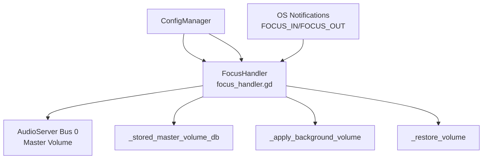

**Sources:** [extensions/scripts/utilities/focus_handler.gd L1-L93](https://github.com/tajemniktv/TajsMod/blob/5f1e656a/extensions/scripts/utilities/focus_handler.gd#L1-L93)

### Key Components

| Component | Type | Purpose |
| --- | --- | --- |
| `_enabled` | `bool` | Toggle for the feature |
| `_background_volume` | `float` | Target volume (0-100%) when unfocused |
| `_stored_master_volume_db` | `float` | Original volume in dB to restore |
| `_was_focused` | `bool` | Previous focus state to detect changes |

**Sources:** [extensions/scripts/utilities/focus_handler.gd L12-L15](https://github.com/tajemniktv/TajsMod/blob/5f1e656a/extensions/scripts/utilities/focus_handler.gd#L12-L15)

### Notification Handling

The manager uses Godot's notification system to detect focus changes:

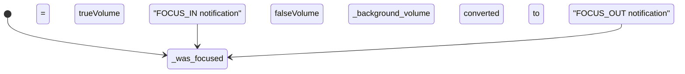

**Sources:** [extensions/scripts/utilities/focus_handler.gd L60-L82](https://github.com/tajemniktv/TajsMod/blob/5f1e656a/extensions/scripts/utilities/focus_handler.gd#L60-L82)

### Configuration Integration

Setup flow from `mod_main.gd`:

1. Instantiated in `_init()` at [mod_main.gd L108](https://github.com/tajemniktv/TajsMod/blob/5f1e656a/mod_main.gd#L108-L108)
2. Setup called with config reference at [mod_main.gd L109](https://github.com/tajemniktv/TajsMod/blob/5f1e656a/mod_main.gd#L109-L109)
3. UI controls added in settings "General" tab at [mod_main.gd L558-L563](https://github.com/tajemniktv/TajsMod/blob/5f1e656a/mod_main.gd#L558-L563)
4. Toggle: `mute_on_focus_loss` (default: `true`)
5. Slider: `background_volume` (0-100%, default: 0%)

**Sources:** [mod_main.gd L107-L110](https://github.com/tajemniktv/TajsMod/blob/5f1e656a/mod_main.gd#L107-L110)

 [mod_main.gd L558-L563](https://github.com/tajemniktv/TajsMod/blob/5f1e656a/mod_main.gd#L558-L563)

---

## WireColorOverrides - Custom Wire Colors

**Purpose:** Allows users to customize wire colors by resource type, overriding game defaults defined in `Data.connectors`.

### Data Flow

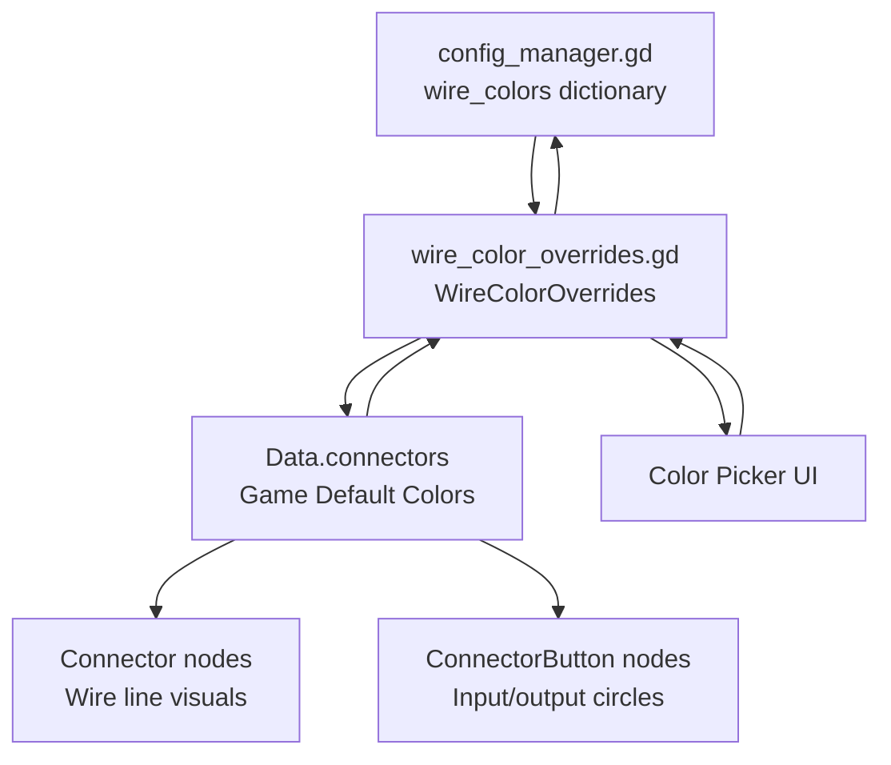

**Sources:** [mod_main.gd L113-L114](https://github.com/tajemniktv/TajsMod/blob/5f1e656a/mod_main.gd#L113-L114)

 [mod_main.gd L144-L147](https://github.com/tajemniktv/TajsMod/blob/5f1e656a/mod_main.gd#L144-L147)

### Wire Categories

The settings UI organizes wires into collapsible categories:

| Category | Resource IDs |
| --- | --- |
| **⚡ Speeds** | `download_speed`, `upload_speed`, `clock_speed`, `gpu_speed`, `code_speed`, `work_speed` |
| **💰 Resources** | `money`, `research`, `token`, `power`, `research_power`, `contribution` |
| **🔓 Hacking** | `hack_power`, `hack_experience`, `virus`, `trojan`, `infected_computer` |
| **📊 Data Types** | `bool`, `char`, `int`, `float`, `bitflag`, `bigint`, `decimal`, `string`, `vector` |
| **🧠 AI / Neural** | `ai`, `neuron_text`, `neuron_image`, `neuron_sound`, `neuron_video`, `neuron_program`, `neuron_game` |
| **🚀 Boosts** | `boost_component`, `boost_research`, `boost_hack`, `boost_code`, `overclock` |
| **📦 Other** | `heat`, `vulnerability`, `storage`, `corporation_data`, `government_data`, `litecoin`, `bitcoin`, `ethereum` |

**Sources:** [mod_main.gd L785-L794](https://github.com/tajemniktv/TajsMod/blob/5f1e656a/mod_main.gd#L785-L794)

### Color Application

Wire colors are applied through two mechanisms:

1. **Data Override:** `wire_colors.apply_overrides()` modifies `Data.connectors[resource_id].color` at [mod_main.gd L147](https://github.com/tajemniktv/TajsMod/blob/5f1e656a/mod_main.gd#L147-L147)
2. **Manual Refresh:** `_refresh_all_connectors()` forces visual update at [mod_main.gd L913-L941](https://github.com/tajemniktv/TajsMod/blob/5f1e656a/mod_main.gd#L913-L941)

The refresh process:

* Iterates through all nodes in `"connector"` group
* Reads `output.get_connector_color()` to get resource type
* Updates `connector.color` from `Data.connectors`
* Calls `connector.draw_update()` to redraw wire line
* Updates `ConnectorButton` visuals via `update_connector_button()`

**Sources:** [mod_main.gd L913-L950](https://github.com/tajemniktv/TajsMod/blob/5f1e656a/mod_main.gd#L913-L950)

---

## GotoGroupManager - Node Group Navigation

**Purpose:** Provides quick navigation to any node group on the board through a button and popup panel.

### Component Structure

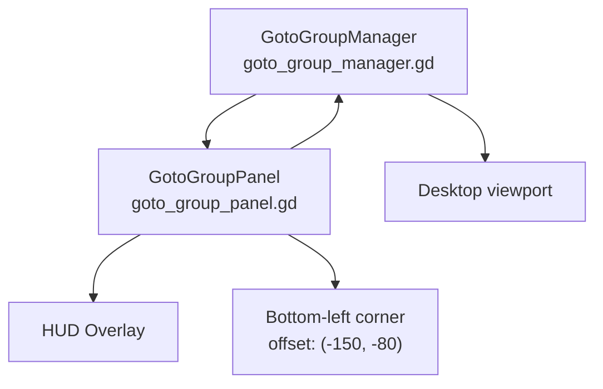

**Sources:** [mod_main.gd L342-L386](https://github.com/tajemniktv/TajsMod/blob/5f1e656a/mod_main.gd#L342-L386)

### Setup Flow

The manager and panel are created in `_setup_goto_group()`:

1. **Manager Creation:** Instantiated at [mod_main.gd L356-L358](https://github.com/tajemniktv/TajsMod/blob/5f1e656a/mod_main.gd#L356-L358)
2. **Panel Creation:** Instantiated and linked to manager at [mod_main.gd L361-L363](https://github.com/tajemniktv/TajsMod/blob/5f1e656a/mod_main.gd#L361-L363)
3. **Container Positioning:** Anchored to bottom-left with offsets at [mod_main.gd L367-L380](https://github.com/tajemniktv/TajsMod/blob/5f1e656a/mod_main.gd#L367-L380)
4. **HUD Injection:** Added to `HUD/Main/MainContainer/Overlay` at [mod_main.gd L385](https://github.com/tajemniktv/TajsMod/blob/5f1e656a/mod_main.gd#L385-L385)

**Sources:** [mod_main.gd L344-L386](https://github.com/tajemniktv/TajsMod/blob/5f1e656a/mod_main.gd#L344-L386)

### Visibility Control

Toggle controlled by `goto_group_enabled` config:

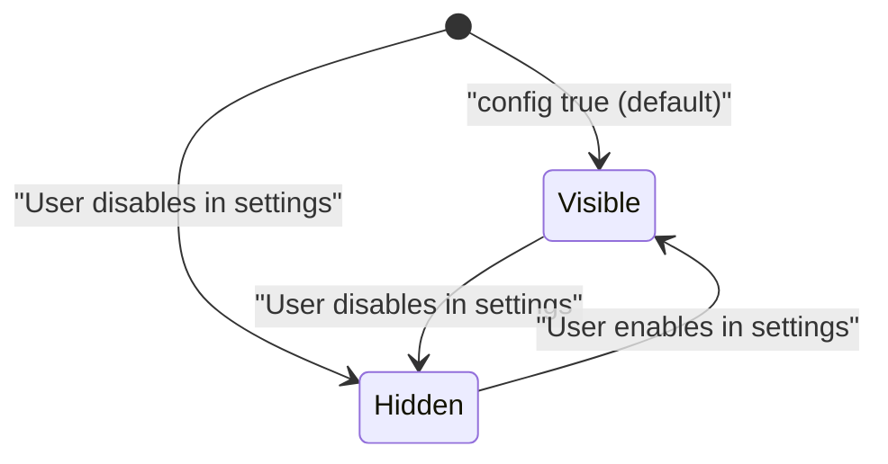

**Sources:** [mod_main.gd L500-L503](https://github.com/tajemniktv/TajsMod/blob/5f1e656a/mod_main.gd#L500-L503)

 [mod_main.gd L331-L332](https://github.com/tajemniktv/TajsMod/blob/5f1e656a/mod_main.gd#L331-L332)

 [mod_main.gd L1081-L1093](https://github.com/tajemniktv/TajsMod/blob/5f1e656a/mod_main.gd#L1081-L1093)

---

## NodeGroupZOrderFix - Z-Order for Nested Groups

**Purpose:** Ensures that fully contained node groups always render on top of their container groups, fixing visual layering issues.

### Problem and Solution

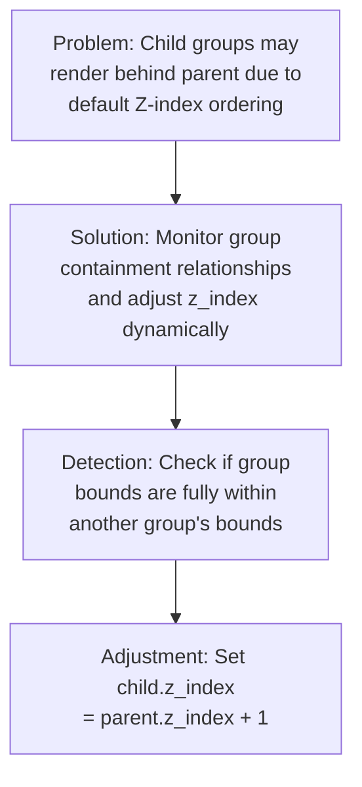

**Sources:** [mod_main.gd L389-L401](https://github.com/tajemniktv/TajsMod/blob/5f1e656a/mod_main.gd#L389-L401)

### Initialization

Simple initialization pattern at [mod_main.gd L397-L399](https://github.com/tajemniktv/TajsMod/blob/5f1e656a/mod_main.gd#L397-L399)

:

1. Create `NodeGroupZOrderFix` instance
2. Name it `"NodeGroupZOrderFix"`
3. Add as child of `mod_main.gd`
4. Enable/disable via config at [mod_main.gd L336-L337](https://github.com/tajemniktv/TajsMod/blob/5f1e656a/mod_main.gd#L336-L337)

The manager automatically monitors the scene tree for node groups and applies z-order fixes as needed.

**Sources:** [mod_main.gd L389-L401](https://github.com/tajemniktv/TajsMod/blob/5f1e656a/mod_main.gd#L389-L401)

 [mod_main.gd L520-L524](https://github.com/tajemniktv/TajsMod/blob/5f1e656a/mod_main.gd#L520-L524)

---

## DisconnectedNodeHighlighter - Disconnected Node Detection

**Purpose:** Visually highlights nodes that are not connected to the main graph for their connection type, helping users identify unused or orphaned nodes.

### Architecture

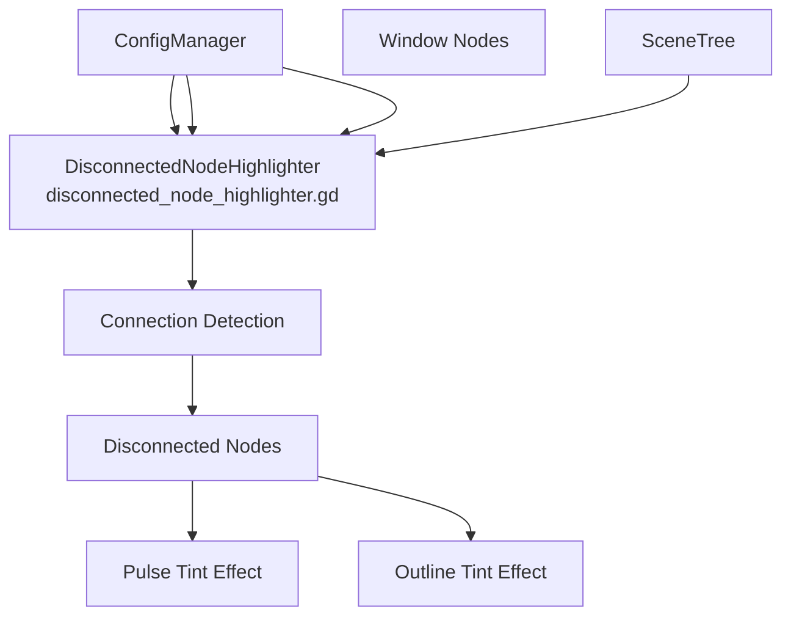

**Sources:** [mod_main.gd L425-L438](https://github.com/tajemniktv/TajsMod/blob/5f1e656a/mod_main.gd#L425-L438)

 [mod_main.gd L691-L753](https://github.com/tajemniktv/TajsMod/blob/5f1e656a/mod_main.gd#L691-L753)

### Highlight Styles

Two visual styles are available:

| Style | Config Value | Effect |
| --- | --- | --- |
| **Pulse Tint** | `"pulse"` | Pulsing color tint on the node |
| **Outline Tint** | `"outline"` | Colored outline around the node |

**Sources:** [mod_main.gd L733-L745](https://github.com/tajemniktv/TajsMod/blob/5f1e656a/mod_main.gd#L733-L745)

### Configuration Options

Settings UI section at [mod_main.gd L691-L753](https://github.com/tajemniktv/TajsMod/blob/5f1e656a/mod_main.gd#L691-L753)

:

1. **Main Toggle:** `highlight_disconnected_enabled` (default: `true`)
2. **Style Dropdown:** `highlight_disconnected_style` (`"pulse"` or `"outline"`)
3. **Intensity Slider:** `highlight_disconnected_intensity` (0-100%, default: 50%)

The sub-settings are only visible when the main toggle is enabled, using a collapsible `MarginContainer` pattern.

**Sources:** [mod_main.gd L691-L753](https://github.com/tajemniktv/TajsMod/blob/5f1e656a/mod_main.gd#L691-L753)

### Initialization Timing

Critical timing requirement: The highlighter must be initialized **before** the settings UI is built, because the settings menu captures a reference to the highlighter:

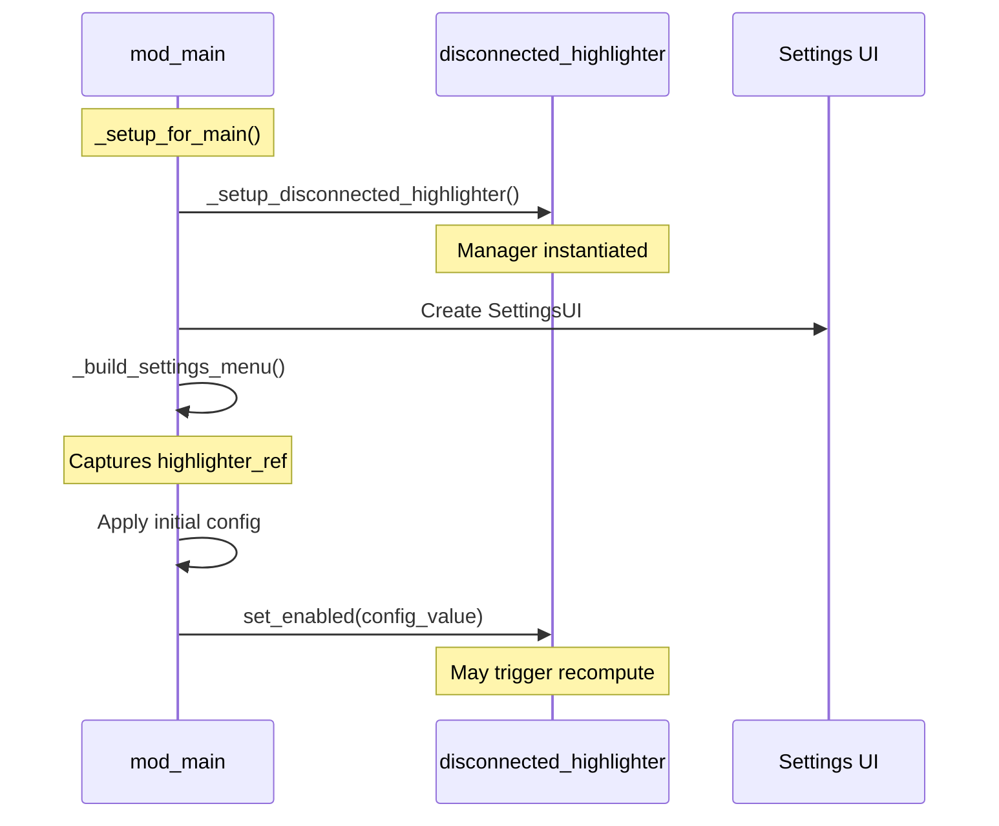

**Sources:** [mod_main.gd L295-L298](https://github.com/tajemniktv/TajsMod/blob/5f1e656a/mod_main.gd#L295-L298)

 [mod_main.gd L425-L438](https://github.com/tajemniktv/TajsMod/blob/5f1e656a/mod_main.gd#L425-L438)

 [mod_main.gd L707-L717](https://github.com/tajemniktv/TajsMod/blob/5f1e656a/mod_main.gd#L707-L717)

---

## StickyNoteManager - Text Notes on Canvas

**Purpose:** Allows players to place editable text notes on the canvas for documentation and organization.

### Component Lifecycle

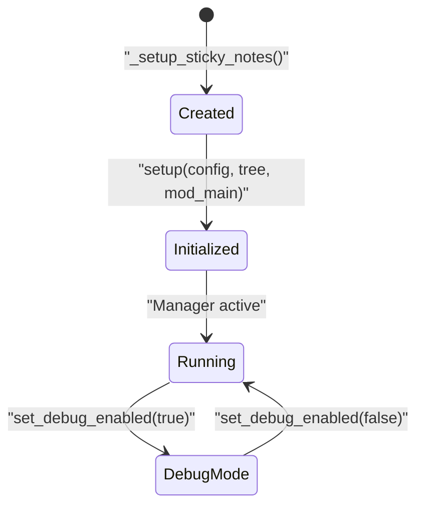

**Sources:** [mod_main.gd L442-L459](https://github.com/tajemniktv/TajsMod/blob/5f1e656a/mod_main.gd#L442-L459)

### Initialization

Setup at [mod_main.gd L443-L459](https://github.com/tajemniktv/TajsMod/blob/5f1e656a/mod_main.gd#L443-L459)

:

1. Check for existing manager instance
2. Create new `StickyNoteManager` instance
3. Name it `"StickyNoteManager"`
4. Add as child
5. Call `setup(config, get_tree(), self)`
6. Apply initial debug mode from `_debug_mode` flag

**Sources:** [mod_main.gd L442-L459](https://github.com/tajemniktv/TajsMod/blob/5f1e656a/mod_main.gd#L442-L459)

 [mod_main.gd L318](https://github.com/tajemniktv/TajsMod/blob/5f1e656a/mod_main.gd#L318-L318)

### Debug Mode Integration

The manager supports debug logging controlled by the global debug mode toggle:

* Initial state set during setup at [mod_main.gd L457](https://github.com/tajemniktv/TajsMod/blob/5f1e656a/mod_main.gd#L457-L457)
* Updated when debug toggle changes at [mod_main.gd L664](https://github.com/tajemniktv/TajsMod/blob/5f1e656a/mod_main.gd#L664-L664)
* Debug mode flag stored in `mod_main._debug_mode` at [mod_main.gd L656](https://github.com/tajemniktv/TajsMod/blob/5f1e656a/mod_main.gd#L656-L656)

**Sources:** [mod_main.gd L456-L457](https://github.com/tajemniktv/TajsMod/blob/5f1e656a/mod_main.gd#L456-L457)

 [mod_main.gd L661-L666](https://github.com/tajemniktv/TajsMod/blob/5f1e656a/mod_main.gd#L661-L666)

---

## UpgradeManager - Modifier Key Upgrades

**Purpose:** Enables bulk upgrade purchases using modifier keys (Ctrl for 10x, Shift for max affordable).

### Setup Pattern

Minimal initialization in `_setup_upgrade_manager()`:

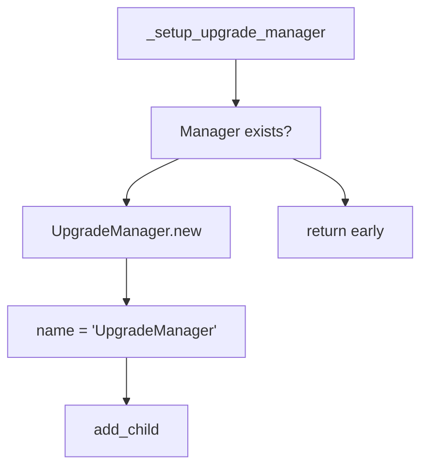

**Sources:** [mod_main.gd L321](https://github.com/tajemniktv/TajsMod/blob/5f1e656a/mod_main.gd#L321-L321)

 [mod_main.gd L1124-L1135](https://github.com/tajemniktv/TajsMod/blob/5f1e656a/mod_main.gd#L1124-L1135)

The manager then hooks into the game's upgrade system to intercept upgrade button clicks and multiply purchase amounts based on held modifier keys. For user-facing details on usage, see [Gameplay Features](/tajemniktv/TajsMod/5.4-gameplay-features-(opt-in)).

**Sources:** Inferred from [mod_main.gd L29](https://github.com/tajemniktv/TajsMod/blob/5f1e656a/mod_main.gd#L29-L29)

 and [mod_main.gd L321](https://github.com/tajemniktv/TajsMod/blob/5f1e656a/mod_main.gd#L321-L321)

---

## WireClearHandler - Right-Click Wire Clearing

**Purpose:** Adds right-click functionality to output connectors to quickly clear all wires from that output.

### Early Initialization

Initialized in `_init()` before scene tree:

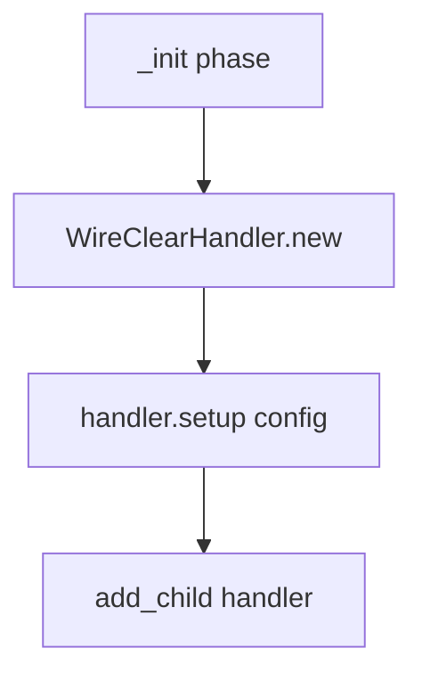

**Sources:** [mod_main.gd L102-L105](https://github.com/tajemniktv/TajsMod/blob/5f1e656a/mod_main.gd#L102-L105)

### Configuration Control

Toggle controlled by `right_click_clear_enabled` setting:

1. **Settings UI:** Toggle added at [mod_main.gd L487-L491](https://github.com/tajemniktv/TajsMod/blob/5f1e656a/mod_main.gd#L487-L491)
2. **State Management:** Calls `wire_clear_handler.set_enabled(v)` on change
3. **Default:** Enabled by default

**Sources:** [mod_main.gd L102-L105](https://github.com/tajemniktv/TajsMod/blob/5f1e656a/mod_main.gd#L102-L105)

 [mod_main.gd L487-L491](https://github.com/tajemniktv/TajsMod/blob/5f1e656a/mod_main.gd#L487-L491)

---

## CheatManager - Cheat Panel

**Purpose:** Provides a UI panel for toggling cheat/debug features in the settings menu.

### Integration Pattern

Unlike other managers, `CheatManager` is instantiated directly during settings menu construction:

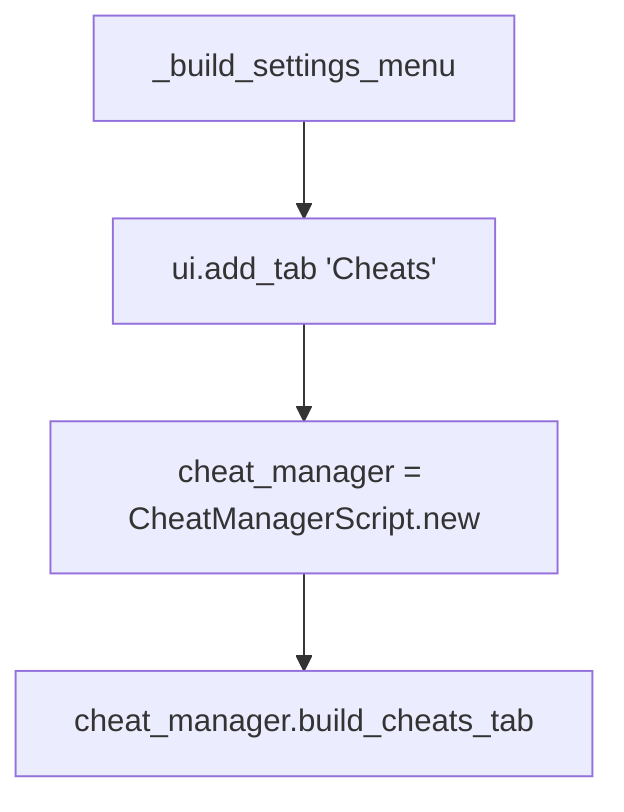

**Sources:** [mod_main.gd L625-L628](https://github.com/tajemniktv/TajsMod/blob/5f1e656a/mod_main.gd#L625-L628)

The manager's `build_cheats_tab()` method populates the "Cheats" settings tab with various cheat toggles and controls. This is a UI builder pattern rather than a persistent manager.

**Sources:** [mod_main.gd L625-L628](https://github.com/tajemniktv/TajsMod/blob/5f1e656a/mod_main.gd#L625-L628)

---

## NotificationLogPanel - Toast History

**Purpose:** Displays a history of recent notification toasts for reference.

### UI Injection

Setup in `_setup_notification_log()`:

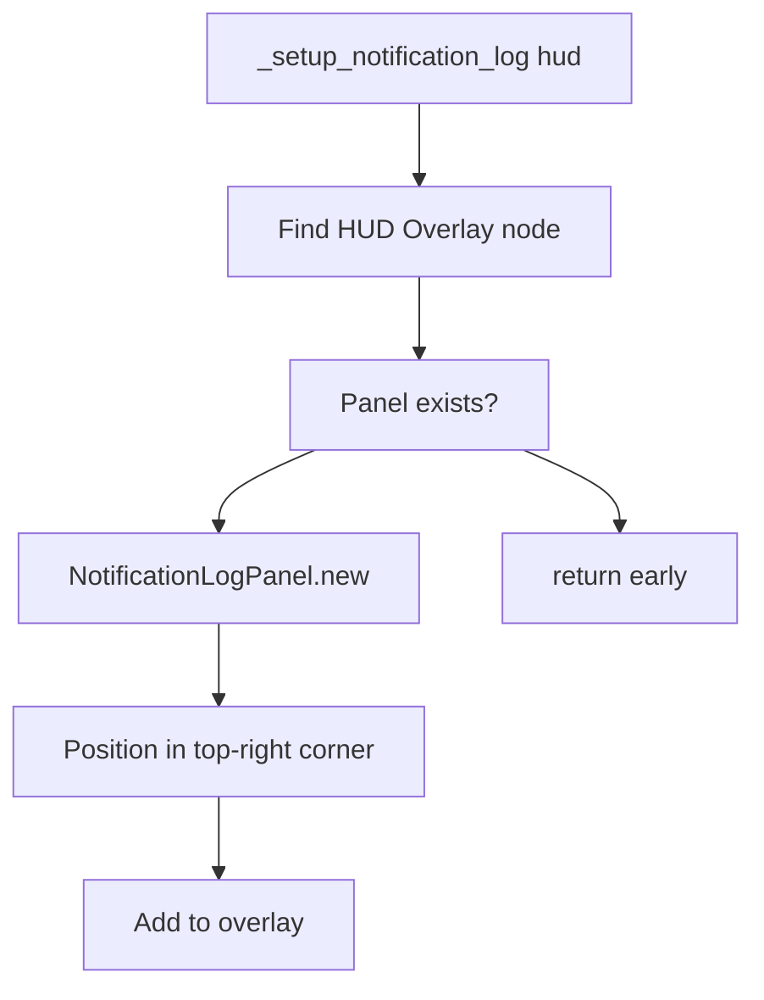

**Sources:** [mod_main.gd L315](https://github.com/tajemniktv/TajsMod/blob/5f1e656a/mod_main.gd#L315-L315)

 [mod_main.gd L1137-L1182](https://github.com/tajemniktv/TajsMod/blob/5f1e656a/mod_main.gd#L1137-L1182)

### Visibility Control

Toggled by `notification_log_enabled` setting:

1. **Settings Toggle:** Added at [mod_main.gd L532-L535](https://github.com/tajemniktv/TajsMod/blob/5f1e656a/mod_main.gd#L532-L535)
2. **Default:** Enabled (`true`)
3. **Visibility Method:** `_set_notification_log_visible()` at [mod_main.gd L1095-L1107](https://github.com/tajemniktv/TajsMod/blob/5f1e656a/mod_main.gd#L1095-L1107)

The panel listens to the game's notification system and stores recent toasts for user review.

**Sources:** [mod_main.gd L532-L535](https://github.com/tajemniktv/TajsMod/blob/5f1e656a/mod_main.gd#L532-L535)

 [mod_main.gd L334-L335](https://github.com/tajemniktv/TajsMod/blob/5f1e656a/mod_main.gd#L334-L335)

 [mod_main.gd L1095-L1107](https://github.com/tajemniktv/TajsMod/blob/5f1e656a/mod_main.gd#L1095-L1107)

---

## Manager Coordination

All managers are coordinated through `mod_main.gd` as the central orchestrator:

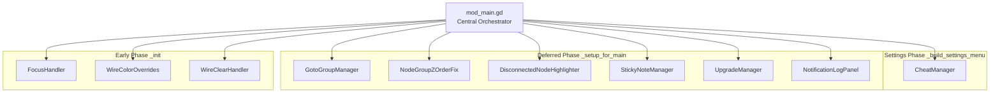

**Sources:** [mod_main.gd L72-L114](https://github.com/tajemniktv/TajsMod/blob/5f1e656a/mod_main.gd#L72-L114)

 [mod_main.gd L278-L340](https://github.com/tajemniktv/TajsMod/blob/5f1e656a/mod_main.gd#L278-L340)

 [mod_main.gd L462-L688](https://github.com/tajemniktv/TajsMod/blob/5f1e656a/mod_main.gd#L462-L688)

### Configuration Integration

All managers integrate with the configuration system:

1. **Setup Phase:** Receive config reference during initialization
2. **State Loading:** Read initial state from config defaults
3. **State Saving:** Write state changes back to config
4. **UI Binding:** Settings toggles/sliders update both config and manager

This ensures all manager state persists across game sessions through `user://tajs_mod_config.json`.

**Sources:** [mod_main.gd L89](https://github.com/tajemniktv/TajsMod/blob/5f1e656a/mod_main.gd#L89-L89)

 [mod_main.gd L104](https://github.com/tajemniktv/TajsMod/blob/5f1e656a/mod_main.gd#L104-L104)

 [mod_main.gd L109](https://github.com/tajemniktv/TajsMod/blob/5f1e656a/mod_main.gd#L109-L109)

 [mod_main.gd L454](https://github.com/tajemniktv/TajsMod/blob/5f1e656a/mod_main.gd#L454-L454)