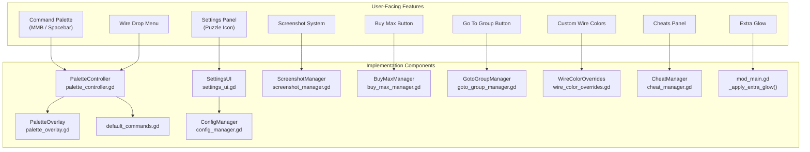
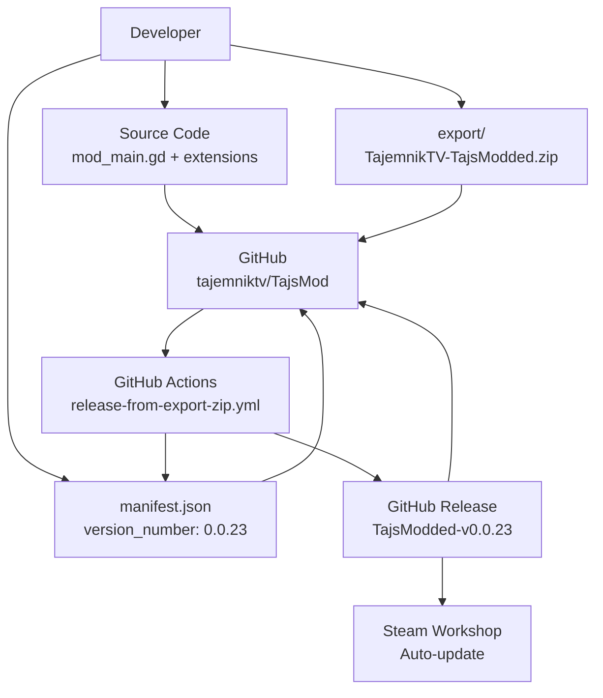

> **Relevant source files**
> * [CHANGELOG.md](https://github.com/tajemniktv/TajsMod/blob/5f1e656a/CHANGELOG.md)
> * [README.md](https://github.com/tajemniktv/TajsMod/blob/5f1e656a/README.md)
> * [manifest.json](https://github.com/tajemniktv/TajsMod/blob/5f1e656a/manifest.json)
> * [mod_main.gd](https://github.com/tajemniktv/TajsMod/blob/5f1e656a/mod_main.gd)
> * [preview/Containers6Input.png](https://github.com/tajemniktv/TajsMod/blob/5f1e656a/preview/Containers6Input.png)

## Purpose and Scope

This document provides a high-level introduction to TajsMod (formerly "TajsView"), a mod for [Upload Labs](https://store.steampowered.com/) that adds quality-of-life improvements, visual enhancements, and optional gameplay modifications without fundamentally altering the core gameplay loop. This overview covers:

* The mod's design philosophy and architectural patterns
* Core component hierarchy and initialization flow
* Feature categories and their implementation components
* Integration approach with the base game
* Development and distribution pipeline

For installation instructions and configuration basics, see [Installation and Configuration](/tajemniktv/TajsMod/2-installation-and-configuration). For detailed architecture patterns, see [Core Architecture](/tajemniktv/TajsMod/3-core-architecture). For a complete feature catalog, see [Feature Reference](/tajemniktv/TajsMod/5-feature-reference).

**Sources:** [README.md L1-L126](https://github.com/tajemniktv/TajsMod/blob/5f1e656a/README.md#L1-L126)

 [manifest.json L1-L37](https://github.com/tajemniktv/TajsMod/blob/5f1e656a/manifest.json#L1-L37)

---

## What is TajsMod?

TajsMod is a **non-invasive enhancement mod** for Upload Labs v2.0.17+ that provides:

* **Quality-of-Life Utilities:** Command palette, wire drop menus, right-click wire clearing, keyboard shortcuts
* **Visual Customization:** Extra glow effects, 17 group colors, 11 pattern types, UI opacity control, custom wire colors
* **UI Improvements:** 6-input containers, "THE BIN" trash node, Go To Group navigation, notification log
* **Optional Gameplay Features:** Node limit control (50-2000+/∞), Buy Max automation, upgrade multipliers, cheats panel

The mod is distributed via Steam Workshop (primary) and GitHub Releases (manual), with automated CI/CD triggered by changes to the export package.

| Property | Value |
| --- | --- |
| **Current Version** | 0.0.23 |
| **Requires Game Version** | 2.0.17+ |
| **Requires Mod Loader** | 7.0.0+ |
| **Distribution** | Steam Workshop, GitHub |
| **License** | All Rights Reserved |

**Sources:** [manifest.json L9-L34](https://github.com/tajemniktv/TajsMod/blob/5f1e656a/manifest.json#L9-L34)

 [README.md L3-L80](https://github.com/tajemniktv/TajsMod/blob/5f1e656a/README.md#L3-L80)

 [mod_main.gd L2-L10](https://github.com/tajemniktv/TajsMod/blob/5f1e656a/mod_main.gd#L2-L10)

---

## Design Philosophy

### Core Principles

The mod follows four key design principles, reflected throughout the codebase:

1. **Modularity:** Features can be independently toggled via configuration * Implemented through `ConfigManager` with 40+ configuration keys [mod_main.gd L88-L89](https://github.com/tajemniktv/TajsMod/blob/5f1e656a/mod_main.gd#L88-L89) * Each feature manager operates independently [mod_main.gd L33-L48](https://github.com/tajemniktv/TajsMod/blob/5f1e656a/mod_main.gd#L33-L48)
2. **Non-Invasive Integration:** Uses script extensions rather than binary patches * 10 script extensions installed in `_init()` [mod_main.gd L73-L82](https://github.com/tajemniktv/TajsMod/blob/5f1e656a/mod_main.gd#L73-L82) * Extensions augment existing classes without replacing them
3. **Opt-In Gameplay Changes:** Controversial features require explicit enablement * Gameplay-modifying features clearly separated in "Cheats" tab [mod_main.gd L626-L628](https://github.com/tajemniktv/TajsMod/blob/5f1e656a/mod_main.gd#L626-L628) * Default configuration favors QoL over gameplay changes
4. **Persistent User Preferences:** Settings survive restarts * Write-through caching: every `set_value()` writes to disk * Configuration stored in `user://tajs_mod_config.json`

**Sources:** [mod_main.gd L462-L689](https://github.com/tajemniktv/TajsMod/blob/5f1e656a/mod_main.gd#L462-L689)

 [README.md L9-L51](https://github.com/tajemniktv/TajsMod/blob/5f1e656a/README.md#L9-L51)

---

## Architectural Patterns

### Hub-and-Spoke Orchestration

```mermaid
flowchart TD

ModLoader["ModLoader<br>(Godot Mod Loader)"]
ModMain["mod_main.gd<br>Central Orchestrator<br>Node"]
Config["ConfigManager<br>config_manager.gd"]
UI["SettingsUI<br>settings_ui.gd"]
Screenshot["ScreenshotManager<br>screenshot_manager.gd"]
BuyMax["BuyMaxManager<br>buy_max_manager.gd"]
Focus["FocusHandler<br>focus_handler.gd"]
WireColor["WireColorOverrides<br>wire_color_overrides.gd"]
GotoGroup["GotoGroupManager<br>goto_group_manager.gd"]
ZOrderFix["NodeGroupZOrderFix<br>node_group_z_order_fix.gd"]
Disconnected["DisconnectedNodeHighlighter<br>disconnected_node_highlighter.gd"]
StickyNotes["StickyNoteManager<br>sticky_note_manager.gd"]
UpgradeMgr["UpgradeManager<br>upgrade_manager.gd"]
CheatMgr["CheatManager<br>cheat_manager.gd"]
Palette["PaletteController<br>palette_controller.gd"]
DefaultCmds["default_commands.gd<br>60+ Command Definitions"]
PaletteUI["PaletteOverlay<br>palette_overlay.gd"]
ScriptExt["10 Script Extensions<br>globals.gd, windows_menu.gd, etc."]
Patcher["Patcher Utility<br>patcher.gd"]

ModLoader --> ModMain
ModMain --> Config
ModMain --> ScriptExt
ModMain --> UI
ModMain --> Screenshot
ModMain --> BuyMax
ModMain --> Focus
ModMain --> WireColor
ModMain --> GotoGroup
ModMain --> ZOrderFix
ModMain --> Disconnected
ModMain --> StickyNotes
ModMain --> UpgradeMgr
ModMain --> CheatMgr
ModMain --> Palette
Config --> Screenshot
Config --> BuyMax
Config --> Focus
UI --> Screenshot
UI --> BuyMax
UI --> Focus

subgraph subGraph2 ["Integration Layer"]
    ScriptExt
    Patcher
    Patcher --> ScriptExt
end

subgraph subGraph1 ["Command System"]
    Palette
    DefaultCmds
    PaletteUI
    Palette --> DefaultCmds
    Palette --> PaletteUI
end

subgraph subGraph0 ["Feature Managers"]
    Screenshot
    BuyMax
    Focus
    WireColor
    GotoGroup
    ZOrderFix
    Disconnected
    StickyNotes
    UpgradeMgr
    CheatMgr
end
```



**Architecture Characteristics:**

* **Central Orchestrator:** `mod_main.gd` acts as the hub, managing lifecycle for all components [mod_main.gd L6](https://github.com/tajemniktv/TajsMod/blob/5f1e656a/mod_main.gd#L6-L6)
* **Manager Autonomy:** Each manager handles a specific domain and can operate independently
* **Deferred Initialization:** Core setup in `_init()`, UI-dependent setup in `_setup_for_main()` [mod_main.gd L72-L340](https://github.com/tajemniktv/TajsMod/blob/5f1e656a/mod_main.gd#L72-L340)
* **Signal-Based Communication:** Managers use `Globals.signals` and `Signals.notify` for decoupled events

**Sources:** [mod_main.gd L6-L164](https://github.com/tajemniktv/TajsMod/blob/5f1e656a/mod_main.gd#L6-L164)

 high-level architecture diagrams

---

## Component Hierarchy

### Code Entity Map

The following diagram maps user-facing features to their implementation components:



**Key Components:**

| Component | Purpose | Initialized In |
| --- | --- | --- |
| `mod_main.gd` | Central orchestrator, lifecycle manager | N/A (entry point) |
| `ConfigManager` | Settings persistence (JSON) | `_init()` |
| `SettingsUI` | Settings panel with tabs | `_setup_for_main()` |
| `PaletteController` | Command palette orchestration | `_init()` |
| `ScreenshotManager` | Tiled screenshot capture | `_init()` |
| `BuyMaxManager` | Upgrade automation with 4 strategies | `_setup_buy_max()` |
| `FocusHandler` | Audio muting on focus loss | `_init()` |
| `WireColorOverrides` | Custom wire coloring | `_init()` |
| `GotoGroupManager` | Node group navigation | `_setup_goto_group()` |
| `DisconnectedNodeHighlighter` | Disconnected node visualization | `_setup_disconnected_highlighter()` |
| `StickyNoteManager` | Canvas notes system | `_setup_sticky_notes()` |

**Sources:** [mod_main.gd L12-L460](https://github.com/tajemniktv/TajsMod/blob/5f1e656a/mod_main.gd#L12-L460)

---

## Initialization Flow

### Two-Phase Initialization Pattern

```mermaid
sequenceDiagram
  participant ModLoader
  participant mod_main._init()
  participant mod_main._ready()
  participant mod_main._setup_for_main()
  participant Upload Labs Game

  ModLoader->>mod_main._init(): Load mod
  note over mod_main._init(): Phase 1: Core Setup
  mod_main._init()->>mod_main._init(): install_script_extension() x10
  mod_main._init()->>mod_main._init(): ConfigManager.new()
  mod_main._init()->>mod_main._init(): ScreenshotManager.new()
  mod_main._init()->>mod_main._init(): PaletteController.new()
  mod_main._init()->>mod_main._init(): WireClearHandler.new()
  mod_main._init()->>mod_main._init(): FocusHandler.new()
  mod_main._init()->>mod_main._init(): WireColorOverrides.new()
  Upload Labs Game->>mod_main._ready(): Scene tree ready
  note over mod_main._ready(): Phase 2: Scene Integration
  mod_main._ready()->>mod_main._ready(): Create shared ColorPickerPanel
  mod_main._ready()->>mod_main._ready(): Apply wire color overrides
  mod_main._ready()->>mod_main._ready(): Apply saved node limit
  mod_main._ready()->>mod_main._ready(): Patcher.inject_bin_window()
  mod_main._ready()->>mod_main._ready(): Listen for Main node
  Upload Labs Game->>mod_main._setup_for_main(): Main node added
  note over mod_main._setup_for_main(): Phase 3: UI & Features
  mod_main._setup_for_main()->>mod_main._setup_for_main(): SettingsUI.new()
  mod_main._setup_for_main()->>mod_main._setup_for_main(): Initialize BuyMaxManager
  mod_main._setup_for_main()->>mod_main._setup_for_main(): Initialize GotoGroupManager
  mod_main._setup_for_main()->>mod_main._setup_for_main(): Initialize DisconnectedHighlighter
  mod_main._setup_for_main()->>mod_main._setup_for_main(): Initialize StickyNoteManager
  mod_main._setup_for_main()->>mod_main._setup_for_main(): _build_settings_menu()
  mod_main._setup_for_main()->>mod_main._setup_for_main(): palette_controller.initialize()
  mod_main._setup_for_main()->>mod_main._setup_for_main(): Apply initial visuals
```

**Initialization Phases:**

1. **`_init()` [72-112](https://github.com/tajemniktv/TajsMod/blob/5f1e656a/72-112) :** Install extensions, create early managers (config, screenshot, palette, wire handlers)
2. **`_ready()` [115-163](https://github.com/tajemniktv/TajsMod/blob/5f1e656a/115-163) :** Scene tree integration, apply saved settings, inject patches
3. **`_setup_for_main()` [278-340](https://github.com/tajemniktv/TajsMod/blob/5f1e656a/278-340) :** Wait for HUD, create UI, initialize feature managers, register commands

**Why Two-Phase?**

* Script extensions must be installed before any game code runs
* Some managers (Screenshot, FocusHandler) need early initialization
* UI-dependent features require HUD to be available
* Deferred setup ensures stable initialization order

**Sources:** [mod_main.gd L72-L340](https://github.com/tajemniktv/TajsMod/blob/5f1e656a/mod_main.gd#L72-L340)

 high-level sequence diagram

---

## Feature Categories

### Implementation Matrix

| Feature Category | User Interface | Implementation | Configuration Keys |
| --- | --- | --- | --- |
| **Command System** | Palette overlay (MMB) | `PaletteController`, `default_commands.gd` | `command_palette_enabled`, `wire_drop_menu_enabled` |
| **Visual Customization** | Visuals tab | `mod_main._apply_extra_glow()`, `WireColorOverrides` | `extra_glow`, `glow_intensity`, `custom_wire_colors_*` |
| **QoL Utilities** | General tab | `FocusHandler`, `ScreenshotManager` | `mute_on_focus_loss`, `screenshot_quality` |
| **UI Enhancements** | General tab | `GotoGroupManager`, `BuyMaxManager`, `DisconnectedHighlighter` | `goto_group_enabled`, `buy_max_enabled`, `highlight_disconnected_enabled` |
| **Gameplay Modifiers** | Cheats tab | `CheatManager`, `Globals.custom_node_limit` | `node_limit`, `upgrade_multiplier` |
| **Development Tools** | Debug tab | `_debug_mode`, `_debug_log_label` | `debug_mode`, `custom_boot_screen` |

**Sources:** [mod_main.gd L462-L689](https://github.com/tajemniktv/TajsMod/blob/5f1e656a/mod_main.gd#L462-L689)

 [README.md L21-L58](https://github.com/tajemniktv/TajsMod/blob/5f1e656a/README.md#L21-L58)

---

## Integration Approach

### Script Extensions vs. Binary Patches

TajsMod uses **script extensions** exclusively to integrate with Upload Labs:

```mermaid
flowchart TD

BaseGame["Upload Labs<br>Base Game Classes"]
Globals["globals.gd"]
WindowsMenu["windows_menu.gd"]
SchematicContainer["schematic_container.gd"]
PopupSchematic["popup_schematic.gd"]
OptionsBar["options_bar.gd"]
WindowGroup["window_group.gd"]
WindowBin["window_bin.gd"]
WindowInventory["window_inventory.gd"]
RequestPanel["request_panel.gd"]
RequestsTab["requests_tab.gd"]
ModMain["mod_main.gd"]

BaseGame --> Globals
BaseGame --> WindowsMenu
BaseGame --> SchematicContainer
BaseGame --> PopupSchematic
BaseGame --> OptionsBar
BaseGame --> WindowGroup
BaseGame --> WindowBin
BaseGame --> WindowInventory
BaseGame --> RequestPanel
BaseGame --> RequestsTab
ModMain --> Globals
ModMain --> WindowsMenu
ModMain --> SchematicContainer
ModMain --> PopupSchematic
ModMain --> OptionsBar
ModMain --> WindowGroup
ModMain --> WindowBin
ModMain --> WindowInventory
ModMain --> RequestPanel
ModMain --> RequestsTab

subgraph subGraph0 ["Extended Classes (10)"]
    Globals
    WindowsMenu
    SchematicContainer
    PopupSchematic
    OptionsBar
    WindowGroup
    WindowBin
    WindowInventory
    RequestPanel
    RequestsTab
end
```



**Extension Examples:**

* **`globals.gd`:** Adds `custom_node_limit`, `select_all_enabled`, `custom_upgrade_multiplier` properties
* **`window_group.gd`:** Adds 11 pattern types and pattern picker UI for node groups
* **`window_bin.gd`:** Implements "THE BIN" trash node functionality
* **`window_inventory.gd`:** Increases container inputs from 4 to 6 (when enabled)
* **`schematic_container.gd`:** Adds Ctrl+A select-all functionality, wire drop spawning

**Why Script Extensions?**

* Compatible with game updates (no binary patching)
* Modular: extensions can be toggled independently
* Safe: extends classes without replacing core logic
* Future-proof: game updates rarely break extensions

**Sources:** [mod_main.gd L73-L82](https://github.com/tajemniktv/TajsMod/blob/5f1e656a/mod_main.gd#L73-L82)

 high-level architecture diagram

---

## Scale and Complexity

### System Metrics

| Metric | Count | Implementation |
| --- | --- | --- |
| **Total Commands** | 60+ | `default_commands.gd` |
| **Script Extensions** | 10 | `mod_main._init()` [73-82](https://github.com/tajemniktv/TajsMod/blob/5f1e656a/73-82) |
| **Feature Managers** | 10+ | `mod_main.gd` [33-48](https://github.com/tajemniktv/TajsMod/blob/5f1e656a/33-48) |
| **Configuration Keys** | 40+ | `ConfigManager.DEFAULT_CONFIG` |
| **Settings Tabs** | 4 | General, Visuals, Cheats, Debug |
| **Group Colors** | 17 | Extended palette in `window_group.gd` |
| **Pattern Types** | 11 | Grid, Stripes, Diagonal, etc. |
| **Wire Resource Types** | 35+ | Configurable in `WireColorOverrides` |

**Code Size Distribution:**

* **Core Orchestration:** `mod_main.gd` (~1850 lines, highest importance: 49.96)
* **Command System:** `default_commands.gd` (~430 lines), `palette_overlay.gd` (~350 lines)
* **Configuration:** `config_manager.gd` (~150 lines), `manifest.json` (37 lines)
* **Feature Managers:** Average ~200-300 lines each
* **Total Codebase:** 5000+ lines across 30+ files

**Sources:** [mod_main.gd L1-L1850](https://github.com/tajemniktv/TajsMod/blob/5f1e656a/mod_main.gd#L1-L1850)

 high-level importance metrics, file counts

---

## Development Pipeline

### Automated Release Workflow



**Release Process:**

1. Developer exports mod to `export/TajemnikTV-TajsModded.zip`
2. Updates `version_number` in `manifest.json` [manifest.json L34](https://github.com/tajemniktv/TajsMod/blob/5f1e656a/manifest.json#L34-L34)
3. Pushes changes to GitHub repository
4. CI workflow `release-from-export-zip.yml` detects changes
5. Workflow reads version from `manifest.json`
6. Creates GitHub release with `.zip` attachment
7. Steam Workshop auto-syncs from GitHub (manual step)

**Sources:** [manifest.json L1-L37](https://github.com/tajemniktv/TajsMod/blob/5f1e656a/manifest.json#L1-L37)

 high-level distribution diagram, [CHANGELOG.md L1-L154](https://github.com/tajemniktv/TajsMod/blob/5f1e656a/CHANGELOG.md#L1-L154)

---

## Navigation Guide

* **[Installation and Configuration](/tajemniktv/TajsMod/2-installation-and-configuration):** Get started with installing and configuring the mod
* **[Core Architecture](/tajemniktv/TajsMod/3-core-architecture):** Deep dive into architectural patterns and component lifecycle
* **[Command Palette System](/tajemniktv/TajsMod/4-command-palette-system):** Learn about the 60+ command system and fuzzy search
* **[Feature Reference](/tajemniktv/TajsMod/5-feature-reference):** Complete catalog of all features with implementation details
* **[Utility Manager Components](/tajemniktv/TajsMod/6-utility-manager-components):** Technical reference for individual managers
* **[Development Guide](/tajemniktv/TajsMod/8-development-guide):** Contributing, building, and release workflow

**Sources:** Table of contents JSON provided