> **Relevant source files**
> * [extensions/scripts/palette/default_commands.gd](https://github.com/tajemniktv/TajsMod/blob/5f1e656a/extensions/scripts/palette/default_commands.gd)
> * [extensions/scripts/palette/palette_overlay.gd](https://github.com/tajemniktv/TajsMod/blob/5f1e656a/extensions/scripts/palette/palette_overlay.gd)

## Purpose and Scope

This page documents the `TajsModPaletteOverlay` class, which implements the visual interface for the command palette system. It covers UI construction, display modes, search integration, and input handling. For the command registration and execution system that powers this UI, see [Command Definitions and Registry](/tajemniktv/TajsMod/4.1-command-definitions-and-registry). For the overall command palette architecture, see [Command Palette System](/tajemniktv/TajsMod/4-command-palette-system).

## Architecture Overview

The `TajsModPaletteOverlay` extends `CanvasLayer` and provides a modal overlay with search capabilities, results display, and keyboard/mouse navigation. It operates in three distinct modes: normal command palette, node picker (for wire-drop feature), and group picker (for jump-to-group navigation).

| Component | Type | Purpose |
| --- | --- | --- |
| `TajsModPaletteOverlay` | CanvasLayer | Root container at z-layer 100 |
| `background` | ColorRect | Semi-transparent backdrop for modal behavior |
| `panel` | PanelContainer | Centered main UI panel (600×500px) |
| `search_input` | LineEdit | Fuzzy search text field |
| `results_container` | VBoxContainer | Scrollable list of command/item results |
| `breadcrumb_label` | Label | Navigation path display in footer |
| `_onboarding_hint` | Control | First-time user guidance panel |

**Sources:** [extensions/scripts/palette/palette_overlay.gd L1-L72](https://github.com/tajemniktv/TajsMod/blob/5f1e656a/extensions/scripts/palette/palette_overlay.gd#L1-L72)

## UI Component Hierarchy

```mermaid
flowchart TD

Overlay["TajsModPaletteOverlay<br>(CanvasLayer layer=100)"]
Background["background<br>(ColorRect)"]
Panel["panel<br>(PanelContainer)"]
VBox["VBoxContainer"]
Header["Header<br>(MarginContainer)"]
SearchHBox["HBoxContainer"]
SearchIcon["🔍 Label"]
SearchInput["search_input<br>(LineEdit)"]
ResultsScroll["results_scroll<br>(ScrollContainer)"]
ResultsContainer["results_container<br>(VBoxContainer)"]
OnboardingHint["_onboarding_hint<br>(PanelContainer)"]
NoResults["no_results_label<br>(Label)"]
ResultRow1["Result Row 1"]
ResultRow2["Result Row 2"]
ResultRowN["Result Row N"]
Footer["Footer<br>(PanelContainer)"]
FooterHBox["HBoxContainer"]
Breadcrumb["breadcrumb_label<br>(Label)"]
HintLabel["Hint Label"]

Overlay --> Background
Overlay --> Panel
Panel --> VBox
VBox --> Header
VBox --> ResultsScroll
VBox --> Footer
Header --> SearchHBox
SearchHBox --> SearchIcon
SearchHBox --> SearchInput
ResultsScroll --> ResultsContainer
ResultsContainer --> OnboardingHint
ResultsContainer --> NoResults
ResultsContainer --> ResultRow1
ResultsContainer --> ResultRow2
ResultsContainer --> ResultRowN
Footer --> FooterHBox
FooterHBox --> Breadcrumb
FooterHBox --> HintLabel
```



**Sources:** [extensions/scripts/palette/palette_overlay.gd L96-L171](https://github.com/tajemniktv/TajsMod/blob/5f1e656a/extensions/scripts/palette/palette_overlay.gd#L96-L171)

 [extensions/scripts/palette/palette_overlay.gd L174-L212](https://github.com/tajemniktv/TajsMod/blob/5f1e656a/extensions/scripts/palette/palette_overlay.gd#L174-L212)

 [extensions/scripts/palette/palette_overlay.gd L215-L247](https://github.com/tajemniktv/TajsMod/blob/5f1e656a/extensions/scripts/palette/palette_overlay.gd#L215-L247)

## Display Modes

The overlay operates in three mutually exclusive modes, controlled by boolean flags:

| Mode | Flag | Trigger | Purpose |
| --- | --- | --- | --- |
| **Normal** | Default state | MMB or `toggle_palette()` | Browse and execute commands from registry |
| **Node Picker** | `_picker_mode = true` | Wire dropped on empty canvas | Display compatible nodes for connection |
| **Group Picker** | `_group_picker_mode = true` | "Jump to Group" command | List all node groups for navigation |

### Mode State Machine


**Sources:** [extensions/scripts/palette/palette_overlay.gd L38-L46](https://github.com/tajemniktv/TajsMod/blob/5f1e656a/extensions/scripts/palette/palette_overlay.gd#L38-L46)

 [extensions/scripts/palette/palette_overlay.gd L335-L398](https://github.com/tajemniktv/TajsMod/blob/5f1e656a/extensions/scripts/palette/palette_overlay.gd#L335-L398)

### Normal Mode Implementation

In normal mode, the overlay displays commands from the registry, organized by categories with breadcrumb navigation.


The home screen displays:

1. **Favorites** (if configured via `palette_config.get_favorites()`)
2. **Recent commands** (up to 5, via `palette_config.get_recents()`)
3. **Root categories** (from `registry.get_root_items()`)

**Sources:** [extensions/scripts/palette/palette_overlay.gd L335-L368](https://github.com/tajemniktv/TajsMod/blob/5f1e656a/extensions/scripts/palette/palette_overlay.gd#L335-L368)

 [extensions/scripts/palette/palette_overlay.gd L627-L673](https://github.com/tajemniktv/TajsMod/blob/5f1e656a/extensions/scripts/palette/palette_overlay.gd#L627-L673)

### Node Picker Mode Implementation

Node picker mode is activated when a wire is dropped on empty canvas space. It filters and displays nodes compatible with the wire's origin pin.


Key state stored during node picker mode:

* `_picker_origin_info`: Dictionary containing wire connection details (is_output, pin type)
* `_picker_spawn_position`: Vector2 for where to create the new node
* `_picker_nodes`: Array of compatible node definitions

**Sources:** [extensions/scripts/palette/palette_overlay.gd L401-L428](https://github.com/tajemniktv/TajsMod/blob/5f1e656a/extensions/scripts/palette/palette_overlay.gd#L401-L428)

 [extensions/scripts/palette/palette_overlay.gd L432-L463](https://github.com/tajemniktv/TajsMod/blob/5f1e656a/extensions/scripts/palette/palette_overlay.gd#L432-L463)

 [extensions/scripts/palette/palette_overlay.gd L1018-L1031](https://github.com/tajemniktv/TajsMod/blob/5f1e656a/extensions/scripts/palette/palette_overlay.gd#L1018-L1031)

### Group Picker Mode Implementation

Group picker mode displays all node groups on the desktop for quick camera navigation.


**Sources:** [extensions/scripts/palette/palette_overlay.gd L500-L533](https://github.com/tajemniktv/TajsMod/blob/5f1e656a/extensions/scripts/palette/palette_overlay.gd#L500-L533)

 [extensions/scripts/palette/palette_overlay.gd L537-L587](https://github.com/tajemniktv/TajsMod/blob/5f1e656a/extensions/scripts/palette/palette_overlay.gd#L537-L587)

 [extensions/scripts/palette/default_commands.gd L162-L193](https://github.com/tajemniktv/TajsMod/blob/5f1e656a/extensions/scripts/palette/default_commands.gd#L162-L193)

## Search and Filtering System

The overlay uses a debounced search system with mode-specific filtering logic.

### Search Pipeline


**Sources:** [extensions/scripts/palette/palette_overlay.gd L323-L328](https://github.com/tajemniktv/TajsMod/blob/5f1e656a/extensions/scripts/palette/palette_overlay.gd#L323-L328)

 [extensions/scripts/palette/palette_overlay.gd L856-L889](https://github.com/tajemniktv/TajsMod/blob/5f1e656a/extensions/scripts/palette/palette_overlay.gd#L856-L889)

### Fuzzy Search Integration

In normal mode, search delegates to `FuzzySearch.search()` for intelligent matching:

| Search Feature | Implementation |
| --- | --- |
| Algorithm | Uses `FuzzySearch` preload from `fuzzy_search.gd` |
| Input | Query string, all executable commands, context, max results |
| Scoring | Keywords, title matching, category relevance |
| Filtering | Respects `can_run()` and tools visibility from context |
| Max Results | 10 items (`MAX_VISIBLE_ITEMS`) |

**Sources:** [extensions/scripts/palette/palette_overlay.gd L11](https://github.com/tajemniktv/TajsMod/blob/5f1e656a/extensions/scripts/palette/palette_overlay.gd#L11-L11)

 [extensions/scripts/palette/palette_overlay.gd L881-L889](https://github.com/tajemniktv/TajsMod/blob/5f1e656a/extensions/scripts/palette/palette_overlay.gd#L881-L889)

### Mode-Specific Filtering

**Node Picker Filtering** (`_filter_picker_nodes`):

* Searches node `name`, `description`, and `category` fields
* Case-insensitive substring matching
* No fuzzy scoring (exact substring required)

**Group Picker Filtering** (`_filter_group_picker`):

* Retrieves group names via `goto_group_manager.get_group_name()`
* Fallback to `get_window_name()` or `custom_name` property
* Case-insensitive substring matching

**Sources:** [extensions/scripts/palette/palette_overlay.gd L477-L493](https://github.com/tajemniktv/TajsMod/blob/5f1e656a/extensions/scripts/palette/palette_overlay.gd#L477-L493)

 [extensions/scripts/palette/palette_overlay.gd L596-L620](https://github.com/tajemniktv/TajsMod/blob/5f1e656a/extensions/scripts/palette/palette_overlay.gd#L596-L620)

## Result Row Construction

Each result item is rendered as a styled `PanelContainer` with dynamic content based on the item's properties.

### Row Component Structure

```mermaid
flowchart TD

Row["PanelContainer<br>(50px height)"]
Margin["MarginContainer<br>(12px margins)"]
HBox["HBoxContainer"]
Indicator["Favorite ★<br>or Recent ⏱"]
Icon["TextureRect<br>(24×24px)"]
Title["Label<br>(18pt font)"]
Path["Category path<br>(12pt gray)"]
Arrow["→ indicator"]
Badge["[SAFE/OPT-IN]<br>(12pt colored)"]

Row --> Margin
Margin --> HBox
HBox --> Indicator
HBox --> Icon
HBox --> Title
HBox --> Path
HBox --> Arrow
HBox --> Badge
```



### Row Creation Logic

The `_create_result_row()` method builds each row with conditional elements:

| Element | Condition | Appearance |
| --- | --- | --- |
| Favorite star | `item._is_favorite == true` | ★ (yellow, 16pt) |
| Recent clock | `item._is_recent == true` | ⏱ (gray, 14pt) |
| Icon | `item.icon_path` exists and loadable | 24×24px texture |
| Title | Always shown | Dynamic via `get_title()` callable or `title` field |
| Category path | Not empty and at home screen | "Cat1 > Cat2" format |
| Arrow indicator | `item.is_category == true` | → symbol |
| Badge | Always shown | [SAFE], [OPT-IN], or [GAMEPLAY] |

**Dynamic Title Support:** Commands can provide a `get_title` callable that returns the current title, enabling dynamic labels like "Wire Drop Menu [ON]" that reflect real-time state.

**Sources:** [extensions/scripts/palette/palette_overlay.gd L725-L819](https://github.com/tajemniktv/TajsMod/blob/5f1e656a/extensions/scripts/palette/palette_overlay.gd#L725-L819)

### Selection and Styling

The `_update_selection()` method applies visual feedback to the selected row:


**Sources:** [extensions/scripts/palette/palette_overlay.gd L822-L842](https://github.com/tajemniktv/TajsMod/blob/5f1e656a/extensions/scripts/palette/palette_overlay.gd#L822-L842)

## Navigation and Input Handling

### Keyboard Shortcuts

The overlay implements comprehensive keyboard navigation in `_on_search_input()`:

| Key | Action | Implementation |
| --- | --- | --- |
| Escape | Close palette | `hide_palette()` |
| Enter | Execute selected item | `_execute_selected()` |
| ↑ | Previous item | `_select_previous()` |
| ↓ | Next item | `_select_next()` |
| → or Tab | Enter category | `_enter_category()` |
| ← or Backspace | Go back | `_go_back()` if search is empty |
| Ctrl+F | Toggle favorite | `_toggle_favorite_selected()` |
| Ctrl+A | Select all text | `search_input.select_all()` |

**Sources:** [extensions/scripts/palette/palette_overlay.gd L896-L940](https://github.com/tajemniktv/TajsMod/blob/5f1e656a/extensions/scripts/palette/palette_overlay.gd#L896-L940)

### Mouse Input

**Background clicks:** Clicking the dimmed background closes the palette via `_on_background_input()`.

**Row interaction:**

* Hover: Sets `_selected_index` via `_on_item_hover()`
* Click: Executes item via `_on_item_click()`

**Mouse button navigation:**

* X1 (back button): `_go_back()`
* X2 (forward button): `_enter_category()`

**Sources:** [extensions/scripts/palette/palette_overlay.gd L943-L964](https://github.com/tajemniktv/TajsMod/blob/5f1e656a/extensions/scripts/palette/palette_overlay.gd#L943-L964)

### Category Navigation with History

The overlay maintains forward/backward history stacks for breadcrumb-style navigation:


**Sources:** [extensions/scripts/palette/palette_overlay.gd L1050-L1088](https://github.com/tajemniktv/TajsMod/blob/5f1e656a/extensions/scripts/palette/palette_overlay.gd#L1050-L1088)

## Execution Flow

### Command Execution


**Sources:** [extensions/scripts/palette/palette_overlay.gd L981-L1048](https://github.com/tajemniktv/TajsMod/blob/5f1e656a/extensions/scripts/palette/palette_overlay.gd#L981-L1048)

## State Management

### Core State Variables

| Variable | Type | Purpose |
| --- | --- | --- |
| `_is_open` | bool | Whether palette is currently visible |
| `_current_path` | Array[String] | Current category breadcrumb path |
| `_displayed_items` | Array[Dictionary] | Items currently shown in results |
| `_selected_index` | int | Index of highlighted result row |
| `_result_items` | Array[Control] | UI node references for result rows |
| `_history_back` | Array | Navigation history for back button |
| `_history_forward` | Array | Navigation history for forward button |

### Mode-Specific State

**Node Picker State:**

* `_picker_mode`: bool flag
* `_picker_origin_info`: Dictionary with `is_output`, pin type
* `_picker_spawn_position`: Vector2 for node creation
* `_picker_nodes`: Array[Dictionary] of compatible node definitions

**Group Picker State:**

* `_group_picker_mode`: bool flag
* `_group_picker_groups`: Array of group node references
* `"goto_group_manager"` metadata: Reference to `GotoGroupManager` instance

**Sources:** [extensions/scripts/palette/palette_overlay.gd L27-L46](https://github.com/tajemniktv/TajsMod/blob/5f1e656a/extensions/scripts/palette/palette_overlay.gd#L27-L46)

## Styling and Theming

### Color Palette

The overlay defines semantic colors as class constants:

| Constant | Value | Usage |
| --- | --- | --- |
| `COLOR_BG_DIM` | rgba(0,0,0,0.6) | Modal background overlay |
| `COLOR_SELECTED` | rgba(0.2,0.4,0.6,0.8) | Selected result row highlight |
| `COLOR_HOVER` | rgba(0.15,0.25,0.35,0.5) | Row hover state |
| `COLOR_BADGE_SAFE` | rgb(0.3,0.7,0.4) | [SAFE] badge (green) |
| `COLOR_BADGE_OPTIN` | rgb(0.85,0.65,0.2) | [OPT-IN] badge (orange) |
| `COLOR_BADGE_GAMEPLAY` | rgb(0.8,0.3,0.3) | [GAMEPLAY] badge (red) |
| `COLOR_TEXT_SHADOW` | rgba(0,0,0,0.8) | Text shadow/outline |
| `COLOR_TEXT_GLOW` | rgba(0.4,0.65,1.0,0.5) | Text outline glow effect |

**Sources:** [extensions/scripts/palette/palette_overlay.gd L54-L62](https://github.com/tajemniktv/TajsMod/blob/5f1e656a/extensions/scripts/palette/palette_overlay.gd#L54-L62)

### Panel Styling

The main panel uses `StyleBoxFlat` with rounded corners and shadow:

```yaml
Background: rgba(0.08, 0.1, 0.14, 0.95)
Border: 2px rgba(0.3, 0.5, 0.7, 0.6)
Corner Radius: 12px (all corners)
Shadow: 10px rgba(0, 0, 0, 0.5)
```

**Theme Integration:** If `res://themes/main.tres` exists, it is applied to the panel for consistent font rendering with the base game.

**Sources:** [extensions/scripts/palette/palette_overlay.gd L96-L134](https://github.com/tajemniktv/TajsMod/blob/5f1e656a/extensions/scripts/palette/palette_overlay.gd#L96-L134)

### Text Styling

The `_apply_text_style()` helper applies outline-based glow effects:

```yaml
# Glow effect via outline
outline_size: 5
font_outline_color: COLOR_TEXT_GLOW (for glowing labels)
```

Applied to:

* Command titles (with glow)
* Category paths (shadow only, no glow)
* Breadcrumbs (shadow only)

**Sources:** [extensions/scripts/palette/palette_overlay.gd L89-L94](https://github.com/tajemniktv/TajsMod/blob/5f1e656a/extensions/scripts/palette/palette_overlay.gd#L89-L94)

## Onboarding System

The overlay includes a first-time user hint panel that displays keyboard shortcuts and features.

### Onboarding Flow


**Manual Trigger:** The "Palette Help" command can re-display the hint via `show_onboarding_hint()`.

**Hint Content:**

* MMB (Middle Mouse) to open/close
* ↑↓ navigate, Enter select, Esc close
* Ctrl+F toggle favorite
* Wire drop → Node Picker feature

**Sources:** [extensions/scripts/palette/palette_overlay.gd L250-L321](https://github.com/tajemniktv/TajsMod/blob/5f1e656a/extensions/scripts/palette/palette_overlay.gd#L250-L321)

 [extensions/scripts/palette/palette_overlay.gd L355-L361](https://github.com/tajemniktv/TajsMod/blob/5f1e656a/extensions/scripts/palette/palette_overlay.gd#L355-L361)

 [extensions/scripts/palette/default_commands.gd L878-L890](https://github.com/tajemniktv/TajsMod/blob/5f1e656a/extensions/scripts/palette/default_commands.gd#L878-L890)

## Signals

The overlay emits three signals for communication with the controller layer:

| Signal | Parameters | Purpose |
| --- | --- | --- |
| `command_executed` | `command_id: String` | Notify that a command was run |
| `node_selected` | `window_id: String`, `spawn_pos: Vector2`, `origin_info: Dictionary` | Request node spawn in picker mode |
| `group_selected` | `group` | Request navigation to group in group picker mode |
| `closed` | None | Notify that palette was hidden |

**Sources:** [extensions/scripts/palette/palette_overlay.gd L64-L67](https://github.com/tajemniktv/TajsMod/blob/5f1e656a/extensions/scripts/palette/palette_overlay.gd#L64-L67)

## Lifecycle Methods

| Method | Called By | Purpose |
| --- | --- | --- |
| `_init()` | Godot | Set `layer = 100`, name node |
| `_ready()` | Godot | Build UI, setup debounce timer |
| `setup()` | PaletteController | Inject dependencies (registry, context, config) |
| `show_palette()` | PaletteController | Display in normal mode |
| `hide_palette()` | User input or command execution | Close and reset state |
| `toggle_palette()` | Input handler | Open/close based on current state |

**Sources:** [extensions/scripts/palette/palette_overlay.gd L70-L87](https://github.com/tajemniktv/TajsMod/blob/5f1e656a/extensions/scripts/palette/palette_overlay.gd#L70-L87)