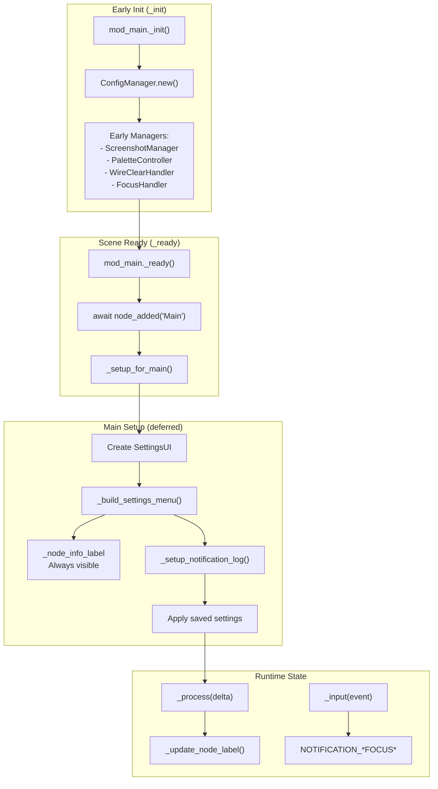
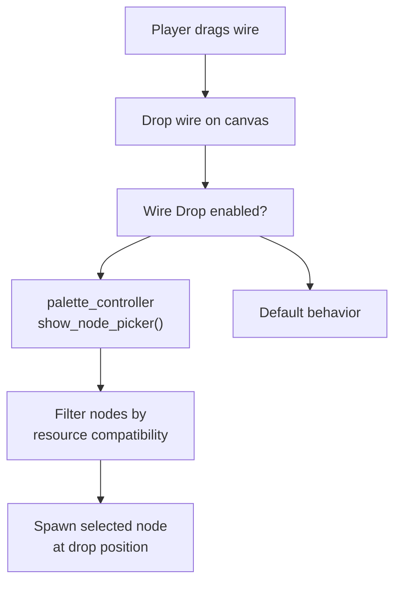
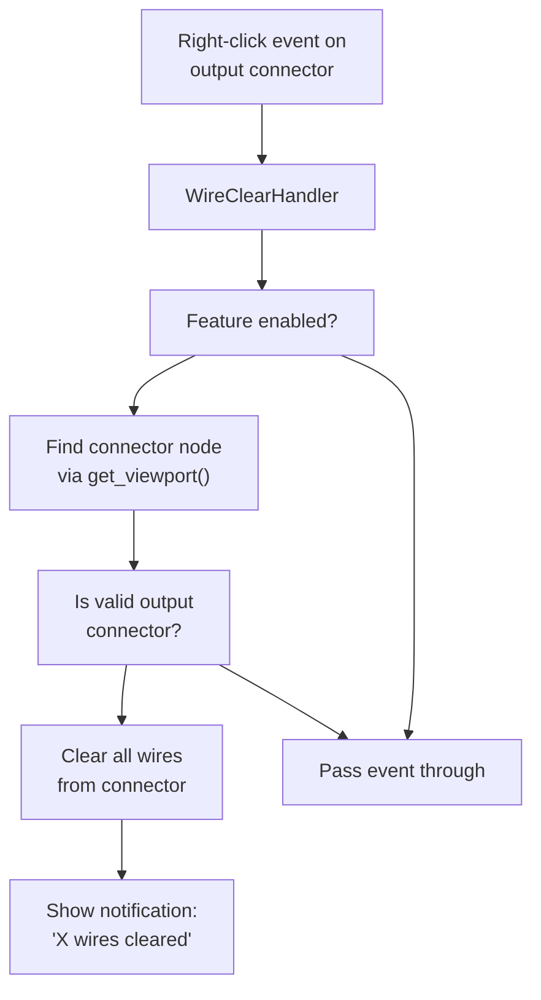
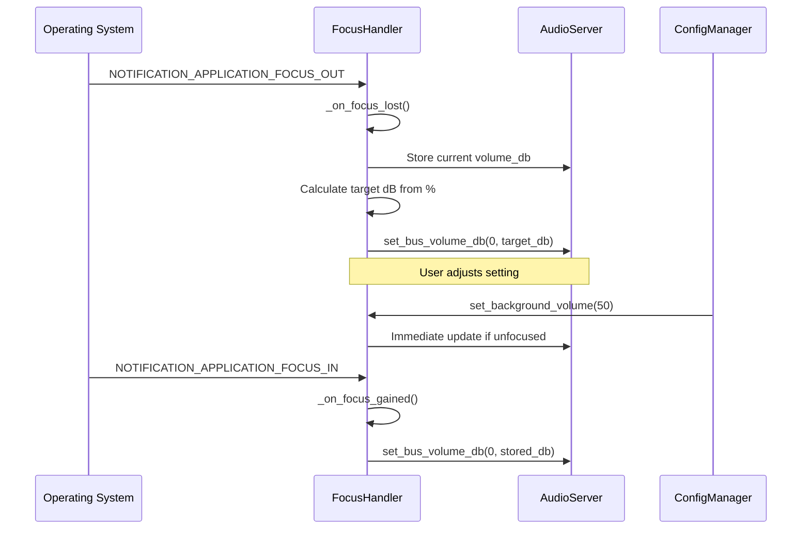
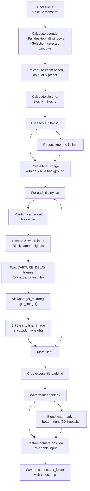
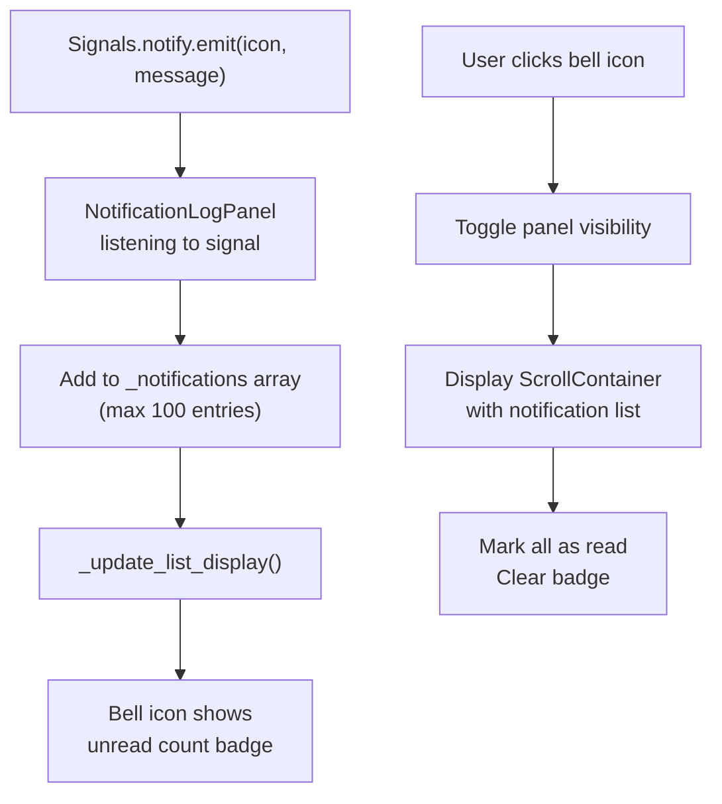
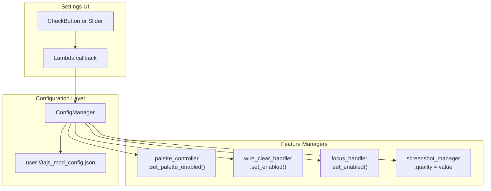

> **Relevant source files**
> * [CHANGELOG.md](https://github.com/tajemniktv/TajsMod/blob/5f1e656a/CHANGELOG.md)
> * [extensions/scenes/windows/window_inventory.gd](https://github.com/tajemniktv/TajsMod/blob/5f1e656a/extensions/scenes/windows/window_inventory.gd)
> * [extensions/scripts/utilities/buy_max_manager.gd](https://github.com/tajemniktv/TajsMod/blob/5f1e656a/extensions/scripts/utilities/buy_max_manager.gd)
> * [extensions/scripts/utilities/focus_handler.gd](https://github.com/tajemniktv/TajsMod/blob/5f1e656a/extensions/scripts/utilities/focus_handler.gd)
> * [extensions/scripts/utilities/screenshot_manager.gd](https://github.com/tajemniktv/TajsMod/blob/5f1e656a/extensions/scripts/utilities/screenshot_manager.gd)
> * [mod_main.gd](https://github.com/tajemniktv/TajsMod/blob/5f1e656a/mod_main.gd)

This page documents quality-of-life utilities that enhance usability without modifying core game mechanics. These features improve workflow efficiency, provide better feedback, and add convenience tools for players.

For visual customization options, see [Visual Enhancements](/tajemniktv/TajsMod/5.1-visual-enhancements). For UI structural improvements, see [UI Improvements](/tajemniktv/TajsMod/5.3-ui-improvements). For opt-in gameplay modifications, see [Gameplay Features](/tajemniktv/TajsMod/5.4-gameplay-features-(opt-in)).

---

## Overview

The mod provides seven major QoL features, each implemented as a dedicated manager or handler component orchestrated by `mod_main.gd`. All features can be toggled independently through the Settings UI and persist their configuration to `user://tajs_mod_config.json`.

| Feature | Manager Class | Primary Input | Configuration Key |
| --- | --- | --- | --- |
| Command Palette | `PaletteController` | MMB / Spacebar | `command_palette_enabled` |
| Wire Drop Menu | `PaletteController` | Drop wire on canvas | `wire_drop_menu_enabled` |
| Right-click Wire Clear | `WireClearHandler` | Right-click on output slot | `right_click_clear_enabled` |
| Node Counter | Label in Settings UI | Always visible | N/A (always active) |
| Mute on Focus Loss | `FocusHandler` | Window focus events | `mute_on_focus_loss` |
| Screenshot System | `ScreenshotManager` | Button in Settings / Palette | `screenshot_quality`, `screenshot_folder` |
| Notification Log | `NotificationLogPanel` | Bell icon in HUD | `notification_log_enabled` |

**Sources:** [mod_main.gd L1-L689](https://github.com/tajemniktv/TajsMod/blob/5f1e656a/mod_main.gd#L1-L689)

---

## Feature Lifecycle and Initialization



All QoL features follow a two-phase initialization pattern: managers are instantiated during `_init()` for early availability, then fully configured in `_setup_for_main()` once the HUD is present.

**Sources:** [mod_main.gd L72-L114](https://github.com/tajemniktv/TajsMod/blob/5f1e656a/mod_main.gd#L72-L114)

 [mod_main.gd L278-L339](https://github.com/tajemniktv/TajsMod/blob/5f1e656a/mod_main.gd#L278-L339)

---

## Command Palette

The Command Palette provides a searchable interface to execute mod commands without navigating menus. See [Command Palette System](/tajemniktv/TajsMod/4-command-palette-system) for complete architecture details.

### Quick Reference

| Aspect | Details |
| --- | --- |
| Activation | Middle Mouse Button or Spacebar (when no input focused) |
| Implementation | `PaletteController` + `palette_overlay.gd` |
| Command Registry | `default_commands.gd` (60+ commands) |
| Search Algorithm | Fuzzy matching with category scoring |
| Special Modes | Wire Drop (spawn compatible nodes), Group Picker |

### Configuration

```

```

The palette controller is initialized early in `_init()` and registered with the scene tree as a direct child of `mod_main`:

```

```

Full initialization occurs in `_setup_for_main()` when the HUD is available:

```

```

**Sources:** [mod_main.gd L98-L100](https://github.com/tajemniktv/TajsMod/blob/5f1e656a/mod_main.gd#L98-L100)

 [mod_main.gd L302-L303](https://github.com/tajemniktv/TajsMod/blob/5f1e656a/mod_main.gd#L302-L303)

 [mod_main.gd L480-L484](https://github.com/tajemniktv/TajsMod/blob/5f1e656a/mod_main.gd#L480-L484)

---

## Wire Drop Menu

When dropping a wire onto empty canvas space (not connecting to a node), the mod spawns a filtered list of compatible nodes that can accept the wire's resource type. This eliminates the need to manually spawn nodes and reconnect wires.



### Implementation Details

The wire drop menu reuses the Command Palette UI in "Node Picker" mode. The `PaletteController` handles the mode switching and node filtering logic. Node compatibility is determined by checking if any input or output connector can accept the wire's resource type.

### Configuration

```

```

**Sources:** [mod_main.gd L467-L470](https://github.com/tajemniktv/TajsMod/blob/5f1e656a/mod_main.gd#L467-L470)

---

## Right-click Wire Clear

Right-clicking on any output connector clears all wires connected from that slot. This provides a faster alternative to individually deleting wires in complex schematics.

### Architecture



### Implementation

The `WireClearHandler` is initialized early and listens for right-click input events globally:

```

```

Configuration toggle:

```

```

**Sources:** [mod_main.gd L102-L105](https://github.com/tajemniktv/TajsMod/blob/5f1e656a/mod_main.gd#L102-L105)

 [mod_main.gd L487-L491](https://github.com/tajemniktv/TajsMod/blob/5f1e656a/mod_main.gd#L487-L491)

---

## Node Counter

A real-time display showing current node count versus the configured limit. Located in the General settings tab, this label updates every frame to reflect schematic changes.

### Display Format

```yaml
Nodes: 247 / 400
```

If the custom node limit is disabled (set to ∞):

```yaml
Nodes: 247 / ∞
```

### Implementation

The node counter uses a persistent `Label` reference that updates in `_process()`:

```

```

Update logic called every frame:

```

```

The `_update_node_label()` function queries `Globals.desktop` to count all window nodes and formats the display text based on the current limit setting.

**Sources:** [mod_main.gd L541-L548](https://github.com/tajemniktv/TajsMod/blob/5f1e656a/mod_main.gd#L541-L548)

 [mod_main.gd L178-L184](https://github.com/tajemniktv/TajsMod/blob/5f1e656a/mod_main.gd#L178-L184)

---

## Mute on Focus Loss

Automatically reduces or mutes audio when the game window loses focus. Useful when multitasking or streaming, preventing Upload Labs audio from bleeding into other applications.

### Configuration Options

| Setting | Type | Range | Default |
| --- | --- | --- | --- |
| Mute on Focus Loss | Toggle | On/Off | On |
| Background Volume | Slider | 0% - 100% | 0% |

### Architecture



### Implementation Details

The `FocusHandler` extends `Node` and uses Godot's notification system to detect focus changes:

```

```

Volume conversion uses linear-to-decibel transformation:

```

```

The handler stores the original master volume when focus is lost and restores it precisely when regained:

```

```

**Sources:** [extensions/scripts/utilities/focus_handler.gd L60-L65](https://github.com/tajemniktv/TajsMod/blob/5f1e656a/extensions/scripts/utilities/focus_handler.gd#L60-L65)

 [extensions/scripts/utilities/focus_handler.gd L84-L92](https://github.com/tajemniktv/TajsMod/blob/5f1e656a/extensions/scripts/utilities/focus_handler.gd#L84-L92)

---

## Screenshot System

A sophisticated tiled capture system that can photograph the entire desktop or just selected nodes, with configurable quality levels and optional watermarking.

### Quality Presets

| Quality | Zoom | Format | Compression | Use Case |
| --- | --- | --- | --- | --- |
| Low | 0.5x | JPG | 80% | Quick sharing, small file size |
| Medium | 0.6x | JPG | 90% | Balanced quality/size |
| High | 0.8x | PNG | Lossless | High detail, moderate size |
| Original | 1.5x | PNG | Lossless | Maximum detail, large files |

### Tiled Capture Algorithm

The screenshot system divides large schematics into viewport-sized tiles, captures each sequentially, then stitches them together. This bypasses Godot's single-frame texture size limits and ensures proper rendering of distant nodes.



### Input Blocking Strategy

During capture, the system must prevent any input from affecting camera position or zoom. This is achieved through multiple defensive layers:

```

```

All states are precisely restored after capture completes.

### Watermark Application

When enabled, a semi-transparent watermark is scaled proportionally (15% of image width, minimum 100px) and blended into the bottom-right corner:

```

```

### Screenshot Types

The system provides two capture modes:

1. **Full Desktop Screenshot** (`take_screenshot()`): Captures all windows on the desktop
2. **Selection Screenshot** (`take_screenshot_selection()`): Captures only selected nodes with 64px padding

Both modes use identical tiling and watermarking logic, differing only in the bounding rectangle calculation.

### Folder Management

Screenshots are saved to a configurable folder with timestamp-based filenames:

```
fullboard_high_2025-12-28T15-30-45.png
selection_12nodes_med_2025-12-28T15-31-20.jpg
```

The folder can be changed via file dialog, and an "Open Folder" button uses `OS.shell_open()` to launch the system file explorer.

**Sources:** [extensions/scripts/utilities/screenshot_manager.gd L56-L339](https://github.com/tajemniktv/TajsMod/blob/5f1e656a/extensions/scripts/utilities/screenshot_manager.gd#L56-L339)

 [extensions/scripts/utilities/screenshot_manager.gd L342-L574](https://github.com/tajemniktv/TajsMod/blob/5f1e656a/extensions/scripts/utilities/screenshot_manager.gd#L342-L574)

---

## Notification Log

A bell-icon panel that displays recent toast notifications in a scrollable history. Players can review messages that disappeared too quickly or check past upgrade notifications.



### Configuration

The notification log panel is initialized in `_setup_for_main()` and can be toggled:

```

```

Configuration toggle:

```

```

**Sources:** [mod_main.gd L315-L316](https://github.com/tajemniktv/TajsMod/blob/5f1e656a/mod_main.gd#L315-L316)

 [mod_main.gd L532-L535](https://github.com/tajemniktv/TajsMod/blob/5f1e656a/mod_main.gd#L532-L535)

---

## Configuration Integration

All QoL features integrate with the configuration system for persistence across sessions. The settings UI provides immediate visual feedback and applies changes without requiring restarts.



Changes are written to disk immediately on every toggle or slider adjustment via `ConfigManager.set_value()`, which internally calls `save_config()` after updating the in-memory dictionary.

**Sources:** [mod_main.gd L462-L563](https://github.com/tajemniktv/TajsMod/blob/5f1e656a/mod_main.gd#L462-L563)

---

## Summary

Quality of Life features enhance the Upload Labs experience through improved input methods, better information display, and powerful utilities like the screenshot system. All features are:

* **Opt-in**: Can be individually disabled without affecting other mod functionality
* **Persistent**: Settings survive game restarts via JSON configuration
* **Non-invasive**: Use script extensions and signal connections rather than binary patching
* **Performant**: Manager instances are lightweight and process only when needed

The screenshot system represents the most technically complex QoL feature, implementing a multi-tile capture algorithm with comprehensive input blocking, while simpler features like the node counter and focus handler provide essential convenience with minimal overhead.

**Sources:** [mod_main.gd L1-L689](https://github.com/tajemniktv/TajsMod/blob/5f1e656a/mod_main.gd#L1-L689)

 [extensions/scripts/utilities/screenshot_manager.gd L1-L761](https://github.com/tajemniktv/TajsMod/blob/5f1e656a/extensions/scripts/utilities/screenshot_manager.gd#L1-L761)

 [extensions/scripts/utilities/focus_handler.gd L1-L93](https://github.com/tajemniktv/TajsMod/blob/5f1e656a/extensions/scripts/utilities/focus_handler.gd#L1-L93)