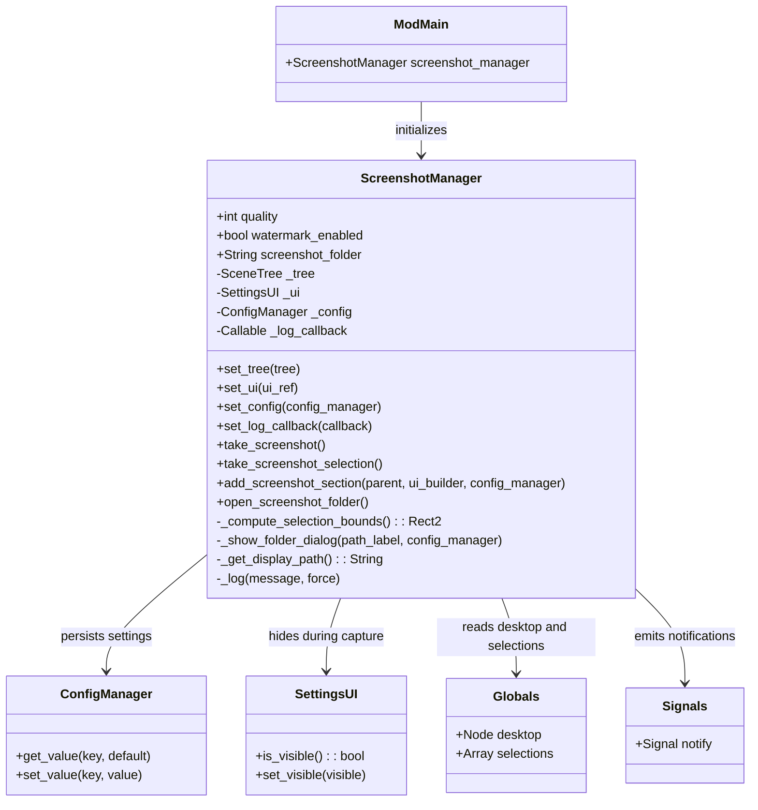
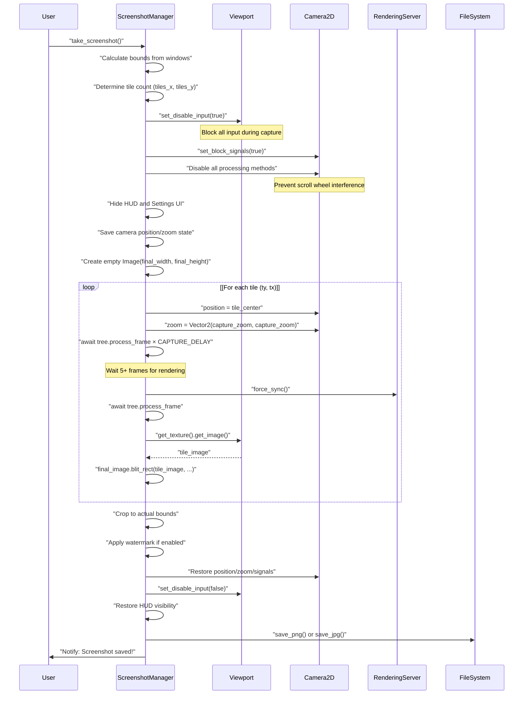
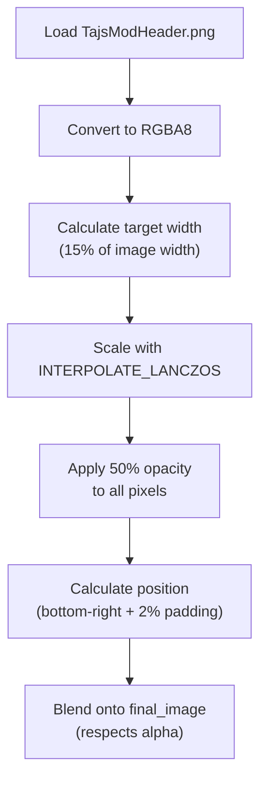
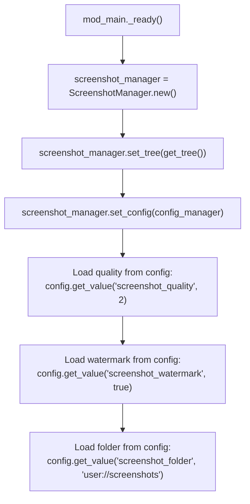
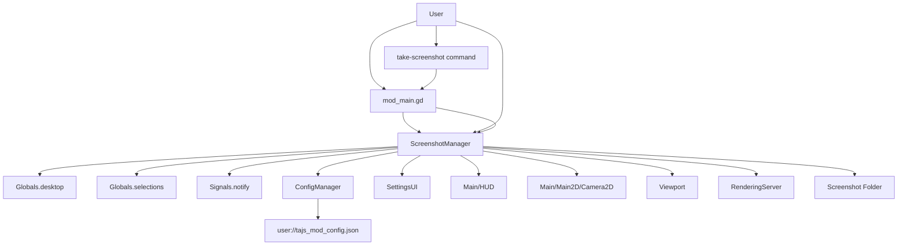

> **Relevant source files**
> * [extensions/scripts/utilities/screenshot_manager.gd](https://github.com/tajemniktv/TajsMod/blob/5f1e656a/extensions/scripts/utilities/screenshot_manager.gd)

## Purpose and Scope

The Screenshot Manager provides high-quality image capture functionality for Upload Labs game boards. It handles capturing full desktop screenshots or selection-only screenshots using a tiled rendering approach that can handle arbitrarily large boards. This component manages quality settings, watermarking, folder configuration, and integrates with the Settings UI.

For information about other utility managers, see [Other Utility Managers](/tajemniktv/TajsMod/6.3-other-utility-managers). For the main orchestrator that initializes this manager, see [The Main Orchestrator](/tajemniktv/TajsMod/3.1-the-main-orchestrator-(mod_main.gd)).

---

## System Overview

The Screenshot Manager is implemented as `ScreenshotManager`, a `RefCounted` utility class that operates independently of the scene tree. It captures images by temporarily manipulating the main camera and viewport, rendering the scene in tiles, and stitching them together into a final high-resolution image.

**Key Capabilities:**

* **Full desktop capture**: Captures all windows on the desktop with automatic bounds calculation
* **Selection capture**: Captures only currently selected nodes with padding
* **Tiled rendering**: Handles boards larger than viewport size by capturing in tiles
* **Quality presets**: Four quality levels balancing file size and image quality
* **Watermarking**: Optional branding overlay with automatic scaling and positioning
* **Configurable output**: User-selectable screenshot folder and filename generation

**Sources:** [extensions/scripts/utilities/screenshot_manager.gd L1-L20](https://github.com/tajemniktv/TajsMod/blob/5f1e656a/extensions/scripts/utilities/screenshot_manager.gd#L1-L20)

---

## Class Architecture



**Sources:** [extensions/scripts/utilities/screenshot_manager.gd L6-L54](https://github.com/tajemniktv/TajsMod/blob/5f1e656a/extensions/scripts/utilities/screenshot_manager.gd#L6-L54)

---

## Quality Settings and Capture Modes

The Screenshot Manager supports four quality presets that determine the capture zoom level and output format. These settings balance image quality, file size, and capture time.

### Quality Presets

| Quality Level | Zoom Factor | Format | Compression | Use Case |
| --- | --- | --- | --- | --- |
| **Low** (0) | 0.5x | JPG | 80% | Quick sharing, small file size |
| **Medium** (1) | 0.6x | JPG | 90% | Balanced quality/size |
| **High** (2) | 0.8x | PNG | Lossless | High detail, reasonable size |
| **Original** (3) | 1.5x | PNG | Lossless | Maximum quality, large files |

The zoom factor determines how much detail is captured. A 1.5x zoom means the final image is 1.5 times larger than the world-space dimensions of the board.

**Sources:** [extensions/scripts/utilities/screenshot_manager.gd L14-L16](https://github.com/tajemniktv/TajsMod/blob/5f1e656a/extensions/scripts/utilities/screenshot_manager.gd#L14-L16)

 [extensions/scripts/utilities/screenshot_manager.gd L91-L94](https://github.com/tajemniktv/TajsMod/blob/5f1e656a/extensions/scripts/utilities/screenshot_manager.gd#L91-L94)

### Capture Modes

The system provides two capture modes:

1. **Full Desktop Capture** (`take_screenshot()`): Captures all windows on the desktop by calculating a bounding rectangle around all children of `Globals.desktop.Windows`.
2. **Selection Capture** (`take_screenshot_selection()`): Captures only nodes in `Globals.selections` with 64px world-space padding for better framing.

Both modes use the same tiled rendering pipeline but differ in bounds calculation.

**Sources:** [extensions/scripts/utilities/screenshot_manager.gd L56-L89](https://github.com/tajemniktv/TajsMod/blob/5f1e656a/extensions/scripts/utilities/screenshot_manager.gd#L56-L89)

 [extensions/scripts/utilities/screenshot_manager.gd L344-L362](https://github.com/tajemniktv/TajsMod/blob/5f1e656a/extensions/scripts/utilities/screenshot_manager.gd#L344-L362)

---

## Tiled Capture Workflow

For large boards, a single viewport capture would be insufficient. The Screenshot Manager uses a tiled approach to capture arbitrarily large areas.



**Sources:** [extensions/scripts/utilities/screenshot_manager.gd L194-L236](https://github.com/tajemniktv/TajsMod/blob/5f1e656a/extensions/scripts/utilities/screenshot_manager.gd#L194-L236)

### Key Steps in Detail

**1. Input Blocking (Lines 96-150)**

To prevent user input from interfering with capture, the system:

* Disables input at viewport level via `viewport.set_disable_input(true)`
* Blocks camera signals with `main_camera.set_block_signals(true)`
* Disables all camera processing methods (process, physics_process, input, etc.)
* Sets the dragger's mouse filter to `MOUSE_FILTER_IGNORE`
* Disables camera zooming animation state

**Sources:** [extensions/scripts/utilities/screenshot_manager.gd L96-L150](https://github.com/tajemniktv/TajsMod/blob/5f1e656a/extensions/scripts/utilities/screenshot_manager.gd#L96-L150)

**2. Tile Calculation (Lines 161-188)**

```
tile_world_size = viewport_size / capture_zoom
tiles_x = ceil(bounds.size.x / tile_world_size.x)
tiles_y = ceil(bounds.size.y / tile_world_size.y)
final_width = tiles_x × viewport_size.x
final_height = tiles_y × viewport_size.y
```

The system adds 15% padding to bounds to ensure edges are captured. If the final image would exceed 16384 pixels in either dimension, the capture zoom is automatically reduced.

**Sources:** [extensions/scripts/utilities/screenshot_manager.gd L161-L188](https://github.com/tajemniktv/TajsMod/blob/5f1e656a/extensions/scripts/utilities/screenshot_manager.gd#L161-L188)

**3. Per-Tile Capture (Lines 194-236)**

For each tile:

1. Calculate tile center position in world coordinates
2. Move camera to tile center and set zoom
3. Wait `CAPTURE_DELAY` (5) frames, plus 5 extra frames for the first tile (visibility culling initialization)
4. Force rendering sync with `RenderingServer.force_sync()`
5. Wait one more frame
6. Capture viewport image with `viewport.get_texture().get_image()`
7. Blit tile into final image at calculated position

The camera position is locked multiple times during the wait to prevent any drift.

**Sources:** [extensions/scripts/utilities/screenshot_manager.gd L194-L236](https://github.com/tajemniktv/TajsMod/blob/5f1e656a/extensions/scripts/utilities/screenshot_manager.gd#L194-L236)

**4. State Restoration (Lines 289-322)**

All modified state is restored:

* Viewport input re-enabled
* Camera signals unblocked
* Camera processing methods re-enabled
* Camera position/zoom restored
* HUD and Settings UI visibility restored
* Background grid visibility restored

**Sources:** [extensions/scripts/utilities/screenshot_manager.gd L289-L322](https://github.com/tajemniktv/TajsMod/blob/5f1e656a/extensions/scripts/utilities/screenshot_manager.gd#L289-L322)

---

## Watermarking System

When `watermark_enabled` is `true`, the system applies a branded watermark to the bottom-right corner of captured images.



The watermark automatically scales based on output image size, with a minimum size of 100px to ensure visibility. The 50% opacity allows the watermark to be visible without obscuring important content.

**Implementation:**

* Watermark source: `res://mods-unpacked/TajemnikTV-TajsModded/TajsModHeader.png`
* Scaling: 15% of final image width
* Minimum size: 100px wide
* Opacity: 50% (alpha multiplied by 0.5)
* Position: Bottom-right corner with 2% padding
* Blend mode: Alpha blending via `final_image.blend_rect()`

**Sources:** [extensions/scripts/utilities/screenshot_manager.gd L251-L288](https://github.com/tajemniktv/TajsMod/blob/5f1e656a/extensions/scripts/utilities/screenshot_manager.gd#L251-L288)

---

## Configuration and Persistence

The Screenshot Manager integrates with the configuration system to persist user preferences across sessions.

### Configuration Keys

| Key | Type | Default | Description |
| --- | --- | --- | --- |
| `screenshot_quality` | int | 2 (High) | Quality preset index (0-3) |
| `screenshot_watermark` | bool | true | Enable watermark overlay |
| `screenshot_folder` | String | `"user://screenshots"` | Output directory path |

**Sources:** [extensions/scripts/utilities/screenshot_manager.gd L14-L20](https://github.com/tajemniktv/TajsMod/blob/5f1e656a/extensions/scripts/utilities/screenshot_manager.gd#L14-L20)

### Initialization Flow



**Sources:** Referenced from mod_main initialization pattern

### Settings UI Integration

The `add_screenshot_section()` method builds a UI control panel that includes:

1. **Quality Selector**: Four toggle buttons for quality presets (Low/Medium/High/Original)
2. **Watermark Toggle**: CheckButton to enable/disable watermarking
3. **Take Screenshot Button**: Triggers `take_screenshot()` on press
4. **Folder Management**: * Display of current folder path (globalized from `user://` if applicable) * "Open Folder" button: Launches system file explorer * "Change Folder" button: Shows `FileDialog` for path selection

Each UI element connects to the configuration system, calling `config_manager.set_value()` when changed to immediately persist the setting.

**Sources:** [extensions/scripts/utilities/screenshot_manager.gd L592-L705](https://github.com/tajemniktv/TajsMod/blob/5f1e656a/extensions/scripts/utilities/screenshot_manager.gd#L592-L705)

---

## Output and File Management

### Filename Generation

Screenshot filenames follow a structured format to ensure uniqueness and include relevant metadata:

**Full Desktop Screenshots:**

```yaml
fullboard_{quality}_{timestamp}.{extension}
Example: fullboard_high_2024-12-15 14-30-45.png
```

**Selection Screenshots:**

```yaml
selection_{node_count}nodes_{quality}_{timestamp}.{extension}
Example: selection_12nodes_med_2024-12-15 14-31-22.jpg
```

Timestamps are generated using `Time.get_datetime_string_from_system()` with colons replaced by hyphens for filesystem compatibility.

**Sources:** [extensions/scripts/utilities/screenshot_manager.gd L325-L328](https://github.com/tajemniktv/TajsMod/blob/5f1e656a/extensions/scripts/utilities/screenshot_manager.gd#L325-L328)

 [extensions/scripts/utilities/screenshot_manager.gd L560-L564](https://github.com/tajemniktv/TajsMod/blob/5f1e656a/extensions/scripts/utilities/screenshot_manager.gd#L560-L564)

### Folder Management

The default screenshot folder is `user://screenshots`, which resolves to the Godot user data directory. Users can change this to any filesystem location.

**Folder Operations:**

1. **Open Folder** (`open_screenshot_folder()`): * Creates directory if it doesn't exist * Globalizes `user://` paths using `ProjectSettings.globalize_path()` * Opens in system file explorer via `OS.shell_open()`
2. **Change Folder** (`_show_folder_dialog()`): * Creates a `FileDialog` with `FILE_MODE_OPEN_DIR` * Sets access mode to `ACCESS_FILESYSTEM` for full filesystem access * Updates configuration on folder selection * Updates UI path display

**Sources:** [extensions/scripts/utilities/screenshot_manager.gd L714-L760](https://github.com/tajemniktv/TajsMod/blob/5f1e656a/extensions/scripts/utilities/screenshot_manager.gd#L714-L760)

---

## Integration with Core Systems



**Integration Points:**

1. **Initialization**: `mod_main.gd` creates the ScreenshotManager instance during `_ready()` and passes references to SceneTree, ConfigManager, and SettingsUI.
2. **Invocation**: Screenshots can be triggered through: * Keyboard shortcut (Ctrl+P) handled in mod_main input processing * Settings UI "Take Screenshot" button * Command Palette `take-screenshot` or `take-screenshot-selection` commands
3. **State Management**: The manager reads from `Globals.desktop` for window enumeration and `Globals.selections` for selection-based captures.
4. **User Feedback**: All operations emit notifications via `Signals.notify` with appropriate icons ("check" for success, "exclamation" for errors).
5. **Configuration**: Settings are immediately persisted through ConfigManager, which writes to `user://tajs_mod_config.json`.

**Sources:** Integration pattern inferred from component architecture

---

## Error Handling and Edge Cases

The Screenshot Manager includes defensive checks for various failure scenarios:

### Error Conditions

| Condition | Check | User Feedback |
| --- | --- | --- |
| Desktop not found | `Globals.desktop` validity | "Could not capture - desktop not found" |
| No windows | `Windows` container empty | "Could not capture - no windows" |
| No selection | `Globals.selections.is_empty()` | "No nodes selected" |
| Camera not found | `Camera2D` node lookup | "Camera not found" |
| Watermark load failure | Texture load result | "WARNING: Could not load watermark image" |
| Folder open failure | `OS.shell_open()` return code | "Could not open folder" |

**Sources:** [extensions/scripts/utilities/screenshot_manager.gd L60-L89](https://github.com/tajemniktv/TajsMod/blob/5f1e656a/extensions/scripts/utilities/screenshot_manager.gd#L60-L89)

 [extensions/scripts/utilities/screenshot_manager.gd L347-L356](https://github.com/tajemniktv/TajsMod/blob/5f1e656a/extensions/scripts/utilities/screenshot_manager.gd#L347-L356)

### Size Limiting

To prevent excessive memory usage or crashes, images exceeding 16384 pixels in either dimension have their zoom automatically reduced:

```javascript
if final_width > max_dimension or final_height > max_dimension:
    var scale_down = min(float(max_dimension) / final_width, 
                         float(max_dimension) / final_height)
    capture_zoom = capture_zoom * scale_down
```

This ensures even extremely large boards can be captured, albeit at reduced zoom.

**Sources:** [extensions/scripts/utilities/screenshot_manager.gd L176-L188](https://github.com/tajemniktv/TajsMod/blob/5f1e656a/extensions/scripts/utilities/screenshot_manager.gd#L176-L188)

---

## Performance Characteristics

### Capture Timing

The tiled capture process is synchronous (blocks the game loop) to maintain state consistency. Approximate timing:

* **Per-tile overhead**: 5-10 frames (CAPTURE_DELAY + sync)
* **First tile**: Additional 5 frames for visibility culling initialization
* **Example**: 3×2 tile grid = 6 tiles × 8 frames avg = ~48 frames = ~0.8 seconds at 60 FPS

### Memory Usage

Each tile consumes viewport size × 4 bytes (RGBA8). For a 1920×1080 viewport:

* Per-tile memory: ~8.3 MB
* Maximum allocation: One tile + final image in memory simultaneously
* Final image size varies by quality and board size

### File Size Examples

Approximate sizes for a 10,000×10,000 pixel board area:

| Quality | Resolution | Format | Approx. Size |
| --- | --- | --- | --- |
| Low | 5,000×5,000 | JPG 80% | 2-4 MB |
| Medium | 6,000×6,000 | JPG 90% | 4-7 MB |
| High | 8,000×8,000 | PNG | 15-25 MB |
| Original | 15,000×15,000 | PNG | 80-120 MB |

Actual sizes depend on board complexity (wire density, colors, etc.).

**Sources:** Performance characteristics derived from implementation analysis