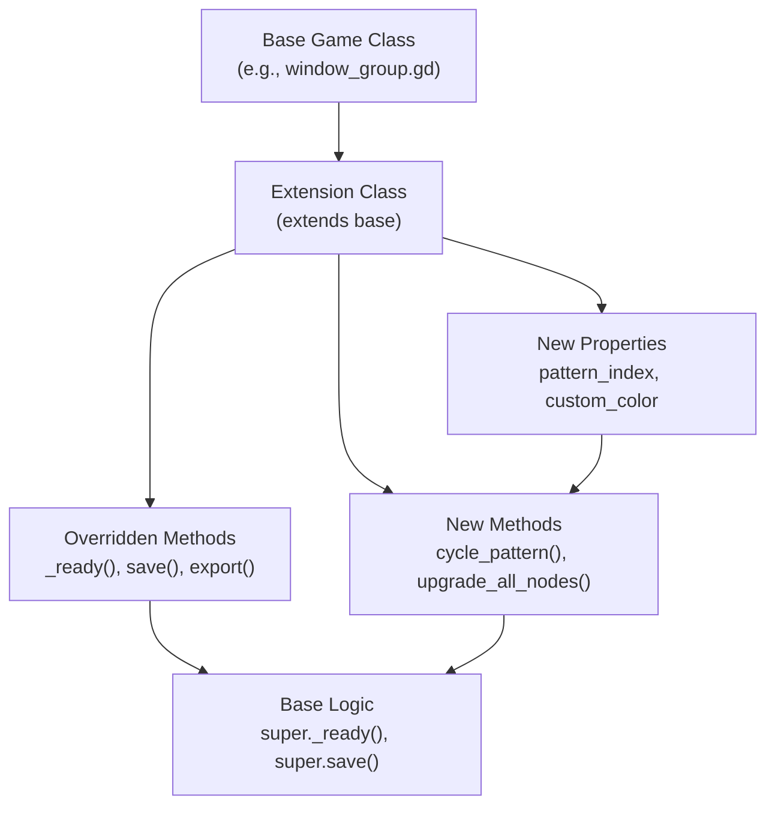
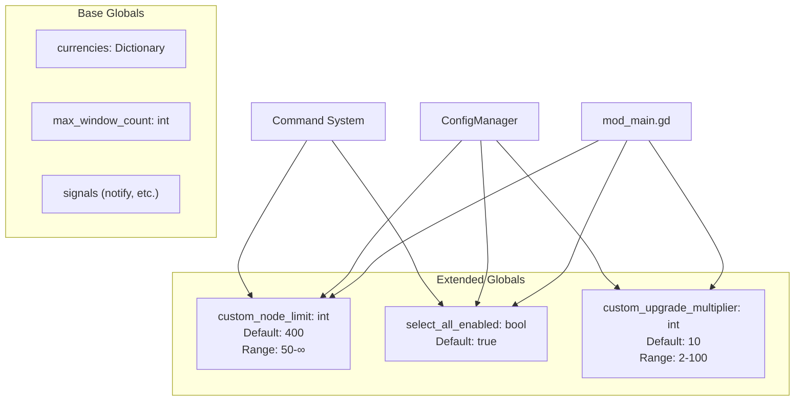
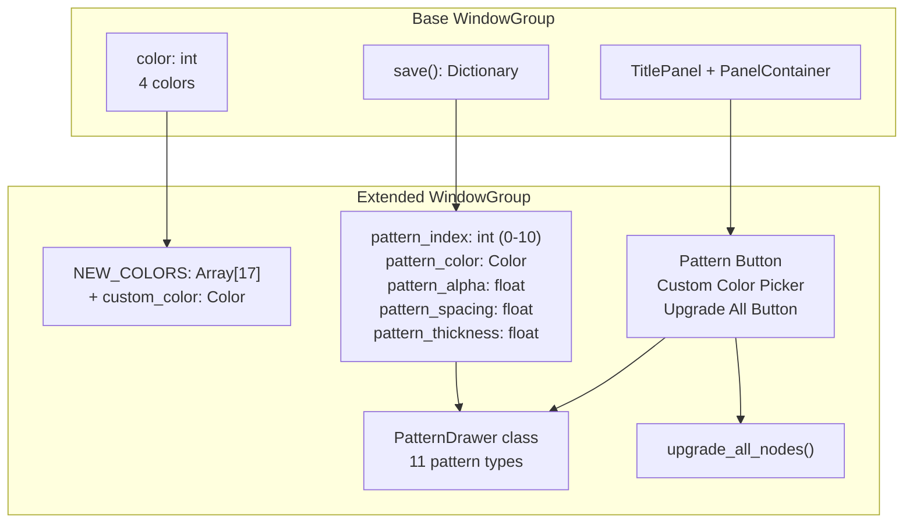
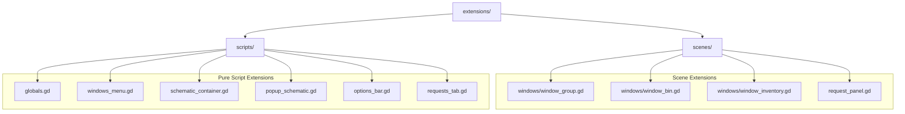
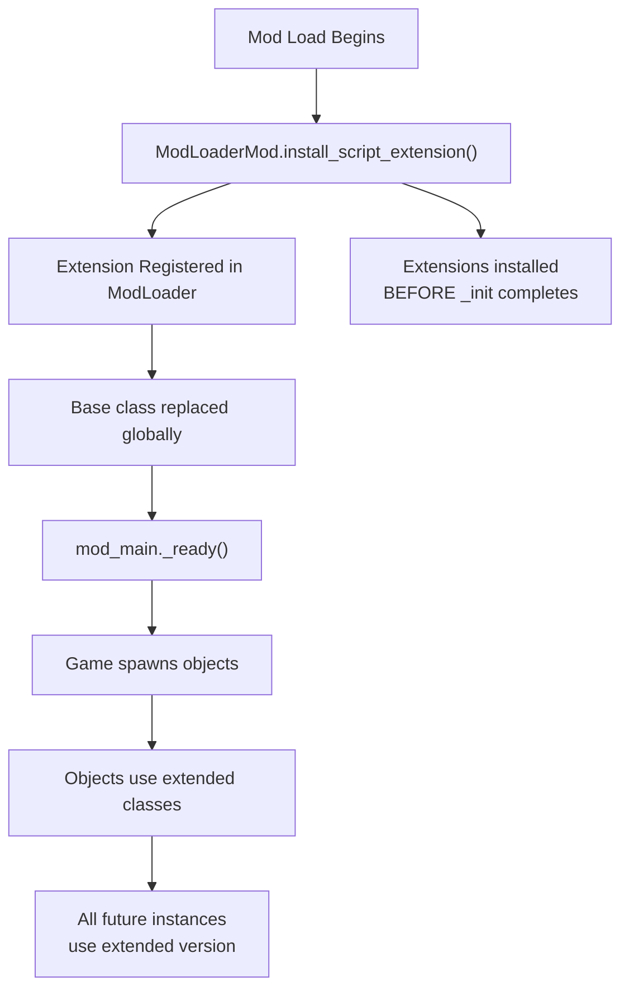

> **Relevant source files**
> * [extensions/scenes/windows/window_group.gd](https://github.com/tajemniktv/TajsMod/blob/5f1e656a/extensions/scenes/windows/window_group.gd)
> * [extensions/scripts/ui/pattern_picker_panel.gd](https://github.com/tajemniktv/TajsMod/blob/5f1e656a/extensions/scripts/ui/pattern_picker_panel.gd)
> * [mod_main.gd](https://github.com/tajemniktv/TajsMod/blob/5f1e656a/mod_main.gd)

## Purpose and Scope

Script extensions are the primary mechanism by which Taj's Mod integrates with the base Upload Labs game. This page documents the 10 script extensions that override and extend base game classes, their installation process, extension patterns, and specific capabilities added by each extension. For information about how these extensions are initialized and coordinated, see [The Main Orchestrator (mod_main.gd)](/tajemniktv/TajsMod/3.1-the-main-orchestrator-(mod_main.gd)).

---

## Extension Mechanism

Script extensions in Godot's ModLoader framework allow mods to extend base game classes without directly modifying game files. The extension mechanism uses Godot's `extends` keyword to inherit from base game classes, then replaces the original class with the extended version at runtime.

### Installation Process

All script extensions are installed during `mod_main.gd`'s `_init()` phase, before any scene tree exists. This ensures extensions are active before any game objects are instantiated.

```mermaid
sequenceDiagram
  participant ModLoader
  participant mod_main._init()
  participant Script Extensions
  participant Base Game Classes

  ModLoader->>mod_main._init(): Load mod
  mod_main._init()->>ModLoader: install_script_extension(globals.gd)
  ModLoader->>Script Extensions: Register extension
  Script Extensions->>Base Game Classes: Override Globals class
  mod_main._init()->>ModLoader: install_script_extension(windows_menu.gd)
  ModLoader->>Script Extensions: Register extension
  Script Extensions->>Base Game Classes: Override WindowsMenu class
  mod_main._init()->>ModLoader: install_script_extension(window_group.gd)
  ModLoader->>Script Extensions: Register extension
  Script Extensions->>Base Game Classes: Override WindowGroup class
  note over mod_main._init(),Base Game Classes: ... 7 more extensions ...
  note over Base Game Classes: All instances now use
```

**Installation Call Sites:**

[mod_main.gd L73-L82](https://github.com/tajemniktv/TajsMod/blob/5f1e656a/mod_main.gd#L73-L82)

Sources: [mod_main.gd L72-L84](https://github.com/tajemniktv/TajsMod/blob/5f1e656a/mod_main.gd#L72-L84)

---

## Complete Extension Registry

The following table catalogs all 10 script extensions, their base game targets, and primary purposes:

| Extension File | Base Game Target | Primary Purpose | Key Additions |
| --- | --- | --- | --- |
| `globals.gd` | `res://scripts/globals.gd` | Game state extensions | `custom_node_limit`, `select_all_enabled`, `custom_upgrade_multiplier` |
| `windows_menu.gd` | `res://scripts/windows_menu.gd` | Window spawning logic | Wire drop menu integration |
| `schematic_container.gd` | `res://scripts/schematic_container.gd` | Schematic handling | Custom container behavior |
| `popup_schematic.gd` | `res://scripts/popup_schematic.gd` | Schematic popups | Modified popup interactions |
| `options_bar.gd` | `res://scripts/options_bar.gd` | Options/toolbar | Custom toolbar actions |
| `window_group.gd` | `res://scenes/windows/window_group.gd` | Node group windows | 17 colors, 11 patterns, upgrade all |
| `window_bin.gd` | `res://scenes/windows/window_bin.gd` | Bin window | THE BIN enhancements |
| `window_inventory.gd` | `res://scenes/windows/window_inventory.gd` | Container windows | 6-input containers (vs 5) |
| `request_panel.gd` | `res://scenes/request_panel.gd` | Request UI | Request panel modifications |
| `requests_tab.gd` | `res://scripts/requests_tab.gd` | Request tab | Request tab behavior |

Sources: [mod_main.gd L73-L82](https://github.com/tajemniktv/TajsMod/blob/5f1e656a/mod_main.gd#L73-L82)

---

## Extension Architecture Pattern

Script extensions follow a consistent pattern: extend the base class, add new properties and methods, override specific base methods to inject custom behavior, and maintain compatibility with base game logic.



**Key Pattern Characteristics:**

1. **Extend Declaration**: `extends "res://path/to/base/class.gd"`
2. **Property Addition**: New state variables without modifying base class
3. **Method Override**: `super.method()` calls preserve base functionality
4. **UI Injection**: Add new controls to existing scene trees
5. **Persistence Extension**: Extend `save()` and `export()` methods

Sources: [extensions/scenes/windows/window_group.gd L1-L6](https://github.com/tajemniktv/TajsMod/blob/5f1e656a/extensions/scenes/windows/window_group.gd#L1-L6)

---

## Critical Extensions: Globals

The `globals.gd` extension adds critical mod-specific state variables to the global game state singleton. These variables are accessed throughout the mod to enable or disable features.



**Configuration Integration:**

* `custom_node_limit` loaded at [mod_main.gd L153-L155](https://github.com/tajemniktv/TajsMod/blob/5f1e656a/mod_main.gd#L153-L155)
* `select_all_enabled` applied at [mod_main.gd L329](https://github.com/tajemniktv/TajsMod/blob/5f1e656a/mod_main.gd#L329-L329)
* `custom_upgrade_multiplier` configured at [mod_main.gd L512-L517](https://github.com/tajemniktv/TajsMod/blob/5f1e656a/mod_main.gd#L512-L517)

**Special Value Handling:**

* `custom_node_limit = -1` represents infinite nodes (displayed as "∞" in UI)
* Node limit slider maps -1 to display value 2050 [mod_main.gd L1008-L1011](https://github.com/tajemniktv/TajsMod/blob/5f1e656a/mod_main.gd#L1008-L1011)

Sources: [mod_main.gd L152-L1030](https://github.com/tajemniktv/TajsMod/blob/5f1e656a/mod_main.gd#L152-L1030)

---

## Window Extensions: Visual Customization

Three window extension files (`window_group.gd`, `window_bin.gd`, `window_inventory.gd`) add substantial visual and functional capabilities to window types.

### window_group.gd: Advanced Customization

The most complex extension, adding 17 colors, 11 pattern types, and group-wide operations.



**Pattern Types (11 total):**

| Index | Name | Description |
| --- | --- | --- |
| 0 | None | No pattern |
| 1 | Horizontal | Horizontal lines |
| 2 | Vertical | Vertical lines |
| 3 | Diagonal / | Forward diagonal |
| 4 | Diagonal \ | Backward diagonal |
| 5 | Grid | Horizontal + Vertical |
| 6 | Diamond | Both diagonals |
| 7 | Dots | Dot matrix |
| 8 | Zigzag | Zigzag lines |
| 9 | Waves | Wave patterns |
| 10 | Brick | Brick wall pattern |

**Color Palette:**

* Base game: 4 colors
* Extended: 17 predefined colors [window_group.gd L9-L12](https://github.com/tajemniktv/TajsMod/blob/5f1e656a/window_group.gd#L9-L12)
* Custom: RGB color picker with alpha support

**Pattern Implementation:**

The `PatternDrawer` class is injected into both `TitlePanel` and `PanelContainer` to draw patterns on the background:

[extensions/scenes/windows/window_group.gd L32-L154](https://github.com/tajemniktv/TajsMod/blob/5f1e656a/extensions/scenes/windows/window_group.gd#L32-L154)

Each pattern uses customizable parameters:

* Color and alpha (transparency)
* Spacing between pattern elements
* Line/dot thickness

**Persistence:**

Pattern settings persist via extended `save()` and `export()` methods:

[extensions/scenes/windows/window_group.gd L446-L469](https://github.com/tajemniktv/TajsMod/blob/5f1e656a/extensions/scenes/windows/window_group.gd#L446-L469)

**Group-Wide Operations:**

`upgrade_all_nodes()` iterates all windows contained within the group and attempts to upgrade them:

[extensions/scenes/windows/window_group.gd L383-L432](https://github.com/tajemniktv/TajsMod/blob/5f1e656a/extensions/scenes/windows/window_group.gd#L383-L432)

This method:

1. Enumerates all `"selectable"` nodes
2. Checks if each is contained within the group bounds
3. Verifies upgrade availability and affordability
4. Executes upgrades with cost deduction
5. Reports success/failure statistics

Sources: [extensions/scenes/windows/window_group.gd L6-L525](https://github.com/tajemniktv/TajsMod/blob/5f1e656a/extensions/scenes/windows/window_group.gd#L6-L525)

### window_inventory.gd: 6-Input Containers

Extends container windows to support 6 input slots instead of the base game's 5. This is a configuration-gated feature requiring a restart.

**Configuration Key:** `six_input_containers` [mod_main.gd L473-L477](https://github.com/tajemniktv/TajsMod/blob/5f1e656a/mod_main.gd#L473-L477)

**Restart Requirement:**

This extension modifies the container's input slot count, which is established during window instantiation. Changing this setting requires tracking via `_restart_original_values` and displaying a restart banner when modified.

Sources: [mod_main.gd L80-L477](https://github.com/tajemniktv/TajsMod/blob/5f1e656a/mod_main.gd#L80-L477)

---

## UI Integration Extensions

Several extensions modify UI elements to integrate mod features into the base game interface.

### windows_menu.gd: Wire Drop Menu

Extends the window spawning menu to add wire drop functionality. When a wire is dropped onto empty canvas space, a quick-add menu appears showing compatible node types that can receive that wire type.

**Integration Point:** `wire_drop_menu_enabled` configuration [mod_main.gd L467-L470](https://github.com/tajemniktv/TajsMod/blob/5f1e656a/mod_main.gd#L467-L470)

**Coordination:** Works with `PaletteController.set_wire_drop_enabled()` to enable/disable feature

### options_bar.gd: Toolbar Extensions

Extends the options/toolbar to add mod-specific controls or modify existing toolbar behavior.

### request_panel.gd & requests_tab.gd: Request System

Extend the request/mission system UI to add custom interactions or modify request panel behavior.

Sources: [mod_main.gd L74-L470](https://github.com/tajemniktv/TajsMod/blob/5f1e656a/mod_main.gd#L74-L470)

---

## Scene vs Script Extensions

Extensions are located in two directories based on whether they extend scene resources or pure script classes:



**Directory Structure:**

* `extensions/scripts/`: Extends pure GDScript classes (singletons, managers)
* `extensions/scenes/`: Extends scene-attached scripts (windows, panels)

This organization mirrors the base game's structure, making it easy to locate the corresponding base class for each extension.

Sources: [mod_main.gd L73-L82](https://github.com/tajemniktv/TajsMod/blob/5f1e656a/mod_main.gd#L73-L82)

---

## Extension Lifecycle

Script extensions have a unique lifecycle compared to regular mod components:



**Timing Characteristics:**

1. **Pre-Scene Tree**: Extensions install before `_ready()` callbacks
2. **Global Scope**: Once installed, ALL instances use the extended class
3. **Persistent**: Extensions remain active for entire game session
4. **No Fallback**: Base class is completely replaced (no dual-existence)

**Implications:**

* Extensions cannot be toggled at runtime
* All extension code must be defensive (handle both modded and unmodded state)
* Property additions must have sensible defaults for legacy save files

Sources: [mod_main.gd L72-L86](https://github.com/tajemniktv/TajsMod/blob/5f1e656a/mod_main.gd#L72-L86)

---

## Common Extension Patterns

### Pattern 1: UI Injection in _ready()

Extensions commonly inject new UI elements into the base class's scene tree:

```javascript
func _ready() -> void:
    super._ready()  # Call base class setup
    
    var title_panel = get_node_or_null("TitlePanel")
    if title_panel:
        var custom_button = Button.new()
        custom_button.text = "Custom Action"
        custom_button.pressed.connect(_on_custom_action)
        
        var title_container = title_panel.get_node_or_null("TitleContainer")
        if title_container:
            title_container.add_child(custom_button)
```

Example: [extensions/scenes/windows/window_group.gd L156-L228](https://github.com/tajemniktv/TajsMod/blob/5f1e656a/extensions/scenes/windows/window_group.gd#L156-L228)

### Pattern 2: Extended Persistence

Extend save/export methods to persist custom properties:

```javascript
func save() -> Dictionary:
    var data = super.save()
    data["custom_property"] = custom_property
    data["custom_color"] = custom_color.to_html(true)
    return data
```

Example: [extensions/scenes/windows/window_group.gd L446-L456](https://github.com/tajemniktv/TajsMod/blob/5f1e656a/extensions/scenes/windows/window_group.gd#L446-L456)

### Pattern 3: Overlay Systems

Create overlay layers for custom rendering without modifying base drawing code:

```javascript
var custom_drawer = CustomDrawer.new()
custom_drawer.set_anchors_preset(Control.PRESET_FULL_RECT)
custom_drawer.mouse_filter = Control.MOUSE_FILTER_IGNORE
parent_panel.add_child(custom_drawer)
parent_panel.move_child(custom_drawer, 0)  # Behind other content
```

Example: [extensions/scenes/windows/window_group.gd L160-L221](https://github.com/tajemniktv/TajsMod/blob/5f1e656a/extensions/scenes/windows/window_group.gd#L160-L221)

### Pattern 4: Signal-Based Feature Gates

Use signals to coordinate optional features:

```go
func _ready() -> void:
    super._ready()
    
    if Globals.has("custom_feature_enabled"):
        if Globals.custom_feature_enabled:
            _setup_custom_feature()
```

This allows features to be toggled via the `Globals` extension without modifying the base class.

Sources: [extensions/scenes/windows/window_group.gd L156-L469](https://github.com/tajemniktv/TajsMod/blob/5f1e656a/extensions/scenes/windows/window_group.gd#L156-L469)

---

## Extension Limitations

While powerful, script extensions have constraints:

### Class Name Conflicts

Extensions cannot use `class_name` declarations if the base class already has one. The ModLoader framework doesn't support overriding named classes.

**Known Limitation:** Drag dead zone feature (Issue #13) cannot be implemented because `WindowContainer` has a `class_name` declaration.

Reference: [mod_main.gd L570-L571](https://github.com/tajemniktv/TajsMod/blob/5f1e656a/mod_main.gd#L570-L571)

### Save Compatibility

Extensions adding new persistent properties must handle missing keys in legacy save files:

```go
func _load_custom_data() -> void:
    if has_meta("custom_property"):
        custom_property = get_meta("custom_property")
    else:
        custom_property = DEFAULT_VALUE  # Fallback for old saves
```

### Runtime Modification

Extensions are installed during mod initialization and cannot be:

* Toggled on/off at runtime
* Hot-reloaded without restarting
* Applied selectively to specific instances

All instances created after installation use the extended class globally.

Sources: [mod_main.gd L570-L571](https://github.com/tajemniktv/TajsMod/blob/5f1e656a/mod_main.gd#L570-L571)

 [extensions/scenes/windows/window_group.gd L472-L489](https://github.com/tajemniktv/TajsMod/blob/5f1e656a/extensions/scenes/windows/window_group.gd#L472-L489)

---

## Debugging Extensions

Extensions can be challenging to debug since they replace base game classes. Common strategies:

### Defensive Coding

Always check for null and handle missing nodes:

```javascript
var title_container = title_panel.get_node_or_null("TitleContainer")
if title_container:
    # Safe to use title_container
else:
    ModLoaderLog.warning("TitleContainer not found", LOG_NAME)
    return
```

### Call Super Methods

Preserve base functionality by calling `super.*()`:

```python
func _ready() -> void:
    super._ready()  # Essential for base class setup
    # Add custom logic after base setup
```

### Logging

Use ModLoader's logging system to track extension behavior:

```
ModLoaderLog.info("Extension initialized: window_group", LOG_NAME)
```

### Version Guards

Check if expected base game structure exists before extending:

```
if not title_panel.has_node("TitleContainer"):
    ModLoaderLog.error("Base game structure changed - extension may fail", LOG_NAME)
```

Sources: [extensions/scenes/windows/window_group.gd L160-L193](https://github.com/tajemniktv/TajsMod/blob/5f1e656a/extensions/scenes/windows/window_group.gd#L160-L193)

---

## Future Extension Points

Potential areas for future extensions include:

* **Desktop/Canvas**: Extend canvas interaction (requires careful patching, see [mod_main.gd L180-L181](https://github.com/tajemniktv/TajsMod/blob/5f1e656a/mod_main.gd#L180-L181) )
* **Save System**: Extend global save/load to add mod-specific save data
* **Tutorial System**: Extend tutorial panels to add mod feature tutorials
* **Schematic Browser**: Extend schematic selection UI
* **Statistics Panel**: Extend stats display with mod-tracked metrics

Each extension point requires analyzing the base game's class structure, identifying safe override points, and implementing defensively to handle game updates.

Sources: [mod_main.gd L180-L181](https://github.com/tajemniktv/TajsMod/blob/5f1e656a/mod_main.gd#L180-L181)