> **Relevant source files**
> * [mod_main.gd](https://github.com/tajemniktv/TajsMod/blob/5f1e656a/mod_main.gd)

## Purpose and Scope

`mod_main.gd` is the central orchestration layer for Taj's Mod. It serves as the single entry point that:

* Installs all script extensions during `_init()`
* Coordinates 10+ feature manager components
* Builds and manages the settings UI
* Handles input routing and game patching
* Bridges between the mod loader and game engine

For information about individual feature managers coordinated by this orchestrator, see [Utility Manager Components](/tajemniktv/TajsMod/6-utility-manager-components). For details on the command palette system it initializes, see [Command Palette System](/tajemniktv/TajsMod/4-command-palette-system).

**Sources:** [mod_main.gd L1-L68](https://github.com/tajemniktv/TajsMod/blob/5f1e656a/mod_main.gd#L1-L68)

---

## Lifecycle and Initialization

### Two-Phase Initialization Pattern

**Sources:** [mod_main.gd L72-L163](https://github.com/tajemniktv/TajsMod/blob/5f1e656a/mod_main.gd#L72-L163)

 [mod_main.gd L271-L340](https://github.com/tajemniktv/TajsMod/blob/5f1e656a/mod_main.gd#L271-L340)

### Phase 1: _init() - Core Setup

The `_init()` method executes before the scene tree is available and handles:

| Initialization Task | Code Reference | Purpose |
| --- | --- | --- |
| Script Extension Installation | [mod_main.gd L73-L82](https://github.com/tajemniktv/TajsMod/blob/5f1e656a/mod_main.gd#L73-L82) | Inject mod behavior into base game classes |
| Version Loading | [mod_main.gd L86](https://github.com/tajemniktv/TajsMod/blob/5f1e656a/mod_main.gd#L86-L86) | Read version from `manifest.json` |
| ConfigManager Creation | [mod_main.gd L89](https://github.com/tajemniktv/TajsMod/blob/5f1e656a/mod_main.gd#L89-L89) | Initialize settings persistence layer |
| Early Manager Setup | [mod_main.gd L92-L113](https://github.com/tajemniktv/TajsMod/blob/5f1e656a/mod_main.gd#L92-L113) | Create managers that don't depend on scene tree |

**Early managers** initialized in `_init()`:

* `ScreenshotManager` - requires config but not scene tree (set later)
* `PaletteController` - added as child node
* `WireClearHandler` - needs config reference
* `FocusHandler` - audio management
* `WireColorOverrides` - color data holder (applied in `_ready()`)

**Sources:** [mod_main.gd L72-L113](https://github.com/tajemniktv/TajsMod/blob/5f1e656a/mod_main.gd#L72-L113)

### Phase 2: _ready() - Scene Tree Integration

The `_ready()` method executes when the scene tree is available:

| Initialization Task | Code Reference | Purpose |
| --- | --- | --- |
| Shared Color Picker Setup | [mod_main.gd L118-L142](https://github.com/tajemniktv/TajsMod/blob/5f1e656a/mod_main.gd#L118-L142) | Create reusable color picker overlay |
| Wire Color Application | [mod_main.gd L144-L147](https://github.com/tajemniktv/TajsMod/blob/5f1e656a/mod_main.gd#L144-L147) | Apply custom wire colors to `Data.connectors` |
| Screenshot Tree Binding | [mod_main.gd L150](https://github.com/tajemniktv/TajsMod/blob/5f1e656a/mod_main.gd#L150-L150) | Bind screenshot manager to scene tree |
| Node Limit Application | [mod_main.gd L153-L155](https://github.com/tajemniktv/TajsMod/blob/5f1e656a/mod_main.gd#L153-L155) | Set `Globals.custom_node_limit` from config |
| BIN Window Patching | [mod_main.gd L158](https://github.com/tajemniktv/TajsMod/blob/5f1e656a/mod_main.gd#L158-L158) | Inject THE BIN window into game |
| Main Scene Listener | [mod_main.gd L162-L163](https://github.com/tajemniktv/TajsMod/blob/5f1e656a/mod_main.gd#L162-L163) | Wait for Main scene to load |

**Sources:** [mod_main.gd L115-L163](https://github.com/tajemniktv/TajsMod/blob/5f1e656a/mod_main.gd#L115-L163)

### Phase 3: _setup_for_main() - Late Initialization

Triggered when the `Main` scene node is added to the tree (after 0.5s delay):

**Sources:** [mod_main.gd L278-L340](https://github.com/tajemniktv/TajsMod/blob/5f1e656a/mod_main.gd#L278-L340)

---

## Manager Coordination Architecture

### Manager Component Registry

`mod_main.gd` maintains references to all feature managers as instance variables:

**Sources:** [mod_main.gd L33-L48](https://github.com/tajemniktv/TajsMod/blob/5f1e656a/mod_main.gd#L33-L48)

### Manager Initialization Pattern

Each manager follows a consistent setup pattern:

| Setup Step | Example (GotoGroupManager) | Code Reference |
| --- | --- | --- |
| 1. Null check | `if goto_group_manager != null` | [mod_main.gd L393-L394](https://github.com/tajemniktv/TajsMod/blob/5f1e656a/mod_main.gd#L393-L394) |
| 2. Instantiate | `goto_group_manager = GotoGroupManagerScript.new()` | [mod_main.gd L356](https://github.com/tajemniktv/TajsMod/blob/5f1e656a/mod_main.gd#L356-L356) |
| 3. Name node | `goto_group_manager.name = "GotoGroupManager"` | [mod_main.gd L357](https://github.com/tajemniktv/TajsMod/blob/5f1e656a/mod_main.gd#L357-L357) |
| 4. Add to tree | `add_child(goto_group_manager)` | [mod_main.gd L358](https://github.com/tajemniktv/TajsMod/blob/5f1e656a/mod_main.gd#L358-L358) |
| 5. Setup call | `goto_group_manager.setup(...)` | Varies by manager |
| 6. Log initialization | `ModLoaderLog.info(...)` | [mod_main.gd L386](https://github.com/tajemniktv/TajsMod/blob/5f1e656a/mod_main.gd#L386-L386) |

**Sources:** [mod_main.gd L344-L460](https://github.com/tajemniktv/TajsMod/blob/5f1e656a/mod_main.gd#L344-L460)

---

## Settings UI Construction

### Tab-Based Organization

The `_build_settings_menu()` method constructs a four-tab settings panel:

```mermaid
flowchart TD

Build["_build_settings_menu()"]
Gen["General Tab"]
Vis["Visuals Tab"]
Cheat["Cheats Tab"]
Debug["Debug Tab"]
GenToggles["Feature Toggles"]
NodeLimit["Node Limit Slider"]
Screenshot["Screenshot Section"]
Focus["Focus Mute Section"]
WireDrop["Wire Drop Menu"]
SixInput["6-Input Containers ⟳"]
CmdPalette["Command Palette"]
RightClick["Right-click Clear"]
SelectAll["Ctrl+A Select All"]
GotoBtn["Go To Group Button"]
BuyMaxBtn["Buy Max Button"]
ZOrderFix["Group Z-Order Fix"]
SliderScroll["Disable Slider Scroll"]
ToastLog["Toast History Panel"]
DiscoHighlight["Highlight Disconnected"]
WireColorSec["Wire Color Section"]
GlowSec["Extra Glow Section"]
OpacitySlider["UI Opacity Slider"]
GlowToggle["Extra Glow Toggle"]
GlowSub["Glow Sub-Settings"]
Intensity["Intensity Slider"]
Strength["Strength Slider"]
Bloom["Bloom Slider"]
Sensitivity["Sensitivity Slider"]
WireToggle["Custom Wire Colors Toggle"]
Categories["Wire Categories"]
Speeds["⚡ Speeds"]
Resources["💰 Resources"]
Hacking["🔓 Hacking"]
DataTypes["📊 Data Types"]
AI["🧠 AI / Neural"]
Boosts["🚀 Boosts"]
Other["📦 Other"]
CheatMgr["CheatManager.build_cheats_tab()"]
ResetBtn["Reset All Settings Button"]
BootScreen["Custom Boot Screen ⟳"]
DebugToggle["Enable Debug Logging"]
DebugInfo["Log Debug Info Button"]
DebugLabel["Debug Log Label"]

Build --> Gen
Build --> Vis
Build --> Cheat
Build --> Debug
Gen --> GenToggles
Gen --> NodeLimit
Gen --> Screenshot
Gen --> Focus
GenToggles --> WireDrop
GenToggles --> SixInput
GenToggles --> CmdPalette
GenToggles --> RightClick
GenToggles --> SelectAll
GenToggles --> GotoBtn
GenToggles --> BuyMaxBtn
GenToggles --> ZOrderFix
GenToggles --> SliderScroll
GenToggles --> ToastLog
GenToggles --> DiscoHighlight
Vis --> WireColorSec
Vis --> GlowSec
Vis --> OpacitySlider
GlowSec --> GlowToggle
GlowSec --> GlowSub
GlowSub --> Intensity
GlowSub --> Strength
GlowSub --> Bloom
GlowSub --> Sensitivity
WireColorSec --> WireToggle
WireColorSec --> Categories
Categories --> Speeds
Categories --> Resources
Categories --> Hacking
Categories --> DataTypes
Categories --> AI
Categories --> Boosts
Categories --> Other
Cheat --> CheatMgr
Debug --> ResetBtn
Debug --> BootScreen
Debug --> DebugToggle
Debug --> DebugInfo
Debug --> DebugLabel
```

**Sources:** [mod_main.gd L462-L688](https://github.com/tajemniktv/TajsMod/blob/5f1e656a/mod_main.gd#L462-L688)

### Settings Toggle Tracking

The `_settings_toggles` dictionary tracks all CheckButton references for synchronization:

| Dictionary Key | Purpose | Code Reference |
| --- | --- | --- |
| `"wire_drop_menu_enabled"` | Wire drop menu toggle | [mod_main.gd L467](https://github.com/tajemniktv/TajsMod/blob/5f1e656a/mod_main.gd#L467-L467) |
| `"six_input_containers"` | Container input count | [mod_main.gd L474](https://github.com/tajemniktv/TajsMod/blob/5f1e656a/mod_main.gd#L474-L474) |
| `"command_palette_enabled"` | Command palette toggle | [mod_main.gd L480](https://github.com/tajemniktv/TajsMod/blob/5f1e656a/mod_main.gd#L480-L480) |
| `"right_click_clear_enabled"` | Right-click wire clear | [mod_main.gd L487](https://github.com/tajemniktv/TajsMod/blob/5f1e656a/mod_main.gd#L487-L487) |
| `"select_all_enabled"` | Ctrl+A select all | [mod_main.gd L494](https://github.com/tajemniktv/TajsMod/blob/5f1e656a/mod_main.gd#L494-L494) |
| `"goto_group_enabled"` | Go to group button | [mod_main.gd L500](https://github.com/tajemniktv/TajsMod/blob/5f1e656a/mod_main.gd#L500-L500) |
| `"buy_max_enabled"` | Buy max button | [mod_main.gd L506](https://github.com/tajemniktv/TajsMod/blob/5f1e656a/mod_main.gd#L506-L506) |
| `"z_order_fix_enabled"` | Z-order fix | [mod_main.gd L520](https://github.com/tajemniktv/TajsMod/blob/5f1e656a/mod_main.gd#L520-L520) |
| `"disable_slider_scroll"` | Slider scroll blocking | [mod_main.gd L527](https://github.com/tajemniktv/TajsMod/blob/5f1e656a/mod_main.gd#L527-L527) |
| `"notification_log_enabled"` | Toast history panel | [mod_main.gd L532](https://github.com/tajemniktv/TajsMod/blob/5f1e656a/mod_main.gd#L532-L532) |
| `"highlight_disconnected_enabled"` | Disconnected highlighting | [mod_main.gd L710](https://github.com/tajemniktv/TajsMod/blob/5f1e656a/mod_main.gd#L710-L710) |
| `"mute_on_focus_loss"` | Focus-based muting | [mod_main.gd L558](https://github.com/tajemniktv/TajsMod/blob/5f1e656a/mod_main.gd#L558-L558) |
| `"disable_controller_input"` | Controller blocking | [mod_main.gd L566](https://github.com/tajemniktv/TajsMod/blob/5f1e656a/mod_main.gd#L566-L566) |
| `"custom_boot_screen"` | Boot screen patch | [mod_main.gd L649](https://github.com/tajemniktv/TajsMod/blob/5f1e656a/mod_main.gd#L649-L649) |

The `sync_settings_toggle()` method allows command palette commands to update toggle UI state:

**Sources:** [mod_main.gd L61](https://github.com/tajemniktv/TajsMod/blob/5f1e656a/mod_main.gd#L61-L61)

 [mod_main.gd L1149-L1154](https://github.com/tajemniktv/TajsMod/blob/5f1e656a/mod_main.gd#L1149-L1154)

### Restart-Required Settings

Settings marked with `⟳` require restart and are tracked in `_restart_original_values`:

**Sources:** [mod_main.gd L62](https://github.com/tajemniktv/TajsMod/blob/5f1e656a/mod_main.gd#L62-L62)

 [mod_main.gd L1159-L1174](https://github.com/tajemniktv/TajsMod/blob/5f1e656a/mod_main.gd#L1159-L1174)

---

## Continuous Processing and Input Handling

### _process() Loop - Persistent Patching

The `_process()` method runs every frame and handles:

| Task | Condition | Code Reference |
| --- | --- | --- |
| Desktop script patching | `!_desktop_patched` | [mod_main.gd L180-L181](https://github.com/tajemniktv/TajsMod/blob/5f1e656a/mod_main.gd#L180-L181) |
| Node label update | Always (when UI visible) | [mod_main.gd L184](https://github.com/tajemniktv/TajsMod/blob/5f1e656a/mod_main.gd#L184-L184) |
| Boot screen patching | `custom_boot_screen` enabled | [mod_main.gd L187-L190](https://github.com/tajemniktv/TajsMod/blob/5f1e656a/mod_main.gd#L187-L190) |

**Desktop patching** continuously attempts to patch the Desktop script until successful, handling game state changes that may reset the script.

**Sources:** [mod_main.gd L178-L190](https://github.com/tajemniktv/TajsMod/blob/5f1e656a/mod_main.gd#L178-L190)

### _input() Event Routing

Input handling implements three blocking/filtering layers:

**Sources:** [mod_main.gd L192-L226](https://github.com/tajemniktv/TajsMod/blob/5f1e656a/mod_main.gd#L192-L226)

### Slider Hover Detection

The `_get_hovered_slider()` and `_find_slider_at_point()` methods perform recursive tree traversal to find sliders under the cursor:

**Algorithm:**

1. Traverse scene tree in reverse order (topmost nodes first)
2. Recursively check children
3. Test if node is HSlider or VSlider
4. Verify control is visible and contains mouse point
5. Validate all ancestors are visible

**Sources:** [mod_main.gd L228-L258](https://github.com/tajemniktv/TajsMod/blob/5f1e656a/mod_main.gd#L228-L258)

---

## Public API Methods

### Configuration Interfaces

Methods exposed for external control (e.g., from command palette):

| Method Signature | Purpose | Code Reference |
| --- | --- | --- |
| `set_node_limit(value: int)` | Update node limit and UI | [mod_main.gd L1033-L1039](https://github.com/tajemniktv/TajsMod/blob/5f1e656a/mod_main.gd#L1033-L1039) |
| `set_extra_glow(enabled: bool)` | Toggle glow and update UI | [mod_main.gd L1042-L1048](https://github.com/tajemniktv/TajsMod/blob/5f1e656a/mod_main.gd#L1042-L1048) |
| `sync_settings_toggle(config_key: String)` | Sync toggle from config | [mod_main.gd L1150-L1154](https://github.com/tajemniktv/TajsMod/blob/5f1e656a/mod_main.gd#L1150-L1154) |

**Sources:** [mod_main.gd L1033-L1154](https://github.com/tajemniktv/TajsMod/blob/5f1e656a/mod_main.gd#L1033-L1154)

### UI Integration Callbacks

| Callback | Trigger | Code Reference |
| --- | --- | --- |
| `_on_node_added(node: Node)` | Scene tree node added | [mod_main.gd L271-L276](https://github.com/tajemniktv/TajsMod/blob/5f1e656a/mod_main.gd#L271-L276) |
| `_on_notification_received(icon, text)` | Signals.notify emitted | [mod_main.gd L1144-L1146](https://github.com/tajemniktv/TajsMod/blob/5f1e656a/mod_main.gd#L1144-L1146) |
| `_on_picker_color_changed(c: Color)` | Shared color picker changed | [mod_main.gd L174-L176](https://github.com/tajemniktv/TajsMod/blob/5f1e656a/mod_main.gd#L174-L176) |

**Sources:** [mod_main.gd L174-L176](https://github.com/tajemniktv/TajsMod/blob/5f1e656a/mod_main.gd#L174-L176)

 [mod_main.gd L271-L276](https://github.com/tajemniktv/TajsMod/blob/5f1e656a/mod_main.gd#L271-L276)

 [mod_main.gd L1144-L1146](https://github.com/tajemniktv/TajsMod/blob/5f1e656a/mod_main.gd#L1144-L1146)

---

## Wire Color System Integration

### Wire Color Management Flow

**Sources:** [mod_main.gd L165-L176](https://github.com/tajemniktv/TajsMod/blob/5f1e656a/mod_main.gd#L165-L176)

 [mod_main.gd L849-L910](https://github.com/tajemniktv/TajsMod/blob/5f1e656a/mod_main.gd#L849-L910)

 [mod_main.gd L913-L950](https://github.com/tajemniktv/TajsMod/blob/5f1e656a/mod_main.gd#L913-L950)

### Wire Color Categories

The wire color section organizes 50+ resource types into 7 collapsible categories:

| Category Emoji | Category Name | Resource IDs | Code Reference |
| --- | --- | --- | --- |
| ⚡ | Speeds | `download_speed`, `upload_speed`, `clock_speed`, etc. | [mod_main.gd L789](https://github.com/tajemniktv/TajsMod/blob/5f1e656a/mod_main.gd#L789-L789) |
| 💰 | Resources | `money`, `research`, `token`, `power`, etc. | [mod_main.gd L790](https://github.com/tajemniktv/TajsMod/blob/5f1e656a/mod_main.gd#L790-L790) |
| 🔓 | Hacking | `hack_power`, `virus`, `trojan`, etc. | [mod_main.gd L791](https://github.com/tajemniktv/TajsMod/blob/5f1e656a/mod_main.gd#L791-L791) |
| 📊 | Data Types | `bool`, `char`, `int`, `float`, `string`, etc. | [mod_main.gd L792](https://github.com/tajemniktv/TajsMod/blob/5f1e656a/mod_main.gd#L792-L792) |
| 🧠 | AI / Neural | `ai`, `neuron_text`, `neuron_image`, etc. | [mod_main.gd L793](https://github.com/tajemniktv/TajsMod/blob/5f1e656a/mod_main.gd#L793-L793) |
| 🚀 | Boosts | `boost_component`, `boost_research`, `overclock`, etc. | [mod_main.gd L794](https://github.com/tajemniktv/TajsMod/blob/5f1e656a/mod_main.gd#L794-L794) |
| 📦 | Other | `heat`, `storage`, `litecoin`, `bitcoin`, etc. | [mod_main.gd L795](https://github.com/tajemniktv/TajsMod/blob/5f1e656a/mod_main.gd#L795-L795) |

Each category creates a collapsible section with color pickers for each wire type using `_add_wire_category()` and `_add_wire_color_picker()`.

**Sources:** [mod_main.gd L786-L810](https://github.com/tajemniktv/TajsMod/blob/5f1e656a/mod_main.gd#L786-L810)

 [mod_main.gd L813-L910](https://github.com/tajemniktv/TajsMod/blob/5f1e656a/mod_main.gd#L813-L910)

---

## State Variables

### UI State Tracking

| Variable | Type | Purpose | Code Reference |
| --- | --- | --- | --- |
| `mod_dir_path` | String | Unpacked mod directory path | [mod_main.gd L51](https://github.com/tajemniktv/TajsMod/blob/5f1e656a/mod_main.gd#L51-L51) |
| `mod_version` | String | Version from manifest.json | [mod_main.gd L52](https://github.com/tajemniktv/TajsMod/blob/5f1e656a/mod_main.gd#L52-L52) |
| `_desktop_patched` | bool | Desktop script patching status | [mod_main.gd L53](https://github.com/tajemniktv/TajsMod/blob/5f1e656a/mod_main.gd#L53-L53) |
| `_node_info_label` | Label | Node count display reference | [mod_main.gd L54](https://github.com/tajemniktv/TajsMod/blob/5f1e656a/mod_main.gd#L54-L54) |
| `_debug_log_label` | Label | Debug log display reference | [mod_main.gd L55](https://github.com/tajemniktv/TajsMod/blob/5f1e656a/mod_main.gd#L55-L55) |
| `_debug_mode` | bool | Verbose logging toggle | [mod_main.gd L56](https://github.com/tajemniktv/TajsMod/blob/5f1e656a/mod_main.gd#L56-L56) |
| `_node_limit_slider` | HSlider | Node limit slider reference | [mod_main.gd L57](https://github.com/tajemniktv/TajsMod/blob/5f1e656a/mod_main.gd#L57-L57) |
| `_node_limit_value_label` | Label | Node limit value display | [mod_main.gd L58](https://github.com/tajemniktv/TajsMod/blob/5f1e656a/mod_main.gd#L58-L58) |
| `_extra_glow_toggle` | CheckButton | Glow toggle reference | [mod_main.gd L59](https://github.com/tajemniktv/TajsMod/blob/5f1e656a/mod_main.gd#L59-L59) |
| `_extra_glow_sub` | MarginContainer | Glow sub-settings container | [mod_main.gd L60](https://github.com/tajemniktv/TajsMod/blob/5f1e656a/mod_main.gd#L60-L60) |
| `_settings_toggles` | Dictionary | Map of config keys to CheckButtons | [mod_main.gd L61](https://github.com/tajemniktv/TajsMod/blob/5f1e656a/mod_main.gd#L61-L61) |
| `_restart_original_values` | Dictionary | Original values for restart-required settings | [mod_main.gd L62](https://github.com/tajemniktv/TajsMod/blob/5f1e656a/mod_main.gd#L62-L62) |

**Sources:** [mod_main.gd L51-L62](https://github.com/tajemniktv/TajsMod/blob/5f1e656a/mod_main.gd#L51-L62)

### Shared Color Picker State

| Variable | Type | Purpose | Code Reference |
| --- | --- | --- | --- |
| `shared_color_picker` | ColorPickerPanel | Reusable color picker instance | [mod_main.gd L65](https://github.com/tajemniktv/TajsMod/blob/5f1e656a/mod_main.gd#L65-L65) |
| `picker_canvas` | CanvasLayer | Overlay layer for picker (z=100) | [mod_main.gd L66](https://github.com/tajemniktv/TajsMod/blob/5f1e656a/mod_main.gd#L66-L66) |
| `_current_picker_callback` | Callable | Callback for color changes | [mod_main.gd L67](https://github.com/tajemniktv/TajsMod/blob/5f1e656a/mod_main.gd#L67-L67) |

The shared color picker architecture allows multiple wire color buttons to use a single picker instance, reducing memory overhead and ensuring consistent UI.

**Sources:** [mod_main.gd L65-L67](https://github.com/tajemniktv/TajsMod/blob/5f1e656a/mod_main.gd#L65-L67)

 [mod_main.gd L118-L142](https://github.com/tajemniktv/TajsMod/blob/5f1e656a/mod_main.gd#L118-L142)

---

## Helper Methods

### Debug Logging System

`_add_debug_log(message: String, force: bool = false)` provides conditional logging:

**Sources:** [mod_main.gd L968-L982](https://github.com/tajemniktv/TajsMod/blob/5f1e656a/mod_main.gd#L968-L982)

### Visual Effect Application

| Method | Effect Applied | Target Node | Code Reference |
| --- | --- | --- | --- |
| `_apply_extra_glow(enabled)` | Glow environment settings | WorldEnvironment in Main | [mod_main.gd L1050-L1067](https://github.com/tajemniktv/TajsMod/blob/5f1e656a/mod_main.gd#L1050-L1067) |
| `_apply_ui_opacity(value)` | UI transparency | HUD/Main/MainContainer | [mod_main.gd L1069-L1078](https://github.com/tajemniktv/TajsMod/blob/5f1e656a/mod_main.gd#L1069-L1078) |

**Glow parameters** when enabled:

* `glow_intensity` - from config key `"glow_intensity"`
* `glow_strength` - from config key `"glow_strength"`
* `glow_bloom` - from config key `"glow_bloom"`
* `glow_hdr_threshold` - from config key `"glow_sensitivity"`

**Sources:** [mod_main.gd L1050-L1078](https://github.com/tajemniktv/TajsMod/blob/5f1e656a/mod_main.gd#L1050-L1078)

### Version Loading

`_load_version()` reads the mod version from `manifest.json`:

1. Construct path: `mod_dir_path + "/manifest.json"`
2. Open file with `FileAccess.open()`
3. Parse JSON with `JSON.parse()`
4. Extract `"version_number"` field
5. Store in `mod_version` variable

**Sources:** [mod_main.gd L957-L966](https://github.com/tajemniktv/TajsMod/blob/5f1e656a/mod_main.gd#L957-L966)

---

## Integration with Command Palette

### Screenshot Command Registration

The orchestrator registers custom screenshot commands that use `ScreenshotManager`:

Each command is registered with:

* Unique ID
* Category path: `["Taj's Mod", "Screenshots"]`
* Keywords for fuzzy search
* Icon path
* Badge: `"SAFE"`
* Run callback (captures `screenshot_manager` reference)
* Optional `can_run` predicate

**Sources:** [mod_main.gd L1192-L1229](https://github.com/tajemniktv/TajsMod/blob/5f1e656a/mod_main.gd#L1192-L1229)

---

## Summary

`mod_main.gd` implements a hub-and-spoke orchestration pattern with:

* **Two-phase initialization**: Script extensions in `_init()`, scene-dependent setup in `_ready()` and `_setup_for_main()`
* **Manager coordination**: Centralized references to 10+ feature managers
* **Settings UI construction**: Tab-based interface with 40+ configuration options
* **Input routing**: Three-layer filtering (controller blocking, slider scroll blocking, UI click-outside)
* **Persistent patching**: Frame-by-frame patching in `_process()` to handle game state changes
* **Shared resources**: Single color picker instance for all wire color customization
* **Public API**: Methods for command palette integration and external control

The orchestrator serves as the single source of truth for mod state and ensures proper initialization order across all components.