> **Relevant source files**
> * [extensions/scenes/windows/window_group.gd](https://github.com/tajemniktv/TajsMod/blob/5f1e656a/extensions/scenes/windows/window_group.gd)
> * [extensions/scenes/windows/window_inventory.gd](https://github.com/tajemniktv/TajsMod/blob/5f1e656a/extensions/scenes/windows/window_inventory.gd)
> * [extensions/scripts/ui/pattern_picker_panel.gd](https://github.com/tajemniktv/TajsMod/blob/5f1e656a/extensions/scripts/ui/pattern_picker_panel.gd)
> * [extensions/scripts/utilities/buy_max_manager.gd](https://github.com/tajemniktv/TajsMod/blob/5f1e656a/extensions/scripts/utilities/buy_max_manager.gd)
> * [extensions/scripts/utilities/focus_handler.gd](https://github.com/tajemniktv/TajsMod/blob/5f1e656a/extensions/scripts/utilities/focus_handler.gd)
> * [mod_main.gd](https://github.com/tajemniktv/TajsMod/blob/5f1e656a/mod_main.gd)

This page documents the user interface enhancements added by Taj's Mod. These improvements focus on making the game's interface more functional, informative, and customizable without altering core gameplay mechanics.

For visual customization features like Extra Glow and Group Colors, see [Visual Enhancements](/tajemniktv/TajsMod/5.1-visual-enhancements). For gameplay-modifying features like Node Limits and Buy Max, see [Gameplay Features (Opt-in)](/tajemniktv/TajsMod/5.4-gameplay-features-(opt-in)). For quality-of-life utilities like the Command Palette, see [Quality of Life Features](/tajemniktv/TajsMod/5.2-quality-of-life-features).

## Overview of UI Improvements

The mod adds several categories of UI enhancements:

| Feature | Description | Configuration | Requires Restart |
| --- | --- | --- | --- |
| 6-Input Containers | Extends container input slots from 5 to 6 | `six_input_containers` | Yes |
| THE BIN | Enhanced bin window functionality | Built-in | No |
| Go To Group Navigation | Jump to any node group on the board | `goto_group_enabled` | No |
| Settings Panel Tabs | Organized settings: General/Visuals/Cheats/Debug | N/A | No |
| Sticky Notes | Place editable text notes on canvas | Built-in | No |
| Disconnected Node Highlighting | Visual highlighting of disconnected nodes | `highlight_disconnected_enabled` | No |
| Node Counter | Real-time node count display | Always visible | No |
| Notification Log | Toast history panel | `notification_log_enabled` | No |
| Group Window Enhancements | Pattern picker, color picker, upgrade all | Built-in | No |
| Buy Max Button | Batch upgrade purchasing | `buy_max_enabled` | No |

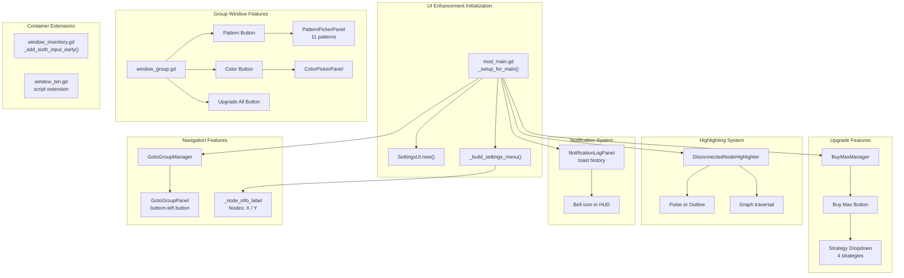
```mermaid
flowchart TD

WindowGroup["window_group.gd"]
PatternBtn["Pattern Button"]
ColorBtn["Color Button"]
UpgradeAllBtn["Upgrade All Button"]
PatternPicker["PatternPickerPanel<br>11 patterns"]
ColorPicker["ColorPickerPanel"]
WindowInventory["window_inventory.gd<br>_add_sixth_input_early()"]
WindowBin["window_bin.gd<br>script extension"]
ModMain["mod_main.gd<br>_setup_for_main()"]
SettingsUI["SettingsUI.new()"]
BuildSettings["_build_settings_menu()"]
GotoGroupMgr["GotoGroupManager"]
GotoGroupPanel["GotoGroupPanel<br>bottom-left button"]
NodeCounter["_node_info_label<br>Nodes: X / Y"]
NotificationLog["NotificationLogPanel<br>toast history"]
BellIcon["Bell icon in HUD"]
DisconnectedHL["DisconnectedNodeHighlighter"]
StyleOptions["Pulse or Outline"]
RecomputeLogic["Graph traversal"]
BuyMaxMgr["BuyMaxManager"]
BuyMaxBtn["Buy Max Button"]
StrategyMenu["Strategy Dropdown<br>4 strategies"]

ModMain --> GotoGroupMgr
ModMain --> DisconnectedHL
ModMain --> BuyMaxMgr
ModMain --> NotificationLog
BuildSettings --> NodeCounter

subgraph subGraph6 ["Upgrade Features"]
    BuyMaxMgr
    BuyMaxBtn
    StrategyMenu
    BuyMaxMgr --> BuyMaxBtn
    BuyMaxBtn --> StrategyMenu
end

subgraph subGraph5 ["Highlighting System"]
    DisconnectedHL
    StyleOptions
    RecomputeLogic
    DisconnectedHL --> StyleOptions
    DisconnectedHL --> RecomputeLogic
end

subgraph subGraph3 ["Notification System"]
    NotificationLog
    BellIcon
    NotificationLog --> BellIcon
end

subgraph subGraph2 ["Navigation Features"]
    GotoGroupMgr
    GotoGroupPanel
    NodeCounter
    GotoGroupMgr --> GotoGroupPanel
end

subgraph subGraph0 ["UI Enhancement Initialization"]
    ModMain
    SettingsUI
    BuildSettings
    ModMain --> SettingsUI
    ModMain --> BuildSettings
end

subgraph subGraph4 ["Group Window Features"]
    WindowGroup
    PatternBtn
    ColorBtn
    UpgradeAllBtn
    PatternPicker
    ColorPicker
    WindowGroup --> PatternBtn
    WindowGroup --> ColorBtn
    WindowGroup --> UpgradeAllBtn
    PatternBtn --> PatternPicker
    ColorBtn --> ColorPicker
end

subgraph subGraph1 ["Container Extensions"]
    WindowInventory
    WindowBin
end
```

**Sources:** [mod_main.gd L278-L340](https://github.com/tajemniktv/TajsMod/blob/5f1e656a/mod_main.gd#L278-L340)

 [mod_main.gd L462-L688](https://github.com/tajemniktv/TajsMod/blob/5f1e656a/mod_main.gd#L462-L688)

## 6-Input Containers

The mod extends inventory containers (storage nodes) to support 6 input slots instead of the default 5. This is an opt-in feature that requires a restart to take effect.

### Implementation

The extension is implemented in `window_inventory.gd` by intercepting the node construction process:

1. **Early Injection** - The `_enter_tree()` method calls `_add_sixth_input_early()` before the parent class initializes
2. **Config Check** - Reads `user://tajs_mod_config.json` to check if `six_input_containers` is enabled
3. **Scene Instantiation** - Loads `res://scenes/input_container.tscn` and adds it as the 6th child
4. **Property Cloning** - Copies properties from the first input to ensure consistency
5. **Signal Connection** - Connects resource signals in `_ready()` for proper functionality

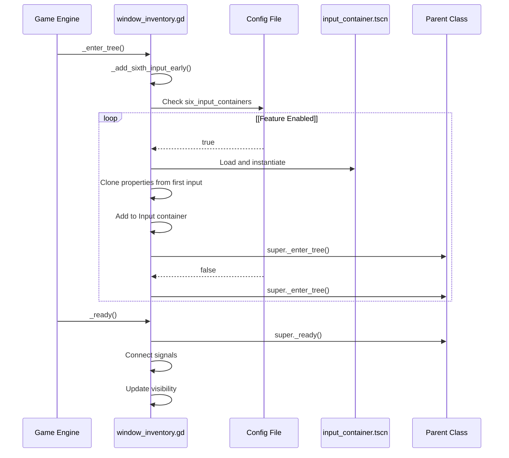
```mermaid
sequenceDiagram
  participant Game Engine
  participant window_inventory.gd
  participant Config File
  participant input_container.tscn
  participant Parent Class

  Game Engine->>window_inventory.gd: _enter_tree()
  window_inventory.gd->>window_inventory.gd: _add_sixth_input_early()
  window_inventory.gd->>Config File: Check six_input_containers
  loop [Feature Enabled]
    Config File-->>window_inventory.gd: true
    window_inventory.gd->>input_container.tscn: Load and instantiate
    window_inventory.gd->>window_inventory.gd: Clone properties from first input
    window_inventory.gd->>window_inventory.gd: Add to Input container
    window_inventory.gd->>Parent Class: super._enter_tree()
    Config File-->>window_inventory.gd: false
    window_inventory.gd->>Parent Class: super._enter_tree()
  end
  Game Engine->>window_inventory.gd: _ready()
  window_inventory.gd->>Parent Class: super._ready()
  window_inventory.gd->>window_inventory.gd: Connect signals
  window_inventory.gd->>window_inventory.gd: Update visibility
```

**Sources:** [extensions/scenes/windows/window_inventory.gd L1-L102](https://github.com/tajemniktv/TajsMod/blob/5f1e656a/extensions/scenes/windows/window_inventory.gd#L1-L102)

### Configuration

The feature is controlled by the `six_input_containers` configuration key and requires a restart. The settings UI displays a "⟳" symbol to indicate this requirement.

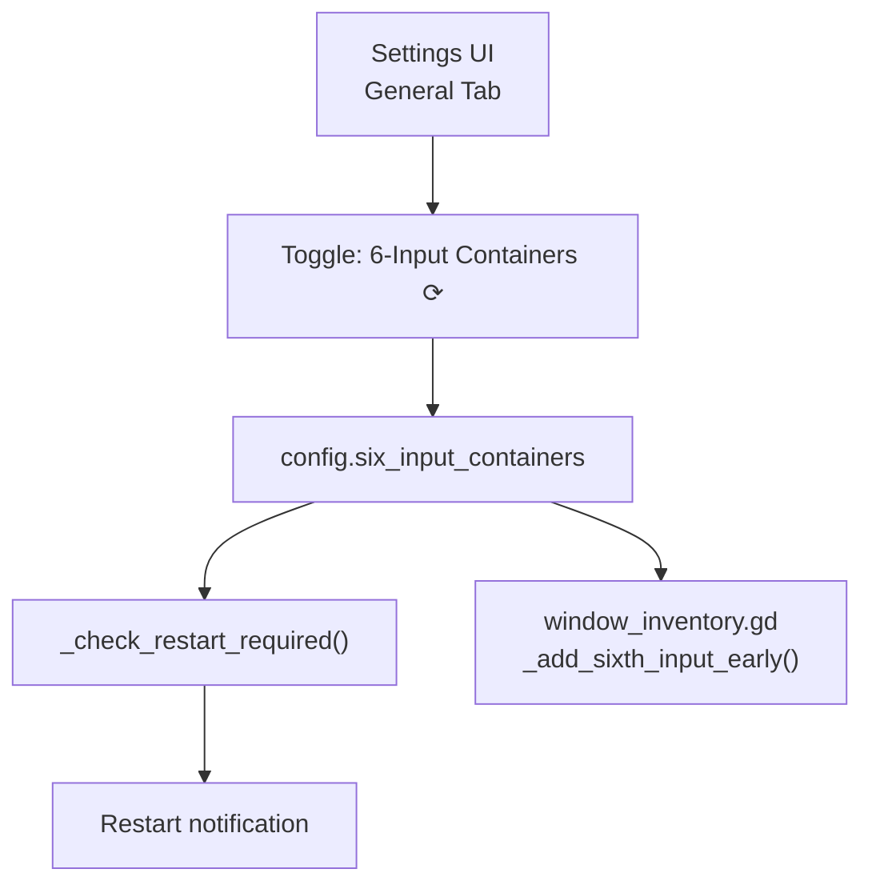
```mermaid
flowchart TD

SettingsUI["Settings UI<br>General Tab"]
Toggle["Toggle: 6-Input Containers ⟳"]
ConfigKey["config.six_input_containers"]
RestartCheck["_check_restart_required()"]
RestartWarning["Restart notification"]
WindowInventory["window_inventory.gd<br>_add_sixth_input_early()"]

SettingsUI --> Toggle
Toggle --> ConfigKey
ConfigKey --> RestartCheck
RestartCheck --> RestartWarning
ConfigKey --> WindowInventory
```

**Sources:** [mod_main.gd L473-L477](https://github.com/tajemniktv/TajsMod/blob/5f1e656a/mod_main.gd#L473-L477)

 [extensions/scenes/windows/window_inventory.gd L17-L30](https://github.com/tajemniktv/TajsMod/blob/5f1e656a/extensions/scenes/windows/window_inventory.gd#L17-L30)

## Go To Group Navigation

A navigation panel that allows players to quickly jump to any node group on the board. The feature adds a button in the bottom-left corner of the HUD that opens a popup list of all existing groups.

### Architecture

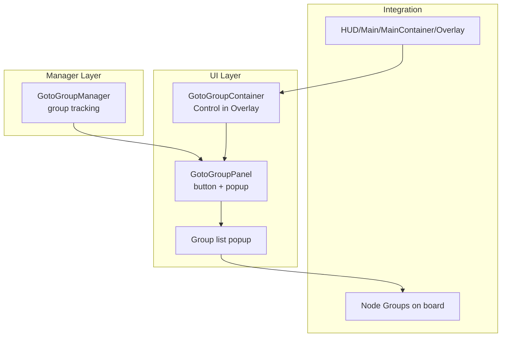
```mermaid
flowchart TD

GotoGroupMgr["GotoGroupManager<br>group tracking"]
GotoContainer["GotoGroupContainer<br>Control in Overlay"]
GotoPanel["GotoGroupPanel<br>button + popup"]
PopupList["Group list popup"]
HUD["HUD/Main/MainContainer/Overlay"]
Groups["Node Groups on board"]

GotoGroupMgr --> GotoPanel
HUD --> GotoContainer
PopupList --> Groups

subgraph Integration ["Integration"]
    HUD
    Groups
end

subgraph subGraph1 ["UI Layer"]
    GotoContainer
    GotoPanel
    PopupList
    GotoPanel --> PopupList
    GotoContainer --> GotoPanel
end

subgraph subGraph0 ["Manager Layer"]
    GotoGroupMgr
end
```

**Sources:** [mod_main.gd L342-L386](https://github.com/tajemniktv/TajsMod/blob/5f1e656a/mod_main.gd#L342-L386)

### Positioning and Layout

The Go To Group panel is positioned in the bottom-left corner, above the bottom toolbar:

* **Anchor Point:** Bottom-left (0, 1)
* **Offset Top:** -150px (to avoid toolbar overlap)
* **Offset Bottom:** -80px
* **Size:** 70x70px minimum

This positioning ensures the button doesn't overlap with existing game UI elements while remaining easily accessible.

**Sources:** [mod_main.gd L368-L385](https://github.com/tajemniktv/TajsMod/blob/5f1e656a/mod_main.gd#L368-L385)

### Configuration

The feature can be toggled on/off without a restart via the `goto_group_enabled` configuration key:

| Setting | Effect |
| --- | --- |
| Enabled (default) | Button visible in HUD |
| Disabled | Button hidden, manager remains active |

**Sources:** [mod_main.gd L499-L503](https://github.com/tajemniktv/TajsMod/blob/5f1e656a/mod_main.gd#L499-L503)

 [mod_main.gd L330-L331](https://github.com/tajemniktv/TajsMod/blob/5f1e656a/mod_main.gd#L330-L331)

## Settings Panel Organization

The mod's settings are organized into four tabs for better usability: **General**, **Visuals**, **Cheats**, and **Debug**. Each tab uses a different icon and contains related settings.

### Tab Structure

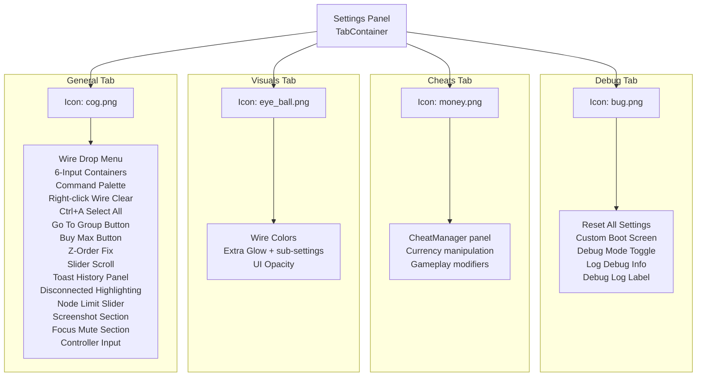
```mermaid
flowchart TD

SettingsPanel["Settings Panel<br>TabContainer"]
GenIcon["Icon: cog.png"]
GenSettings["Wire Drop Menu<br>6-Input Containers<br>Command Palette<br>Right-click Wire Clear<br>Ctrl+A Select All<br>Go To Group Button<br>Buy Max Button<br>Z-Order Fix<br>Slider Scroll<br>Toast History Panel<br>Disconnected Highlighting<br>Node Limit Slider<br>Screenshot Section<br>Focus Mute Section<br>Controller Input"]
VisIcon["Icon: eye_ball.png"]
VisSettings["Wire Colors<br>Extra Glow + sub-settings<br>UI Opacity"]
CheatIcon["Icon: money.png"]
CheatSettings["CheatManager panel<br>Currency manipulation<br>Gameplay modifiers"]
DebugIcon["Icon: bug.png"]
DebugSettings["Reset All Settings<br>Custom Boot Screen<br>Debug Mode Toggle<br>Log Debug Info<br>Debug Log Label"]

SettingsPanel --> GenIcon
SettingsPanel --> VisIcon
SettingsPanel --> CheatIcon
SettingsPanel --> DebugIcon

subgraph subGraph3 ["Debug Tab"]
    DebugIcon
    DebugSettings
    DebugIcon --> DebugSettings
end

subgraph subGraph2 ["Cheats Tab"]
    CheatIcon
    CheatSettings
    CheatIcon --> CheatSettings
end

subgraph subGraph1 ["Visuals Tab"]
    VisIcon
    VisSettings
    VisIcon --> VisSettings
end

subgraph subGraph0 ["General Tab"]
    GenIcon
    GenSettings
    GenIcon --> GenSettings
end
```

**Sources:** [mod_main.gd L462-L688](https://github.com/tajemniktv/TajsMod/blob/5f1e656a/mod_main.gd#L462-L688)

### Settings Categories

Each tab groups related functionality:

1. **General (463-563)** - Core quality-of-life features and toggles
2. **Visuals (574-623)** - Appearance customization and effects
3. **Cheats (626-628)** - Opt-in gameplay modifications
4. **Debug (631-688)** - Diagnostic tools and development features

**Sources:** [mod_main.gd L464](https://github.com/tajemniktv/TajsMod/blob/5f1e656a/mod_main.gd#L464-L464)

 [mod_main.gd L574](https://github.com/tajemniktv/TajsMod/blob/5f1e656a/mod_main.gd#L574-L574)

 [mod_main.gd L626](https://github.com/tajemniktv/TajsMod/blob/5f1e656a/mod_main.gd#L626-L626)

 [mod_main.gd L631](https://github.com/tajemniktv/TajsMod/blob/5f1e656a/mod_main.gd#L631-L631)

## Sticky Notes

The Sticky Notes feature allows players to place editable text notes directly on the canvas. This is useful for annotating complex circuits or leaving reminders.

### Manager Setup

The `StickyNoteManager` is initialized during the main setup phase:

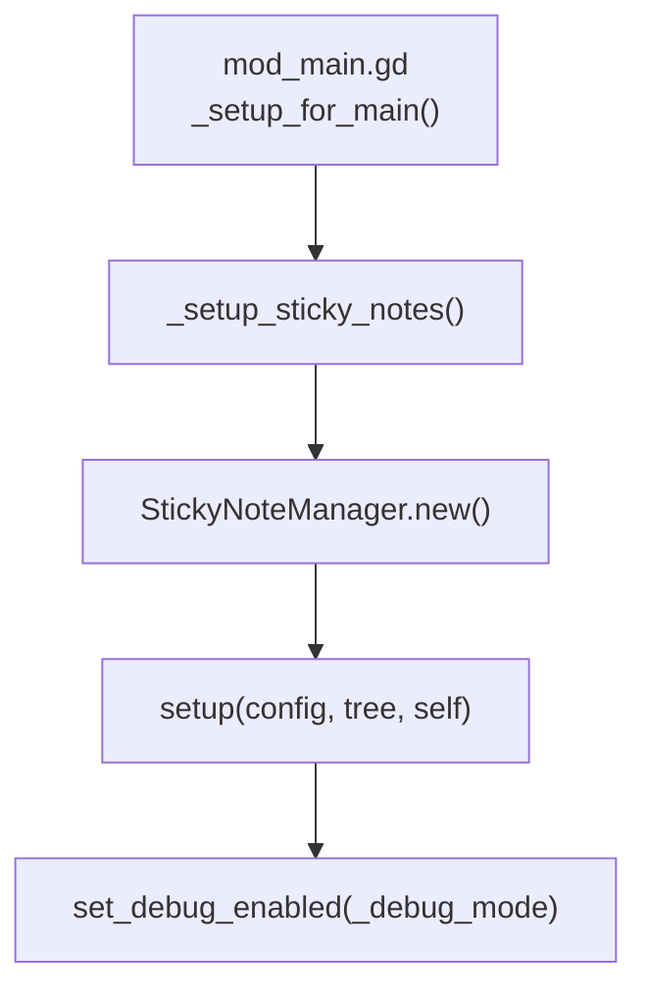
```mermaid
flowchart TD

ModMain["mod_main.gd<br>_setup_for_main()"]
SetupCall["_setup_sticky_notes()"]
Manager["StickyNoteManager.new()"]
Setup["setup(config, tree, self)"]
DebugMode["set_debug_enabled(_debug_mode)"]

ModMain --> SetupCall
SetupCall --> Manager
Manager --> Setup
Setup --> DebugMode
```

**Sources:** [mod_main.gd L441-L459](https://github.com/tajemniktv/TajsMod/blob/5f1e656a/mod_main.gd#L441-L459)

### Features

* **Editable Text:** Click to edit note contents
* **Draggable:** Move notes anywhere on the canvas
* **Persistent:** Saved with the game state
* **Debug Logging:** Optional verbose logging when debug mode is enabled

The manager is passed a reference to `mod_main` to access the `_debug_mode` property for logging control.

**Sources:** [mod_main.gd L447-L457](https://github.com/tajemniktv/TajsMod/blob/5f1e656a/mod_main.gd#L447-L457)

## Disconnected Node Highlighting

This feature visually highlights nodes that are not connected to the main graph for their connection type (e.g., electricity nodes not connected to a power source).

### Architecture

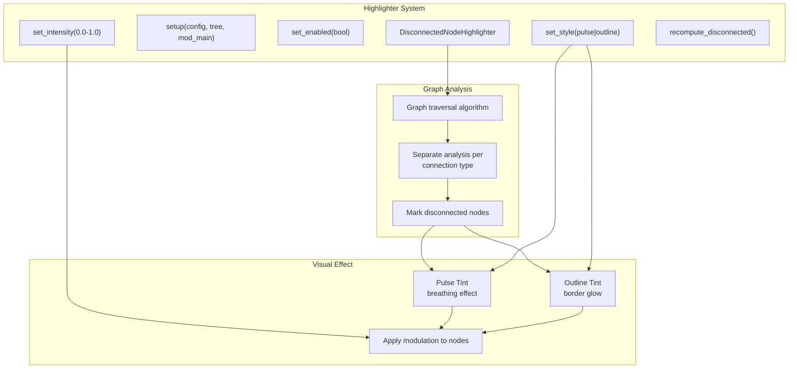
```mermaid
flowchart TD

Manager["DisconnectedNodeHighlighter"]
Setup["setup(config, tree, mod_main)"]
Enabled["set_enabled(bool)"]
Style["set_style(pulse|outline)"]
Intensity["set_intensity(0.0-1.0)"]
Recompute["recompute_disconnected()"]
Traversal["Graph traversal algorithm"]
ConnectionTypes["Separate analysis per<br>connection type"]
Marking["Mark disconnected nodes"]
PulseMode["Pulse Tint<br>breathing effect"]
OutlineMode["Outline Tint<br>border glow"]
ApplyEffect["Apply modulation to nodes"]

Manager --> Traversal
Marking --> PulseMode
Marking --> OutlineMode
Style --> PulseMode
Style --> OutlineMode
Intensity --> ApplyEffect

subgraph subGraph2 ["Visual Effect"]
    PulseMode
    OutlineMode
    ApplyEffect
    PulseMode --> ApplyEffect
    OutlineMode --> ApplyEffect
end

subgraph subGraph1 ["Graph Analysis"]
    Traversal
    ConnectionTypes
    Marking
    Traversal --> ConnectionTypes
    ConnectionTypes --> Marking
end

subgraph subGraph0 ["Highlighter System"]
    Manager
    Setup
    Enabled
    Style
    Intensity
    Recompute
end
```

**Sources:** [mod_main.gd L423-L438](https://github.com/tajemniktv/TajsMod/blob/5f1e656a/mod_main.gd#L423-L438)

 [mod_main.gd L691-L753](https://github.com/tajemniktv/TajsMod/blob/5f1e656a/mod_main.gd#L691-L753)

### Settings UI

The disconnected highlighting section includes:

1. **Main Toggle** - Enable/disable the feature
2. **Style Dropdown** - Choose between "Pulse Tint" (index 0) or "Outline Tint" (index 1)
3. **Intensity Slider** - Control effect strength (0-100%)
4. **Collapsible Sub-settings** - Hidden when feature is disabled

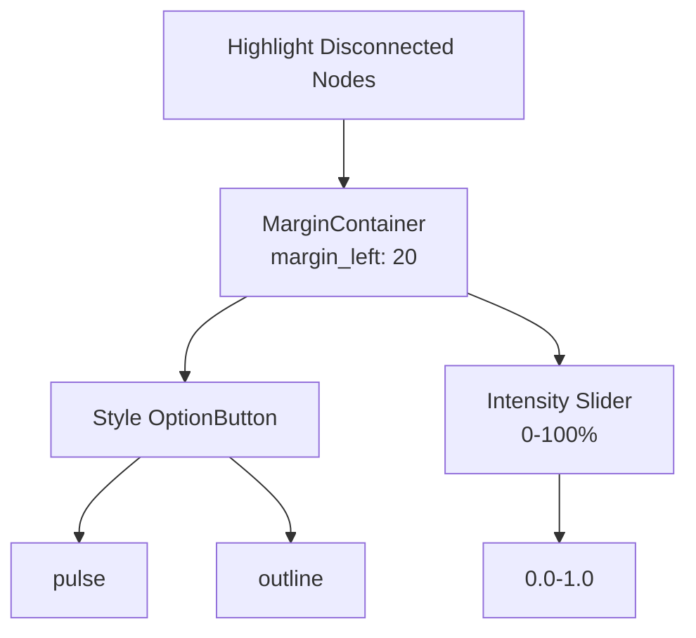
```mermaid
flowchart TD

MainToggle["Highlight Disconnected Nodes"]
SubContainer["MarginContainer<br>margin_left: 20"]
StyleRow["Style OptionButton"]
IntensitySlider["Intensity Slider<br>0-100%"]
PulseStyle["pulse"]
OutlineStyle["outline"]
IntensityValue["0.0-1.0"]

MainToggle --> SubContainer
SubContainer --> StyleRow
SubContainer --> IntensitySlider
StyleRow --> PulseStyle
StyleRow --> OutlineStyle
IntensitySlider --> IntensityValue
```

**Sources:** [mod_main.gd L691-L753](https://github.com/tajemniktv/TajsMod/blob/5f1e656a/mod_main.gd#L691-L753)

### Configuration Keys

| Key | Type | Default | Description |
| --- | --- | --- | --- |
| `highlight_disconnected_enabled` | Boolean | `true` | Enable/disable highlighting |
| `highlight_disconnected_style` | String | `"pulse"` | Visual style: `"pulse"` or `"outline"` |
| `highlight_disconnected_intensity` | Float | `0.5` | Effect intensity (0.0-1.0) |

**Sources:** [mod_main.gd L710](https://github.com/tajemniktv/TajsMod/blob/5f1e656a/mod_main.gd#L710-L710)

 [mod_main.gd L736](https://github.com/tajemniktv/TajsMod/blob/5f1e656a/mod_main.gd#L736-L736)

 [mod_main.gd L748](https://github.com/tajemniktv/TajsMod/blob/5f1e656a/mod_main.gd#L748-L748)

## Node Counter

A real-time display showing current node count versus the node limit. The label is positioned in the General tab settings panel.

### Implementation

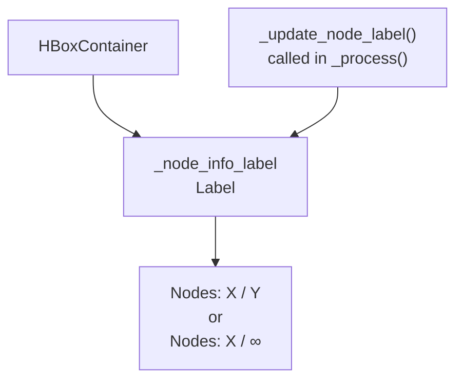
```mermaid
flowchart TD

InfoRow["HBoxContainer"]
Label["_node_info_label<br>Label"]
UpdateLogic["_update_node_label()<br>called in _process()"]
Format["Nodes: X / Y<br>or<br>Nodes: X / ∞"]

InfoRow --> Label
UpdateLogic --> Label
Label --> Format
```

The label is updated every frame in the `_process()` method to reflect current game state. When the node limit is set to infinity (999999), it displays "∞" instead of the numeric value.

**Sources:** [mod_main.gd L541-L548](https://github.com/tajemniktv/TajsMod/blob/5f1e656a/mod_main.gd#L541-L548)

 [mod_main.gd L184](https://github.com/tajemniktv/TajsMod/blob/5f1e656a/mod_main.gd#L184-L184)

### Display Format

* **Standard:** "Nodes: 42 / 400"
* **Infinite Limit:** "Nodes: 42 / ∞"
* **Font Size:** 24px
* **Alignment:** Right-aligned in container
* **Update Frequency:** Every frame

**Sources:** [mod_main.gd L542-L547](https://github.com/tajemniktv/TajsMod/blob/5f1e656a/mod_main.gd#L542-L547)

## Notification Log Panel

A toast history panel that allows players to view recent notifications that may have been missed. Accessed via a bell icon button in the HUD.

### Integration

The notification log is initialized during the main setup phase and can be toggled on/off:

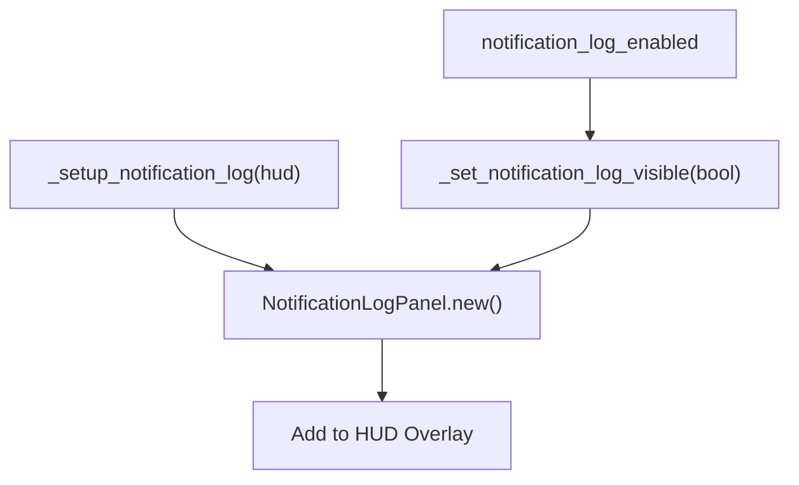
```mermaid
flowchart TD

Setup["_setup_notification_log(hud)"]
Manager["NotificationLogPanel.new()"]
HUDIntegration["Add to HUD Overlay"]
Toggle["notification_log_enabled"]
Visibility["_set_notification_log_visible(bool)"]

Setup --> Manager
Manager --> HUDIntegration
Toggle --> Visibility
Visibility --> Manager
```

**Sources:** [mod_main.gd L315](https://github.com/tajemniktv/TajsMod/blob/5f1e656a/mod_main.gd#L315-L315)

 [mod_main.gd L532-L535](https://github.com/tajemniktv/TajsMod/blob/5f1e656a/mod_main.gd#L532-L535)

### Configuration

* **Config Key:** `notification_log_enabled`
* **Default:** `true`
* **Restart Required:** No
* **Description:** "Show a bell icon to view recent notifications and messages."

**Sources:** [mod_main.gd L532-L535](https://github.com/tajemniktv/TajsMod/blob/5f1e656a/mod_main.gd#L532-L535)

## Group Window Enhancements

The `window_group.gd` extension adds significant customization options to node group windows, including pattern overlays, custom colors, and batch operations.

### Enhanced Title Bar

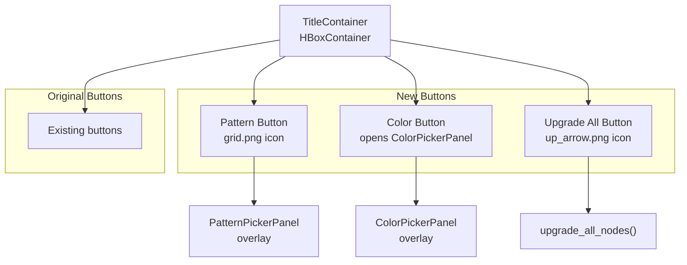
```mermaid
flowchart TD

TitleContainer["TitleContainer<br>HBoxContainer"]
OriginalBtns["Existing buttons"]
PatternBtn["Pattern Button<br>grid.png icon"]
ColorBtn["Color Button<br>opens ColorPickerPanel"]
UpgradeAllBtn["Upgrade All Button<br>up_arrow.png icon"]
PatternPicker["PatternPickerPanel<br>overlay"]
ColorPicker["ColorPickerPanel<br>overlay"]
UpgradeLogic["upgrade_all_nodes()"]

TitleContainer --> OriginalBtns
TitleContainer --> PatternBtn
TitleContainer --> ColorBtn
TitleContainer --> UpgradeAllBtn
PatternBtn --> PatternPicker
ColorBtn --> ColorPicker
UpgradeAllBtn --> UpgradeLogic

subgraph subGraph1 ["New Buttons"]
    PatternBtn
    ColorBtn
    UpgradeAllBtn
end

subgraph subGraph0 ["Original Buttons"]
    OriginalBtns
end
```

**Sources:** [extensions/scenes/windows/window_group.gd L172-L211](https://github.com/tajemniktv/TajsMod/blob/5f1e656a/extensions/scenes/windows/window_group.gd#L172-L211)

### Pattern System

The pattern system supports 11 different pattern types that can be overlaid on group windows:

| Index | Pattern | Description |
| --- | --- | --- |
| 0 | None | No pattern |
| 1 | Horizontal | Horizontal lines |
| 2 | Vertical | Vertical lines |
| 3 | Diagonal / | Forward diagonal lines |
| 4 | Diagonal \ | Backward diagonal lines |
| 5 | Grid | Horizontal + vertical lines |
| 6 | Diamond | Diagonal cross-hatch |
| 7 | Dots | Dot grid pattern |
| 8 | Zigzag | Zigzag lines |
| 9 | Waves | Sine wave pattern |
| 10 | Brick | Brick wall pattern |

**Sources:** [extensions/scripts/ui/pattern_picker_panel.gd L19-L22](https://github.com/tajemniktv/TajsMod/blob/5f1e656a/extensions/scripts/ui/pattern_picker_panel.gd#L19-L22)

### Pattern Customization

The `PatternPickerPanel` provides full control over pattern appearance:

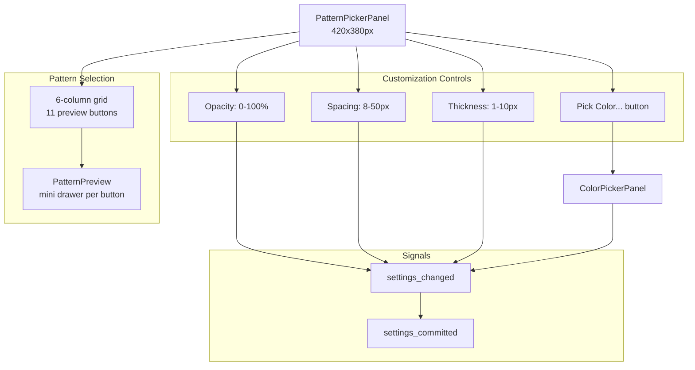
```mermaid
flowchart TD

Panel["PatternPickerPanel<br>420x380px"]
Grid["6-column grid<br>11 preview buttons"]
PreviewDrawer["PatternPreview<br>mini drawer per button"]
ColorBtn["Pick Color... button"]
AlphaSlider["Opacity: 0-100%"]
SpacingSlider["Spacing: 8-50px"]
ThicknessSlider["Thickness: 1-10px"]
Changed["settings_changed"]
Committed["settings_committed"]
ColorPicker["ColorPickerPanel"]

Panel --> Grid
Panel --> ColorBtn
Panel --> AlphaSlider
Panel --> SpacingSlider
Panel --> ThicknessSlider
ColorBtn --> ColorPicker
AlphaSlider --> Changed
SpacingSlider --> Changed
ThicknessSlider --> Changed
ColorPicker --> Changed

subgraph Signals ["Signals"]
    Changed
    Committed
    Changed --> Committed
end

subgraph subGraph1 ["Customization Controls"]
    ColorBtn
    AlphaSlider
    SpacingSlider
    ThicknessSlider
end

subgraph subGraph0 ["Pattern Selection"]
    Grid
    PreviewDrawer
    Grid --> PreviewDrawer
end
```

**Sources:** [extensions/scripts/ui/pattern_picker_panel.gd L84-L175](https://github.com/tajemniktv/TajsMod/blob/5f1e656a/extensions/scripts/ui/pattern_picker_panel.gd#L84-L175)

### Pattern Drawer Implementation

The `PatternDrawer` class extends `Control` and draws patterns on group panels:

1. **Injection Points:** * TitlePanel (group header) * PanelContainer (group body)
2. **Drawing Method:** * `_draw()` called when pattern needs redraw * Match statement dispatches to specific pattern functions * Clipping enabled to constrain to panel bounds
3. **Style Properties:** * `pattern_type`: 0-10 (pattern index) * `color`: Base color with alpha * `spacing`: Distance between pattern elements * `thickness`: Line/dot thickness

**Sources:** [extensions/scenes/windows/window_group.gd L34-L153](https://github.com/tajemniktv/TajsMod/blob/5f1e656a/extensions/scenes/windows/window_group.gd#L34-L153)

### Upgrade All Button

The "Upgrade All" button purchases upgrades for all nodes contained within a group:

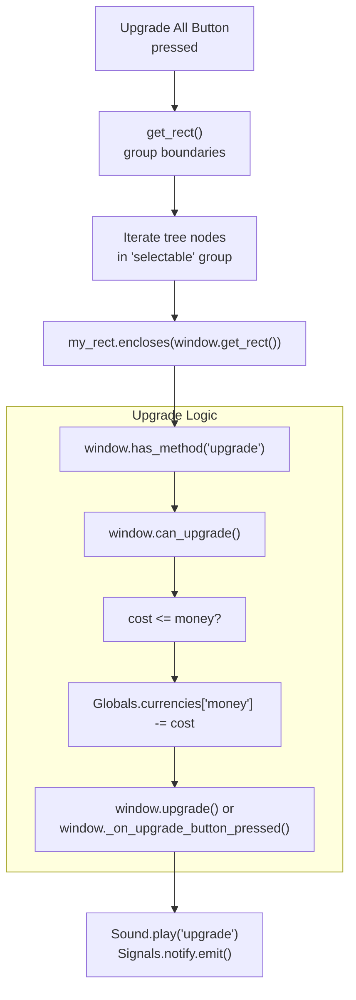
```mermaid
flowchart TD

UpgradeBtn["Upgrade All Button<br>pressed"]
GetRect["get_rect()<br>group boundaries"]
FindNodes["Iterate tree nodes<br>in 'selectable' group"]
CheckContainment["my_rect.encloses(window.get_rect())"]
CanUpgrade["window.can_upgrade()"]
HasMethod["window.has_method('upgrade')"]
CheckCost["cost <= money?"]
DeductCost["Globals.currencies['money'] -= cost"]
CallUpgrade["window.upgrade() or<br>window._on_upgrade_button_pressed()"]
Results["Sound.play('upgrade')<br>Signals.notify.emit()"]

UpgradeBtn --> GetRect
GetRect --> FindNodes
FindNodes --> CheckContainment
CheckContainment --> HasMethod
CallUpgrade --> Results

subgraph subGraph0 ["Upgrade Logic"]
    CanUpgrade
    HasMethod
    CheckCost
    DeductCost
    CallUpgrade
    HasMethod --> CanUpgrade
    CanUpgrade --> CheckCost
    CheckCost --> DeductCost
    DeductCost --> CallUpgrade
end
```

**Sources:** [extensions/scenes/windows/window_group.gd L383-L431](https://github.com/tajemniktv/TajsMod/blob/5f1e656a/extensions/scenes/windows/window_group.gd#L383-L431)

### Persistence

Group window customizations are saved and loaded with the game state:

* **save()** - Returns dictionary with pattern settings and custom color
* **export()** - Same as save(), for blueprint export
* **_load_custom_data()** - Restores pattern and color from metadata

Pattern settings persisted:

* `pattern_index`
* `pattern_color` (as HTML color string)
* `pattern_alpha`
* `pattern_spacing`
* `pattern_thickness`
* `custom_color` (if set)

**Sources:** [extensions/scenes/windows/window_group.gd L446-L490](https://github.com/tajemniktv/TajsMod/blob/5f1e656a/extensions/scenes/windows/window_group.gd#L446-L490)

## Buy Max Button

The Buy Max system adds a split button to upgrade tabs for batch purchasing upgrades with multiple strategies.

### Button Layout

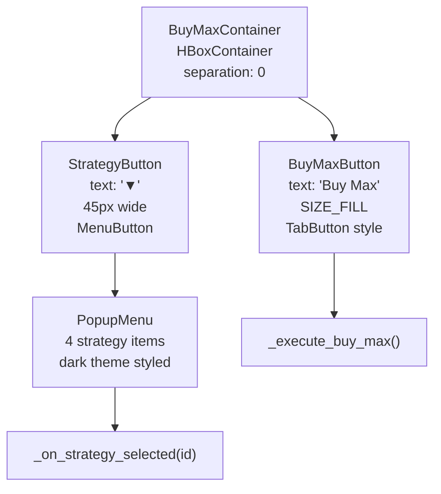
```mermaid
flowchart TD

Container["BuyMaxContainer<br>HBoxContainer<br>separation: 0"]
MainBtn["BuyMaxButton<br>text: 'Buy Max'<br>SIZE_FILL<br>TabButton style"]
StrategyBtn["StrategyButton<br>text: '▼'<br>45px wide<br>MenuButton"]
Popup["PopupMenu<br>4 strategy items<br>dark theme styled"]
Execute["_execute_buy_max()"]
SelectStrategy["_on_strategy_selected(id)"]

Container --> MainBtn
Container --> StrategyBtn
StrategyBtn --> Popup
MainBtn --> Execute
Popup --> SelectStrategy
```

**Sources:** [extensions/scripts/utilities/buy_max_manager.gd L124-L169](https://github.com/tajemniktv/TajsMod/blob/5f1e656a/extensions/scripts/utilities/buy_max_manager.gd#L124-L169)

### Purchase Strategies

The system supports four purchase strategies:

| Strategy ID | Name | Description | Algorithm |
| --- | --- | --- | --- |
| 0 | Round Robin | Even distribution | Buy 1 level of each upgrade in rotation |
| 1 | Cheapest First | Cost optimization | Always buy cheapest available |
| 2 | Most Expensive | Max per purchase | Buy most expensive affordable |
| 3 | Top to Bottom | Sequential maxing | Max each upgrade in UI order |

**Sources:** [extensions/scripts/utilities/buy_max_manager.gd L12-L31](https://github.com/tajemniktv/TajsMod/blob/5f1e656a/extensions/scripts/utilities/buy_max_manager.gd#L12-L31)

### Strategy Implementation

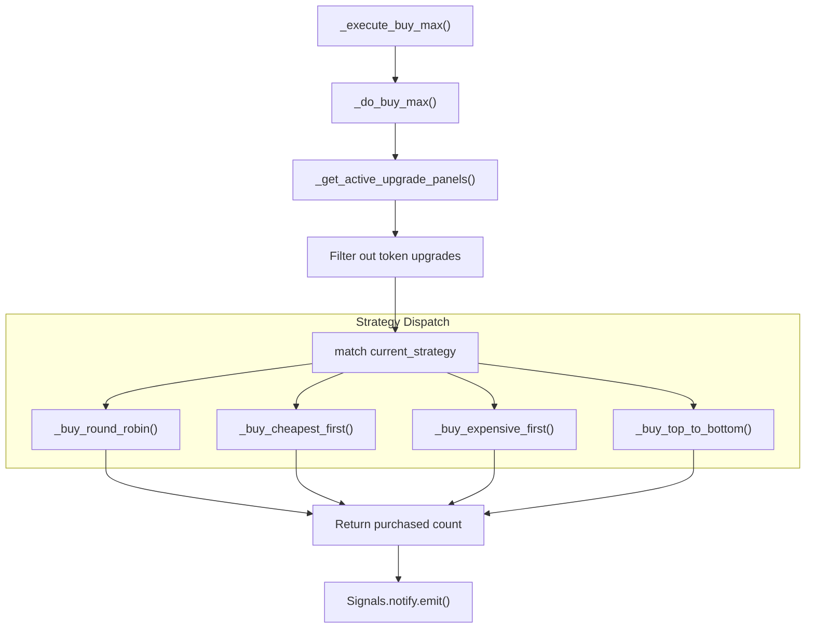
```mermaid
flowchart TD

Execute["_execute_buy_max()"]
DoBuyMax["_do_buy_max()"]
GetPanels["_get_active_upgrade_panels()"]
FilterTokens["Filter out token upgrades"]
Match["match current_strategy"]
RR["_buy_round_robin()"]
CF["_buy_cheapest_first()"]
EF["_buy_expensive_first()"]
TB["_buy_top_to_bottom()"]
Result["Return purchased count"]
Notify["Signals.notify.emit()"]

Execute --> DoBuyMax
DoBuyMax --> GetPanels
GetPanels --> FilterTokens
FilterTokens --> Match
RR --> Result
CF --> Result
EF --> Result
TB --> Result
Result --> Notify

subgraph subGraph0 ["Strategy Dispatch"]
    Match
    RR
    CF
    EF
    TB
    Match --> RR
    Match --> CF
    Match --> EF
    Match --> TB
end
```

**Sources:** [extensions/scripts/utilities/buy_max_manager.gd L255-L283](https://github.com/tajemniktv/TajsMod/blob/5f1e656a/extensions/scripts/utilities/buy_max_manager.gd#L255-L283)

### Strategy Details

**Round Robin (290-323):**

* Groups panels by currency type
* Processes each currency group independently
* Buys one level from each panel in rotation
* Continues until no more purchases possible

**Cheapest First (326-351):**

* Refreshes all panels each iteration
* Finds cheapest `can_purchase()` panel
* Purchases and repeats
* Optimal for maximizing total purchases

**Most Expensive (354-379):**

* Finds most expensive affordable upgrade
* Purchases highest cost item first
* Useful for quick progress on expensive upgrades

**Top to Bottom (382-398):**

* Processes panels in UI order
* Maxes out each upgrade before moving to next
* Predictable and systematic approach

**Sources:** [extensions/scripts/utilities/buy_max_manager.gd L290-L398](https://github.com/tajemniktv/TajsMod/blob/5f1e656a/extensions/scripts/utilities/buy_max_manager.gd#L290-L398)

### UI Styling

The Buy Max button matches the game's theme:

* **Theme:** Dark blue-grey background (`Color(0.086, 0.102, 0.137)`)
* **Border:** Light blue-grey (`Color(0.270, 0.332, 0.457)`)
* **Font Size:** 28px for main button
* **Variation:** `"TabButton"` theme type
* **Popup Styling:** Dark theme with rounded corners and proper margins

**Sources:** [extensions/scripts/utilities/buy_max_manager.gd L131-L138](https://github.com/tajemniktv/TajsMod/blob/5f1e656a/extensions/scripts/utilities/buy_max_manager.gd#L131-L138)

 [extensions/scripts/utilities/buy_max_manager.gd L203-L234](https://github.com/tajemniktv/TajsMod/blob/5f1e656a/extensions/scripts/utilities/buy_max_manager.gd#L203-L234)

### Strategy Menu

The strategy dropdown displays checkmarks for the current selection:

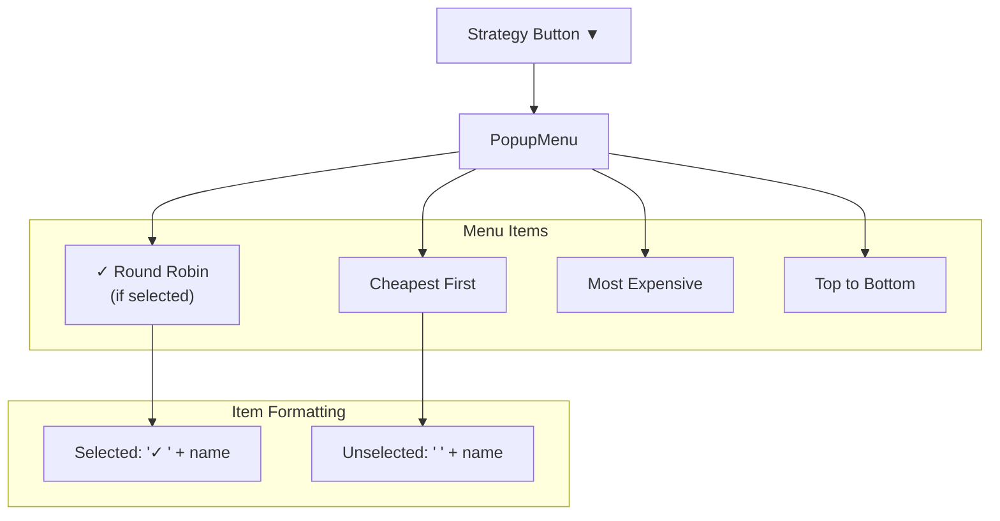
```mermaid
flowchart TD

StrategyBtn["Strategy Button ▼"]
Popup["PopupMenu"]
Item0["✓ Round Robin<br>  (if selected)"]
Item1["Cheapest First"]
Item2["Most Expensive"]
Item3["Top to Bottom"]
Selected["Selected: '✓ ' + name"]
Unselected["Unselected: '   ' + name"]

StrategyBtn --> Popup
Popup --> Item0
Popup --> Item1
Popup --> Item2
Popup --> Item3
Item0 --> Selected
Item1 --> Unselected

subgraph subGraph1 ["Item Formatting"]
    Selected
    Unselected
end

subgraph subGraph0 ["Menu Items"]
    Item0
    Item1
    Item2
    Item3
end
```

**Sources:** [extensions/scripts/utilities/buy_max_manager.gd L182-L199](https://github.com/tajemniktv/TajsMod/blob/5f1e656a/extensions/scripts/utilities/buy_max_manager.gd#L182-L199)

## Z-Order Fix for Node Groups

The `NodeGroupZOrderFix` ensures that fully contained node groups always render on top of their container groups. This prevents visual issues where nested groups appear behind their parents.

### Setup and Configuration

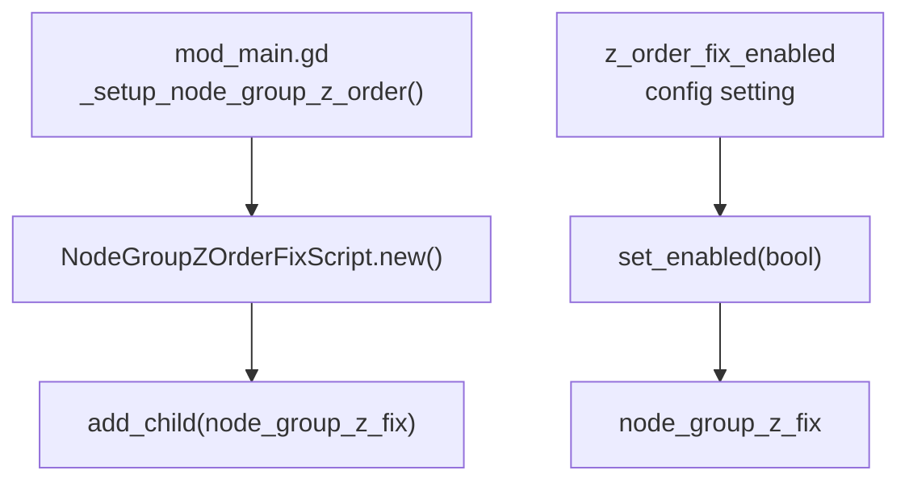
```mermaid
flowchart TD

ModMain["mod_main.gd<br>_setup_node_group_z_order()"]
Create["NodeGroupZOrderFixScript.new()"]
AddChild["add_child(node_group_z_fix)"]
Toggle["z_order_fix_enabled<br>config setting"]
SetEnabled["set_enabled(bool)"]
node_group_z_fix["node_group_z_fix"]

ModMain --> Create
Create --> AddChild
Toggle --> SetEnabled
SetEnabled --> node_group_z_fix
```

**Sources:** [mod_main.gd L389-L401](https://github.com/tajemniktv/TajsMod/blob/5f1e656a/mod_main.gd#L389-L401)

 [mod_main.gd L520-L524](https://github.com/tajemniktv/TajsMod/blob/5f1e656a/mod_main.gd#L520-L524)

The feature is enabled by default and can be toggled in the General settings tab without requiring a restart.

**Sources:** [mod_main.gd L336-L337](https://github.com/tajemniktv/TajsMod/blob/5f1e656a/mod_main.gd#L336-L337)

---

**Complete Sources:**

* [mod_main.gd L1-L848](https://github.com/tajemniktv/TajsMod/blob/5f1e656a/mod_main.gd#L1-L848)
* [extensions/scenes/windows/window_group.gd L1-L525](https://github.com/tajemniktv/TajsMod/blob/5f1e656a/extensions/scenes/windows/window_group.gd#L1-L525)
* [extensions/scripts/utilities/buy_max_manager.gd L1-L451](https://github.com/tajemniktv/TajsMod/blob/5f1e656a/extensions/scripts/utilities/buy_max_manager.gd#L1-L451)
* [extensions/scenes/windows/window_inventory.gd L1-L102](https://github.com/tajemniktv/TajsMod/blob/5f1e656a/extensions/scenes/windows/window_inventory.gd#L1-L102)
* [extensions/scripts/ui/pattern_picker_panel.gd L1-L524](https://github.com/tajemniktv/TajsMod/blob/5f1e656a/extensions/scripts/ui/pattern_picker_panel.gd#L1-L524)
* [extensions/scripts/utilities/focus_handler.gd L1-L93](https://github.com/tajemniktv/TajsMod/blob/5f1e656a/extensions/scripts/utilities/focus_handler.gd#L1-L93)