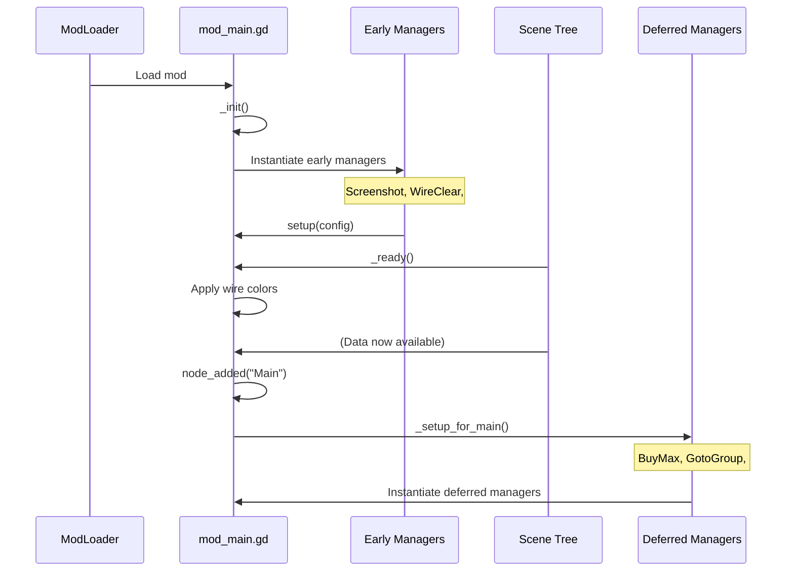
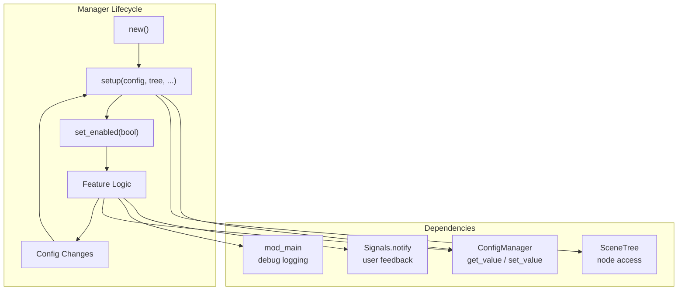
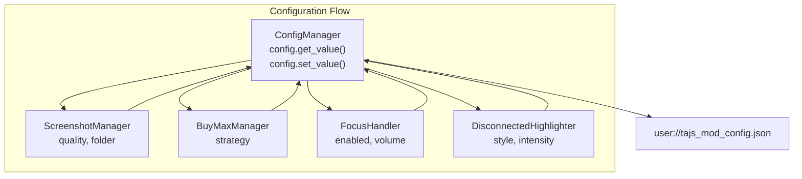
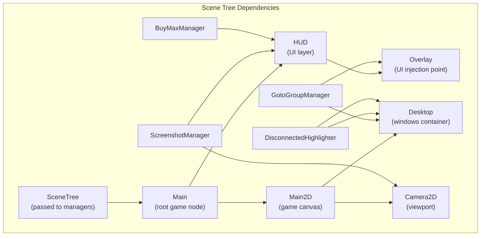
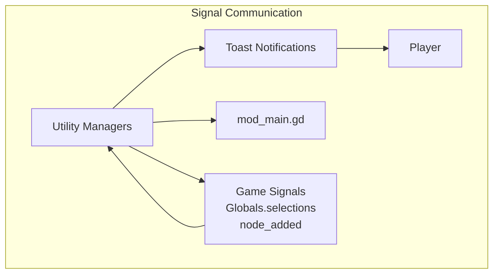
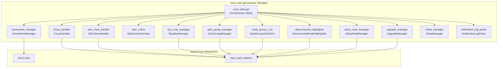
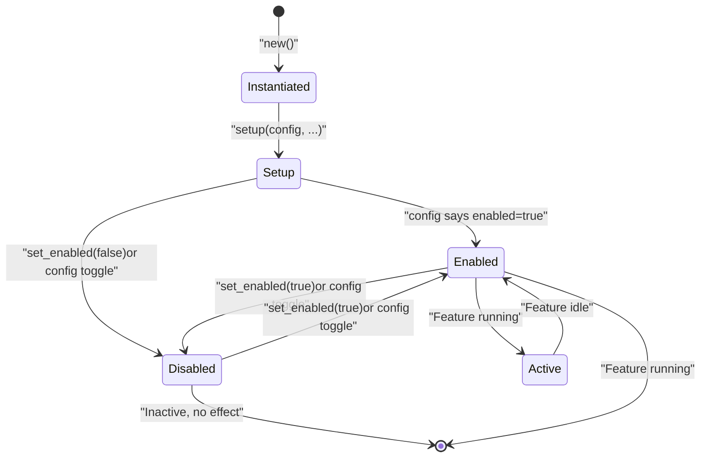
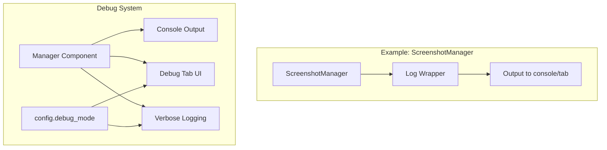

> **Relevant source files**
> * [extensions/scenes/windows/window_inventory.gd](https://github.com/tajemniktv/TajsMod/blob/5f1e656a/extensions/scenes/windows/window_inventory.gd)
> * [extensions/scripts/utilities/buy_max_manager.gd](https://github.com/tajemniktv/TajsMod/blob/5f1e656a/extensions/scripts/utilities/buy_max_manager.gd)
> * [extensions/scripts/utilities/focus_handler.gd](https://github.com/tajemniktv/TajsMod/blob/5f1e656a/extensions/scripts/utilities/focus_handler.gd)
> * [extensions/scripts/utilities/screenshot_manager.gd](https://github.com/tajemniktv/TajsMod/blob/5f1e656a/extensions/scripts/utilities/screenshot_manager.gd)
> * [mod_main.gd](https://github.com/tajemniktv/TajsMod/blob/5f1e656a/mod_main.gd)

## Purpose and Scope

This page documents the architecture and integration patterns for the 12 utility manager components in Taj's Mod. These managers are modular, single-responsibility components that implement specific features such as screenshots, audio handling, visual enhancements, and gameplay utilities. Each manager is instantiated and coordinated by [mod_main.gd](/tajemniktv/TajsMod/3.1-the-main-orchestrator-(mod_main.gd)), which serves as the central orchestrator.

For documentation on specific managers:

* **Screenshot capture system**: See [Screenshot Manager](/tajemniktv/TajsMod/6.1-screenshot-manager)
* **Upgrade automation**: See [Buy Max Manager](/tajemniktv/TajsMod/6.2-buy-max-manager)
* **Other managers** (Focus, WireColor, GotoGroup, etc.): See [Other Utility Managers](/tajemniktv/TajsMod/6.3-other-utility-managers)

For information about the command system that allows users to interact with these managers, see [Command Palette System](/tajemniktv/TajsMod/4-command-palette-system).

---

## Manager Catalog

The mod includes 12 utility managers, each handling a distinct feature domain:

| Manager | Class Name | Purpose | Init Phase | Config Key |
| --- | --- | --- | --- | --- |
| Screenshot | `ScreenshotManager` | Tiled desktop image capture with quality settings | Early (_init) | `screenshot_quality`, `screenshot_folder` |
| Wire Clear | `WireClearHandler` | Right-click wire disconnection | Early (_init) | `right_click_clear_enabled` |
| Focus Handler | `FocusHandler` | Audio volume reduction on focus loss | Early (_init) | `mute_on_focus_loss`, `background_volume` |
| Wire Colors | `WireColorOverrides` | Custom wire colors by resource type | Early (_ready) | `custom_wire_colors` |
| Buy Max | `BuyMaxManager` | Batch upgrade purchasing with 4 strategies | Deferred | `buy_max_enabled`, `buy_max_strategy` |
| Goto Group | `GotoGroupManager` | Quick navigation to node groups | Deferred | `goto_group_enabled` |
| Z-Order Fix | `NodeGroupZOrderFix` | Nested group rendering order correction | Deferred | `z_order_fix_enabled` |
| Disconnected Highlighter | `DisconnectedNodeHighlighter` | Visual highlighting of unconnected nodes | Deferred | `highlight_disconnected_enabled` |
| Sticky Notes | `StickyNoteManager` | Editable canvas text annotations | Deferred | `sticky_note_manager` settings |
| Upgrade Manager | `UpgradeManager` | Modifier key-based upgrade multipliers | Deferred | `upgrade_multiplier` |
| Cheat Manager | `CheatManager` | Debug cheats for currency/resources | Deferred | Various cheat toggles |
| Notification Log | `NotificationLogPanel` | Toast notification history viewer | Deferred | `notification_log_enabled` |

Sources: [mod_main.gd L12-L30](https://github.com/tajemniktv/TajsMod/blob/5f1e656a/mod_main.gd#L12-L30)

 [mod_main.gd L33-L48](https://github.com/tajemniktv/TajsMod/blob/5f1e656a/mod_main.gd#L33-L48)

 [mod_main.gd L72-L114](https://github.com/tajemniktv/TajsMod/blob/5f1e656a/mod_main.gd#L72-L114)

 [mod_main.gd L278-L340](https://github.com/tajemniktv/TajsMod/blob/5f1e656a/mod_main.gd#L278-L340)

---

## Manager Lifecycle and Integration

### Initialization Phases

Managers are initialized in two distinct phases based on their dependencies:



**Early Initialization** ([mod_main.gd L92-L114](https://github.com/tajemniktv/TajsMod/blob/5f1e656a/mod_main.gd#L92-L114)

):

* Occurs in `_init()` and `_ready()`
* Managers that don't require HUD or Main scene access
* Includes: ScreenshotManager, WireClearHandler, FocusHandler, WireColorOverrides

**Deferred Setup** ([mod_main.gd L278-L340](https://github.com/tajemniktv/TajsMod/blob/5f1e656a/mod_main.gd#L278-L340)

):

* Occurs in `_setup_for_main()` after Main scene is loaded
* Managers that need HUD nodes, viewport access, or UI injection
* Includes: BuyMaxManager, GotoGroupManager, DisconnectedNodeHighlighter, StickyNoteManager, etc.

Sources: [mod_main.gd L72-L114](https://github.com/tajemniktv/TajsMod/blob/5f1e656a/mod_main.gd#L72-L114)

 [mod_main.gd L278-L340](https://github.com/tajemniktv/TajsMod/blob/5f1e656a/mod_main.gd#L278-L340)

---

### Common Integration Pattern

Most managers follow this standard interface pattern:



**Standard Manager Interface:**

* Constructor (`_init()` or `new()`) - Creates instance, minimal setup
* `setup(...)` - Initializes with dependencies (config, tree, callbacks)
* `set_enabled(bool)` - Runtime enable/disable toggle
* Feature-specific methods - Core functionality
* Config integration - Reads settings, writes changes

Sources: [mod_main.gd L92-L114](https://github.com/tajemniktv/TajsMod/blob/5f1e656a/mod_main.gd#L92-L114)

 [extensions/scripts/utilities/screenshot_manager.gd L32-L46](https://github.com/tajemniktv/TajsMod/blob/5f1e656a/extensions/scripts/utilities/screenshot_manager.gd#L32-L46)

 [extensions/scripts/utilities/focus_handler.gd L22-L30](https://github.com/tajemniktv/TajsMod/blob/5f1e656a/extensions/scripts/utilities/focus_handler.gd#L22-L30)

 [extensions/scripts/utilities/buy_max_manager.gd L46-L76](https://github.com/tajemniktv/TajsMod/blob/5f1e656a/extensions/scripts/utilities/buy_max_manager.gd#L46-L76)

---

## Manager Dependencies and Communication

### Configuration Integration

All managers integrate with `ConfigManager` for persistent settings:



**Configuration Pattern:**

1. Manager receives `config` reference in `setup()`
2. Loads initial values: `config.get_value("key", default)`
3. Updates on change: `config.set_value("key", new_value)`
4. ConfigManager auto-saves to disk

Sources: [mod_main.gd L89](https://github.com/tajemniktv/TajsMod/blob/5f1e656a/mod_main.gd#L89-L89)

 [extensions/scripts/utilities/screenshot_manager.gd L44-L46](https://github.com/tajemniktv/TajsMod/blob/5f1e656a/extensions/scripts/utilities/screenshot_manager.gd#L44-L46)

 [extensions/scripts/utilities/buy_max_manager.gd L50-L54](https://github.com/tajemniktv/TajsMod/blob/5f1e656a/extensions/scripts/utilities/buy_max_manager.gd#L50-L54)

 [extensions/scripts/utilities/focus_handler.gd L22-L29](https://github.com/tajemniktv/TajsMod/blob/5f1e656a/extensions/scripts/utilities/focus_handler.gd#L22-L29)

---

### Scene Tree and Node Access

Managers that need to interact with the game's UI or canvas require SceneTree access:



**Tree Access Pattern:**

* `tree.root.get_node_or_null("Main/HUD")` - Find HUD nodes
* `tree.root.get_node_or_null("Main/Main2D/Camera2D")` - Access camera
* `tree.process_frame` - Frame synchronization for captures

Sources: [extensions/scripts/utilities/screenshot_manager.gd L32-L33](https://github.com/tajemniktv/TajsMod/blob/5f1e656a/extensions/scripts/utilities/screenshot_manager.gd#L32-L33)

 [extensions/scripts/utilities/buy_max_manager.gd L46-L76](https://github.com/tajemniktv/TajsMod/blob/5f1e656a/extensions/scripts/utilities/buy_max_manager.gd#L46-L76)

 [mod_main.gd L344-L386](https://github.com/tajemniktv/TajsMod/blob/5f1e656a/mod_main.gd#L344-L386)

---

### Signal-Based Communication

Managers communicate with the game and user through Godot signals:



**Common Signal Usage:**

* `Signals.notify.emit("check", "Success message")` - Success feedback
* `Signals.notify.emit("exclamation", "Error message")` - Error feedback
* `Sound.play("click_toggle2")` - Audio feedback for actions

Sources: [extensions/scripts/utilities/screenshot_manager.gd L339](https://github.com/tajemniktv/TajsMod/blob/5f1e656a/extensions/scripts/utilities/screenshot_manager.gd#L339-L339)

 [extensions/scripts/utilities/buy_max_manager.gd L250-L252](https://github.com/tajemniktv/TajsMod/blob/5f1e656a/extensions/scripts/utilities/buy_max_manager.gd#L250-L252)

 [mod_main.gd L276](https://github.com/tajemniktv/TajsMod/blob/5f1e656a/mod_main.gd#L276-L276)

---

## Code Entity Mapping: Manager Classes to Files

This diagram maps each manager component to its source file and key methods:

```mermaid
flowchart TD

Base["Node / RefCounted<br>(Godot base classes)"]
SM["ScreenshotManager<br>RefCounted"]
FH["TajsModFocusHandler<br>Node"]
BM["BuyMaxManager<br>Node"]
WC["WireClearHandler<br>Node"]
WO["WireColorOverrides<br>Node"]
GG["GotoGroupManager<br>Node"]
ZO["NodeGroupZOrderFix<br>Node"]
DH["DisconnectedNodeHighlighter<br>Node"]
SN["StickyNoteManager<br>Node"]
UM["UpgradeManager<br>Node"]
CM["CheatManager<br>Node"]
SMFile["utilities/screenshot_manager.gd<br>take_screenshot()<br>take_screenshot_selection()<br>add_screenshot_section()"]
FHFile["utilities/focus_handler.gd<br>setup(config)<br>set_enabled(bool)<br>_on_focus_lost()<br>_on_focus_gained()"]
BMFile["utilities/buy_max_manager.gd<br>setup(tree, config)<br>set_strategy(int)<br>_execute_buy_max()<br>_buy_round_robin()"]
WCFile["wire_drop/wire_clear_handler.gd<br>setup(config)<br>set_enabled(bool)"]
WOFile["utilities/wire_color_overrides.gd<br>setup(config)<br>apply_overrides()<br>set_enabled(bool)"]
GGFile["utilities/goto_group_manager.gd<br>(manages group navigation)"]
ZOFile["utilities/node_group_z_order_fix.gd<br>set_enabled(bool)"]
DHFile["utilities/disconnected_node_highlighter.gd<br>setup(config, tree)<br>set_enabled(bool)<br>recompute_disconnected()"]
SNFile["utilities/sticky_note_manager.gd<br>setup(config, tree)<br>set_debug_enabled(bool)"]
UMFile["utilities/upgrade_manager.gd<br>(handles modifier keys)"]
CMFile["utilities/cheat_manager.gd<br>build_cheats_tab(parent)"]

SM --> SMFile
FH --> FHFile
BM --> BMFile
WC --> WCFile
WO --> WOFile
GG --> GGFile
ZO --> ZOFile
DH --> DHFile
SN --> SNFile
UM --> UMFile
CM --> CMFile

subgraph subGraph1 ["Source Files"]
    SMFile
    FHFile
    BMFile
    WCFile
    WOFile
    GGFile
    ZOFile
    DHFile
    SNFile
    UMFile
    CMFile
end

subgraph subGraph0 ["Manager Class Hierarchy"]
    Base
    SM
    FH
    BM
    WC
    WO
    GG
    ZO
    DH
    SN
    UM
    CM
    Base --> SM
    Base --> FH
    Base --> BM
    Base --> WC
    Base --> WO
    Base --> GG
    Base --> ZO
    Base --> DH
    Base --> SN
    Base --> UM
    Base --> CM
end
```



Sources: [mod_main.gd L12-L30](https://github.com/tajemniktv/TajsMod/blob/5f1e656a/mod_main.gd#L12-L30)

 [extensions/scripts/utilities/screenshot_manager.gd L1-L10](https://github.com/tajemniktv/TajsMod/blob/5f1e656a/extensions/scripts/utilities/screenshot_manager.gd#L1-L10)

 [extensions/scripts/utilities/focus_handler.gd L1-L10](https://github.com/tajemniktv/TajsMod/blob/5f1e656a/extensions/scripts/utilities/focus_handler.gd#L1-L10)

 [extensions/scripts/utilities/buy_max_manager.gd L1-L10](https://github.com/tajemniktv/TajsMod/blob/5f1e656a/extensions/scripts/utilities/buy_max_manager.gd#L1-L10)

---

## Manager Instantiation and Ownership

All manager instances are created and owned by `mod_main.gd`:



**Ownership Pattern:**

* Instance variables declared in [mod_main.gd L33-L48](https://github.com/tajemniktv/TajsMod/blob/5f1e656a/mod_main.gd#L33-L48)
* Node-based managers added as children via `add_child()`
* RefCounted managers (ScreenshotManager) held by reference only
* All managers accessible via `mod_main` instance

Sources: [mod_main.gd L33-L48](https://github.com/tajemniktv/TajsMod/blob/5f1e656a/mod_main.gd#L33-L48)

 [mod_main.gd L92-L114](https://github.com/tajemniktv/TajsMod/blob/5f1e656a/mod_main.gd#L92-L114)

 [mod_main.gd L356-L421](https://github.com/tajemniktv/TajsMod/blob/5f1e656a/mod_main.gd#L356-L421)

---

## Manager Enable/Disable Pattern

Most managers support runtime toggling through a consistent interface:



**Standard Enable/Disable Methods:**

```go
# BuyMaxManager example
func set_enabled(enabled: bool) -> void:
    _enabled = enabled
    if _config:
        _config.set_value("buy_max_enabled", enabled)
    _set_visible(enabled)

# FocusHandler example  
func set_enabled(enabled: bool) -> void:
    _enabled = enabled
    if _config:
        _config.set_value("mute_on_focus_loss", enabled)
    if not enabled and not _was_focused:
        _restore_volume()
```

Managers respond to Settings UI toggles immediately via this pattern, allowing real-time feature control without restart.

Sources: [extensions/scripts/utilities/focus_handler.gd L32-L39](https://github.com/tajemniktv/TajsMod/blob/5f1e656a/extensions/scripts/utilities/focus_handler.gd#L32-L39)

 [mod_main.gd L500-L508](https://github.com/tajemniktv/TajsMod/blob/5f1e656a/mod_main.gd#L500-L508)

---

## Debug and Logging Integration

Managers integrate with the mod's debug logging system:



**Logging Pattern:**

* Each manager defines `const LOG_NAME = "TajsModded:ManagerName"`
* Uses `ModLoaderLog.info(message, LOG_NAME)` for console output
* Optional callback to Settings UI debug tab
* `_debug_mode` flag controls verbosity

Sources: [extensions/scripts/utilities/screenshot_manager.gd L8-L12](https://github.com/tajemniktv/TajsMod/blob/5f1e656a/extensions/scripts/utilities/screenshot_manager.gd#L8-L12)

 [extensions/scripts/utilities/screenshot_manager.gd L48-L52](https://github.com/tajemniktv/TajsMod/blob/5f1e656a/extensions/scripts/utilities/screenshot_manager.gd#L48-L52)

 [extensions/scripts/utilities/buy_max_manager.gd L9](https://github.com/tajemniktv/TajsMod/blob/5f1e656a/extensions/scripts/utilities/buy_max_manager.gd#L9-L9)

 [mod_main.gd L656-L667](https://github.com/tajemniktv/TajsMod/blob/5f1e656a/mod_main.gd#L656-L667)

---

## Manager UI Integration Points

Managers that provide UI components integrate through well-defined injection points:

| Manager | UI Component | Injection Target | Method |
| --- | --- | --- | --- |
| ScreenshotManager | Quality buttons, Take button | Settings Panel → General tab | `add_screenshot_section()` |
| BuyMaxManager | Buy Max split button | Upgrades tab → ButtonsContainer | `_inject_buy_max_button()` |
| GotoGroupManager | Group navigation button | HUD → Overlay → GotoGroupContainer | `_setup_goto_group()` |
| DisconnectedHighlighter | Highlight overlays | Desktop → Windows | Dynamic overlay creation |
| StickyNoteManager | Sticky note panels | Desktop → Canvas | Dynamic note creation |
| NotificationLogPanel | Bell icon + history | HUD → Overlay | Direct panel injection |

**UI Injection Strategy:**

* Settings UI integration: Managers provide `add_*_section(parent)` methods
* HUD injection: Find specific containers via `get_node_or_null()` paths
* Dynamic UI: Create overlays/panels as needed, parent to appropriate containers

Sources: [extensions/scripts/utilities/screenshot_manager.gd L592-L704](https://github.com/tajemniktv/TajsMod/blob/5f1e656a/extensions/scripts/utilities/screenshot_manager.gd#L592-L704)

 [extensions/scripts/utilities/buy_max_manager.gd L112-L169](https://github.com/tajemniktv/TajsMod/blob/5f1e656a/extensions/scripts/utilities/buy_max_manager.gd#L112-L169)

 [mod_main.gd L342-L386](https://github.com/tajemniktv/TajsMod/blob/5f1e656a/mod_main.gd#L342-L386)

---

## Feature-Specific Initialization Details

### Early Managers (No HUD Dependencies)

These managers initialize in `_init()` or `_ready()` because they don't need UI access:

**ScreenshotManager** [mod_main.gd L92-L96](https://github.com/tajemniktv/TajsMod/blob/5f1e656a/mod_main.gd#L92-L96)

:

```
screenshot_manager = ScreenshotManagerScript.new()
screenshot_manager.quality = int(config.get_value("screenshot_quality", 2))
screenshot_manager.screenshot_folder = config.get_value("screenshot_folder", "user://screenshots")
screenshot_manager.watermark_enabled = config.get_value("screenshot_watermark", true)
screenshot_manager.set_config(config)
```

**WireClearHandler** [mod_main.gd L103-L105](https://github.com/tajemniktv/TajsMod/blob/5f1e656a/mod_main.gd#L103-L105)

:

```
wire_clear_handler = WireClearHandlerScript.new()
wire_clear_handler.setup(config)
add_child(wire_clear_handler)
```

**FocusHandler** [mod_main.gd L108-L110](https://github.com/tajemniktv/TajsMod/blob/5f1e656a/mod_main.gd#L108-L110)

:

```
focus_handler = FocusHandlerScript.new()
focus_handler.setup(config)
add_child(focus_handler)
```

---

### Deferred Managers (Require HUD/Scene Access)

These managers initialize in `_setup_for_main()` after the Main scene is ready:

**BuyMaxManager** [mod_main.gd L406-L420](https://github.com/tajemniktv/TajsMod/blob/5f1e656a/mod_main.gd#L406-L420)

:

```
buy_max_manager = BuyMaxManagerScript.new()
buy_max_manager.name = "BuyMaxManager"
add_child(buy_max_manager)
await get_tree().create_timer(0.1).timeout
buy_max_manager.setup(get_tree(), config)
```

**DisconnectedNodeHighlighter** [mod_main.gd L425-L438](https://github.com/tajemniktv/TajsMod/blob/5f1e656a/mod_main.gd#L425-L438)

:

```
disconnected_highlighter = DisconnectedNodeHighlighterScript.new()
disconnected_highlighter.name = "DisconnectedNodeHighlighter"
add_child(disconnected_highlighter)
disconnected_highlighter.setup(config, get_tree(), self)
```

**GotoGroupManager** [mod_main.gd L355-L363](https://github.com/tajemniktv/TajsMod/blob/5f1e656a/mod_main.gd#L355-L363)

:

```
goto_group_manager = GotoGroupManagerScript.new()
goto_group_manager.name = "GotoGroupManager"
add_child(goto_group_manager)
goto_group_panel = GotoGroupPanelScript.new()
goto_group_panel.setup(goto_group_manager)
```

---

## Summary: Manager Architecture Principles

The utility manager system follows these core architectural principles:

1. **Single Responsibility** - Each manager handles one feature domain
2. **Late Binding** - Dependencies injected via `setup()` after construction
3. **Configuration Driven** - All settings persisted through ConfigManager
4. **Hub-and-Spoke** - mod_main.gd coordinates all managers
5. **Runtime Toggle** - Features can be enabled/disabled without restart (where possible)
6. **Scene Tree Aware** - Managers know when to initialize based on dependencies
7. **Signal Communication** - Decoupled communication via Godot signals
8. **Uniform Interface** - Common patterns for setup, enable/disable, logging

This modular architecture allows features to be:

* Developed independently
* Tested in isolation
* Enabled/disabled by configuration
* Extended without affecting other managers

Sources: [mod_main.gd L1-L163](https://github.com/tajemniktv/TajsMod/blob/5f1e656a/mod_main.gd#L1-L163)

 [mod_main.gd L278-L340](https://github.com/tajemniktv/TajsMod/blob/5f1e656a/mod_main.gd#L278-L340)