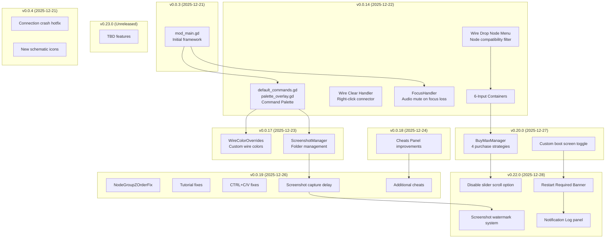
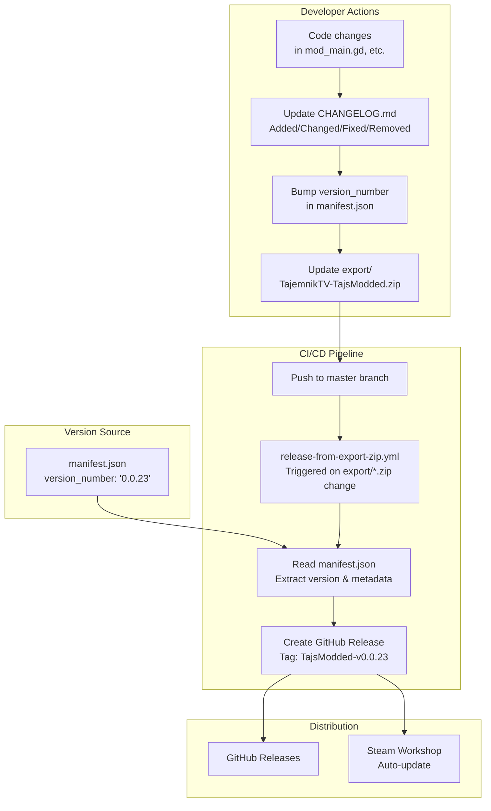
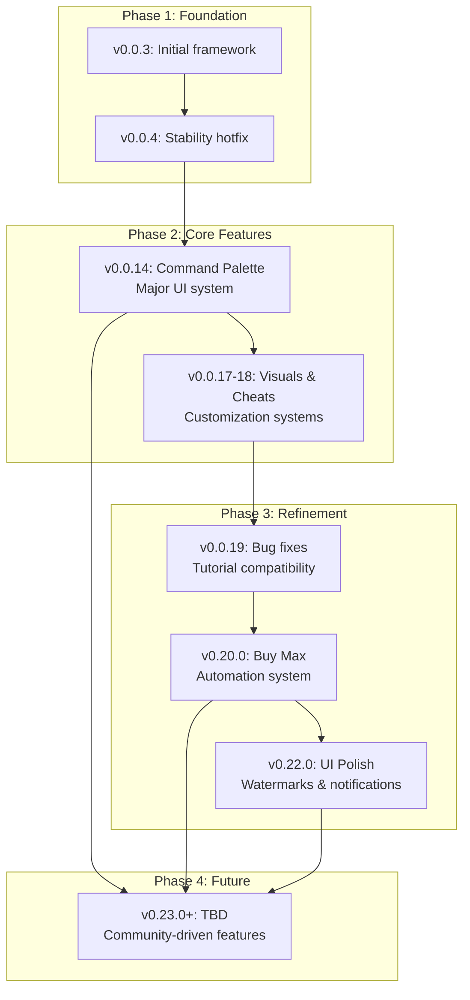

> **Relevant source files**
> * [CHANGELOG.md](https://github.com/tajemniktv/TajsMod/blob/5f1e656a/CHANGELOG.md)
> * [README.md](https://github.com/tajemniktv/TajsMod/blob/5f1e656a/README.md)
> * [manifest.json](https://github.com/tajemniktv/TajsMod/blob/5f1e656a/manifest.json)
> * [preview/Containers6Input.png](https://github.com/tajemniktv/TajsMod/blob/5f1e656a/preview/Containers6Input.png)

## Purpose and Scope

This document provides a comprehensive history of TajsMod's development from its initial release to the current version, tracking feature additions, architectural changes, and bug fixes across all versions. It also outlines the planned future development direction based on the current roadmap.

For information about the CI/CD pipeline and release automation, see [Building and Distribution](/tajemniktv/TajsMod/8.1-building-and-distribution). For details on how to contribute new features, see [Contributing Guidelines](/tajemniktv/TajsMod/8.2-contributing-guidelines).

Sources: [CHANGELOG.md L1-L154](https://github.com/tajemniktv/TajsMod/blob/5f1e656a/CHANGELOG.md#L1-L154)

 [manifest.json L1-L37](https://github.com/tajemniktv/TajsMod/blob/5f1e656a/manifest.json#L1-L37)

---

## Current Version Status

**Version:** `0.0.23` (as of [manifest.json L34](https://github.com/tajemniktv/TajsMod/blob/5f1e656a/manifest.json#L34-L34)

)
**Status:** `beta` ([manifest.json L28](https://github.com/tajemniktv/TajsMod/blob/5f1e656a/manifest.json#L28-L28)

)
**Compatible Game Version:** `2.0.17+` ([manifest.json L10](https://github.com/tajemniktv/TajsMod/blob/5f1e656a/manifest.json#L10-L10)

)
**Compatible Mod Loader:** `7.0.0+` ([manifest.json L13](https://github.com/tajemniktv/TajsMod/blob/5f1e656a/manifest.json#L13-L13)

)

The mod is currently in active development with regular feature additions and refinements. Version numbering follows semantic versioning with the format `MAJOR.MINOR.PATCH`, though the current `0.0.x` series indicates early beta status.

Sources: [manifest.json L10-L34](https://github.com/tajemniktv/TajsMod/blob/5f1e656a/manifest.json#L10-L34)

---

## Version Timeline and Major Milestones

```sql
#mermaid-skq814mtyae{font-family:ui-sans-serif,-apple-system,system-ui,Segoe UI,Helvetica;font-size:16px;fill:#333;}@keyframes edge-animation-frame{from{stroke-dashoffset:0;}}@keyframes dash{to{stroke-dashoffset:0;}}#mermaid-skq814mtyae .edge-animation-slow{stroke-dasharray:9,5!important;stroke-dashoffset:900;animation:dash 50s linear infinite;stroke-linecap:round;}#mermaid-skq814mtyae .edge-animation-fast{stroke-dasharray:9,5!important;stroke-dashoffset:900;animation:dash 20s linear infinite;stroke-linecap:round;}#mermaid-skq814mtyae .error-icon{fill:#dddddd;}#mermaid-skq814mtyae .error-text{fill:#222222;stroke:#222222;}#mermaid-skq814mtyae .edge-thickness-normal{stroke-width:1px;}#mermaid-skq814mtyae .edge-thickness-thick{stroke-width:3.5px;}#mermaid-skq814mtyae .edge-pattern-solid{stroke-dasharray:0;}#mermaid-skq814mtyae .edge-thickness-invisible{stroke-width:0;fill:none;}#mermaid-skq814mtyae .edge-pattern-dashed{stroke-dasharray:3;}#mermaid-skq814mtyae .edge-pattern-dotted{stroke-dasharray:2;}#mermaid-skq814mtyae .marker{fill:#999;stroke:#999;}#mermaid-skq814mtyae .marker.cross{stroke:#999;}#mermaid-skq814mtyae svg{font-family:ui-sans-serif,-apple-system,system-ui,Segoe UI,Helvetica;font-size:16px;}#mermaid-skq814mtyae p{margin:0;}#mermaid-skq814mtyae .edge{stroke-width:3;}#mermaid-skq814mtyae .section--1 rect,#mermaid-skq814mtyae .section--1 path,#mermaid-skq814mtyae .section--1 circle,#mermaid-skq814mtyae .section--1 path{fill:hsl(0, 0%, 66.7647058824%);}#mermaid-skq814mtyae .section--1 text{fill:#333;}#mermaid-skq814mtyae .node-icon--1{font-size:40px;color:#333;}#mermaid-skq814mtyae .section-edge--1{stroke:hsl(0, 0%, 66.7647058824%);}#mermaid-skq814mtyae .edge-depth--1{stroke-width:17;}#mermaid-skq814mtyae .section--1 line{stroke:rgb(84.7499999999, 84.7499999999, 84.7499999999);stroke-width:3;}#mermaid-skq814mtyae .lineWrapper line{stroke:#333;}#mermaid-skq814mtyae .disabled,#mermaid-skq814mtyae .disabled circle,#mermaid-skq814mtyae .disabled text{fill:lightgray;}#mermaid-skq814mtyae .disabled text{fill:#efefef;}#mermaid-skq814mtyae .section-0 rect,#mermaid-skq814mtyae .section-0 path,#mermaid-skq814mtyae .section-0 circle,#mermaid-skq814mtyae .section-0 path{fill:hsl(-120, 0%, 66.7647058824%);}#mermaid-skq814mtyae .section-0 text{fill:#333;}#mermaid-skq814mtyae .node-icon-0{font-size:40px;color:#333;}#mermaid-skq814mtyae .section-edge-0{stroke:hsl(-120, 0%, 66.7647058824%);}#mermaid-skq814mtyae .edge-depth-0{stroke-width:14;}#mermaid-skq814mtyae .section-0 line{stroke:rgb(84.7499999999, 84.7499999999, 84.7499999999);stroke-width:3;}#mermaid-skq814mtyae .lineWrapper line{stroke:#333;}#mermaid-skq814mtyae .disabled,#mermaid-skq814mtyae .disabled circle,#mermaid-skq814mtyae .disabled text{fill:lightgray;}#mermaid-skq814mtyae .disabled text{fill:#efefef;}#mermaid-skq814mtyae .section-1 rect,#mermaid-skq814mtyae .section-1 path,#mermaid-skq814mtyae .section-1 circle,#mermaid-skq814mtyae .section-1 path{fill:hsl(0, 0%, 61.6666666667%);}#mermaid-skq814mtyae .section-1 text{fill:#333;}#mermaid-skq814mtyae .node-icon-1{font-size:40px;color:#333;}#mermaid-skq814mtyae .section-edge-1{stroke:hsl(0, 0%, 61.6666666667%);}#mermaid-skq814mtyae .edge-depth-1{stroke-width:11;}#mermaid-skq814mtyae .section-1 line{stroke:rgb(97.7499999999, 97.7499999999, 97.7499999999);stroke-width:3;}#mermaid-skq814mtyae .lineWrapper line{stroke:#333;}#mermaid-skq814mtyae .disabled,#mermaid-skq814mtyae .disabled circle,#mermaid-skq814mtyae .disabled text{fill:lightgray;}#mermaid-skq814mtyae .disabled text{fill:#efefef;}#mermaid-skq814mtyae .section-2 rect,#mermaid-skq814mtyae .section-2 path,#mermaid-skq814mtyae .section-2 circle,#mermaid-skq814mtyae .section-2 path{fill:hsl(30, 0%, 66.7647058824%);}#mermaid-skq814mtyae .section-2 text{fill:#333;}#mermaid-skq814mtyae .node-icon-2{font-size:40px;color:#333;}#mermaid-skq814mtyae .section-edge-2{stroke:hsl(30, 0%, 66.7647058824%);}#mermaid-skq814mtyae .edge-depth-2{stroke-width:8;}#mermaid-skq814mtyae .section-2 line{stroke:rgb(84.7499999999, 84.7499999999, 84.7499999999);stroke-width:3;}#mermaid-skq814mtyae .lineWrapper line{stroke:#333;}#mermaid-skq814mtyae .disabled,#mermaid-skq814mtyae .disabled circle,#mermaid-skq814mtyae .disabled text{fill:lightgray;}#mermaid-skq814mtyae .disabled text{fill:#efefef;}#mermaid-skq814mtyae .section-3 rect,#mermaid-skq814mtyae .section-3 path,#mermaid-skq814mtyae .section-3 circle,#mermaid-skq814mtyae .section-3 path{fill:hsl(60, 0%, 66.7647058824%);}#mermaid-skq814mtyae .section-3 text{fill:#333;}#mermaid-skq814mtyae .node-icon-3{font-size:40px;color:#333;}#mermaid-skq814mtyae .section-edge-3{stroke:hsl(60, 0%, 66.7647058824%);}#mermaid-skq814mtyae .edge-depth-3{stroke-width:5;}#mermaid-skq814mtyae .section-3 line{stroke:rgb(84.7499999999, 84.7499999999, 84.7499999999);stroke-width:3;}#mermaid-skq814mtyae .lineWrapper line{stroke:#333;}#mermaid-skq814mtyae .disabled,#mermaid-skq814mtyae .disabled circle,#mermaid-skq814mtyae .disabled text{fill:lightgray;}#mermaid-skq814mtyae .disabled text{fill:#efefef;}#mermaid-skq814mtyae .section-4 rect,#mermaid-skq814mtyae .section-4 path,#mermaid-skq814mtyae .section-4 circle,#mermaid-skq814mtyae .section-4 path{fill:hsl(90, 0%, 66.7647058824%);}#mermaid-skq814mtyae .section-4 text{fill:#333;}#mermaid-skq814mtyae .node-icon-4{font-size:40px;color:#333;}#mermaid-skq814mtyae .section-edge-4{stroke:hsl(90, 0%, 66.7647058824%);}#mermaid-skq814mtyae .edge-depth-4{stroke-width:2;}#mermaid-skq814mtyae .section-4 line{stroke:rgb(84.7499999999, 84.7499999999, 84.7499999999);stroke-width:3;}#mermaid-skq814mtyae .lineWrapper line{stroke:#333;}#mermaid-skq814mtyae .disabled,#mermaid-skq814mtyae .disabled circle,#mermaid-skq814mtyae .disabled text{fill:lightgray;}#mermaid-skq814mtyae .disabled text{fill:#efefef;}#mermaid-skq814mtyae .section-5 rect,#mermaid-skq814mtyae .section-5 path,#mermaid-skq814mtyae .section-5 circle,#mermaid-skq814mtyae .section-5 path{fill:hsl(120, 0%, 66.7647058824%);}#mermaid-skq814mtyae .section-5 text{fill:#333;}#mermaid-skq814mtyae .node-icon-5{font-size:40px;color:#333;}#mermaid-skq814mtyae .section-edge-5{stroke:hsl(120, 0%, 66.7647058824%);}#mermaid-skq814mtyae .edge-depth-5{stroke-width:-1;}#mermaid-skq814mtyae .section-5 line{stroke:rgb(84.7499999999, 84.7499999999, 84.7499999999);stroke-width:3;}#mermaid-skq814mtyae .lineWrapper line{stroke:#333;}#mermaid-skq814mtyae .disabled,#mermaid-skq814mtyae .disabled circle,#mermaid-skq814mtyae .disabled text{fill:lightgray;}#mermaid-skq814mtyae .disabled text{fill:#efefef;}#mermaid-skq814mtyae .section-6 rect,#mermaid-skq814mtyae .section-6 path,#mermaid-skq814mtyae .section-6 circle,#mermaid-skq814mtyae .section-6 path{fill:hsl(150, 0%, 66.7647058824%);}#mermaid-skq814mtyae .section-6 text{fill:#333;}#mermaid-skq814mtyae .node-icon-6{font-size:40px;color:#333;}#mermaid-skq814mtyae .section-edge-6{stroke:hsl(150, 0%, 66.7647058824%);}#mermaid-skq814mtyae .edge-depth-6{stroke-width:-4;}#mermaid-skq814mtyae .section-6 line{stroke:rgb(84.7499999999, 84.7499999999, 84.7499999999);stroke-width:3;}#mermaid-skq814mtyae .lineWrapper line{stroke:#333;}#mermaid-skq814mtyae .disabled,#mermaid-skq814mtyae .disabled circle,#mermaid-skq814mtyae .disabled text{fill:lightgray;}#mermaid-skq814mtyae .disabled text{fill:#efefef;}#mermaid-skq814mtyae .section-7 rect,#mermaid-skq814mtyae .section-7 path,#mermaid-skq814mtyae .section-7 circle,#mermaid-skq814mtyae .section-7 path{fill:hsl(210, 0%, 75%);}#mermaid-skq814mtyae .section-7 text{fill:#333;}#mermaid-skq814mtyae .node-icon-7{font-size:40px;color:#333;}#mermaid-skq814mtyae .section-edge-7{stroke:hsl(210, 0%, 75%);}#mermaid-skq814mtyae .edge-depth-7{stroke-width:-7;}#mermaid-skq814mtyae .section-7 line{stroke:rgb(63.75, 63.75, 63.75);stroke-width:3;}#mermaid-skq814mtyae .lineWrapper line{stroke:#333;}#mermaid-skq814mtyae .disabled,#mermaid-skq814mtyae .disabled circle,#mermaid-skq814mtyae .disabled text{fill:lightgray;}#mermaid-skq814mtyae .disabled text{fill:#efefef;}#mermaid-skq814mtyae .section-8 rect,#mermaid-skq814mtyae .section-8 path,#mermaid-skq814mtyae .section-8 circle,#mermaid-skq814mtyae .section-8 path{fill:hsl(270, 0%, 66.7647058824%);}#mermaid-skq814mtyae .section-8 text{fill:#333;}#mermaid-skq814mtyae .node-icon-8{font-size:40px;color:#333;}#mermaid-skq814mtyae .section-edge-8{stroke:hsl(270, 0%, 66.7647058824%);}#mermaid-skq814mtyae .edge-depth-8{stroke-width:-10;}#mermaid-skq814mtyae .section-8 line{stroke:rgb(84.7499999999, 84.7499999999, 84.7499999999);stroke-width:3;}#mermaid-skq814mtyae .lineWrapper line{stroke:#333;}#mermaid-skq814mtyae .disabled,#mermaid-skq814mtyae .disabled circle,#mermaid-skq814mtyae .disabled text{fill:lightgray;}#mermaid-skq814mtyae .disabled text{fill:#efefef;}#mermaid-skq814mtyae .section-9 rect,#mermaid-skq814mtyae .section-9 path,#mermaid-skq814mtyae .section-9 circle,#mermaid-skq814mtyae .section-9 path{fill:hsl(300, 0%, 66.7647058824%);}#mermaid-skq814mtyae .section-9 text{fill:#333;}#mermaid-skq814mtyae .node-icon-9{font-size:40px;color:#333;}#mermaid-skq814mtyae .section-edge-9{stroke:hsl(300, 0%, 66.7647058824%);}#mermaid-skq814mtyae .edge-depth-9{stroke-width:-13;}#mermaid-skq814mtyae .section-9 line{stroke:rgb(84.7499999999, 84.7499999999, 84.7499999999);stroke-width:3;}#mermaid-skq814mtyae .lineWrapper line{stroke:#333;}#mermaid-skq814mtyae .disabled,#mermaid-skq814mtyae .disabled circle,#mermaid-skq814mtyae .disabled text{fill:lightgray;}#mermaid-skq814mtyae .disabled text{fill:#efefef;}#mermaid-skq814mtyae .section-10 rect,#mermaid-skq814mtyae .section-10 path,#mermaid-skq814mtyae .section-10 circle,#mermaid-skq814mtyae .section-10 path{fill:hsl(330, 0%, 66.7647058824%);}#mermaid-skq814mtyae .section-10 text{fill:#333;}#mermaid-skq814mtyae .node-icon-10{font-size:40px;color:#333;}#mermaid-skq814mtyae .section-edge-10{stroke:hsl(330, 0%, 66.7647058824%);}#mermaid-skq814mtyae .edge-depth-10{stroke-width:-16;}#mermaid-skq814mtyae .section-10 line{stroke:rgb(84.7499999999, 84.7499999999, 84.7499999999);stroke-width:3;}#mermaid-skq814mtyae .lineWrapper line{stroke:#333;}#mermaid-skq814mtyae .disabled,#mermaid-skq814mtyae .disabled circle,#mermaid-skq814mtyae .disabled text{fill:lightgray;}#mermaid-skq814mtyae .disabled text{fill:#efefef;}#mermaid-skq814mtyae .section-root rect,#mermaid-skq814mtyae .section-root path,#mermaid-skq814mtyae .section-root circle{fill:hsl(0, 0%, 66.7647058824%);}#mermaid-skq814mtyae .section-root text{fill:#333;}#mermaid-skq814mtyae .icon-container{height:100%;display:flex;justify-content:center;align-items:center;}#mermaid-skq814mtyae .edge{fill:none;}#mermaid-skq814mtyae .eventWrapper{filter:brightness(120%);}#mermaid-skq814mtyae :root{--mermaid-font-family:"trebuchet ms",verdana,arial,sans-serif;}Foundation2025-12-21   v0.0.3Initial   modframework2025-12-21   v0.0.4Connection   crashhotfixNew   schematic   iconsCore   Features2025-12-22   v0.0.14Command   PalettesystemWire   Drop   NodeMenuWire   Clear   Handler6-Input   ContainersFocus   Handler   (audiomute)2025-12-23   v0.0.17Wire   colorcustomizationScreenshot   foldermanagement2025-12-24   v0.0.18CheatsimprovementsQuality   Expansion2025-12-26   v0.0.19NodeGroupZOrderFix6-input   containerssettingTutorial   fixesCTRL+C/VfunctionalityCapture   delaysetting2025-12-27   v0.20.0BuyMaxManagersystemCustom   boot   screentoggle2025-12-28   v0.22.0Disable   slider   scrolloptionScreenshotwatermark   systemRestart   RequiredBannerNotification   LogpanelFutureTBD   v0.23.0Unreleased   features"TajsMod Release Timeline"
```

Sources: [CHANGELOG.md L1-L154](https://github.com/tajemniktv/TajsMod/blob/5f1e656a/CHANGELOG.md#L1-L154)

---

## Feature Evolution Map

This diagram maps major feature additions to their implementation components in the codebase.



Sources: [CHANGELOG.md L1-L154](https://github.com/tajemniktv/TajsMod/blob/5f1e656a/CHANGELOG.md#L1-L154)

---

## Version Details

### v0.22.0 - Latest Stable (2025-12-28)

**Focus:** UI Polish and Screenshot Enhancements

| Feature | Component | Description |
| --- | --- | --- |
| Disable Slider Scroll | Settings Panel | Prevents accidental scroll wheel changes on sliders |
| Screenshot Watermark | `ScreenshotManager` | Adds configurable watermark to captured images |
| Restart Required Banner | `mod_main.gd` | UI indicator for settings requiring game restart |
| Notification Log | Notification Log Panel | Panel for viewing past notifications |

Sources: [CHANGELOG.md L25-L44](https://github.com/tajemniktv/TajsMod/blob/5f1e656a/CHANGELOG.md#L25-L44)

---

### v0.20.0 - Buy Max Release (2025-12-27)

**Focus:** Gameplay Automation and Visual Customization

| Feature | Component | Implementation |
| --- | --- | --- |
| Buy Max System | `BuyMaxManager` | Button for purchasing maximum affordable upgrade levels |
|  |  | Supports 4 strategies: Round Robin, Cheapest First, Expensive First, Top to Bottom |
| Boot Screen Toggle | Settings Panel (Debug) | Enable/disable custom boot screen |

**Bug Fixes:**

* Command Palette: Fixed `Ctrl+A` selecting game nodes instead of search text
* Wire Drop: Enforced custom node limit when dropping wires
* Documentation: Fixed markdown table styling

Sources: [CHANGELOG.md L56-L68](https://github.com/tajemniktv/TajsMod/blob/5f1e656a/CHANGELOG.md#L56-L68)

---

### v0.0.19 - Stability Improvements (2025-12-26)

**Focus:** Bug Fixes and Quality of Life

| Feature | Component | Purpose |
| --- | --- | --- |
| NodeGroupZOrderFix | `NodeGroupZOrderFix` | Corrects visual layering of grouped nodes |
| 6-Input Containers | Settings Panel | Configurable toggle for extended container inputs |
| Tutorial Fixes | `mod_main.gd` | Compatibility fixes for game tutorial |
| CTRL+C/V Fixes | Input handling | Restored clipboard functionality |
| Capture Delay | `ScreenshotManager` | Configurable delay before screenshot capture |
| Additional Cheats | Cheats Panel | Expanded cheat options |

Sources: [CHANGELOG.md L69-L77](https://github.com/tajemniktv/TajsMod/blob/5f1e656a/CHANGELOG.md#L69-L77)

---

### v0.0.18 - Cheats Refinement (2025-12-24)

**Focus:** Gameplay Modifier Improvements

* Enhanced cheats panel with improved UI
* Better integration with game systems
* More granular control options

Sources: [CHANGELOG.md L78-L81](https://github.com/tajemniktv/TajsMod/blob/5f1e656a/CHANGELOG.md#L78-L81)

---

### v0.0.17 - Visual Customization (2025-12-23)

**Focus:** Wire Appearance and Screenshot Management

| Feature | Component | Description |
| --- | --- | --- |
| Wire Color Customization | `WireColorOverrides` | Change wire colors for better visibility |
| Screenshot Folder Management | `ScreenshotManager` | Open and configure screenshot folder location |

Sources: [CHANGELOG.md L82-L87](https://github.com/tajemniktv/TajsMod/blob/5f1e656a/CHANGELOG.md#L82-L87)

---

### v0.0.14 - Command Palette Release (2025-12-22)

**Focus:** Major Feature Expansion - Command System

This was the first major feature release after the initial framework, introducing the core command palette system that would become central to the mod's user experience.

| Feature | Component | Lines of Code | Purpose |
| --- | --- | --- | --- |
| Command Palette | `default_commands.gd` | 400+ | Middle-click quick action menu with fuzzy search |
|  | `palette_overlay.gd` | 300+ | UI overlay and search engine |
| Wire Drop Node Menu | Node spawning system |  | Drop wire on empty canvas to spawn compatible nodes |
| Wire Clear Handler | Input handling |  | Right-click connectors to clear all wires |
| 6-Input Containers | Container extension |  | Increased from 4 to 6 input slots |
| Focus Handler | `FocusHandler` |  | Mute audio when game loses focus |
| Node Compatibility Filter | Node filtering logic |  | Smart filtering for wire drop spawning |

**Changed:**

* Improved pattern button layout for Group Nodes
* Updated mod description and metadata
* Added header comments to scripts

Sources: [CHANGELOG.md L88-L112](https://github.com/tajemniktv/TajsMod/blob/5f1e656a/CHANGELOG.md#L88-L112)

---

### v0.0.4 - Critical Hotfix (2025-12-21)

**Focus:** Stability

| Change | Type | Impact |
| --- | --- | --- |
| Connection crash fix | Bug Fix | Critical - prevented game crashes during wiring |
| New schematic icons | Enhancement | Visual improvement |

Sources: [CHANGELOG.md L115-L132](https://github.com/tajemniktv/TajsMod/blob/5f1e656a/CHANGELOG.md#L115-L132)

---

### v0.0.3 - Initial Release (2025-12-21)

**Focus:** Foundational Framework

* Initial mod framework established
* Core `mod_main.gd` orchestrator
* Basic settings system
* Script extension architecture

Sources: [CHANGELOG.md L133-L150](https://github.com/tajemniktv/TajsMod/blob/5f1e656a/CHANGELOG.md#L133-L150)

---

## Release Workflow and Versioning



**Version Synchronization Points:**

* [manifest.json L34](https://github.com/tajemniktv/TajsMod/blob/5f1e656a/manifest.json#L34-L34)  - `version_number` field is the single source of truth
* [CHANGELOG.md L1-L154](https://github.com/tajemniktv/TajsMod/blob/5f1e656a/CHANGELOG.md#L1-L154)  - Documents changes for each version
* CI/CD pipeline reads version from manifest to create release tags
* Steam Workshop syncs automatically from GitHub releases

Sources: [manifest.json L34](https://github.com/tajemniktv/TajsMod/blob/5f1e656a/manifest.json#L34-L34)

 [CHANGELOG.md L1-L154](https://github.com/tajemniktv/TajsMod/blob/5f1e656a/CHANGELOG.md#L1-L154)

---

## Feature Categories by Version

### Command Palette Evolution

| Version | Enhancement | Component |
| --- | --- | --- |
| v0.0.14 | Initial implementation | `default_commands.gd`, `palette_overlay.gd` |
| v0.0.14 | Fuzzy search engine | Search algorithm in overlay |
| v0.20.0 | Fixed `Ctrl+A` text selection | Input handling |

---

### Screenshot System Evolution

| Version | Enhancement | Component |
| --- | --- | --- |
| v0.0.17 | Folder management | `ScreenshotManager` |
| v0.0.19 | Capture delay setting | `ScreenshotManager` |
| v0.22.0 | Watermark system | `ScreenshotManager` |

---

### Manager Components by Introduction Version

| Manager | Version | Purpose |
| --- | --- | --- |
| `FocusHandler` | v0.0.14 | Audio mute on focus loss |
| `WireColorOverrides` | v0.0.17 | Custom wire color system |
| `ScreenshotManager` | v0.0.17 | Image capture system |
| `NodeGroupZOrderFix` | v0.0.19 | Z-order correction |
| `BuyMaxManager` | v0.20.0 | Upgrade automation |

Sources: [CHANGELOG.md L88-L112](https://github.com/tajemniktv/TajsMod/blob/5f1e656a/CHANGELOG.md#L88-L112)

 [CHANGELOG.md L82-L87](https://github.com/tajemniktv/TajsMod/blob/5f1e656a/CHANGELOG.md#L82-L87)

 [CHANGELOG.md L69-L77](https://github.com/tajemniktv/TajsMod/blob/5f1e656a/CHANGELOG.md#L69-L77)

 [CHANGELOG.md L56-L68](https://github.com/tajemniktv/TajsMod/blob/5f1e656a/CHANGELOG.md#L56-L68)

---

## Roadmap and Future Development

### v0.23.0 (Unreleased)

The next version is currently in development. The [CHANGELOG.md L7-L23](https://github.com/tajemniktv/TajsMod/blob/5f1e656a/CHANGELOG.md#L7-L23)

 section shows the planned structure but no concrete features are listed yet.

**Status:** Early planning phase
**Expected Focus:** TBD based on community feedback and bug reports

Sources: [CHANGELOG.md L5-L24](https://github.com/tajemniktv/TajsMod/blob/5f1e656a/CHANGELOG.md#L5-L24)

---

### Long-Term Development Themes

Based on the mod's evolution pattern and stated goals from [README.md L3](https://github.com/tajemniktv/TajsMod/blob/5f1e656a/README.md#L3-L3)

 future development is expected to follow these themes:

#### 1. Expanded QoL Features

The mod description states: *"A growing collection of Utility / QoL + Visual Tweaks"* ([manifest.json L3](https://github.com/tajemniktv/TajsMod/blob/5f1e656a/manifest.json#L3-L3)

)

**Pattern Analysis:**

* Each major version typically adds 2-4 new utility features
* Focus on non-invasive improvements that don't alter core gameplay
* Examples: Command Palette (v0.0.14), Screenshot system (v0.0.17), Buy Max (v0.20.0)

#### 2. Visual Customization

**Existing Systems:**

* Wire color customization (v0.0.17)
* Group node patterns and colors
* Extra glow settings
* UI opacity controls

**Potential Expansions:**

* Additional pattern types beyond current 11
* More color palette options beyond current 17
* Custom themes

#### 3. Opt-in Gameplay Features

Per [README.md L51](https://github.com/tajemniktv/TajsMod/blob/5f1e656a/README.md#L51-L51)

: *"Anything that affects gameplay is **opt-in** and clearly separated from pure QoL/visual settings."*

**Current Gameplay Features:**

* Node limit control (slider from 50 to 2000+)
* Buy Max system with 4 strategies
* Cheats Panel (money, research, tokens)

**Development Principle:** Controversial features require explicit enablement and remain in separate settings categories.

#### 4. Command Palette Expansion

The Command Palette system introduced in v0.0.14 has become a core interaction pattern. Future development likely includes:

* More specialized command categories
* Custom command registration API
* Additional specialized modes beyond Node Picker and Group Picker

Sources: [README.md L1-L126](https://github.com/tajemniktv/TajsMod/blob/5f1e656a/README.md#L1-L126)

 [manifest.json L1-L37](https://github.com/tajemniktv/TajsMod/blob/5f1e656a/manifest.json#L1-L37)

 [CHANGELOG.md L1-L154](https://github.com/tajemniktv/TajsMod/blob/5f1e656a/CHANGELOG.md#L1-L154)

---

## Development Velocity and Release Cadence

### Release Frequency Analysis

```css
#mermaid-gwqbfxrs1ik{font-family:ui-sans-serif,-apple-system,system-ui,Segoe UI,Helvetica;font-size:16px;fill:#333;}@keyframes edge-animation-frame{from{stroke-dashoffset:0;}}@keyframes dash{to{stroke-dashoffset:0;}}#mermaid-gwqbfxrs1ik .edge-animation-slow{stroke-dasharray:9,5!important;stroke-dashoffset:900;animation:dash 50s linear infinite;stroke-linecap:round;}#mermaid-gwqbfxrs1ik .edge-animation-fast{stroke-dasharray:9,5!important;stroke-dashoffset:900;animation:dash 20s linear infinite;stroke-linecap:round;}#mermaid-gwqbfxrs1ik .error-icon{fill:#dddddd;}#mermaid-gwqbfxrs1ik .error-text{fill:#222222;stroke:#222222;}#mermaid-gwqbfxrs1ik .edge-thickness-normal{stroke-width:1px;}#mermaid-gwqbfxrs1ik .edge-thickness-thick{stroke-width:3.5px;}#mermaid-gwqbfxrs1ik .edge-pattern-solid{stroke-dasharray:0;}#mermaid-gwqbfxrs1ik .edge-thickness-invisible{stroke-width:0;fill:none;}#mermaid-gwqbfxrs1ik .edge-pattern-dashed{stroke-dasharray:3;}#mermaid-gwqbfxrs1ik .edge-pattern-dotted{stroke-dasharray:2;}#mermaid-gwqbfxrs1ik .marker{fill:#999;stroke:#999;}#mermaid-gwqbfxrs1ik .marker.cross{stroke:#999;}#mermaid-gwqbfxrs1ik svg{font-family:ui-sans-serif,-apple-system,system-ui,Segoe UI,Helvetica;font-size:16px;}#mermaid-gwqbfxrs1ik p{margin:0;}#mermaid-gwqbfxrs1ik .mermaid-main-font{font-family:ui-sans-serif,-apple-system,system-ui,Segoe UI,Helvetica;}#mermaid-gwqbfxrs1ik .exclude-range{fill:#eeeeee;}#mermaid-gwqbfxrs1ik .section{stroke:none;opacity:0.2;}#mermaid-gwqbfxrs1ik .section0{fill:#dddddd;}#mermaid-gwqbfxrs1ik .section2{fill:#eaeaea;}#mermaid-gwqbfxrs1ik .section1,#mermaid-gwqbfxrs1ik .section3{fill:white;opacity:0.2;}#mermaid-gwqbfxrs1ik .sectionTitle0{fill:#444;}#mermaid-gwqbfxrs1ik .sectionTitle1{fill:#444;}#mermaid-gwqbfxrs1ik .sectionTitle2{fill:#444;}#mermaid-gwqbfxrs1ik .sectionTitle3{fill:#444;}#mermaid-gwqbfxrs1ik .sectionTitle{text-anchor:start;font-family:ui-sans-serif,-apple-system,system-ui,Segoe UI,Helvetica;}#mermaid-gwqbfxrs1ik .grid .tick{stroke:lightgrey;opacity:0.8;shape-rendering:crispEdges;}#mermaid-gwqbfxrs1ik .grid .tick text{font-family:ui-sans-serif,-apple-system,system-ui,Segoe UI,Helvetica;fill:#333;}#mermaid-gwqbfxrs1ik .grid path{stroke-width:0;}#mermaid-gwqbfxrs1ik .today{fill:none;stroke:red;stroke-width:2px;}#mermaid-gwqbfxrs1ik .task{stroke-width:2;}#mermaid-gwqbfxrs1ik .taskText{text-anchor:middle;font-family:ui-sans-serif,-apple-system,system-ui,Segoe UI,Helvetica;}#mermaid-gwqbfxrs1ik .taskTextOutsideRight{fill:#333;text-anchor:start;font-family:ui-sans-serif,-apple-system,system-ui,Segoe UI,Helvetica;}#mermaid-gwqbfxrs1ik .taskTextOutsideLeft{fill:#333;text-anchor:end;}#mermaid-gwqbfxrs1ik .task.clickable{cursor:pointer;}#mermaid-gwqbfxrs1ik .taskText.clickable{cursor:pointer;fill:#003163!important;font-weight:bold;}#mermaid-gwqbfxrs1ik .taskTextOutsideLeft.clickable{cursor:pointer;fill:#003163!important;font-weight:bold;}#mermaid-gwqbfxrs1ik .taskTextOutsideRight.clickable{cursor:pointer;fill:#003163!important;font-weight:bold;}#mermaid-gwqbfxrs1ik .taskText0,#mermaid-gwqbfxrs1ik .taskText1,#mermaid-gwqbfxrs1ik .taskText2,#mermaid-gwqbfxrs1ik .taskText3{fill:#333;}#mermaid-gwqbfxrs1ik .task0,#mermaid-gwqbfxrs1ik .task1,#mermaid-gwqbfxrs1ik .task2,#mermaid-gwqbfxrs1ik .task3{fill:#eaeaea;stroke:#ccc;}#mermaid-gwqbfxrs1ik .taskTextOutside0,#mermaid-gwqbfxrs1ik .taskTextOutside2{fill:#333;}#mermaid-gwqbfxrs1ik .taskTextOutside1,#mermaid-gwqbfxrs1ik .taskTextOutside3{fill:#333;}#mermaid-gwqbfxrs1ik .active0,#mermaid-gwqbfxrs1ik .active1,#mermaid-gwqbfxrs1ik .active2,#mermaid-gwqbfxrs1ik .active3{fill:hsl(0, 0%, 100%);stroke:#eaeaea;}#mermaid-gwqbfxrs1ik .activeText0,#mermaid-gwqbfxrs1ik .activeText1,#mermaid-gwqbfxrs1ik .activeText2,#mermaid-gwqbfxrs1ik .activeText3{fill:#333!important;}#mermaid-gwqbfxrs1ik .done0,#mermaid-gwqbfxrs1ik .done1,#mermaid-gwqbfxrs1ik .done2,#mermaid-gwqbfxrs1ik .done3{stroke:grey;fill:lightgrey;stroke-width:2;}#mermaid-gwqbfxrs1ik .doneText0,#mermaid-gwqbfxrs1ik .doneText1,#mermaid-gwqbfxrs1ik .doneText2,#mermaid-gwqbfxrs1ik .doneText3{fill:#333!important;}#mermaid-gwqbfxrs1ik .crit0,#mermaid-gwqbfxrs1ik .crit1,#mermaid-gwqbfxrs1ik .crit2,#mermaid-gwqbfxrs1ik .crit3{stroke:#ff8888;fill:red;stroke-width:2;}#mermaid-gwqbfxrs1ik .activeCrit0,#mermaid-gwqbfxrs1ik .activeCrit1,#mermaid-gwqbfxrs1ik .activeCrit2,#mermaid-gwqbfxrs1ik .activeCrit3{stroke:#ff8888;fill:hsl(0, 0%, 100%);stroke-width:2;}#mermaid-gwqbfxrs1ik .doneCrit0,#mermaid-gwqbfxrs1ik .doneCrit1,#mermaid-gwqbfxrs1ik .doneCrit2,#mermaid-gwqbfxrs1ik .doneCrit3{stroke:#ff8888;fill:lightgrey;stroke-width:2;cursor:pointer;shape-rendering:crispEdges;}#mermaid-gwqbfxrs1ik .milestone{transform:rotate(45deg) scale(0.8,0.8);}#mermaid-gwqbfxrs1ik .milestoneText{font-style:italic;}#mermaid-gwqbfxrs1ik .doneCritText0,#mermaid-gwqbfxrs1ik .doneCritText1,#mermaid-gwqbfxrs1ik .doneCritText2,#mermaid-gwqbfxrs1ik .doneCritText3{fill:#333!important;}#mermaid-gwqbfxrs1ik .activeCritText0,#mermaid-gwqbfxrs1ik .activeCritText1,#mermaid-gwqbfxrs1ik .activeCritText2,#mermaid-gwqbfxrs1ik .activeCritText3{fill:#333!important;}#mermaid-gwqbfxrs1ik .titleText{text-anchor:middle;font-size:18px;fill:#444;font-family:ui-sans-serif,-apple-system,system-ui,Segoe UI,Helvetica;}#mermaid-gwqbfxrs1ik :root{--mermaid-font-family:"trebuchet ms",verdana,arial,sans-serif;}12/2112/2312/2512/2712/2912/3101/0101/0301/0501/0701/0901/1101/1301/15v0.0.3 Framework       v0.0.4 Hotfix         v0.0.14 Command Palette v0.0.17 Visuals        v0.0.18 Cheats         v0.0.19 Stability      v0.20.0 Buy Max        v0.22.0 UI Polish      v0.23.0 TBD           Initial LaunchRapid DevelopmentRefinementPlanned"Release Timeline and Cadence"
```

**Observed Patterns:**

* **Rapid initial development:** 6 releases in 8 days (Dec 21-28)
* **Daily releases during peak:** v0.0.14 through v0.0.19
* **Stabilization phase:** Releases spaced 1-2 days apart after v0.0.19

**Current Status:** `beta` tag ([manifest.json L28](https://github.com/tajemniktv/TajsMod/blob/5f1e656a/manifest.json#L28-L28)

) indicates ongoing active development with expectation of frequent updates.

Sources: [CHANGELOG.md L1-L154](https://github.com/tajemniktv/TajsMod/blob/5f1e656a/CHANGELOG.md#L1-L154)

 [manifest.json L28](https://github.com/tajemniktv/TajsMod/blob/5f1e656a/manifest.json#L28-L28)

---

## Breaking Changes and Compatibility

### Game Version Requirements

| Mod Version | Required Game Version | Required Mod Loader | Notes |
| --- | --- | --- | --- |
| v0.0.3 - current | 2.0.17+ | 7.0.0+ | No known compatibility issues |

Sources: [manifest.json L10-L13](https://github.com/tajemniktv/TajsMod/blob/5f1e656a/manifest.json#L10-L13)

---

### Configuration Schema Evolution

**No breaking changes to date.** The `ConfigManager` system uses a merge strategy where:

1. New defaults from updates are automatically added to user config
2. Existing user settings are preserved
3. Deprecated settings are retained but ignored

This approach prevents configuration loss during updates. See [Configuration System](/tajemniktv/TajsMod/3.2-configuration-system) for implementation details.

Sources: [manifest.json L15-L17](https://github.com/tajemniktv/TajsMod/blob/5f1e656a/manifest.json#L15-L17)

---

## Community Feedback Integration

### Issue Tracking and Triage

The mod uses structured issue templates for bug reports and feature requests:

* **Bug Report Template:** 11 required fields ([README.md L100](https://github.com/tajemniktv/TajsMod/blob/5f1e656a/README.md#L100-L100) )
* **Feature Request Template:** 8 required fields
* **Automated Triage:** Auto-labeling system

**Feedback Loop:**

1. Users submit issues via GitHub
2. Automated triage assigns labels
3. Developer reviews and implements
4. Changes documented in [CHANGELOG.md](https://github.com/tajemniktv/TajsMod/blob/5f1e656a/CHANGELOG.md)

**Response Rate:** Active monitoring per [README.md L17](https://github.com/tajemniktv/TajsMod/blob/5f1e656a/README.md#L17-L17)

's commitment: *"I actively read feedback for the game itself, and I'll do the same for the mod."*

Sources: [README.md L96-L103](https://github.com/tajemniktv/TajsMod/blob/5f1e656a/README.md#L96-L103)

---

## Version Numbering Policy

### Current Scheme: 0.0.x

**Interpretation:**

* `0.0.x` indicates **early beta** status ([manifest.json L28](https://github.com/tajemniktv/TajsMod/blob/5f1e656a/manifest.json#L28-L28) )
* Major version `0` = pre-1.0, expect breaking changes
* Minor version `0` = feature additions may be experimental
* Patch version `x` = incremented for each release

### Expected Future Scheme

**When transitioning to `0.1.x`:**

* Core feature set stabilized
* API boundaries defined
* Breaking changes announced in advance

**When transitioning to `1.0.0`:**

* Production-ready quality
* Stable API for extension developers
* Comprehensive documentation
* Full test coverage

**Note:** No formal timeline announced for version milestone transitions.

Sources: [manifest.json L34](https://github.com/tajemniktv/TajsMod/blob/5f1e656a/manifest.json#L34-L34)

---

## Changelog Maintenance

### Format and Structure

The [CHANGELOG.md L1-L154](https://github.com/tajemniktv/TajsMod/blob/5f1e656a/CHANGELOG.md#L1-L154)

 follows a standard format with four categories for each version:

| Category | Purpose | Example |
| --- | --- | --- |
| **Added** | New features | Buy Max system, Screenshot watermark |
| **Changed** | Modifications to existing features | Improved pattern button layout |
| **Removed** | Deprecated or deleted features | (None to date) |
| **Fixed** | Bug corrections | `Ctrl+A` in Command Palette |

### Versioning in Changelog

**Format:** `## [VERSION] - YYYY-MM-DD`

* Example: `## [0.22.0] - 2025-12-28` ([CHANGELOG.md L25](https://github.com/tajemniktv/TajsMod/blob/5f1e656a/CHANGELOG.md#L25-L25) )
* Unreleased version uses `TBD` for date ([CHANGELOG.md L7](https://github.com/tajemniktv/TajsMod/blob/5f1e656a/CHANGELOG.md#L7-L7) )

Sources: [CHANGELOG.md L1-L154](https://github.com/tajemniktv/TajsMod/blob/5f1e656a/CHANGELOG.md#L1-L154)

---

## Distribution Metadata

### Steam Workshop Tags

Current tags on Steam Workshop ([manifest.json L23-L29](https://github.com/tajemniktv/TajsMod/blob/5f1e656a/manifest.json#L23-L29)

):

| Tag | Indicates |
| --- | --- |
| `gameplay` | Contains gameplay-affecting features (opt-in) |
| `qol` | Quality of life improvements |
| `visual` | Visual enhancements and customization |
| `cheats` | Includes cheat/debug features |
| `beta` | Actively developed, expect frequent updates |

These tags help users understand the mod's scope before subscribing.

Sources: [manifest.json L23-L29](https://github.com/tajemniktv/TajsMod/blob/5f1e656a/manifest.json#L23-L29)

---

## Summary: Development Trajectory



**Key Observations:**

1. **Rapid initial development** (Dec 21-28, 2025): 8 versions in 8 days
2. **Pattern emergence**: Command Palette (v0.0.14) became core interaction model
3. **Feature diversity**: Visual, QoL, and gameplay features developed in parallel
4. **Stability focus**: Multiple bug fix releases ensure robustness
5. **Community-driven**: Open to feedback and feature requests

**Current State:** Active beta with regular feature additions while maintaining stability.

Sources: [CHANGELOG.md L1-L154](https://github.com/tajemniktv/TajsMod/blob/5f1e656a/CHANGELOG.md#L1-L154)

 [manifest.json L1-L37](https://github.com/tajemniktv/TajsMod/blob/5f1e656a/manifest.json#L1-L37)

 [README.md L1-L126](https://github.com/tajemniktv/TajsMod/blob/5f1e656a/README.md#L1-L126)