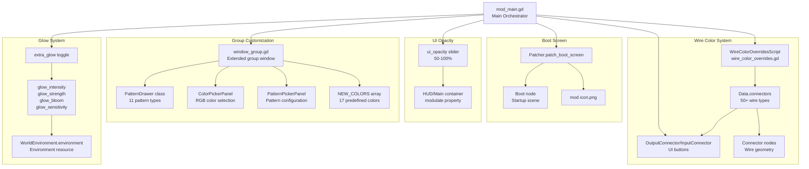
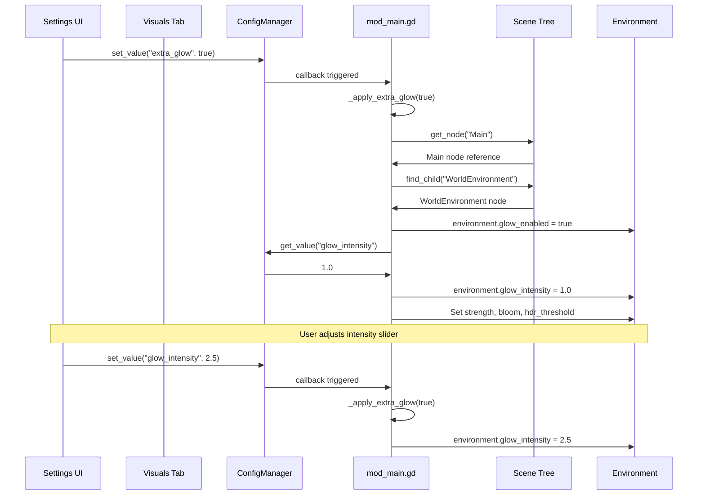
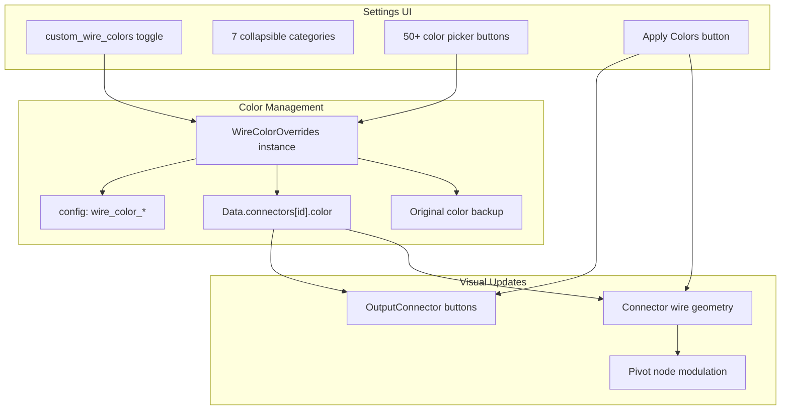
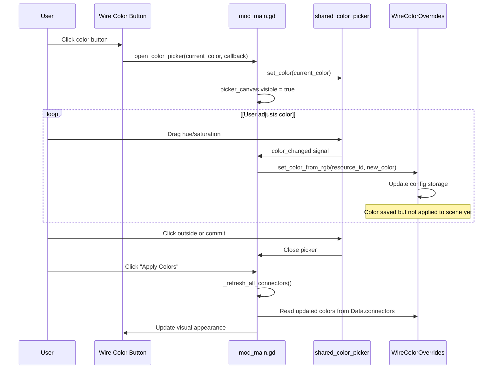
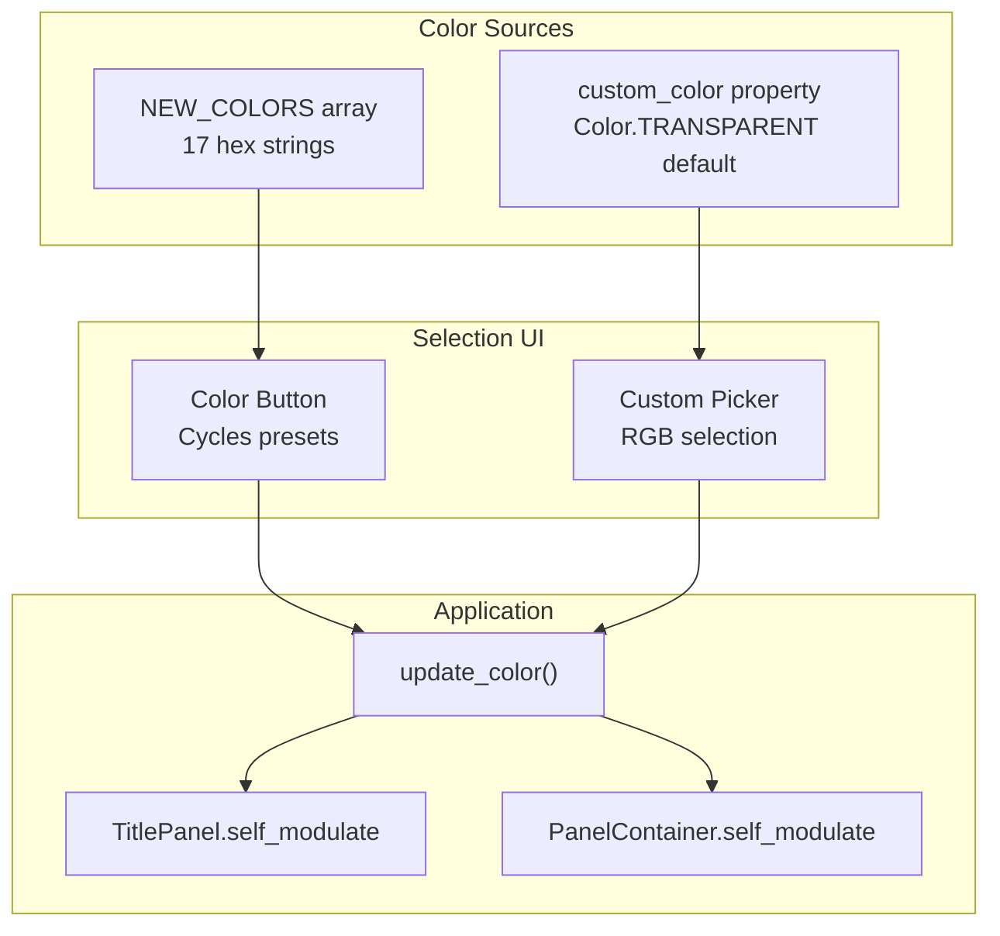
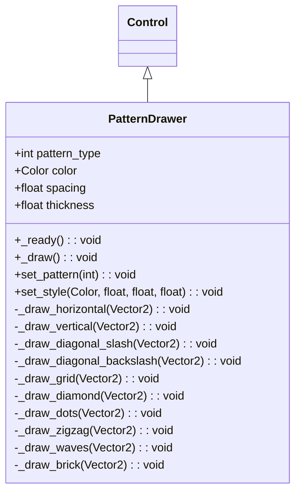
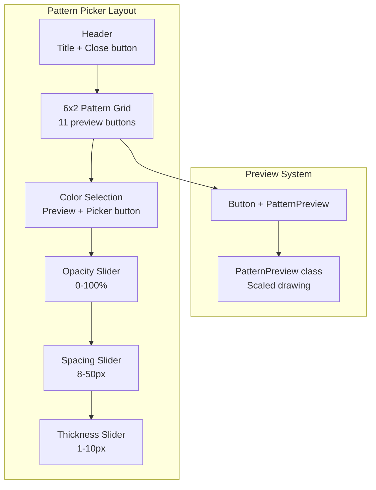
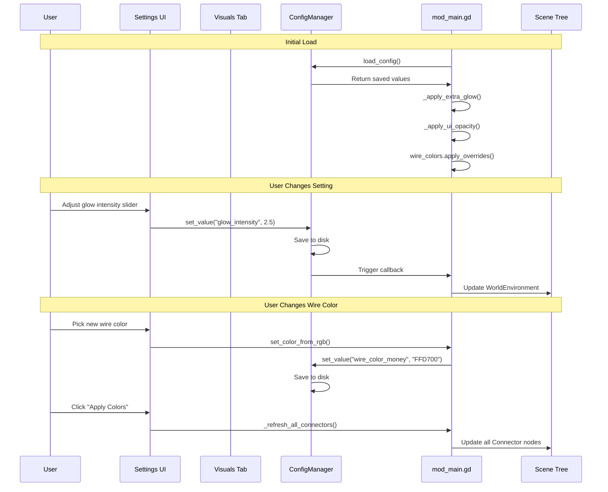

> **Relevant source files**
> * [CHANGELOG.md](https://github.com/tajemniktv/TajsMod/blob/5f1e656a/CHANGELOG.md)
> * [extensions/scenes/windows/window_group.gd](https://github.com/tajemniktv/TajsMod/blob/5f1e656a/extensions/scenes/windows/window_group.gd)
> * [extensions/scripts/ui/pattern_picker_panel.gd](https://github.com/tajemniktv/TajsMod/blob/5f1e656a/extensions/scripts/ui/pattern_picker_panel.gd)
> * [mod_main.gd](https://github.com/tajemniktv/TajsMod/blob/5f1e656a/mod_main.gd)

This page documents the visual customization features provided by TajsMod. These features modify the appearance of the game without affecting gameplay mechanics. For quality-of-life features that improve usability, see [5.2](/tajemniktv/TajsMod/5.2-quality-of-life-features). For UI improvements that add new interface elements, see [5.3](/tajemniktv/TajsMod/5.3-ui-improvements).

Visual enhancements include:

* **Extra Glow**: Advanced glow/bloom post-processing effects
* **UI Opacity**: Global transparency control for UI elements
* **Wire Colors**: Customizable colors for 50+ resource wire types
* **Node Group Customization**: 17 color palette + 11 pattern types
* **Custom Boot Screen**: Mod branding on game startup

---

## System Architecture

The visual enhancement system consists of independent subsystems coordinated by `mod_main.gd`:



**Sources:** [mod_main.gd L1-L1613](https://github.com/tajemniktv/TajsMod/blob/5f1e656a/mod_main.gd#L1-L1613)

 [extensions/scenes/windows/window_group.gd L1-L525](https://github.com/tajemniktv/TajsMod/blob/5f1e656a/extensions/scenes/windows/window_group.gd#L1-L525)

---

## Extra Glow System

The Extra Glow system provides customizable post-processing bloom effects by modifying the `WorldEnvironment` node's `Environment` resource.

### Configuration Parameters

| Parameter | Type | Range | Default | Description |
| --- | --- | --- | --- | --- |
| `extra_glow` | bool | - | false | Master toggle for glow effects |
| `glow_intensity` | float | 0.0 - 5.0 | 1.0 | Overall brightness multiplier |
| `glow_strength` | float | 0.5 - 2.0 | 1.0 | Bloom spread/radius |
| `glow_bloom` | float | 0.0 - 0.5 | 0.0 | Additional bloom amount |
| `glow_sensitivity` | float | 0.0 - 1.0 | 0.0 | HDR threshold (lower = more glow) |

### Implementation Flow



### Code Location

The glow toggle and sub-settings UI are built in [mod_main.gd L580-L618](https://github.com/tajemniktv/TajsMod/blob/5f1e656a/mod_main.gd#L580-L618)

 The apply function is implemented at [mod_main.gd L1050-L1068](https://github.com/tajemniktv/TajsMod/blob/5f1e656a/mod_main.gd#L1050-L1068)

:

```

```

**Sources:** [mod_main.gd L580-L618](https://github.com/tajemniktv/TajsMod/blob/5f1e656a/mod_main.gd#L580-L618)

 [mod_main.gd L1050-L1068](https://github.com/tajemniktv/TajsMod/blob/5f1e656a/mod_main.gd#L1050-L1068)

---

## UI Opacity Control

Allows users to adjust the transparency of the HUD overlay, making it less visually intrusive without hiding it completely.

### Parameters

| Setting | Range | Default | Unit |
| --- | --- | --- | --- |
| `ui_opacity` | 50 - 100 | 100 | % |

### Implementation

The opacity slider is added at [mod_main.gd L620-L623](https://github.com/tajemniktv/TajsMod/blob/5f1e656a/mod_main.gd#L620-L623)

 and applies modulation to the HUD's main container:

```

```

The opacity value is converted from percentage (50-100) to alpha (0.5-1.0) and applied to the `modulate` property, which affects all children recursively.

**Sources:** [mod_main.gd L620-L623](https://github.com/tajemniktv/TajsMod/blob/5f1e656a/mod_main.gd#L620-L623)

 [mod_main.gd L1069-L1077](https://github.com/tajemniktv/TajsMod/blob/5f1e656a/mod_main.gd#L1069-L1077)

---

## Wire Color Customization

TajsMod allows customization of wire colors for 50+ resource types through the `WireColorOverrides` system.

### Configurable Wire Types

Wire colors are organized into 7 categories:

| Category | Wire Types | Count |
| --- | --- | --- |
| ⚡ Speeds | download_speed, upload_speed, clock_speed, gpu_speed, code_speed, work_speed | 6 |
| 💰 Resources | money, research, token, power, research_power, contribution | 6 |
| 🔓 Hacking | hack_power, hack_experience, virus, trojan, infected_computer | 5 |
| 📊 Data Types | bool, char, int, float, bitflag, bigint, decimal, string, vector | 9 |
| 🧠 AI / Neural | ai, neuron_text, neuron_image, neuron_sound, neuron_video, neuron_program, neuron_game | 7 |
| 🚀 Boosts | boost_component, boost_research, boost_hack, boost_code, overclock | 5 |
| 📦 Other | heat, vulnerability, storage, corporation_data, government_data, litecoin, bitcoin, ethereum | 8 |

### Architecture



### Wire Color Section UI

The settings UI builds a collapsible category system at [mod_main.gd L756-L811](https://github.com/tajemniktv/TajsMod/blob/5f1e656a/mod_main.gd#L756-L811)

:

```

```

Each category creates a collapsible section with color picker buttons at [mod_main.gd L813-L847](https://github.com/tajemniktv/TajsMod/blob/5f1e656a/mod_main.gd#L813-L847)

### Color Picker Integration

Individual wire colors use a shared color picker overlay created in [mod_main.gd L115-L177](https://github.com/tajemniktv/TajsMod/blob/5f1e656a/mod_main.gd#L115-L177)

:



### Connector Refresh Process

The `_refresh_all_connectors()` function at [mod_main.gd L913-L941](https://github.com/tajemniktv/TajsMod/blob/5f1e656a/mod_main.gd#L913-L941)

 updates all visible wires:

1. **Update wire geometry** - Iterate `connector` group nodes, read color from `output.OutputConnector`, apply to line and pivot
2. **Update connector buttons** - Iterate `window` group nodes, find all connector buttons, call `update_connector_button()`

**Sources:** [mod_main.gd L756-L950](https://github.com/tajemniktv/TajsMod/blob/5f1e656a/mod_main.gd#L756-L950)

 [extensions/scripts/utilities/wire_color_overrides.gd](https://github.com/tajemniktv/TajsMod/blob/5f1e656a/extensions/scripts/utilities/wire_color_overrides.gd)

---

## Node Group Visual Customization

Node Groups (container windows) support extensive visual customization through colors and patterns.

### Color System

Groups support 17 predefined colors plus custom RGB selection:



The `NEW_COLORS` array is defined at [extensions/scenes/windows/window_group.gd L9-L12](https://github.com/tajemniktv/TajsMod/blob/5f1e656a/extensions/scenes/windows/window_group.gd#L9-L12)

:

```

```

Color selection logic at [extensions/scenes/windows/window_group.gd L332-L353](https://github.com/tajemniktv/TajsMod/blob/5f1e656a/extensions/scenes/windows/window_group.gd#L332-L353)

:

```

```

### Pattern System

Groups support 11 pattern types with customizable appearance:

| Pattern ID | Name | Description |
| --- | --- | --- |
| 0 | None | No pattern overlay |
| 1 | Horizontal | Horizontal parallel lines |
| 2 | Vertical | Vertical parallel lines |
| 3 | Diagonal / | Diagonal lines (slope +1) |
| 4 | Diagonal \ | Diagonal lines (slope -1) |
| 5 | Grid | Horizontal + vertical lines |
| 6 | Diamond | Both diagonal directions |
| 7 | Dots | Regular dot grid |
| 8 | Zigzag | Zigzag wave pattern |
| 9 | Waves | Sine wave pattern |
| 10 | Brick | Brick wall pattern |

### Pattern Configuration

Each pattern has 4 customizable parameters:

| Parameter | Type | Range | Default | Description |
| --- | --- | --- | --- | --- |
| `pattern_index` | int | 0-10 | 0 | Pattern type selection |
| `pattern_color` | Color | RGB | Black | Base color before alpha |
| `pattern_alpha` | float | 0.0-1.0 | 0.4 | Transparency level |
| `pattern_spacing` | float | 8.0-50.0 px | 20.0 | Distance between elements |
| `pattern_thickness` | float | 1.0-10.0 px | 4.0 | Line/dot thickness |

### PatternDrawer Class

The `PatternDrawer` class at [extensions/scenes/windows/window_group.gd L34-L154](https://github.com/tajemniktv/TajsMod/blob/5f1e656a/extensions/scenes/windows/window_group.gd#L34-L154)

 renders patterns using Godot's 2D drawing API:



Each pattern type is drawn using primitive operations:

* **Lines**: `draw_line(from, to, color, width)`
* **Dots**: `draw_circle(position, radius, color)`
* **Complex**: `draw_polyline(points, color, width)`

Example implementation for Grid pattern at [extensions/scenes/windows/window_group.gd L85-L87](https://github.com/tajemniktv/TajsMod/blob/5f1e656a/extensions/scenes/windows/window_group.gd#L85-L87)

:

```

```

### Pattern Picker UI

The pattern picker is a modal overlay defined in [extensions/scripts/ui/pattern_picker_panel.gd L1-L524](https://github.com/tajemniktv/TajsMod/blob/5f1e656a/extensions/scripts/ui/pattern_picker_panel.gd#L1-L524)

:



The picker emits signals when settings change:

* `settings_changed(pattern_index, color, alpha, spacing, thickness)` - Real-time updates
* `settings_committed(pattern_index, color, alpha, spacing, thickness)` - User closes picker

### Integration with Group Windows

Pattern system integration at [extensions/scenes/windows/window_group.gd L156-L228](https://github.com/tajemniktv/TajsMod/blob/5f1e656a/extensions/scenes/windows/window_group.gd#L156-L228)

:

1. **Inject PatternDrawers**: Two drawers are added (title + body) at [window_group.gd L160-L221](https://github.com/tajemniktv/TajsMod/blob/5f1e656a/window_group.gd#L160-L221)
2. **Add Pattern Button**: Pattern settings button at [window_group.gd L172-L186](https://github.com/tajemniktv/TajsMod/blob/5f1e656a/window_group.gd#L172-L186)
3. **Setup Picker Overlay**: Modal picker layer at [window_group.gd L281-L308](https://github.com/tajemniktv/TajsMod/blob/5f1e656a/window_group.gd#L281-L308)
4. **Connect Signals**: Real-time updates at [window_group.gd L323-L329](https://github.com/tajemniktv/TajsMod/blob/5f1e656a/window_group.gd#L323-L329)

**Sources:** [extensions/scenes/windows/window_group.gd L1-L525](https://github.com/tajemniktv/TajsMod/blob/5f1e656a/extensions/scenes/windows/window_group.gd#L1-L525)

 [extensions/scripts/ui/pattern_picker_panel.gd L1-L524](https://github.com/tajemniktv/TajsMod/blob/5f1e656a/extensions/scripts/ui/pattern_picker_panel.gd#L1-L524)

---

## Custom Boot Screen

TajsMod can display a custom boot screen showing mod branding and version information during game startup.

### Configuration

| Setting | Type | Default | Description |
| --- | --- | --- | --- |
| `custom_boot_screen` | bool | true | Enable custom boot screen (requires restart) |

### Implementation

The boot screen is patched continuously in the `_process()` loop at [mod_main.gd L186-L190](https://github.com/tajemniktv/TajsMod/blob/5f1e656a/mod_main.gd#L186-L190)

:

```

```

The patcher modifies:

1. Boot scene text labels to show mod name and version
2. Replaces default icon with mod icon (`icon.png`)
3. Adjusts layout/styling to match mod branding

This runs on every frame until the Boot node is detected and patched, ensuring it works even if the boot screen appears after mod initialization.

**Sources:** [mod_main.gd L186-L190](https://github.com/tajemniktv/TajsMod/blob/5f1e656a/mod_main.gd#L186-L190)

 [mod_main.gd L648-L652](https://github.com/tajemniktv/TajsMod/blob/5f1e656a/mod_main.gd#L648-L652)

---

## Persistence

All visual settings are persisted through the `ConfigManager` system.

### Saved Settings

**Extra Glow:**

* `extra_glow`: bool
* `glow_intensity`: float
* `glow_strength`: float
* `glow_bloom`: float
* `glow_sensitivity`: float

**UI:**

* `ui_opacity`: float (50-100)
* `custom_boot_screen`: bool

**Wire Colors:**

* `custom_wire_colors`: bool (master toggle)
* `wire_color_<resource_id>`: string (hex format, e.g., "FF0000")

**Group Settings (per-group in save file):**

* `color`: int (preset index)
* `custom_color`: string (hex format)
* `pattern_index`: int (0-10)
* `pattern_color`: string (hex format)
* `pattern_alpha`: float
* `pattern_spacing`: float
* `pattern_thickness`: float
* `locked`: bool (lock state)

Group settings are saved via the extended `save()` and `export()` methods at [extensions/scenes/windows/window_group.gd L446-L470](https://github.com/tajemniktv/TajsMod/blob/5f1e656a/extensions/scenes/windows/window_group.gd#L446-L470)

 and restored in `_load_custom_data()` at [window_group.gd L472-L490](https://github.com/tajemniktv/TajsMod/blob/5f1e656a/window_group.gd#L472-L490)

**Sources:** [extensions/scenes/windows/window_group.gd L446-L490](https://github.com/tajemniktv/TajsMod/blob/5f1e656a/extensions/scenes/windows/window_group.gd#L446-L490)

 [mod_main.gd L88-L96](https://github.com/tajemniktv/TajsMod/blob/5f1e656a/mod_main.gd#L88-L96)

---

## Configuration Flow



**Sources:** [mod_main.gd L88-L163](https://github.com/tajemniktv/TajsMod/blob/5f1e656a/mod_main.gd#L88-L163)

 [mod_main.gd L462-L688](https://github.com/tajemniktv/TajsMod/blob/5f1e656a/mod_main.gd#L462-L688)